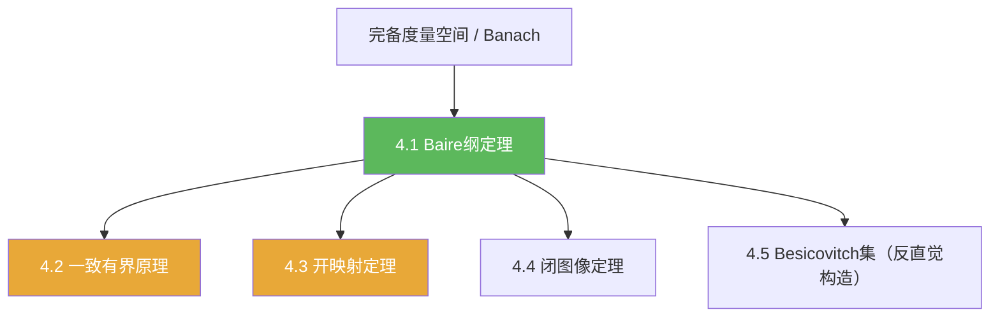

# 第04章 Baire纲定理的应用 — 章节汇总

**相关笔记：** [[第03章 紧算子与Fredholm算子 — 章节汇总]] | [[2.3 纲与开映射定理]] | [[1.2 完备化]] | [[Banach空间]] | [[Wiki/index]]

> [!abstract] 概览
> 本章把“完备性”转化为一套强力工具链：  
> ==Baire 纲定理== →（一致有界 / 开映射 / 闭图像）三件套 →（额外）一个强反直觉的几何构造示例（Besicovitch/Kakeya）。  
> 学习目标是：看到题目中的量词结构与完备性前提时，能立刻选对工具并写出证明骨架。

^overview

---

## 一、知识结构总览

---

## 二、各节入口（学习路线）

| 节 | 主题 | 你应带走的“可复用结论/套路” |
|---|---|---|
| [[4.1 Baire纲定理]] | Baire 方法论 | 可数坏集凑不满；闭集覆盖抽“好球”；嵌套球 + 完备取极限 |
| [[4.2 一致有界原理]] | 点态→一致 | $E_n$ 构造 + Baire 抽内点 + 缩放；逐点收敛 ⇒ $\sup\|T_n\|<\infty$ |
| [[4.3 开映射定理]] | 满射→开放 | “球映球”版本最可用；双射 ⇒ 逆有界（有界逆定理） |
| [[4.4 闭图像定理]] | 图像闭→有界 | “极限传递”验证图像闭；解决不显然有界的算子 |
| [[4.5 Besicovitch集]] | 反直觉构造 | 方向离散化→重排折叠→取极限；面积趋 0 但方向全覆盖 |
| [[4.6 习题]] | 训练题 | 将三件套与 Baire 套路固化成题型 |
| [[4.7 问题]] | 延伸问题 | 完备性边界、范畴 vs 测度、Kakeya 现象直觉 |

---

## 三、跨章关联（你应看见的主线）

1) **完备性来自第01章**  
本章的发动机是“完备 ⇒ Baire”。对照：[[1.2 完备化]]、[[1.4 赋范线性空间]]、[[Banach空间]]。  

2) **与第02章的重复与分工**  
第02章已有一份“Baire→开映射/闭图像/有界逆”的紧凑版：[[2.3 纲与开映射定理]]。  
本章的目标是把它们写成“可做题的工具箱”（更强调证明骨架、量词结构与应用模板），并补上“一致有界原理 + 反直觉示例”。

---

## 四、自测清单（逐条打勾）

- [ ] 我能写出 Baire 纲定理的两种表述，并能复述“嵌套闭球 + 完备取极限”的证明骨架。  
- [ ] 我能把“逐点有界”正确翻译成 $X=\bigcup_n E_n$ 并解释为何每个 $E_n$ 闭。  
- [ ] 我能从开映射定理得到“球映球”，并用它一行推出有界逆。  
- [ ] 我能说清楚“图像闭”的验证是一个极限传递问题，并能指出它适合在哪类题里用。  
- [ ] 我能解释范畴与测度是两套不同语言，不能混用。  
- [ ] 我能复述 Besicovitch/Kakeya 构造的三步框架（离散化→重排→极限）。  

---

## 五、各节概览（快速回看）

- ![[4.1 Baire纲定理#^overview]]
- ![[4.2 一致有界原理#^overview]]
- ![[4.3 开映射定理#^overview]]
- ![[4.4 闭图像定理#^overview]]
- ![[4.5 Besicovitch集#^overview]]

---

## 六、本章索引（Wiki 导航）

**节笔记：** [[4.1 Baire纲定理]] | [[4.2 一致有界原理]] | [[4.3 开映射定理]] | [[4.4 闭图像定理]] | [[4.5 Besicovitch集]] | [[4.6 习题]] | [[4.7 问题]]

**concepts：** [[Baire空间]] [[第一纲集]] [[Besicovitch集]]

**theorems：** [[Baire纲定理]] [[一致有界原理]] [[开映射定理]] [[闭图像定理]] [[有界逆定理]] [[Besicovitch定理]]

**旧概念回链：** [[完备度量空间]] [[完备化]] [[Banach空间]] [[有界线性算子]] [[算子范数]] [[紧集]]

---

## 七、引用（PDF）

![[00-Raw素材/泛函分析/04_第4章_Baire纲定理的应用/4.1_Baire纲定理.pdf]]
![[00-Raw素材/泛函分析/04_第4章_Baire纲定理的应用/4.2_一致有界原理.pdf]]
![[00-Raw素材/泛函分析/04_第4章_Baire纲定理的应用/4.3_开映射定理.pdf]]
![[00-Raw素材/泛函分析/04_第4章_Baire纲定理的应用/4.4_闭图像定理.pdf]]
![[00-Raw素材/泛函分析/04_第4章_Baire纲定理的应用/4.5_Besicovitch集.pdf]]
![[00-Raw素材/泛函分析/04_第4章_Baire纲定理的应用/4.6_习题.pdf]]
![[00-Raw素材/泛函分析/04_第4章_Baire纲定理的应用/4.7_问题.pdf]]
