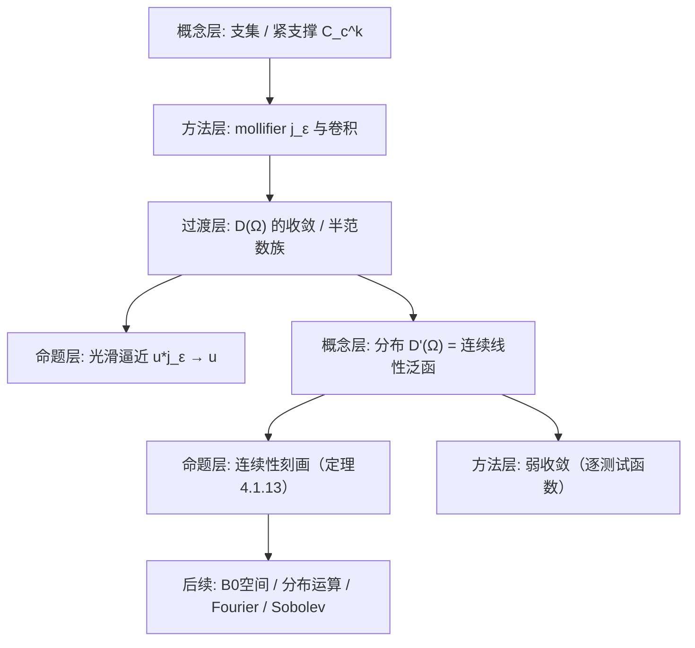

**相关笔记：** [[2.5 共轭空间 弱收敛 自反空间]]｜[[2.3 纲与开映射定理]]｜[[4.2 B0空间]]｜[[4.3 广义函数的运算]]｜[[第04章 广义函数与Sobolev空间 — 章节汇总]]

> [!abstract] 概览
> 本节做两件事：  
> 1) 先把“性质很好”的测试函数空间 $\mathcal D(\Omega)=C_c^\infty(\Omega)$ 的**收敛性**定义清楚，并建立“卷积光滑化（mollifier）”作为核心工具；  
> 2) 再把**广义函数/分布**定义为 $\mathcal D(\Omega)$ 上的连续线性泛函，给出 $\delta$、局部可积函数、测度等基本例子，并用一个“局部半范数估计”刻画连续性（定理4.1.13）。  
> - 核心对象：$\mathcal D(\Omega)$、$\mathcal D'(\Omega)$、支集、卷积核 $j_\varepsilon$  
> - 核心结论：$u*j_\varepsilon\to u$（在 $C^k$ 或在分布意义下）；$f\in\mathcal D'(\Omega)$ 当且仅当满足对每个紧集的有限阶导数半范数估计  
> - 关键门槛：$\mathcal D(\Omega)$ 的收敛 **必须有共同紧支集**（否则“到处一致”无从谈起）；分布的微商靠“积分分部”定义（依赖紧支撑）  
> - 与后续接口：4.2 把 $\mathcal D(\Omega)$ 的拓扑抽象成 $B_0$（可数半范数空间）；4.3 用“算子在 $\mathcal D$ 上连续”诱导分布上的运算；4.5 用分布微商定义 Sobolev 空间
> ^overview

---

# 1. 本节主题定位

- **本节的核心问题**
  1) 选什么“测试函数空间”来测量广义对象？为什么要用 $\mathcal D(\Omega)=C_c^\infty(\Omega)$？  
  2) $\mathcal D(\Omega)$ 上的“收敛”应当是什么（为什么不能只用一个范数）？  
  3) 如何从测试函数空间自然地产生新的对象：连续线性泛函 $\Rightarrow$ 分布 $\mathcal D'(\Omega)$？  
  4) 分布如何与普通函数/测度衔接？如何刻画“连续性”以便后续做运算？

- **本节在本章知识链中的位置**
  - 4.1：搭好“测试函数—分布”框架 + mollifier 工具（后面所有定义与证明都要用）  
  - 4.2：抽象化测试函数空间的拓扑结构（$B_0$ 空间/Fréchet 结构）  
  - 4.3：在分布上定义微商、平移、卷积、对偶算子等  
  - 4.4：把 Fourier 变换推广到 $\mathcal S',\mathcal D'$  
  - 4.5：用“分布微商在 $L^p$”定义 Sobolev，并证明嵌入/紧嵌入

- **本节依赖哪些前置概念/定理**
  - 支集、紧集、相对紧（第1章的拓扑/紧性直觉）  
  - $L^p$ 空间、卷积与 Young 不等式（第2章/2.5）  
  - Riesz 表示（用于“$L^1_{\text{loc}}$ 作为分布”的 1-1 性等论证）

- **本节为后续哪些内容铺路**
  - “算子在 $\mathcal D$ 上连续” $\Rightarrow$ 在 $\mathcal D'$ 上取对偶算子（4.3 的统一范式）  
  - “弱收敛（分布收敛）”成为后续极限交换、逼近论证的统一语言

## 二、核心思想

> [!tip] 把“分布”用成招式：两条主线
> 1) **把不可微对象变可微**：先用 $j_\varepsilon$ 光滑化，再在极限里解释导数/方程（“先算后极限”）。  
> 2) **定义靠对偶**：遇到“无法点值/无法微分”，就改成“对所有测试函数成立的积分恒等式”（弱形式/分布意义）。

> [!warning] 最容易“看懂但不会用”的点
> - 你以为在 $\mathcal D$ 里“$\varphi_j\to 0$”就是各阶导数逐点趋零；但**缺了“共同紧支集”就完全错**：收敛定义自带“局部性”，并且是对每个紧集上的一致估计。  
> - 你以为“分布等于函数”；但 $\delta$ 等对象说明 $\mathcal D'$ 远大于 $L^1_{\text{loc}}$，后续做题要学会用**作用在测试函数上**来识别对象。

---

# 2. 内容分层图

---

# 3. 定义系统

## 3.1 支集（support）

> [!quote] 原文直接信息（支集）
> 设 $\Omega\subset\mathbb R^n$ 开集，$u\in C(\Omega)$。称集合
> $$
> F=\{x\in\Omega:\ u(x)\neq 0\}
> $$
> 的闭包（在 $\Omega$ 中）为 $u$ 的支集，记 $\operatorname{supp}(u)$。等价地：$\operatorname{supp}(u)$ 是在其外 $u\equiv 0$ 的、相对于 $\Omega$ 的最小闭集。

- **定义对象是什么**：连续函数（后续也推广到分布）。  
- **为什么要这样定义 / 解决什么问题**：把“只在有限区域起作用”的函数形式化；卷积、积分分部、局部估计都需要“边界项消失”。  
- **与前面概念的关系**：支集是“局部—整体”桥梁；后面所有拓扑都按“对每个紧集”定义。  
- **最小例子**：$\Omega=\mathbb R$，$u=\mathbf 1_{[-1,1]}$ 的连续近似（真正连续可取三角帽函数），支集为 $[-1,1]$。  
- **非例/边界**：若 $u$ 在 $\Omega$ 上处处非零，则 $\operatorname{supp}(u)=\overline\Omega$（在 $\Omega$ 内闭包）。  
- **初学者误区**：把“$u(x)=0$ 的点集”当支集；实际上支集看的是“在哪里可能非零”，是补集里“恒为 0”的最大开集的补。

## 3.2 测试函数空间 $C_c^k(\Omega)$ 与 $\mathcal D(\Omega)$

> [!quote] 原文直接信息（$C_c^k$）
> 对整数 $k\ge 0$（可为 $\infty$），$C_c^k(\Omega)$ 表示支集在 $\Omega$ 内紧的全体 $C^k(\Omega)$ 函数的集合。特别地
> $$
> \mathcal D(\Omega):=C_c^\infty(\Omega)
> $$
> 称为（本章的）基本空间/测试函数空间。

- **定义对象是什么**：光滑且紧支撑的函数。  
- **为什么要这样定义**：  
  1) 光滑：允许任意次积分分部，把导数“转移”到测试函数上（定义分布导数的关键）；  
  2) 紧支撑：积分分部无边界项；并且“局部”性质可以在每个紧集上用半范数控制。  
- **最小例子**：标准 bump 函数（例4.1.1 的 $j$）及其缩放 $j_\varepsilon$。  
- **非例**：常数函数 $1$ 在 $\mathbb R^n$ 上不属于 $\mathcal D$（无紧支撑）。  
- **误区**：把 $\mathcal D(\Omega)$ 与 $C_0^\infty(\Omega)$（在边界趋0）混同；本书此处核心是“紧支撑”，不是“边界零”。

## 3.3 mollifier（平滑核）$j$ 与 $j_\varepsilon$

> [!quote] 原文直接信息（例4.1.1：一个标准核）
> 定义
> $$
> j(x)=\begin{cases}
> C_n\exp\!\Big(\dfrac{1}{|x|^2-1}\Big),& |x|<1,\\
> 0,& |x|\ge 1,
> \end{cases}\qquad (4.1.1)
> $$
> 其中 $C_n$ 仅依赖维数，使得 $\int_{\mathbb R^n} j(x)\,dx=1$。对任意 $\varepsilon>0$，令
> $$
> j_\varepsilon(x)=\varepsilon^{-n}j(x/\varepsilon).
> $$

- **定义对象是什么**：$\mathcal D(\mathbb R^n)$ 中的非负函数，质量为 1，且支撑在单位球。  
- **为什么这样定义**：$\varepsilon^{-n}$ 保证积分归一化不变；$x/\varepsilon$ 保证支撑缩到半径 $\varepsilon$，实现“质量集中到 0”。  
- **解决的问题**：提供“逼近恒等算子”的核：$u*j_\varepsilon \approx u$，并且 $u*j_\varepsilon\in C^\infty$。  
- **最小例子**：$j_\varepsilon$ 本身。  
- **边界情况**：若不归一化（积分不为 1），则卷积不会逼近恒等。  
- **误区**：认为任意 $L^1$ 核都能当 mollifier；实际还需要“质量集中 + 归一化 + 足够正则/矩条件”。

## 3.4 $\mathcal D(\Omega)$ 的收敛（拓扑）

> [!quote] 原文直接信息（定义4.1.5：$\mathcal D$ 的收敛）
> 在 $C_c^\infty(\Omega)$ 上定义收敛性：称 $\varphi_j\to\varphi_0$（在 $\mathcal D(\Omega)$ 中），若  
> (1) 存在相对于 $\Omega$ 的紧集 $K$，使得 $\operatorname{supp}(\varphi_j)\subset K$（对所有 $j$）；  
> (2) 对任意多重指标 $\alpha$，有
> $$
> \max_{x\in K}\big|\partial^\alpha(\varphi_j-\varphi_0)(x)\big|\to 0\quad (j\to\infty).
> $$

- **为什么要这样定义（关键！）**：  
  - (1) 把“局部性”钉死：所有函数活动范围统一关在某个紧集内，否则“控制导数”没有共同域；  
  - (2) 要求在该紧集上各阶导数一致收敛，保证后续“对偶泛函连续性”的估计成立。  
- **最小例子**：固定 $\varphi\in\mathcal D$，令 $\varphi_j=\varphi/j$，则 $\varphi_j\to 0$。  
- **非例**：$\varphi_j(x)=\varphi(x-j)$（平移到无穷远）满足逐点趋0，但支集不落在共同紧集里，因此 **不在 $\mathcal D$ 中收敛到 0**。  
- **误区**：把它当成 Fréchet 范数收敛；事实上 $\mathcal D(\Omega)$ 不是单个范数可刻画（这一点在 4.2 会抽象化）。

## 3.5 分布/广义函数 $\mathcal D'(\Omega)$

> [!quote] 原文直接信息（定义4.1.7：广义函数）
> $\mathcal D(\Omega)$ 上的一切连续线性泛函都称为广义函数（分布），记作 $\mathcal D'(\Omega)$。  
> 即 $f:\mathcal D(\Omega)\to\mathbb R$ 满足：  
> (1) 线性；(2) 若 $\varphi_j\to\varphi_0$（在 $\mathcal D(\Omega)$），则 $\langle f,\varphi_j\rangle\to\langle f,\varphi_0\rangle$。

- **定义对象是什么**：作用在测试函数上的“测量器”。  
- **为什么要这样定义**：我们希望把“微分/点值/Fourier”等操作转化为“对测试函数的线性连续作用”，从而避开对象本身不光滑/不可积的障碍。  
- **解决的问题**：把 $\delta$、主值、弱导数等统一到一个线性框架中。  
- **最小例子**：由 $L^1_{\text{loc}}$ 函数 $u$ 诱导的分布：$\langle u,\varphi\rangle=\int u\varphi$。  
- **非例**：不可测函数一般不能给出良定义的线性泛函（本书注2强调）。  
- **误区**：把“连续”理解成点态；此处连续性是相对于 **定义4.1.5 的拓扑**。

---

# 4. 定理/命题系统

## 4.1 命题4.1.2（卷积得到测试函数）

> [!quote] 原文直接信息（命题4.1.2）
> 设 $u$ 可积，且在 $\Omega$ 的某个紧子集 $K$ 外恒为 $0$。则当 $\varepsilon>0$ 足够小时，
> $$
> u_\varepsilon(x):=\int_\Omega u(y)\,j_\varepsilon(x-y)\,dy\qquad (4.1.3)
> $$
> 是 $C_c^\infty(\Omega)$ 的函数，并且可逐次微分，满足
> $$
> \partial^\alpha u_\varepsilon(x)=\int_\Omega u(y)\,\partial^\alpha j_\varepsilon(x-y)\,dy\qquad (4.1.4)
> $$

- **条件逐条解释**
  - $u\in L^1$：保证卷积积分有意义；  
  - $u$ 有紧支撑 $K$：保证 $u_\varepsilon$ 的支撑被控制在 $K_\varepsilon:=\{x:\operatorname{dist}(x,K)\le\varepsilon\}$，并能选 $\varepsilon$ 让 $K_\varepsilon\Subset\Omega$；  
  - $j_\varepsilon\in C_c^\infty$：保证可对 $x$ 任意次求导并交换导数与积分（配合控制收敛）。

- **结论到底在说什么**
  - “卷积=平滑化”：把粗糙的 $L^1$ 函数变成测试函数（光滑且紧支撑）。  
  - “导数可交换”：$\partial^\alpha(u*j_\varepsilon)=u*\partial^\alpha j_\varepsilon$（后续定义弱导数时的核心交换律）。

- **证明骨架（只抽骨架）**
  1) **支撑控制**：利用 $j_\varepsilon$ 支撑在 $B(0,\varepsilon)$，推出 $u_\varepsilon$ 支撑在 $K_\varepsilon$；  
  2) **可微性**：用差商 + Lebesgue 控制收敛，证明一阶导数并得到公式；  
  3) **高阶导数**：对任意多重指标重复 Step2。

- **证明最关键的一跳**
  - 差商写成积分中 $j_\varepsilon(x+h)-j_\varepsilon(x)$，再用 $j_\varepsilon$ 的可微性给出一致界，从而能用控制收敛把 $h\to0$ 推入积分。

- **若条件削弱，哪里可能出问题**
  - 若 $u$ 无紧支撑，则 $u_\varepsilon$ 未必紧支撑（无法属于 $\mathcal D$）；  
  - 若 $u\notin L^1_{\text{loc}}$，卷积可能无意义。

## 4.2 定理4.1.3（mollifier 逼近：$C^k$ 收敛）

> [!quote] 原文直接信息（定理4.1.3）
> 若 $u\in C_c^k(\Omega)$，则
> $$
> \|u_\varepsilon-u\|_{C^k(\Omega)}\to 0\qquad (\varepsilon\to 0).
> $$

- **条件逐条解释**
  - $u\in C^k$：确保 $\partial^\alpha u$（$|\alpha|\le k$）存在并一致连续（在紧集邻域上）；  
  - $u$ 紧支撑：把问题限制到一个紧集上做一致估计；也确保卷积只涉及有限区域。

- **结论到底在说什么**
  - mollifier 给出 $C^k$ 意义下的“平滑逼近”：不仅 $u_\varepsilon\to u$，而且所有 $|\alpha|\le k$ 的导数也一致收敛。

- **证明骨架（Step 1/2/3）**
  1) 把 $u$ 视为在 $\mathbb R^n$ 上延拓（$\Omega$ 外补 0），并写成 $u_\varepsilon(x)=\int u(x-\varepsilon y)j(y)\,dy$；  
  2) 对 $|\alpha|\le k$，估计
 
$$
|\partial^\alpha u_\varepsilon(x)-\partial^\alpha u(x)|
\le \int |\partial^\alpha u(x-\varepsilon y)-\partial^\alpha u(x)|\,j(y)\,dy;
$$
 
  3) 用 $\partial^\alpha u$ 在紧集上的一致连续性：当 $\varepsilon$ 小时，$|y|\le 1$ 下差值统一小，从而整体积分小。

- **证明中最关键的一跳**
  - 把误差写成“统一连续差值”的平均：这一步把“点态连续”升级为“一致收敛”，完全靠紧支撑带来的紧集一致连续。

## 4.3 定理4.1.13（分布连续性的局部半范数刻画）

> [!quote] 原文直接信息（定理4.1.13）
> 为了 $f\in\mathcal D'(\Omega)$，必须且仅须：对任意相对于 $\Omega$ 的紧集 $K$，存在常数 $C>0$ 与非负整数 $m$，使得对所有 $\varphi\in\mathcal D(\Omega)$ 且 $\operatorname{supp}(\varphi)\subset K$，
> $$
> |\langle f,\varphi\rangle|\le C\sum_{|\alpha|\le m}\sup_{x\in K}|\partial^\alpha\varphi(x)|. \qquad (4.1.6)
> $$

- **条件逐条解释**
  - “对每个紧集 $K$”：分布是**局部**对象；在不同 $K$ 上允许用不同阶数 $m$ 与常数 $C$；  
  - “有限阶导数到 $m$”：连续性并不要求控制无限多阶导数；每个 $K$ 上只需要某个有限阶即可。  

- **结论到底在说什么**
  - “连续线性泛函” $\iff$ “在每个紧集上，被某个有限阶导数半范数族所控制”。  
  - 这给了实用判别：要证 $f$ 连续，就找一个适当的 $m$ 和估计把 $f$ 压到 $\|\varphi\|_{m,K}$ 上。

- **证明骨架（Step 1/2/3）**
  1) **充分性**：若 (4.1.6) 对每个紧集成立，则对任何 $\varphi_j\to\varphi_0$（共同支撑 $\subset K$ 且各阶导数一致收敛），右端 $\to0$，故 $\langle f,\varphi_j\rangle\to\langle f,\varphi_0\rangle$；  
  2) **必要性（反证）**：若对某紧集 $K$ 不存在这样的 $C,m$，则可构造 $\varphi_j$ 支撑 $\subset K$ 且 $\|\varphi_j\|_{m,K}$ 很小但 $|\langle f,\varphi_j\rangle|$ 很大；  
  3) 利用“齐次性”把 $\varphi_j$ 归一化成在 $\mathcal D$ 中收敛到 0 的序列，却使 $\langle f,\varphi_j\rangle$ 不趋 0，矛盾于连续性。

- **证明中最关键的一跳**
  - “连续性 $\Rightarrow$ 存在某个有限阶 $m$ 控制”：这一步本质是把拓扑（无限多半范数诱导）压缩成“局部有限阶控制”，是后续所有估计/紧性论证的核心入口。

- **若条件削弱，哪里可能出问题**
  - 若只要求对单个 $m$ 控制所有紧集，通常不成立（不同区域可能需要不同阶）；  
  - 若允许 $\operatorname{supp}(\varphi)$ 不受控，则无法通过局部半范数估计给出连续性。

---

# 5. 例子与反例系统

- **最关键的例子**
  1) **局部可积函数 $u\in L^1_{\text{loc}}$** 诱导分布：$\langle u,\varphi\rangle=\int u\varphi$。  
     - 服务点：把分布视为“对测试函数的积分加权”。  
  2) **Dirac $\delta_{x_0}$**：$\langle\delta_{x_0},\varphi\rangle=\varphi(x_0)$。  
     - 服务点：展示 $\mathcal D'$ 严格大于 $L^1_{\text{loc}}$；以及“点值”可以合法存在。  
  3) **近似恒等（习题4.1.4）**：Poisson 核/热核 $\to\delta$。  
     - 服务点：后续弱极限与 PDE 基本解的核心套路。

- **最值得补的反例**
  1) **平移到无穷远的 bump**：$\varphi_j(x)=\varphi(x-j)$ 逐点趋 0，但不在 $\mathcal D$ 收敛。  
     - 服务点：提醒“共同紧支集”不是装饰条件。  
  2) **$\delta$ 不是局部可积函数（习题4.1.2）**。  
     - 服务点：避免误把分布当成函数。

---

# 6. 本节逻辑链复原（作者为什么这样安排）

1) 先定义支集与 $C_c^k$：锁定“紧支撑”作为局部工具箱的基座。  
2) 给出标准核 $j$ 与缩放：构造一个可随尺度收缩的“质量为1”的测试函数。  
3) 用卷积命题证明：只要 $u$ 局部可积且紧支撑，就能被核平滑成 $C_c^\infty$。  
4) 再证明 $u*j_\varepsilon\to u$：说明核真的是“逼近恒等”，从而后续可以“先平滑后极限”。  
5) 定义 $\mathcal D$ 的收敛：让“对所有 $\varphi$ 的作用”形成良定义拓扑；并指出其不可范数化。  
6) 最后定义分布为 $\mathcal D$ 上连续线性泛函，并用局部估计（定理4.1.13）把“连续性”转成可操作的不等式。

---

# 7. 本节高风险误区（≥5 条）

1) **误读点**：认为“$\varphi_j\to 0$ in $\mathcal D$”等价于 $\varphi_j^{(\alpha)}(x)\to 0$ 对每个 $x$。  
   - **为什么容易误读**：日常分析里收敛常以逐点/一致为主。  
   - **正确理解**：必须同时满足“共同紧支撑”+“对该紧集上一致收敛”。平移 bump 是经典反例。  

2) **误读点**：把 $C_0^\infty(\Omega)$（边界趋零）当成 $C_c^\infty(\Omega)$。  
   - **原因**：符号习惯差异。  
   - **正确理解**：本节核心是“紧支撑”，确保积分分部无边界项；后续 $\mathcal D'(\Omega)$ 也基于此。  

3) **误读点**：认为所有分布都能写成某个函数 $f(x)$。  
   - **原因**：一开始把分布当“加权密度”。  
   - **正确理解**：$\delta$、主值等是本质新对象，只能通过对测试函数的作用来定义。  

4) **误读点**：在证明里随意把微分与积分交换。  
   - **原因**：形式计算看起来合理。  
   - **正确理解**：交换需要核的光滑性 + 可积控制（控制收敛/Young 不等式）。紧支撑常用于提供统一界。  

5) **误读点**：误把 (4.1.6) 里的 $m$ 当作“全局固定”。  
   - **原因**：看到“存在 $m$”就默认是同一个。  
   - **正确理解**：这是对每个紧集 $K$ 的局部性质；换 $K$ 可以换 $m$、$C$。  

6) **误读点**：以为“$j_\varepsilon\to\delta$”是函数意义的极限。  
   - **原因**：核确实逐点收缩。  
   - **正确理解**：这是分布意义的极限：$\int j_\varepsilon(x)\varphi(x)\,dx\to\varphi(0)$。

---

# 8. 知识库拆分建议

- **A类：应独立成概念卡**
  - 支集 $\operatorname{supp}$（函数/分布的支集作为后续可扩展点）  
  - 测试函数空间 $\mathcal D(\Omega)=C_c^\infty(\Omega)$ 与其收敛  
  - mollifier / 近似恒等核 $j_\varepsilon$  
  - 分布 $\mathcal D'(\Omega)$、分布收敛（弱收敛）

- **B类：应独立成定理卡**
  - 命题4.1.2（卷积平滑化 + 导数交换）  
  - 定理4.1.3（mollifier 在 $C^k$ 意义逼近）  
  - 定理4.1.13（分布连续性的局部半范数刻画）  

- **C类：只保留在本节页中**
  - 证明骨架中的差商技巧与控制收敛使用点（作为“套路说明”即可）  

- **D类：专题综述候选**
  - “近似恒等族 $\to$ δ”的常见核（Poisson/热核/截断核等）  
  - “分布=弱形式”在 PDE 中的统一模板（后续与 Sobolev 对接）

---

# 9. 后续学习接口

- **适合下一轮展开证明的点**
  - 定理4.1.13 的“必要性”反证构造序列（如何用齐次性与拓扑产生矛盾）  
  - 定理4.1.3 中“从一致连续得到一致收敛”的精确量化

- **适合设计习题的点**
  - 证明某给定泛函是分布：直接用 (4.1.6) 给出半范数估计  
  - 证明某序列分布收敛：对任意 $\varphi$ 计算极限（常用换元 + 逼近恒等）

- **适合与前一节比较的点**
  - 与第2章“弱收敛”对比：这里的弱收敛不是 Banach 空间弱拓扑，而是“逐测试函数”。  

- **适合与下一节衔接的点**
  - 4.2：把 $\mathcal D_K$ 的半范数族抽象成 $B_0$（可数半范数空间），并研究连续线性泛函的结构  
  - 4.3：用“$\partial^\alpha$ 在 $\mathcal D$ 上连续”定义分布微商，并发展平移/反射/卷积

---

# 10. 自测问题

## 10.A 自测问题（5题）

1) $\varphi_j\to 0$ 在 $\mathcal D(\Omega)$ 的定义里，“共同紧支集”具体如何使用？给出一个“逐点趋0但不收敛”的例子。  
2) 为什么分布导数要定义为 $\langle \partial^\alpha f,\varphi\rangle = (-1)^{|\alpha|}\langle f,\partial^\alpha\varphi\rangle$？哪条条件保证分部积分无边界项？  
3) 说明 $j_\varepsilon$ 的三个关键性质（归一化/支撑收缩/光滑）分别在“$u*j_\varepsilon$ 平滑”与“$u*j_\varepsilon\to u$”中承担什么作用。  
4) 用定理4.1.13 的语言描述：为什么 $\delta_{x_0}$ 是分布？它在任意紧集 $K$ 上的 $m$ 可以取多少？  
5) 解释“分布收敛（弱收敛）”的口径，并说明它与 $L^p$ 收敛的关系（哪些蕴含成立/不成立）。

## 10.B 习题（完整解答，按教材编号全覆盖）

> [!tip] 编号门禁（4.1）
> - [x] 4.1.1
> - [x] 4.1.2
> - [x] 4.1.3
> - [x] 4.1.4
> - [x] 4.1.5

### 习题 4.1.1（$C_0^\infty(\Omega)$ 在 $L^p(\Omega)$ 中稠密）
> [!problem] 题目
> 设 $1\le p<\infty$，求证：$C_0^\infty(\Omega)$ 在 $L^p(\Omega)$ 中稠密。
>
> [!solution]- 完整过程解答
> 记目标为：对任意 $u\in L^p(\Omega)$、任意 $\varepsilon>0$，构造 $u_\varepsilon\in C_0^\infty(\Omega)$ 使 $\|u-u_\varepsilon\|_{L^p}<\varepsilon$。教材提示给出“三步 $\varepsilon/3$”策略：
> 
> **Step 0（准备：核平滑 + Young）**  
> 取标准 mollifier $j_\delta$。对 $u\in L^p$ 定义 $u*j_\delta$（先将 $u$ 在 $\Omega$ 外延拓为 0）。由 Young 不等式（引理2.5.14）：
> $$
> \|u*j_\delta\|_{L^p}\le \|u\|_{L^p}\|j_\delta\|_{L^1}=\|u\|_{L^p}.
> $$
> 
> **Step 1（先把 $u$ 逼近到“连续且紧支撑”）**  
> 由 Lusin 定理：对任意 $\eta>0$，存在连续函数 $v$ 使 $v$ 与 $u$ 在大部分区域一致，且 $\|u-v\|_{L^p}<\eta$。再用截断函数把 $v$ 截成紧支撑（例如取 $\chi\in C_0^\infty(\Omega)$，$\chi\equiv 1$ 在一个大紧集上，令 $v_1=\chi v$），可使 $\|v-v_1\|_{L^p}<\eta$。于是得到 $v_1\in C_0(\Omega)$ 且紧支撑，并满足
> $$
> \|u-v_1\|_{L^p}<2\eta.
> $$
> 
> （这是“把问题转移到紧支撑连续函数”的关键：后面才能用卷积在 $\Omega$ 内平滑。）
> 
> **Step 2（卷积平滑：$v_1*j_\delta\in C_0^\infty$ 且 $L^p$ 逼近）**  
> 由命题4.1.2（需要紧支撑条件）可知：当 $\delta$ 足够小时，$v_1*j_\delta\in C_0^\infty(\Omega)$。并且由于 $v_1\in L^p$，标准结论（可由平移连续性 + 逼近恒等证明）给出
> $$
> \|v_1*j_\delta - v_1\|_{L^p}\to 0\quad(\delta\to 0).
> $$
> 因此可取 $\delta$ 使 $\|v_1*j_\delta-v_1\|_{L^p}<\eta$。
> 
> **Step 3（合并误差：$\varepsilon/3$ 论证）**  
> 取 $\eta=\varepsilon/3$。由 Step1 选 $v_1$ 使 $\|u-v_1\|_{L^p}<2\varepsilon/3$；再由 Step2 选 $\delta$ 使 $\|v_1*j_\delta-v_1\|_{L^p}<\varepsilon/3$。令 $u_\varepsilon=v_1*j_\delta\in C_0^\infty(\Omega)$，则
> $$
> \|u-u_\varepsilon\|_{L^p}\le \|u-v_1\|_{L^p}+\|v_1-v_1*j_\delta\|_{L^p}<\varepsilon.
> $$
> 从而 $C_0^\infty(\Omega)$ 在 $L^p(\Omega)$ 中稠密。

### 习题 4.1.2（$\delta$ 不是局部可积函数）
> [!problem] 题目
> 求证：$\delta$ 函数不是局部可积函数。
>
> [!solution]- 完整过程解答
> 反证：设存在 $f\in L^1_{\mathrm{loc}}(\mathbb R)$ 使得对一切 $\varphi\in\mathcal D(\mathbb R)$，
> $$
> \langle \delta,\varphi\rangle=\varphi(0)=\int_{\mathbb R} f(x)\varphi(x)\,dx.
> $$
> 
> 取一列测试函数 $\varphi_k\in\mathcal D(\mathbb R)$，满足：
> - $\varphi_k\ge 0$，$\operatorname{supp}(\varphi_k)\subset(-1/k,1/k)$；
> - $\varphi_k(0)=1$，且 $0\le \varphi_k\le 1$。
> （例如先取某个 bump $\psi$，令 $\varphi_k(x)=\psi(kx)$ 并归一化到 $\varphi_k(0)=1$。）
> 
> 则由 $f\in L^1_{\mathrm{loc}}$，有
> $$
> \Big|\int f(x)\varphi_k(x)\,dx\Big|\le \int_{|x|<1/k}|f(x)|\,dx \xrightarrow[k\to\infty]{} 0,
> $$
> 因为局部可积函数在缩小邻域上的积分趋于 0。
> 但另一方面应有
> $$
> \int f(x)\varphi_k(x)\,dx=\varphi_k(0)=1,
> $$
> 矛盾。故 $\delta$ 不能由局部可积函数表示，即 $\delta\notin L^1_{\mathrm{loc}}$。

### 习题 4.1.3（$f_j(x)=(1+x/j)^j\to e^x$ 于 $\mathcal D'(\mathbb R)$）
> [!problem] 题目
> 设
> $$
> f_j(x)=\Big(1+\frac{x}{j}\Big)^j,\qquad (j=1,2,\dots)(x\in\mathbb R).
> $$
> 求证：$f_j\to e^x$（在 $\mathcal D'(\mathbb R)$ 中）。
>
> [!solution]- 完整过程解答
> 取任意 $\varphi\in\mathcal D(\mathbb R)$，其支撑包含于某紧区间 $[-R,R]$。
> 
> **Step 1（紧集上一致收敛）**  
> 经典极限给出：对每个固定 $x$，$(1+x/j)^j\to e^x$。并且在紧集 $[-R,R]$ 上收敛是一致的：可用
> $$
> \Big(1+\frac{x}{j}\Big)^j=\exp\!\Big(j\ln(1+x/j)\Big),\qquad \ln(1+t)=t+O(t^2)\ (t\to 0),
> $$
> 得到
> $$
> j\ln(1+x/j)=x+O(R^2/j)\quad \text{一致于 }|x|\le R,
> $$
> 从而 $f_j\to e^x$ 一致于 $[-R,R]$。
> 
> **Step 2（对偶作用收敛）**  
> 于是
> $$
> \langle f_j-e^x,\varphi\rangle=\int_{\mathbb R}(f_j(x)-e^x)\varphi(x)\,dx=\int_{-R}^R (f_j(x)-e^x)\varphi(x)\,dx.
> $$
> 用一致收敛与 $|\varphi|\le \|\varphi\|_\infty$ 得
> $$
> \big|\langle f_j-e^x,\varphi\rangle\big|\le (2R)\,\|\varphi\|_\infty\cdot \sup_{|x|\le R}|f_j(x)-e^x|\xrightarrow[j\to\infty]{}0.
> $$
> 因此对一切 $\varphi\in\mathcal D(\mathbb R)$ 都有 $\langle f_j,\varphi\rangle\to \langle e^x,\varphi\rangle$，即 $f_j\to e^x$ 于 $\mathcal D'(\mathbb R)$。

### 习题 4.1.4（两种近似恒等核 $\to\delta$）
> [!problem] 题目
> 在 $\mathcal D'(\mathbb R)$ 中，求证：
> 1)
> $$
> \frac{1}{\pi}\cdot \frac{\varepsilon}{x^2+\varepsilon^2}\to \delta(x)\qquad (\varepsilon\to 0+);
> $$
> 2)
> $$
> \frac{1}{2\sqrt{\pi t}}\exp\!\Big(-\frac{x^2}{4t}\Big)\to \delta(x)\qquad (t\to 0+).
> $$
>
> [!solution]- 完整过程解答
> 这两族函数都是“近似恒等族”：满足（i）非负；（ii）积分为 1；（iii）质量在参数趋 0 时集中到 0。对任意 $\varphi\in\mathcal D(\mathbb R)$，只需证
> $$
> \int_{\mathbb R}k_\eta(x)\varphi(x)\,dx\to \varphi(0).
> $$
> 
> **(1) Poisson 型核**  
> 令 $k_\varepsilon(x)=\dfrac{1}{\pi}\dfrac{\varepsilon}{x^2+\varepsilon^2}$。先验证归一化：
> $$\int_{\mathbb R}k_\varepsilon(x)\,dx=\frac{1}{\pi}\int_{\mathbb R}\frac{\varepsilon}{x^2+\varepsilon^2}\,dx
> =\frac{1}{\pi}\int_{\mathbb R}\frac{1}{y^2+1}\,dy=1\quad(x=\varepsilon y).$$
> 于是
> $$
> \int k_\varepsilon(x)\varphi(x)\,dx-\varphi(0)=\int k_\varepsilon(x)\big(\varphi(x)-\varphi(0)\big)\,dx.
> $$
> 对任意 $\delta>0$，把积分分为 $|x|<\delta$ 与 $|x|\ge \delta$：
> - 在 $|x|<\delta$：$\varphi$ 连续，故当 $\delta$ 小时 $\sup_{|x|<\delta}|\varphi(x)-\varphi(0)|$ 可任意小，并且 $\int_{|x|<\delta}k_\varepsilon\le 1$；  
> - 在 $|x|\ge\delta$：有
> $$
> \int_{|x|\ge\delta}k_\varepsilon(x)\,dx=\frac{1}{\pi}\int_{|y|\ge\delta/\varepsilon}\frac{1}{1+y^2}\,dy\xrightarrow[\varepsilon\to 0]{}0,
> $$
> 因为积分尾部随下限 $\delta/\varepsilon\to\infty$ 消失。
> 两部分合并得到极限为 0，即 $\langle k_\varepsilon,\varphi\rangle\to \varphi(0)$，从而 $k_\varepsilon\to\delta$ 于 $\mathcal D'$。
> 
> **(2) 热核（Gaussian）**  
> 令 $h_t(x)=\dfrac{1}{2\sqrt{\pi t}}e^{-x^2/(4t)}$。同样先验证归一化：
> $$
> \int_{\mathbb R}h_t(x)\,dx=\int_{\mathbb R}\frac{1}{2\sqrt{\pi}}e^{-y^2/4}\,dy=1\quad(x=\sqrt t\,y).
> $$
> 再写
> $$
> \int h_t(x)\varphi(x)\,dx-\varphi(0)=\int h_t(x)\big(\varphi(x)-\varphi(0)\big)\,dx.
> $$
> 分区间 $|x|<\delta$ 与 $|x|\ge\delta$：  
> - $|x|<\delta$ 用 $\varphi$ 的一致连续性控制差值；  
> - $|x|\ge\delta$ 用高斯尾估计：
> $$
> \int_{|x|\ge\delta}h_t(x)\,dx=\int_{|y|\ge \delta/\sqrt t}\frac{1}{2\sqrt\pi}e^{-y^2/4}\,dy\xrightarrow[t\to 0]{}0.
> $$
> 故 $\langle h_t,\varphi\rangle\to\varphi(0)$，即 $h_t\to\delta$ 于 $\mathcal D'(\mathbb R)$。

### 习题 4.1.5（存在光滑截断：$\varphi\equiv 1$ 于 $K$ 的邻域）
> [!problem] 题目
> 设 $\Omega\subset\mathbb R^n$ 是开集，又设 $K$ 是 $\Omega$ 的一个紧子集。求证：存在一个函数 $\varphi\in C_0^\infty(\Omega)$，使得 $0\le \varphi(x)\le 1$，且 $\varphi(x)$ 在 $K$ 的一个邻域内恒为 $1$。
>
> [!solution]- 完整过程解答
> **Step 1（用开集把 $K$ 与边界隔开）**  
> 因为 $K\Subset\Omega$，存在 $r>0$ 使得闭 $r$-邻域
> $$
> K_r:=\{x:\operatorname{dist}(x,K)\le r\}\Subset\Omega.
> $$
> 取两个开集
> $$
> K\subset U\subset \overline U\subset V\subset \overline V\subset \Omega,
> $$
> 例如令 $U=\{x:\operatorname{dist}(x,K)<r/2\}$，$V=\{x:\operatorname{dist}(x,K)<r\}$。
> 
> **Step 2（先做一个“粗糙截断”再平滑）**  
> 取连续函数 $\chi$ 使得 $0\le \chi\le 1$，$\chi\equiv 1$ 于 $\overline U$，$\chi\equiv 0$ 于 $\mathbb R^n\setminus V$（这是经典 Urysohn 引理/距离函数构造：令 $\chi(x)=\eta(\operatorname{dist}(x,\overline U))$，$\eta$ 在 $[0,r/2]$ 上为 1，在 $[r,\infty)$ 上为 0）。此时 $\chi$ 已有紧支撑且在 $K$ 邻域为 1，但还不光滑。
> 
> **Step 3（卷积平滑且不破坏“为1”的性质）**  
> 取 mollifier $j_\varepsilon$，$\varepsilon$ 足够小（例如 $\varepsilon<r/4$），令
> $$
> \varphi:=\chi*j_\varepsilon.
> $$
> 则 $\varphi\in C^\infty$，且 $\operatorname{supp}(\varphi)\subset V_\varepsilon\Subset\Omega$，因此 $\varphi\in C_0^\infty(\Omega)$。
> 
> 另外，$0\le \chi\le 1$ 与 $j_\varepsilon\ge 0$、$\int j_\varepsilon=1$ 给出 $0\le \varphi\le 1$。  
> 最关键的是：当 $x\in U$ 且 $\varepsilon$ 足够小时，球 $B(x,\varepsilon)\subset V$，并且对所有 $y\in B(x,\varepsilon)$ 有 $\chi(y)=1$（因为 $x$ 离 $\mathbb R^n\setminus U$ 有正距离）。于是
> $$
> \varphi(x)=\int \chi(x-y)j_\varepsilon(y)\,dy=\int 1\cdot j_\varepsilon(y)\,dy=1.
> $$
> 故 $\varphi\equiv 1$ 于 $U$（$K$ 的一个邻域），满足题意。

## 10.C 引用与原文 PDF（末尾嵌入）

> [!quote]- 参考（教材分片）
> 1. 张恭庆，《泛函分析讲义（第二版）（上）》，第 4 章 §1：广义函数的概念。  
> 2. 本节对应分片 PDF：![[00-Raw素材/泛函分析讲义_张恭庆/章节内容/第四章_广义函数与Sobolev空间/4.1_广义函数的概念.pdf]]
