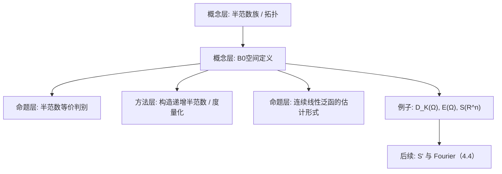

**相关笔记：** [[4.1 广义函数的概念]]｜[[4.3 广义函数的运算]]｜[[4.4 S上的Fourier变换]]｜[[第04章 广义函数与Sobolev空间 — 章节汇总]]

> [!abstract] 概览
> 本节把 4.1 中 $\mathcal D(\Omega)$ 的收敛性抽象化：用**可数个半范数**来描述拓扑，得到“可数范数空间/ $B_0$ 空间”。它是后续两条主线的底盘：  
> - 让 $\mathcal D_K(\Omega)$、$\mathcal E(\Omega)=C^\infty(\Omega)$、Schwartz 空间 $\mathcal S(\mathbb R^n)$ 等都处在同一类“可控拓扑”的空间里；  
> - 让“连续线性泛函”可以被**局部估计**刻画（与 4.1 的定理4.1.13 是同一思想在更抽象层面的复现）。  
> - 核心概念：半范数族、等价半范数族、$B_0$ 空间、完备性、Schwartz 空间与 $\mathcal S'$  
> - 高风险点：一个 $B_0$ 空间一般**不可由单个范数**刻画；“等价”指诱导同一收敛，不是逐点相等
> ^overview

---

# 1. 本节主题定位

- **本节的核心问题**
  1) 如何用“可数个半范数”刻画像 $\mathcal D_K(\Omega)$ 这样的收敛性？  
  2) 两组半范数何时认为“给的是同一拓扑”（等价）？  
  3) 在这种结构下，连续线性泛函有什么通用刻画？（为分布/温和分布做准备）  

- **本节在本章知识链中的位置**
  - 4.1：给出 $\mathcal D(\Omega)$ 的收敛（但尚未抽象成统一语言）  
  - 4.2：把这种收敛推广为 $B_0$ 空间；并引入 $\mathcal S,\mathcal S'$（为 4.4 Fourier 做准备）  
  - 4.3：在 $\mathcal D'$、$\mathcal S'$ 上定义运算（都依赖“算子在 $B_0$ 空间上连续”）  

- **本节依赖哪些前置概念/定理**
  - 4.1：$\mathcal D_K(\Omega)$ 的半范数刻画（式(4.2.1)）  
  - 基本拓扑：紧集列、完备性、对角线抽取（将在例/习题中用到）

- **本节为后续哪些内容铺路**
  - 4.4：把 Fourier 变换作为 $\mathcal S\to\mathcal S$ 的连续线性同构，再对偶到 $\mathcal S'$  
  - 4.5：Sobolev 的 Fourier 表达与 $H^{\pm m}$ 的对偶结构

## 二、核心思想

> [!tip] 一句话：用“可数半范数”代替“单个范数”
> 在 $\mathcal D_K(\Omega)$、$\mathcal E(\Omega)$、$\mathcal S(\mathbb R^n)$ 这类空间里，“收敛”本质是：  
> - 对每个 $m$，某个“直到 $m$ 阶导数（再乘多项式权）”的上界趋于 0；  
> 这天然是**半范数族**，而不是一个范数。

> [!warning] 最易踩坑
> - 只检查某一个 $m$ 的半范数趋零就断言收敛（错误：要对所有 $m$）。  
> - 看到“可数范数空间”就以为真有范数（实际上通常是半范数；可把它们“递增化”后仍然只是半范数）。

---

# 2. 内容分层图

---

# 3. 定义系统

## 3.1 可数范数空间 / $B_0$ 空间

> [!quote] 原文直接信息（定义4.2.1）
> 设 $X$ 是线性空间，称它是**可数范数空间**（或 $B_0$ 空间），是指在 $X$ 上给定可数个半范数 $\{\|\cdot\|_m\}_{m\ge 1}$ 满足：  
> (1) $\|x+y\|_m\le \|x\|_m+\|y\|_m$；  
> (2) $\|\lambda x\|_m=|\lambda|\|x\|_m$；  
> (3) $\|x\|_m\ge 0$ 且 $\|0\|_m=0$；  
> (4) 若 $\|x\|_m=0$ 对所有 $m$，则 $x=0$。

- **定义对象是什么**：带可数半范数族的拓扑线性空间（收敛由“对所有 $m$ 的半范数收敛”定义）。  
- **为什么要这样定义**：把 $\mathcal D_K(\Omega)$ 等空间的“所有阶导数一致收敛”结构抽象出来，形成可复用的拓扑工具。  
- **它解决了什么问题**：后续要谈“连续线性算子/对偶空间/弱收敛”，必须先有可操作的拓扑刻画。  
- **最小例子**：有限维空间上取同一个范数重复为 $\|\cdot\|_m=\|\cdot\|$。  
- **边界情况**：若只给一个半范数（例如只看 $m=1$），往往不足以刻画原本的收敛。  
- **初学者误区**：把“可数范数空间”误当“存在一个范数”等价；通常做不到（比如 $\mathcal D(\Omega)$ 的拓扑不可由单范数导出）。

## 3.2 递增化半范数（规范化技巧）

> [!quote] 原文直接信息（定义等价的递增半范数）
> 在 $B_0$ 空间定义中，可把半范数族替换成满足
> $$
> \|x\|_1'\le \|x\|_2'\le \cdots
> $$
> 的半范数族，例如令
> $$
> \|x\|_m'=\max(\|x\|_1,\dots,\|x\|_m).
> $$

- **为什么要这样做**：递增化后，很多估计可写成“只需控制足够大的 $m$”，并方便构造度量。  
- **误区**：递增化不改变拓扑（等价），但会改变数值；不要在数值层面硬比较。

## 3.3 等价半范数族

> [!quote] 原文直接信息（定义4.2.2）
> 在线性空间 $X$ 上给定两组可数半范数 $\{\|\cdot\|_m\}$ 与 $\{\|\cdot\|_m'\}$，若它们导出相同的收敛性，则称两组半范数**等价**。

- **“等价”到底在说什么**：两个拓扑相同（收敛列相同、连续性相同）。  
- **最小例子**：$\sum_{k\le m}a_k$ 与 $\max_{k\le m}a_k$ 诱导同一“对每个 $m$ 都趋 0”的结构（只差常数因子）。

## 3.4 完备性（后续构造对偶与极限要用）

> [!quote] 原文直接信息（定义4.2.8：完备性，摘意）
> 给定度量（或等价的准范数）后，可讨论 $B_0$ 空间的完备性；完备的 $B_0$ 空间是典型的 Fréchet 空间情形。

> [!note] 本节实际用法
> - 对 $\mathcal E(\Omega)$、$\mathcal S(\mathbb R^n)$ 等，需要“Cauchy 列在每个半范数下都收敛”来推出极限仍在空间中。

---

# 4. 定理/命题系统

## 4.1 命题4.2.3（等价半范数族的判别）

> [!quote] 原文直接信息（命题4.2.3）
> 两组可数半范数 $\{\|\cdot\|_m\}$ 与 $\{\|\cdot\|_m'\}$ 等价，当且仅当：  
> 对每个 $m$，存在 $m'$ 与常数 $C_{mm'}>0$ 使
> $$
> \|x\|_m\le C_{mm'}\|x\|_{m'}'\quad(\forall x),
> $$
> 且反向也成立（交换两族角色）。

- **条件作用**
  - “对每个 $m$ 允许换到某个 $m'$”：体现“不同半范数等级的可比性”；  
  - 常数 $C_{mm'}$ 允许依赖 $m,m'$：只要能在每个等级上比较即可。  

- **结论可操作化**
  - 要证明两拓扑相同：只需证明“每个半范数都被另一族某个半范数控制”（双向）。

- **证明骨架（抽骨架）**
  1) 若等价，则收敛列在两拓扑一致；对“$\|x_j\|_{m'}'\to 0$”推出“$\|x_j\|_m\to 0$”可反推出支配不等式；  
  2) 若存在上述支配，则立刻得到任意列在一族下趋0 等价于在另一族下趋0。

## 4.2 命题4.2.4（$B_0$ 空间可度量化：给出一个准范数/度量）

> [!quote] 原文直接信息（命题4.2.4，摘意）
> 若 $\{\|\cdot\|_m\}$ 是 $B_0$ 空间上的可数半范数，则可构造一个准范数/度量，使其诱导的收敛与原半范数族一致。

- **为什么重要**
  - 让“完备性、基本列、闭集”等概念可以用度量语言表述（更易用）。  
- **关键点**
  - 典型构造是把每个半范数压到 $(0,1)$ 再加权求和，例如
 
$$
d(x,y)=\sum_{m=1}^\infty 2^{-m}\frac{\|x-y\|_m}{1+\|x-y\|_m}.
$$
 
  - 这个 $d$ 与原拓扑等价：$x_j\to x$ 当且仅当对每个 $m$ 有 $\|x_j-x\|_m\to 0$。

## 4.3 定理4.2.12（$B_0$ 空间有“足够多”的连续线性泛函）

> [!quote] 原文直接信息（定理4.2.12，意旨）
> 任意 $B_0$ 空间具有足够多的连续线性泛函（可用来分离点/刻画拓扑）。

- **这句话在后续怎么用**
  - 把“对象=连续线性泛函”落地：例如 $\mathcal S'(\mathbb R^n)$、$\mathcal D'(\Omega)$。  
  - 说明拓扑不是空的：连续泛函足以检测差异（类似 Hahn–Banach 的“分离”精神在此类空间的版本）。

---

# 5. 例子与反例系统

- **关键例子**
  1) **$\mathcal D_K(\Omega)$**：固定紧集 $K$，用
 
$$
\|\varphi\|_{m,K}=\sum_{|\alpha|\le m}\max_{x\in K}|\partial^\alpha\varphi(x)|
$$
 
     刻画“各阶导数在 $K$ 上一致”。  
  2) **$\mathcal E(\Omega)=C^\infty(\Omega)$**：取紧集列 $K_1\Subset K_2\Subset\cdots$ 且 $\bigcup K_m=\Omega$，定义
 
$$
\|\varphi\|_m=\sum_{|\alpha|\le m}\max_{x\in K_m}|\partial^\alpha\varphi(x)|.
$$
 
  3) **Schwartz 空间 $\mathcal S(\mathbb R^n)$**：半范数同时控制“高阶导数 + 多项式权衰减”，为 Fourier 变换的稳定性服务。

- **最值得补的反例**
  - $\mathcal D(\Omega)$（不固定 $K$）一般不能用单范数描述：因为“支撑可以跑动”，局部半范数无法全局统一。

---

# 6. 本节逻辑链复原

1) 从 4.1 的 $\mathcal D_K(\Omega)$ 出发：收敛其实由可数个半范数控制（式(4.2.1)）。  
2) 抽象出 $B_0$ 空间：把“很多半范数同时控制”变为一个通用概念。  
3) 讨论等价半范数：说明“换紧集列/换具体写法”不会改变拓扑本质（保证定义的稳定性）。  
4) 给出度量化与完备性：把后续所需的极限/闭性工具补齐。  
5) 引入 $\mathcal S,\mathcal S'$ 等核心例子：为 Fourier 与 Sobolev 做准备。

---

# 7. 本节高风险误区（≥5 条）

1) **误读点**：把“可数范数空间”理解成“存在一个范数”。  
   - **原因**：名称误导。  
   - **正确理解**：一般是半范数族；即使能度量化，也未必来自范数。  

2) **误读点**：认为证明收敛只要检查某个固定 $m$ 的半范数。  
   - **原因**：在 Banach 空间里只需一个范数。  
   - **正确理解**：$x_j\to 0$ 要求对所有 $m$ 都有 $\|x_j\|_m\to 0$。  

3) **误读点**：认为两组半范数等价就是逐项相等或同阶相控。  
   - **原因**：把“等价范数”经验生搬硬套。  
   - **正确理解**：允许 $m$ 对应到另一个 $m'$（命题4.2.3），这是拓扑层面的等价。  

4) **误读点**：以为 $\mathcal E(\Omega)$ 的拓扑依赖于具体选择的紧集列 $\{K_m\}$。  
   - **原因**：半范数直接写在 $K_m$ 上。  
   - **正确理解**：不同紧集列给出等价半范数族（习题4.2.1）。  

5) **误读点**：把“完备”当成“每个半范数完备”。  
   - **原因**：忽略“同时”这件事。  
   - **正确理解**：$B_0$ 完备指：Cauchy 列在诱导度量下收敛；等价地，对每个 $m$ 在半范数意义 Cauchy 且存在共同极限并落在空间里。  

---

# 8. 知识库拆分建议

- **A类：概念卡**
  - $B_0$ 空间（可数半范数空间）  
  - 半范数族的等价（命题4.2.3 作为判别）  
  - $\mathcal D_K(\Omega)$、$\mathcal E(\Omega)$、$\mathcal S(\mathbb R^n)$ 的拓扑定义  

- **B类：定理卡**
  - 命题4.2.3（等价判别）  
  - 命题4.2.4（度量化/准范数构造）  
  - 定理4.2.12（足够多的连续线性泛函）

- **C类：留在本节页**
  - “递增化半范数”的规范化技巧（更像使用提示）

- **D类：专题综述候选**
  - “各种常见函数空间（$C^k,C^\infty,\mathcal D,\mathcal S$）的拓扑对照表”

---

# 9. 后续学习接口

- **下一轮可展开证明点**
  - 命题4.2.3 的必要性方向：如何从“同收敛”推出“半范数支配”  
  - 定理4.2.12（依赖引理4.2.11）的构造细节：如何在 $B_0$ 空间中找分离泛函  

- **适合出题的点**
  - 给定两种半范数写法，证明它们等价（典型：$\max$ vs $\sum$；换紧集列）  
  - 用对角线法从“逐层有界”抽出收敛子列（习题4.2.4 的模式）

- **与前后节衔接**
  - 与 4.1：4.1 的 $\mathcal D$ 收敛在固定支撑 $K$ 上就是 $B_0$ 结构  
  - 与 4.4：Schwartz 空间是 Fourier 变换的天然定义域；其对偶 $\mathcal S'$ 是温和分布

---

# 10. 自测问题

## 10.A 自测问题（5题）

1) 写出 $B_0$ 空间的定义，并解释为什么“$\|x\|_m=0\ \forall m\Rightarrow x=0$”是必须的。  
2) 给出两组半范数等价的判别（命题4.2.3），并用一句话说清“为什么允许 $m\mapsto m'$”。  
3) 解释为什么 $\mathcal E(\Omega)$ 的拓扑与紧集列选择无关。  
4) 写出把半范数族度量化的典型公式，并说明它如何等价于“逐 $m$ 收敛”。  
5) 为什么 Fourier 变换更自然地放在 $\mathcal S$ 上而非 $\mathcal D$ 上？

## 10.B 习题（完整解答，按教材编号全覆盖）

> [!tip] 编号门禁（4.2）
> - [x] 4.2.1
> - [x] 4.2.2
> - [x] 4.2.3
> - [x] 4.2.4

### 习题 4.2.1（$\mathcal E(\Omega)$ 拓扑与紧集列无关）
> [!problem] 题目
> 验证：在例 4.2.6 中，$\mathcal E(\Omega)$ 上的收敛性与紧集列 $\{K_m\}$ 的特殊选择无关。
>
> [!solution]- 完整过程解答
> 例4.2.6 中：选紧集列 $K_1\Subset K_2\Subset\cdots$ 且 $\bigcup_{m\ge1}K_m=\Omega$，定义半范数
> $$
> \|\varphi\|_m:=\sum_{|\alpha|\le m}\max_{x\in K_m}|\partial^\alpha\varphi(x)|.
> $$
> 需要证明：若换成另一列 $K_1'\Subset K_2'\Subset\cdots$（同样穷尽 $\Omega$），得到的半范数族 $\{\|\cdot\|_m'\}$ 与原族等价（命题4.2.3）。
> 
> **Step 1（紧集穷尽的“相互包含”）**  
> 由于 $\{K_m'\}$ 的并为 $\Omega$，对每个固定的 $K_m$（紧集），存在 $m'(m)$ 使
> $$
> K_m\subset K_{m'(m)}'.
> $$
> 同理，对每个 $K_{m'}'$ 存在 $m(m')$ 使 $K_{m'}'\subset K_{m(m')}$。
> 
> **Step 2（半范数支配）**  
> 若 $K_m\subset K_{m'}'$，则对任意 $\varphi\in\mathcal E(\Omega)$ 与 $|\alpha|\le m$，
> $$
> \max_{x\in K_m}|\partial^\alpha\varphi(x)|\le \max_{x\in K_{m'}'}|\partial^\alpha\varphi(x)|.
> $$
> 于是
> $$
> \|\varphi\|_m\le \sum_{|\alpha|\le m}\max_{x\in K_{m'}'}|\partial^\alpha\varphi(x)|
> \le \|\varphi\|_{m'}'.
> $$
> 即得到 $\|\cdot\|_m\le 1\cdot \|\cdot\|_{m'}'$（这里 $m'$ 取决于 $m$）。
> 
> 反向同理：存在 $m$ 使 $\|\cdot\|_{m'}'\le \|\cdot\|_{m}$。
> 
> **Step 3（应用命题4.2.3）**  
> 两向支配成立，故两组半范数等价，诱导的收敛性与紧集列选择无关。

### 习题 4.2.2（Schwartz 半范数的等价）
> [!problem] 题目
> 设
> $$
> \|\varphi\|_m'=\sup_{|k|\le m,\ |\alpha|\le m,\ x\in\mathbb R^n}\big|x^k\,\partial^\alpha\varphi(x)\big|
> \quad(m=0,1,2,\dots),
> $$
> 求证：$\{\|\cdot\|_m'\}$ 与 $\mathcal S(\mathbb R^n)$ 上的标准可数半范数组等价（从而 $\|\cdot\|_m'$ 也是 $\mathcal S(\mathbb R^n)$ 上的等价可数半范数组）。
>
> [!solution]- 完整过程解答
> 设标准半范数族写成（任取一种常见等价写法即可）
> $$
> \|\varphi\|_m:=\sum_{|k|\le m,\ |\alpha|\le m}\sup_{x\in\mathbb R^n}\big|x^k\,\partial^\alpha\varphi(x)\big|.
> $$
> 
> **Step 1（$\|\cdot\|_m'$ 控制 $\|\cdot\|_m$）**  
> 记 $N_m=\#\{(k,\alpha):|k|\le m,|\alpha|\le m\}$（有限常数，仅依赖 $m,n$）。则
> $$
> \|\varphi\|_m=\sum_{(k,\alpha)} \sup_x |x^k\partial^\alpha\varphi(x)|
> \le N_m\cdot \max_{(k,\alpha)}\sup_x |x^k\partial^\alpha\varphi(x)|
> =N_m\|\varphi\|_m'.
> $$
> 即 $\|\cdot\|_m\le N_m\|\cdot\|_m'$。
> 
> **Step 2（$\|\cdot\|_m$ 控制 $\|\cdot\|_m'$）**  
> 反向更直接：$\|\varphi\|_m'$ 是上述求和项的最大值，因此
> $$
> \|\varphi\|_m'=\max_{(k,\alpha)}\sup_x|x^k\partial^\alpha\varphi(x)|
> \le \sum_{(k,\alpha)}\sup_x|x^k\partial^\alpha\varphi(x)|
> =\|\varphi\|_m.
> $$
> 
> **Step 3（应用命题4.2.3）**  
> 两向支配给出半范数族等价，从而 $\|\cdot\|_m'$ 与标准半范数族诱导同一收敛性。

### 习题 4.2.3（$\mathcal D_K(\Omega)$ 与 $\mathcal E(\Omega)$ 是 $B_0$ 空间）
> [!problem] 题目
> 验证：$\mathcal D_K(\Omega)$ 与 $\mathcal E(\Omega)$ 都是 $B_0$ 空间。
>
> [!solution]- 完整过程解答
> **(1) $\mathcal D_K(\Omega)$**  
> 固定紧集 $K\Subset\Omega$，令
> $$
> \|\varphi\|_{m,K}:=\sum_{|\alpha|\le m}\max_{x\in K}|\partial^\alpha\varphi(x)|,\qquad m=0,1,2,\dots
> $$
> 并令 $\mathcal D_K(\Omega)=\{\varphi\in C^\infty(\Omega):\operatorname{supp}\varphi\subset K\}$。  
> 逐条验证 $B_0$ 公理：
> - 三角不等式与齐次性来自 $\max$ 与求和的线性；  
> - 非负性显然；  
> - 若 $\|\varphi\|_{m,K}=0$ 对所有 $m$，则所有阶导数在 $K$ 上为 0，特别地 $\varphi\equiv 0$ 于 $K$，且支撑 $\subset K$，故 $\varphi\equiv 0$。  
> 因而 $\mathcal D_K(\Omega)$ 是 $B_0$ 空间。
> 
> **(2) $\mathcal E(\Omega)$**  
> 取任意紧集穷尽 $K_1\Subset K_2\Subset\cdots$，$\bigcup K_m=\Omega$。定义
> $$
> \|\varphi\|_m:=\sum_{|\alpha|\le m}\max_{x\in K_m}|\partial^\alpha\varphi(x)|,\qquad m=0,1,2,\dots
> $$
> 同样可逐条验证 $B_0$ 公理。关键是“分离点”：若对所有 $m$ 都有 $\|\varphi\|_m=0$，则对每个 $m$ 有 $\varphi\equiv 0$ 于 $K_m$，从而 $\varphi\equiv 0$ 于 $\Omega$。  
> 因而 $\mathcal E(\Omega)$ 是 $B_0$ 空间。
> 
> （并且由习题4.2.1，拓扑与紧集列选择无关。）

### 习题 4.2.4（解析函数空间 $A(G)$ 是 $B_0$，并有收敛子列）
> [!problem] 题目
> 设 $G$ 是复平面中的有界开连通区域，记 $A(G)$ 为 $G$ 上的解析函数全体。取开集列
> $$
> G_1\Subset \overline G_1\subset G_2\Subset \overline G_2\subset\cdots\subset G,\qquad \bigcup_{m\ge1}\overline G_m=G,
> $$
> 
> 其中每个 $G_m$ 的边界由有限条分段可求长曲线围成。令
> $$
> \|\varphi\|_m=\max_{z\in \overline G_m}|\varphi(z)|\qquad(\forall \varphi\in A(G)).
> $$
> 求证：$A(G)$ 是 $B_0$ 空间。又若 $\{\varphi_n\}_{n\ge1}\subset A(G)$ 且存在常数列 $\{M_m\}$ 使
> $$
> \|\varphi_n\|_m\le M_m\quad(m=1,2,\dots;\ n=1,2,\dots),
> $$
> 则 $\{\varphi_n\}$ 必有收敛子列。
>
> [!solution]- 完整过程解答
> **(1) $A(G)$ 是 $B_0$ 空间**  
> 对每个 $m$，$\|\cdot\|_m$ 显然满足半范数三公理。若 $\|\varphi\|_m=0$ 对所有 $m$，则 $\varphi\equiv 0$ 于每个 $\overline G_m$，因此 $\varphi\equiv 0$ 于 $\bigcup_m \overline G_m=G$。满足分离点条件，故是 $B_0$ 空间。
> 
> **(2) 有界族存在收敛子列（Montel/对角线法）**  
> 给定每个 $m$，$\{\varphi_n\}$ 在紧集 $\overline G_m$ 上一致有界：$\sup_n\max_{\overline G_m}|\varphi_n|\le M_m$。  
> 由复分析的 Montel 定理（或 Arzelà–Ascoli + Cauchy 估计给出等度连续），解析函数族在每个紧集上一致有界 $\Rightarrow$ 是正规族：从 $\{\varphi_n\}$ 可抽出子列在 $\overline G_m$ 上一致收敛（并且极限仍解析）。
> 
> 具体用“对角线抽取”构造一个在所有 $\overline G_m$ 上都收敛的子列：  
> - 先对 $m=1$，从 $\{\varphi_n\}$ 抽出子列 $\{\varphi_n^{(1)}\}$ 在 $\overline G_1$ 上一致收敛；  
> - 再对 $m=2$，从 $\{\varphi_n^{(1)}\}$ 抽出子列 $\{\varphi_n^{(2)}\}$ 在 $\overline G_2$ 上一致收敛；  
> - 依此进行。  
> 取对角线子列 $\psi_k:=\varphi_k^{(k)}$，则对每个固定 $m$，当 $k$ 足够大时 $\psi_k$ 是第 $m$ 步子列的尾部，因此在 $\overline G_m$ 上一致收敛。
> 
> 因此得到 $\{\psi_k\}$ 在每个 $\overline G_m$ 上一致收敛，从而在 $G$ 上局部一致收敛，极限函数仍解析，故 $\{\varphi_n\}$ 必有收敛子列。

## 10.C 引用与原文 PDF（末尾嵌入）

> [!quote]- 参考（教材分片）
> 1. 张恭庆，《泛函分析讲义（第二版）（上）》，第 4 章 §2：$B_0$ 空间。  
> 2. 本节对应分片 PDF：![[00-Raw素材/泛函分析讲义_张恭庆/章节内容/第四章_广义函数与Sobolev空间/4.2_B0空间.pdf]]
