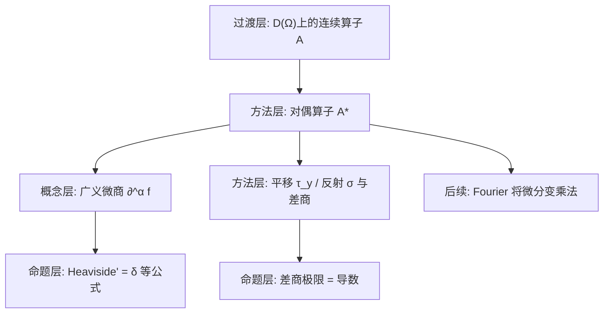

**相关笔记：** [[4.1 广义函数的概念]]｜[[4.2 B0空间]]｜[[4.4 S上的Fourier变换]]｜[[4.5 Sobolev空间与嵌入定理]]｜[[第04章 广义函数与Sobolev空间 — 章节汇总]]

> [!abstract] 概览
> 本节给出“在分布上做运算”的统一原则：先在测试函数空间 $\mathcal D(\Omega)$ 上给连续线性算子 $A$，再用对偶把它推到 $\mathcal D'(\Omega)$：  
> $$\langle A^*f,\varphi\rangle=\langle f,A\varphi\rangle.$$  
> 由此得到最核心的运算——**广义微商**（分布导数），并由平移/反射等算子导出一套可交换的结构。  
> - 核心方法：算子连续性 + 对偶定义运算  
> - 核心结论：$\partial^\alpha$ 在分布意义下总可定义；跳跃点的导数产生 $\delta$；$\frac{d}{dx}\ln|x|=\mathrm{P.V.}\frac1x$  
> - 关键门槛：测试函数紧支撑确保“分部积分无边界项”
> ^overview

---

# 1. 本节主题定位

- **本节的核心问题**
  1) 分布上哪些“运算”是合法的？如何系统地定义？  
  2) 广义导数如何定义，为什么能覆盖所有分布？  
  3) 平移、反射、差商极限等操作如何在 $\mathcal D'$ 中表达？  

- **本节在本章知识链中的位置**
  - 4.1：分布定义与连续性刻画（提供“对偶框架”）  
  - 4.2：$B_0$ 空间语言保证“算子连续”可控  
  - 4.3：在 $\mathcal D',\mathcal S'$ 上做运算（微分、平移、反射等）  
  - 4.4：Fourier 变换把“微分↔乘多项式”变为代数规则  
  - 4.5：用分布导数定义 Sobolev（弱导数）

- **依赖的前置概念/定理**
  - 4.1 的 $\mathcal D$ 收敛与分布连续性  
  - 4.2 的 Schwartz 空间（温和分布出现在习题4.3.6）

- **为后续铺路**
  - PDE 里“弱形式”的一切都靠这里的对偶定义；Fourier/Sobolev 的核心交换律也从这里起源。

## 二、核心思想

> [!tip] 运算的通用模板（把“作用在分布上”转回“作用在测试函数上”）
> 1) 先在 $\mathcal D(\Omega)$ 上定义（并证明）算子 $A$ **连续**；  
> 2) 再定义 $A^*$ 作用在分布上：$\langle A^*f,\varphi\rangle=\langle f,A\varphi\rangle$；  
> 3) 任何需要的性质（线性、交换、极限可交换）都尽量先在 $\mathcal D$ 上证，再对偶到 $\mathcal D'$。

> [!warning] 看懂但不会用的高频点
> - “把导数转移到测试函数上”时**符号 $(-1)^{|\alpha|}$** 极易丢；这来自分部积分（边界项为 0 的原因是紧支撑）。  
> - 不是所有运算都能在 $\mathcal D'$ 上定义（例如分布乘法一般不闭）；本节给的是“可保证闭合”的运算族：由 $\mathcal D$ 上连续算子诱导的运算。

---

# 2. 内容分层图

---

# 3. 定义系统

## 3.1 $\mathcal D(\Omega)$ 上的连续线性算子与对偶算子

> [!quote] 原文直接信息（连续算子与对偶）
> 设 $A:\mathcal D(\Omega)\to\mathcal D(\Omega)$ 为线性算子，称 $A$ 连续是指：
> $$
> \varphi_j\to\varphi\ \text{于}\ \mathcal D(\Omega)\ \Longrightarrow\ A\varphi_j\to A\varphi\ \text{于}\ \mathcal D(\Omega).
> $$
> 在 $\mathcal D'(\Omega)$ 上定义 $A^*$：
> $$
> \langle A^*f,\varphi\rangle=\langle f,A\varphi\rangle\qquad(\forall \varphi\in\mathcal D(\Omega),\ \forall f\in\mathcal D'(\Omega)).
> $$

- **为什么要这样定义**：分布本身不一定能点值/相乘/求导，但它对测试函数的作用总是可定义；把运算“搬到测试函数一侧”即可。  
- **条件作用**：$A$ 连续保证 $A^*f$ 仍是连续泛函（仍在 $\mathcal D'$）。  
- **最小例子**：微分算子、乘法算子（见 3.2/3.3）。

## 3.2 广义微商（分布导数）

> [!quote] 原文直接信息（定义4.3.3：广义微商）
> 对 $f\in\mathcal D'(\Omega)$ 与多重指标 $\alpha$，定义 $\alpha$ 阶广义微商 $\partial^\alpha f$ 为：
> $$
> \langle \partial^\alpha f,\varphi\rangle =(-1)^{|\alpha|}\langle f,\partial^\alpha\varphi\rangle\qquad(\forall \varphi\in\mathcal D(\Omega)).
> $$

- **为什么要这样定义**
  - 当 $f$ 来自光滑函数 $u$ 时，分部积分给出  
 
$$
\int (\partial^\alpha u)\varphi =(-1)^{|\alpha|}\int u\,\partial^\alpha\varphi,
$$
 
    因此该定义与经典导数一致；  
  - 对一般分布，该式直接把“导数”定义成一个新的连续泛函。

- **关键条件的作用**
  - $\varphi\in C_c^\infty$：确保分部积分**没有边界项**（紧支撑是核心）。  

- **初学者误区**
  - 忘记 $(-1)^{|\alpha|}$；  
  - 误以为分布导数一定还是函数；实际上常出现 $\delta$、主值等更奇异对象。

---

# 4. 定理/命题系统

## 4.1 例4.3.1/4.3.2：微分算子与乘法算子在 $\mathcal D$ 上连续

> [!quote] 原文直接信息（例4.3.1/4.3.2，摘意）
> 任意微分算子 $\partial^\alpha:\mathcal D(\Omega)\to\mathcal D(\Omega)$ 连续；若 $\psi\in C^\infty(\Omega)$，则乘法算子 $A(\varphi)=\psi\varphi$ 也是连续的。

- **为什么重要**：这是后续在分布上做“微分/乘以光滑函数”的合法性来源。  
- **关键一跳**：在固定紧集 $K$ 上，$\|\partial^\alpha\varphi\|_{m,K}\le \|\varphi\|_{m+|\alpha|,K}$，从而半范数可控。

## 4.2 公式4.3.4：Heaviside 的导数是 Dirac

> [!quote] 原文直接信息（公式4.3.4）
> 设
> $$
> Y(x)=\begin{cases}1,&x>0,\\ 0,&x\le 0,\end{cases}
> $$
> 则 $\dfrac{d}{dx}Y=\delta$（在分布意义下）。

- **条件作用**：测试函数紧支撑使得
 
$$
\langle Y',\varphi\rangle=-\langle Y,\varphi'\rangle=-\int_0^\infty \varphi'(x)\,dx=\varphi(0)=\langle\delta,\varphi\rangle.
$$
 

## 4.3 平移与差商：导数是平移差商的极限（习题4.3.4）

> [!note] 结论先行（本节最可用的“操作化”口径）
> 在 $\mathcal D'(\mathbb R^n)$ 中，
> $$
> \widetilde{\partial_{x_i}}f=\lim_{h\to 0}\frac{1}{h}\big(\tau_{-he_i}f-f\big),
> $$
> 其中 $(\tau_y\varphi)(x)=\varphi(x-y)$，并对偶定义 $(\tau_y f,\varphi)= (f,\tau_{-y}\varphi)$。

- **关键条件的作用**：$\varphi$ 光滑可做 Taylor 展开；紧支撑保证差商在积分里可控。

---

# 5. 例子与反例系统

- **关键例子**
  - 跳跃函数的分布导数会多出 $\delta$（习题4.3.3）：这解释了“弱导数捕捉跳跃”。  
  - $\ln|x|$ 的导数是主值 $1/x$（习题4.3.2）：这是“不可积奇点”在分布中的标准处理方式。  

- **反例提醒**
  - 分布乘法一般不可定义：只有乘以光滑函数（乘法算子在 $\mathcal D$ 上连续）才保证闭合。

---

# 6. 本节逻辑链复原

1) 先定义 $\mathcal D$ 上连续算子，并指出微分/乘光滑函数是连续的。  
2) 用“对偶算子 $A^*$”把运算推到分布上。  
3) 特化 $A=\partial^\alpha$ 得到分布导数（广义微商）。  
4) 通过具体公式（Heaviside、主值、跳跃点）展示：分布导数把“不可导/不连续”转成 $\delta$ 等可控对象。  
5) 引入平移/反射等连续算子，为差商极限与后续 Fourier 规则做准备。

---

# 7. 本节高风险误区（≥5 条）

1) **误读点**：把 $\langle \partial^\alpha f,\varphi\rangle$ 写成 $\langle f,\partial^\alpha\varphi\rangle$（忘掉符号）。  
   - **正确理解**：必须有 $(-1)^{|\alpha|}$。  

2) **误读点**：认为“分布可微”需要分布来自可微函数。  
   - **正确理解**：任意分布都可做任意阶广义微商；只是结果可能更奇异。  

3) **误读点**：把“主值”当作普通函数 $1/x$。  
   - **正确理解**：$\mathrm{P.V.}(1/x)$ 只通过对测试函数的极限积分定义。  

4) **误读点**：把“平移到 $\mathcal D'$”写错符号：$(\tau_y f,\varphi)=(f,\tau_y\varphi)$。  
   - **正确理解**：对偶关系应是 $(\tau_y f,\varphi)=(f,\tau_{-y}\varphi)$。  

5) **误读点**：认为跳跃函数导数只等于 a.e. 导数。  
   - **正确理解**：若有跳跃，分布导数多出 $\delta$ 项（习题4.3.3）。  

---

# 8. 知识库拆分建议

- **A类：概念卡**
  - 对偶算子 $A^*$ 的定义范式  
  - 分布导数（广义微商）  
  - 平移算子 $\tau_y$、反射算子（本节后半出现）  
  - 主值分布 $\mathrm{P.V.}(1/x)$

- **B类：定理卡**
  - Heaviside' = δ  
  - 跳跃点导数公式（习题4.3.3）  
  - 差商极限公式（习题4.3.4）

- **C类：留在本节页**
  - “连续算子 → 对偶运算”这一套使用指南  

- **D类：专题综述候选**
  - “常用分布恒等式清单”（$\delta$、主值、跳跃、基本解）

---

# 9. 后续学习接口

- **下一轮可展开证明点**
  - 平移在 $\mathcal D$ 上连续（从支撑控制与导数估计出发）  
  - 由 Taylor 展开导出差商极限=导数（习题4.3.4）  

- **适合出题的点**
  - “计算某个分布导数”与“识别 δ 项”  
  - “证明某映射 $y\mapsto\langle f,\tau_{-y}\varphi\rangle$ 光滑”（习题4.3.5）

- **与后续衔接**
  - 4.4：Fourier 变换把 $\partial^\alpha$ 变成乘 $(2\pi i\xi)^\alpha$，主值/δ 都能通过变换表统一处理。  
  - 4.5：Sobolev 的弱导数正是这里的广义微商在 $L^p$ 中的实现。

---

# 10. 自测问题

## 10.A 自测问题（5题）

1) 为什么分布导数定义里必须用 $(-1)^{|\alpha|}$？哪一步用到测试函数紧支撑？  
2) 说明“$A$ 在 $\mathcal D$ 上连续”如何推出 $A^*$ 把 $\mathcal D'$ 映到自身。  
3) 举例说明：连续但不可微的函数（如 $|x|$）的分布导数是什么？为什么没有 $\delta$？  
4) 写出跳跃函数导数的 δ 项系数如何由左右极限决定。  
5) 解释 $\mathrm{P.V.}(1/x)$ 的定义，并说明它为什么是分布但不是局部可积函数。

## 10.B 习题（完整解答，按教材编号全覆盖）

> [!tip] 编号门禁（4.3）
> - [x] 4.3.1
> - [x] 4.3.2
> - [x] 4.3.3
> - [x] 4.3.4
> - [x] 4.3.5
> - [x] 4.3.6

### 习题 4.3.1（计算：$|x|$ 与 $x_+^\lambda$ 的广义导数）
> [!problem] 题目
> 计算：  
> (1) $\widetilde{\dfrac{d}{dx}}|x|$；  
> (2) $\widetilde{\dfrac{d^n}{dx^n}}x_+^\lambda$（$\lambda\in\mathbb R,\ \lambda\ge 0$），其中
> $$
> x_+^\lambda=\begin{cases}x^\lambda,&x>0,\\ 0,&x\le 0.\end{cases}
> $$
>
> [!solution]- 完整过程解答
> **(1) $\widetilde{\dfrac{d}{dx}}|x|=\mathrm{sgn}(x)$**  
> 取任意 $\varphi\in\mathcal D(\mathbb R)$：
> $$\Big\langle \widetilde{\frac{d}{dx}}|x|,\varphi\Big\rangle=-\int_{\mathbb R}|x|\varphi'(x)\,dx
> =-\int_{-\infty}^0(-x)\varphi'(x)\,dx-\int_0^\infty x\varphi'(x)\,dx.$$
> 分部积分（边界项因 $\varphi$ 紧支撑为 0）得
> $$=-\Big([(-x)\varphi(x)]_{-\infty}^0-\int_{-\infty}^0(-1)\varphi(x)\,dx\Big)
>   -\Big([x\varphi(x)]_0^\infty-\int_0^\infty 1\cdot\varphi(x)\,dx\Big)$$
> $$=\int_{-\infty}^0(-1)\varphi(x)\,dx+\int_0^\infty 1\cdot\varphi(x)\,dx
> =\int_{\mathbb R}\mathrm{sgn}(x)\,\varphi(x)\,dx.$$
> 因此分布导数对应于函数 $\mathrm{sgn}(x)$，并且**没有 $\delta$ 项**（原因：$|x|$ 连续无跳跃）。
> 
> **(2) $\widetilde{\dfrac{d^n}{dx^n}}x_+^\lambda$ 的一般形式**  
> 对 $\varphi\in\mathcal D(\mathbb R)$，
> $$\Big\langle \widetilde{\frac{d^n}{dx^n}}x_+^\lambda,\varphi\Big\rangle
> =(-1)^n\int_0^\infty x^\lambda\,\varphi^{(n)}(x)\,dx.$$
> 
> - 若 $\lambda>n-1$，则 $x^{\lambda-n}$ 在 $0$ 附近仍可积，反复分部积分 $n$ 次且 $x^\lambda$ 在 $0$ 处的低阶导数为 0（$\lambda>n-1$ 保证边界项消失），得到
> $$\widetilde{\frac{d^n}{dx^n}}x_+^\lambda
> =\lambda(\lambda-1)\cdots(\lambda-n+1)\,x_+^{\lambda-n}.$$
> 
> - 若 $\lambda=m\in\mathbb N_0$ 为非负整数，则 $x_+^m$ 是分段多项式。对 $n\le m$，仍有
> $$
> \widetilde{\frac{d^n}{dx^n}}x_+^m=m(m-1)\cdots(m-n+1)\,x_+^{m-n}.
> $$
> 对 $n=m+1$，有 $\widetilde{\dfrac{d^{m+1}}{dx^{m+1}}}x_+^m=m!\,\delta$；更一般地，对 $n=m+1+k$，
> $$
> \widetilde{\frac{d^{m+1+k}}{dx^{m+1+k}}}x_+^m=m!\,\delta^{(k)}.
> $$
> 这是因为每做一次导数都会把 $x_+^m$ 的“0 处边界项”转化为 $\delta$ 的导数（与习题4.3.3 同一机制）。
> 
> （若需要把公式推广到所有实 $\lambda$ 且任意 $n$，可用 Gamma 函数形式
> $\frac{\Gamma(\lambda+1)}{\Gamma(\lambda-n+1)}x_+^{\lambda-n}$
> 并按解析延拓解释奇异情形；本题按教材语境给出上述分段情形即可。）

### 习题 4.3.2（$\dfrac{d}{dx}\ln|x|=\mathrm{P.V.}\dfrac1x$）
> [!problem] 题目
> 求证：
> $$
> \widetilde{\frac{d}{dx}}\ln|x|=\mathrm{P.V.}\Big(\frac1x\Big),
> $$
> 即
> $$
> \Big\langle \widetilde{\frac{d}{dx}}\ln|x|,\varphi\Big\rangle=\lim_{\varepsilon\to0+}\int_{|x|\ge\varepsilon}\frac{\varphi(x)}{x}\,dx\qquad(\forall\varphi\in\mathcal D(\mathbb R)).
> $$
>
> [!solution]- 完整过程解答
> 对任意 $\varphi\in\mathcal D(\mathbb R)$，按分布导数定义：
> $$
> \Big\langle \widetilde{\frac{d}{dx}}\ln|x|,\varphi\Big\rangle=-\int_{\mathbb R}\ln|x|\,\varphi'(x)\,dx.
> $$
> 由于 $\ln|x|$ 在 0 有不可积奇性，先做截断：对 $\varepsilon>0$，
> $$
> I_\varepsilon:=-\int_{|x|\ge\varepsilon}\ln|x|\,\varphi'(x)\,dx.
> $$
> 在区间 $(-\infty,-\varepsilon]$ 与 $[\varepsilon,\infty)$ 分部积分（边界项在无穷远为 0，因为 $\varphi$ 紧支撑），得
> $$I_\varepsilon=\int_{|x|\ge\varepsilon}\frac{\varphi(x)}{x}\,dx
> +\underbrace{\big[\ln|x|\varphi(x)\big]_{x=-\varepsilon}^{x=\varepsilon}}_{=\,\ln(\varepsilon)\varphi(\varepsilon)-\ln(\varepsilon)\varphi(-\varepsilon)}.$$
> 由于 $\varphi$ 光滑，$\varphi(\varepsilon)-\varphi(-\varepsilon)=O(\varepsilon)$，故边界项为
> $$
> \ln(\varepsilon)\cdot O(\varepsilon)\xrightarrow[\varepsilon\to0+]{}0.
> $$
> 因而
> $$\lim_{\varepsilon\to0+}I_\varepsilon=\lim_{\varepsilon\to0+}\int_{|x|\ge\varepsilon}\frac{\varphi(x)}{x}\,dx
> =\Big\langle \mathrm{P.V.}\Big(\frac1x\Big),\varphi\Big\rangle.$$
> 由 $I_\varepsilon\to \langle \widetilde{\frac{d}{dx}}\ln|x|,\varphi\rangle$，结论成立。

### 习题 4.3.3（跳跃点导数产生 $\delta$）
> [!problem] 题目
> 设 $\Omega=(\alpha,\beta)\subset\mathbb R$，$x_0\in\Omega$。又设 $f\in C^1(\Omega\setminus\{x_0\})$，$x_0$ 是 $f$ 的第一类间断点且 $f'$ 在 $\Omega\setminus\{x_0\}$ 内有界。求证：
> $$
> \widetilde{\frac{d}{dx}}f=f'+\big(f(x_0+0)-f(x_0-0)\big)\delta(x_0).
> $$
>
> [!solution]- 完整过程解答
> 取任意 $\varphi\in\mathcal D(\Omega)$。按定义：
> $$\Big\langle \widetilde{\frac{d}{dx}}f,\varphi\Big\rangle=-\int_\Omega f(x)\varphi'(x)\,dx
> =-\int_\alpha^{x_0}f\varphi'-\int_{x_0}^{\beta}f\varphi'.$$
> 分别在两段分部积分（边界项在 $\alpha,\beta$ 处为 0，因为 $\varphi$ 紧支撑在 $\Omega$ 内），得
> $$=\int_\alpha^{x_0}f'(x)\varphi(x)\,dx-\big[f(x)\varphi(x)\big]_{\alpha}^{x_0-}
>  +\int_{x_0}^{\beta}f'(x)\varphi(x)\,dx-\big[f(x)\varphi(x)\big]_{x_0+}^{\beta}$$
> $$
> =\int_\Omega f'(x)\varphi(x)\,dx+\big(f(x_0+0)-f(x_0-0)\big)\varphi(x_0).
> $$
> 注意到最后一项正是 $\langle (f(x_0+0)-f(x_0-0))\delta(x_0),\varphi\rangle$。故结论成立。
> 
> > 关键机制：跳跃导致分部积分在 $x_0$ 处出现“边界项”，它在分布里对应 $\delta$。

### 习题 4.3.4（导数=平移差商极限）
> [!problem] 题目
> 求证：对 $\forall f\in\mathcal D'(\mathbb R^n)$，
> $$
> \widetilde{\partial_{x_i}}f=\lim_{h\to0}\frac1h\big(\tau_{-he_i}f-f\big),\qquad i=1,\dots,n,
> $$
> 其中 $e_i$ 是第 $i$ 个标准基向量。
>
> [!solution]- 完整过程解答
> 取任意 $\varphi\in\mathcal D(\mathbb R^n)$。利用平移对偶定义：
> $$\Big\langle \frac1h(\tau_{-he_i}f-f),\varphi\Big\rangle
> =\frac1h\big(\langle f,\tau_{he_i}\varphi\rangle-\langle f,\varphi\rangle\big)
> =\Big\langle f,\frac{\tau_{he_i}\varphi-\varphi}{h}\Big\rangle.$$
> 当 $h\to0$ 时，$\frac{\tau_{he_i}\varphi-\varphi}{h}\to \partial_{x_i}\varphi$ 在 $\mathcal D$ 中成立：  
> - 支撑：小平移不改变紧支撑的“共同紧集”控制；  
> - 导数一致收敛：由 Taylor 展开 $\varphi(x+he_i)=\varphi(x)+h\partial_{x_i}\varphi(x)+o(h)$，并对各阶导数同样成立且在紧集上一致。  
> 于是由 $f$ 的连续性，
> $$\lim_{h\to0}\Big\langle f,\frac{\tau_{he_i}\varphi-\varphi}{h}\Big\rangle
> =\langle f,\partial_{x_i}\varphi\rangle
> =-\langle \widetilde{\partial_{x_i}}f,\varphi\rangle.$$
> 注意右端出现负号；因此
> $$\lim_{h\to0}\Big\langle \frac1h(\tau_{-he_i}f-f),\varphi\Big\rangle
> =\langle \widetilde{\partial_{x_i}}f,\varphi\rangle.$$
> 因为对所有测试函数成立，得到所需分布极限。

### 习题 4.3.5（$y\mapsto\langle f,\tau_{-y}\varphi\rangle$ 是光滑函数）
> [!problem] 题目
> 求证：对 $f\in\mathcal D'(\mathbb R^n)$ 与 $\varphi\in\mathcal D(\mathbb R^n)$，函数
> $$
> g(y)=\langle f,\tau_{-y}\varphi\rangle
> $$
> 属于 $C^\infty(\mathbb R^n)$。
>
> [!solution]- 完整过程解答
> 先证一阶导数存在。对任意 $i$，
> $$\frac{g(y+he_i)-g(y)}{h}=\Big\langle f,\frac{\tau_{-(y+he_i)}\varphi-\tau_{-y}\varphi}{h}\Big\rangle
> =\Big\langle f,\tau_{-y}\frac{\tau_{-he_i}\varphi-\varphi}{h}\Big\rangle.$$
> 当 $h\to0$，括号内在 $\mathcal D$ 中收敛到 $-\partial_{x_i}\varphi$（由 Taylor）。平移 $\tau_{-y}$ 是 $\mathcal D$ 上连续线性算子，因此
> $$
> \tau_{-y}\frac{\tau_{-he_i}\varphi-\varphi}{h}\to -\tau_{-y}(\partial_{x_i}\varphi)\quad\text{于 }\mathcal D.
> $$
> 由 $f$ 连续性可把极限送入配对：
> $$
> \partial_{y_i}g(y)=\Big\langle f,-\tau_{-y}(\partial_{x_i}\varphi)\Big\rangle.
> $$
> 右端显然连续于 $y$（同理用 $\mathcal D$ 上平移连续性），故 $g\in C^1$。  
> 对高阶导数重复此论证（每次差商都对应对 $\varphi$ 的高阶导数），得 $g\in C^\infty$，并有
> $$
> \partial_y^\alpha g(y)=(-1)^{|\alpha|}\langle f,\tau_{-y}\partial_x^\alpha\varphi\rangle.
> $$

### 习题 4.3.6（温和分布的结构表示）
> [!problem] 题目
> 求证：每个 $f\in\mathcal S'$ 必是 $L^2(\mathbb R^n)$ 函数乘以多项式的广义微商之有限和。即存在 $u_\alpha\in L^2(\mathbb R^n)$ 及偶数 $m$，使得
> $$
> f=(-1)^{|\alpha|}\sum_{|\alpha|\le m}\partial^\alpha\Big((1+|x|^2)^{m/2}u_\alpha\Big).
> $$
> （提示：利用 (4.2.7) 式，且其中的 $m$ 可认为是偶数：必要时在 (4.2.6) 中用 $2m$ 取代 $m$。）
>
> [!solution]- 完整过程解答
> 这题本质是把“连续线性泛函”在 $\mathcal S$ 上的连续性（由可数半范数控制）转化为一个 $L^2$ 表示，再通过分部积分把导数转移出去。
> 
> **Step 1（从 $\mathcal S'$ 的连续性得到 $L^2$ 表示）**  
> 由教材在 4.2 中给出的结构（式(4.2.7) 对应的结论）：存在 $m$ 与 $u_\alpha\in L^2(\mathbb R^n)$（$|\alpha|\le m$），使得对所有 $\varphi\in\mathcal S$，
> $$
> \langle f,\varphi\rangle=\sum_{|\alpha|\le m}\int_{\mathbb R^n}u_\alpha(x)\,(1+|x|^2)^{m/2}\,\partial^\alpha\varphi(x)\,dx.
> $$
> 若需要，可把 $m$ 换成 $2m$ 以确保 $m$ 为偶数（不改变“有限和”结构）。
> 
> **Step 2（把导数“转移”到 $u_\alpha$ 一侧）**  
> 对每个项做分部积分（$\varphi$ 快速衰减，边界项为 0）：
> $$\int u_\alpha(1+|x|^2)^{m/2}\partial^\alpha\varphi
> =(-1)^{|\alpha|}\int \partial^\alpha\!\big((1+|x|^2)^{m/2}u_\alpha\big)\,\varphi.$$
> 
> **Step 3（识别为分布等式）**  
> 因而
> $$
> \langle f,\varphi\rangle=\Big\langle (-1)^{|\alpha|}\sum_{|\alpha|\le m}\partial^\alpha\big((1+|x|^2)^{m/2}u_\alpha\big),\ \varphi\Big\rangle\quad(\forall\varphi\in\mathcal S).
> $$
> $$
> \langle f,\varphi\rangle=\Big\langle (-1)^{|\alpha|}\sum_{|\alpha|\le m}\partial^\alpha\big((1+|x|^2)^{m/2}u_\alpha\big),\ \varphi\Big\rangle\quad(\forall\varphi\in\mathcal S).
> $$
> 由对偶的唯一性得到所求分布恒等式。

## 10.C 引用与原文 PDF（末尾嵌入）

> [!quote]- 参考（教材分片）
> 1. 张恭庆，《泛函分析讲义（第二版）（上）》，第 4 章 §3：广义函数的运算。  
> 2. 本节对应分片 PDF：![[00-Raw素材/泛函分析讲义_张恭庆/章节内容/第四章_广义函数与Sobolev空间/4.3_广义函数的运算.pdf]]
