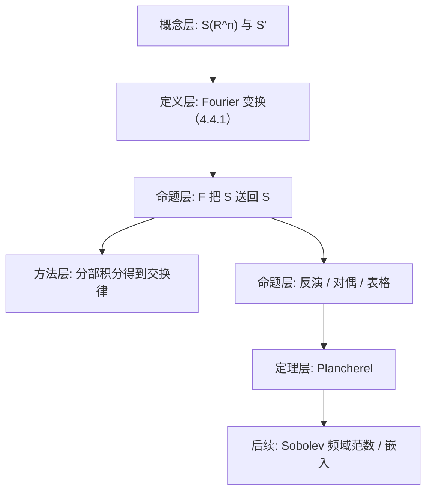

**相关笔记：** [[4.2 B0空间]]｜[[4.3 广义函数的运算]]｜[[4.5 Sobolev空间与嵌入定理]]｜[[第04章 广义函数与Sobolev空间 — 章节汇总]]

> [!abstract] 概览
> 本节的核心任务是把 Fourier 变换从 $L^1$ 推广到 Schwartz 空间 $\mathcal S(\mathbb R^n)$（以及其对偶 $\mathcal S'$），并建立三条“可运算”的规则链：  
> 1) $\mathcal F:\mathcal S\to\mathcal S$ 连续同构（足够好，能无限次分部积分）；  
> 2) 微分/乘多项式在 Fourier 下互换：$\partial^\alpha \leftrightarrow (2\pi i\xi)^\alpha$；  
> 3) $L^2$ 情形下内积保持（Plancherel），从而 Sobolev 范数可用 Fourier 权重表述（4.5 的关键接口）。  
> - 关键门槛：本书采用归一化 $\exp(-2\pi i x\cdot\xi)$（常数不同会影响所有公式）  
> - 高风险点：Fourier 常数、符号与“反演/Plancherel”的配套必须成套记忆
> ^overview

---

# 1. 本节主题定位

- **本节的核心问题**
  1) 为什么 $L^1$ 上的 Fourier 定义太窄，必须扩大定义域？  
  2) 为什么 $\mathcal S(\mathbb R^n)$ 是 Fourier 的“天然舞台”？  
  3) 反演、对偶性、Plancherel 在本书的常数规范下各是什么形式？  
  4) 如何用 Fourier 定义/刻画 Sobolev（为 4.5 铺路）？

- **本节在本章知识链中的位置**
  - 4.2：给出 $\mathcal S$ 的 $B_0$ 拓扑（可数半范数）  
  - 4.4：证明 Fourier 在 $\mathcal S$ 上封闭并连续，才能对偶到 $\mathcal S'$  
  - 4.5：$H^s$ 的 Fourier 权重范数与嵌入定理的频域证明高度相关

## 二、核心思想

> [!tip] 核心口径：把 Fourier 变换当成“可交换运算表”
> 一旦 $\mathcal F$ 在 $\mathcal S$ 上成立，就可以把 PDE/弱导数变成代数式：  
> $$
> \mathcal F(\partial^\alpha u)=(2\pi i\xi)^\alpha\,\widehat u(\xi),\qquad
> \mathcal F(x^\alpha u)=\frac{1}{(2\pi i)^{|\alpha|}}\partial_\xi^\alpha \widehat u.
> $$

> [!warning] 常数门禁（本节最易造成“会算但算错”）
> 本书定义：
> $$
> \widehat\varphi(\xi)=(\mathcal F\varphi)(\xi)=\int_{\mathbb R^n}\varphi(x)\,e^{-2\pi i x\cdot\xi}\,dx.
> $$
> 因此所有“微分↔乘多项式”“反演”“Plancherel”都必须与 $2\pi$ 成套出现；换一种常数体系会导致每个公式的系数都变。

---

# 2. 内容分层图

---

# 3. 定义系统

## 3.1 Fourier 变换（$L^1$ 口径）

> [!quote] 原文直接信息（式(4.4.1)）
> 对 $\varphi\in L^1(\mathbb R^n)$，定义 Fourier 变换
> $$
> (\mathcal F\varphi)(\xi)=\widehat\varphi(\xi)=\int_{\mathbb R^n}\varphi(x)\exp(-2\pi i x\cdot\xi)\,dx,\qquad (4.4.1)
> $$
> 其中 $x\cdot\xi=x_1\xi_1+\cdots+x_n\xi_n$。

- **为什么要这样定义**：这是分析里最基础的积分定义，但对 $L^p(p>1)$ 或多项式增长函数并不一定收敛。  
- **本节要解决的问题**：通过 $\mathcal S$ 与 $\mathcal S'$ 扩大 Fourier 的定义域与运算自由度。

## 3.2 Fourier 逆变换（与本书常数配套）

> [!quote] 原文直接信息（逆变换，摘意）
> 定义
> $$
> \check\varphi(x)=\int_{\mathbb R^n}\varphi(\xi)\exp(2\pi i x\cdot\xi)\,d\xi
> $$
> 为 Fourier 逆变换（Fourier 积分）。

- **条件作用**：正号对应 (4.4.1) 的负号；二者成对保证反演与 Plancherel。

---

# 4. 定理/命题系统

## 4.1 命题4.4.1：$\mathcal F(\mathcal S)\subset\mathcal S$

> [!quote] 原文直接信息（命题4.4.1，摘意）
> 若 $\varphi\in\mathcal S(\mathbb R^n)$，则 $\widehat\varphi\in\mathcal S(\mathbb R^n)$。

- **条件逐条解释**
  - $\varphi\in\mathcal S$ 意味着：任意多重指标 $\alpha,\beta$，$x^\alpha\partial^\beta\varphi(x)$ 有界（甚至快速衰减）。  
  - 这保证可无限次分部积分，把 $x$ 上的幂/导数转到指数项上，从而得到 $\xi$ 上的快速衰减与光滑性。

- **证明骨架（Step 1/2/3）**
  1) 先证 $\widehat\varphi$ 光滑：对 $\xi$ 求导可把导数推进积分（由一致可积控制）。  
  2) 用恒等式 $\widehat{\partial^\beta\varphi}(\xi)=(2\pi i\xi)^\beta\widehat\varphi(\xi)$ 得到多项式增长控制；  
  3) 再用 $\widehat{x^\alpha\varphi}=\frac{1}{(2\pi i)^{|\alpha|}}\partial_\xi^\alpha\widehat\varphi$ 得到对 $\xi$ 的任意阶导数也有多项式增长控制，合并得快速衰减。

- **最关键的一跳**
  - “分部积分/导数交换”合法性完全依赖 $\mathcal S$ 的快速衰减，使边界项为 0。

## 4.2 Plancherel（推论4.4.11，意旨）

> [!quote] 原文直接信息（Plancherel，摘意）
> Fourier 变换可延拓为 $L^2$ 上的等距变换：$\| \widehat f\|_{L^2}=\|f\|_{L^2}$，并保持内积。

- **结论在做什么**
  - 把 Fourier 从“积分公式”升级成 Hilbert 空间等距同构；  
  - 使 Sobolev 范数可写为频域加权 $L^2$ 范数（习题4.4.1/4.4.2）。

---

# 5. 例子与反例系统

- **关键例子**
  - $\Delta f=f$ 在 Fourier 下变成代数方程（习题4.4.4）：这是“频域秒杀 PDE”的最简示范。  
  - $H^m,H^s$ 的 Fourier 范数：说明 Sobolev 的“正则性=频域衰减/可积性”。

- **最值得补的反例**
  - 常数函数 $1$ 不在 $L^1$，因此 (4.4.1) 不可用；但在分布意义下 Fourier 仍可定义（$\mathcal F(1)=\delta$ 之类结论属于更高阶表格内容）。

---

# 6. 本节逻辑链复原

1) 从 $L^1$ 定义出 Fourier。  
2) 说明 $L^1$ 太窄（多项式/一般 $L^p$ 不行），转而引入 $\mathcal S$。  
3) 证明 $\mathcal F$ 在 $\mathcal S$ 上封闭且连续。  
4) 建立反演/对偶/交换律。  
5) 用 Plancherel 把理论落到 $L^2$，为 Sobolev 与嵌入定理准备频域工具。

---

# 7. 本节高风险误区（≥5 条）

1) **误读点**：忽略 $2\pi$ 常数，导致微分交换律系数全错。  
   - **正确理解**：本书固定用 $e^{-2\pi i x\cdot\xi}$。  

2) **误读点**：把 Fourier 变换仅当作 $L^1$ 积分。  
   - **正确理解**：本节目标是 $\mathcal S$（再对偶到 $\mathcal S'$）。  

3) **误读点**：随意对积分号内求导/分部积分。  
   - **正确理解**：需要快速衰减（$\mathcal S$）或 $L^1$ 控制；否则边界项/交换都可能失败。  

4) **误读点**：把 Plancherel 当成“对所有 $L^1$ 函数都成立”。  
   - **正确理解**：它是 $L^2$ 理论（可先在 $L^1\cap L^2$ 上证，再延拓）。  

5) **误读点**：以为频域权重 $(1+|\xi|^2)^{s/2}$ 与导数范数“完全相等”。  
   - **正确理解**：一般是**等价范数**（习题4.4.1），需要比较 $(1+|\xi|^2)^m$ 与 $\sum_{|\alpha|\le m}|\xi|^{2|\alpha|}$。

---

# 8. 知识库拆分建议

- **A类：概念卡**
  - Fourier 变换的常数规范（本书版本）  
  - $\mathcal S(\mathbb R^n)$ 与 $\mathcal S'$（温和分布）  
  - 交换律：微分/乘法的 Fourier 对应  

- **B类：定理卡**
  - $\mathcal F:\mathcal S\to\mathcal S$（命题4.4.1）  
  - Plancherel 定理  
  - Sobolev 频域范数等价（习题4.4.1/4.4.2）

- **C类：留在本节页**
  - “常数门禁”与表格化对照提醒

- **D类：专题综述候选**
  - Fourier 变换公式表（卷积/乘法/微分/平移/反射/δ/主值等）

---

# 9. 后续学习接口

- **下一轮可展开证明点**
  - $\mathcal F(\mathcal S)\subset\mathcal S$ 的严格证明（多重指标估计）  
  - Plancherel 的延拓步骤（密度 + 等距延拓）

- **适合出题的点**
  - 用 Fourier 解线性 PDE（代数化）  
  - 用频域权重定义 Sobolev 并证明等价

- **与下一节衔接**
  - 4.5 的嵌入/紧嵌入常通过 Fourier 权重估计与频域分解实现（本节提供工具）。

---

# 10. 自测问题

## 10.A 自测问题（5题）

1) 写出本书的 Fourier 定义 (4.4.1) 并说明为什么常数选择会影响所有后续公式。  
2) 为什么 $\mathcal S$ 的快速衰减能保证分部积分无边界项？  
3) 写出 $\mathcal F(\partial^\alpha \varphi)$ 与 $\mathcal F(x^\alpha\varphi)$ 的公式，并解释条件作用。  
4) 叙述 Plancherel 的意义：它把 Fourier 从哪个空间延拓到哪个空间？保留什么结构？  
5) 用一句话解释：Sobolev 正则性在频域上体现为哪种“可积性/衰减”？

## 10.B 习题（完整解答，按教材编号全覆盖）

> [!tip] 编号门禁（4.4）
> - [x] 4.4.1
> - [x] 4.4.2
> - [x] 4.4.3
> - [x] 4.4.4

### 习题 4.4.1（$H^m$ 的两种范数等价与完备）
> [!problem] 题目
> 设
> $$
> H^m(\mathbb R^n)=\{u\in\mathcal S':\ \widetilde{\partial^\alpha}u\in L^2(\mathbb R^n)\ (|\alpha|\le m)\},
> $$
> 
> 范数定义为
> $$
> \|u\|_m=\Big(\sum_{|\alpha|\le m}\|\widetilde{\partial^\alpha}u\|_{L^2}^2\Big)^{1/2}.
> $$
> 又对 $u\in H^m(\mathbb R^n)$ 定义
> $$
> \|u\|_m'=\Big(\int_{\mathbb R^n}(1+|\xi|^2)^m\,|\widehat u(\xi)|^2\,d\xi\Big)^{1/2}.
> $$
> 求证：  
> (1) $\|u\|_m'<\infty$；  
> (2) $\|\cdot\|_m'$ 是 $H^m$ 上的等价范数；  
> (3) $H^m(\mathbb R^n)$ 是完备的。
>
> [!solution]- 完整过程解答
> **准备：Plancherel + 微分交换律**  
> 对足够好的 $u$（先在 $\mathcal S$ 上证，再由密度/延拓推广），有
> $$
> \widehat{\widetilde{\partial^\alpha}u}(\xi)=(2\pi i\xi)^\alpha \widehat u(\xi).
> $$
> Plancherel 给出
> $$
> \|\widetilde{\partial^\alpha}u\|_{L^2}^2=\|(2\pi i\xi)^\alpha\widehat u(\xi)\|_{L^2}^2
> =(2\pi)^{2|\alpha|}\int |\xi^\alpha|^2|\widehat u(\xi)|^2\,d\xi.
> $$
> 
> **(1) 证明 $\|u\|_m'<\infty$**  
> 注意多项式比较：存在常数 $C_1,C_2>0$（只依赖 $m,n$）使
> $$
> C_1\sum_{|\alpha|\le m}|\xi|^{2|\alpha|}\le (1+|\xi|^2)^m\le C_2\sum_{|\alpha|\le m}|\xi|^{2|\alpha|}.
> $$
> （理由：$(1+|\xi|^2)^m=\sum_{k=0}^m\binom{m}{k}|\xi|^{2k}$；而 $\sum_{|\alpha|\le m}|\xi|^{2|\alpha|}$ 与 $\sum_{k\le m}|\xi|^{2k}$ 只差一个组合数因子。）
> 
> 由 $u\in H^m$，右侧各项 $\|\widetilde{\partial^\alpha}u\|_2<\infty$，因此 $\int |\xi|^{2k}|\widehat u|^2<\infty$ 对所有 $k\le m$ 成立，从而
> $$
> \int (1+|\xi|^2)^m|\widehat u|^2<\infty,
> $$
> $$
> \int (1+|\xi|^2)^m|\widehat u|^2<\infty,
> $$
> 即 $\|u\|_m'<\infty$。
> 
> **(2) 等价范数**  
> 由上面的比较不等式与 Plancherel：
> $$\|u\|_m^2=\sum_{|\alpha|\le m}\|\widetilde{\partial^\alpha}u\|_2^2
> \asymp \sum_{|\alpha|\le m}\int |\xi|^{2|\alpha|}|\widehat u|^2
> \asymp \int (1+|\xi|^2)^m|\widehat u|^2=(\|u\|_m')^2.$$
> 因而存在 $c,C>0$ 使 $c\|u\|_m\le \|u\|_m'\le C\|u\|_m$，即 $\|\cdot\|_m'$ 与 $\|\cdot\|_m$ 等价。
> 
> **(3) 完备性**  
> 取 $H^m$ 中基本列 $\{u_j\}$（对范数 $\|\cdot\|_m$ 或等价的 $\|\cdot\|_m'$）。用 $\|\cdot\|_m'$ 更方便：则
> $$
> \widehat u_j \ \text{在}\ L^2\big((1+|\xi|^2)^m d\xi\big)\ \text{中为 Cauchy}.
> $$
> 由于该加权 $L^2$ 空间是完备的，存在 $v\in L^2((1+|\xi|^2)^m d\xi)$ 使 $\widehat u_j\to v$ 于该空间。定义 $u$ 为 $v$ 的逆 Fourier 变换（在分布意义下可定义，且可验证 $u\in H^m$）。  
> 再由收敛性可得 $\|u_j-u\|_m'=\|\widehat u_j-v\|_{L^2((1+|\xi|^2)^m)}\to 0$，故 $\|u_j-u\|_m\to 0$。因此 $H^m$ 完备。

### 习题 4.4.2（实指数 $s$ 的 Sobolev 空间 $H^s$）
> [!problem] 题目
> 对任意非负实数 $s$，定义
> $$
> H^s(\mathbb R^n)=\{u\in L^2(\mathbb R^n):\ (1+|\xi|^2)^{s/2}\widehat u(\xi)\in L^2(\mathbb R^n)\},
> $$
> 范数
> $$
> \|u\|_s=\|(1+|\xi|^2)^{s/2}\widehat u\|_{L^2}.
> $$
> 求证：  
> (1) 当 $s=m\in\mathbb N$ 时，此定义与原来 $H^m(\mathbb R^n)$ 的定义等价；  
> (2) $H^s(\mathbb R^n)$ 中可引进内积 $(\cdot,\cdot)_s$ 使 $\|u\|_s=(u,u)_s^{1/2}$；  
> (3) 设 $u\in H^s(\mathbb R^n)$，求证：存在（某个）$\tilde u\in L^2_{\mathrm{loc}}(\mathbb R^n)$ 使
> $$
> \tilde u(\xi)(1+|\xi|^2)^{-s/2}\in L^2(\mathbb R^n),
> $$
> 
> 
> 并且对任意 $\varphi\in\mathcal S$，
> $$
> (u,\mathcal F\varphi)=\int_{\mathbb R^n}\varphi(\xi)\tilde u(\xi)\,d\xi.
> $$
>
> [!solution]- 完整过程解答
> **(1) $s=m$ 时与 $H^m$ 等价**  
> 这正是习题4.4.1(2) 的内容：$\|u\|_m$ 与 $\|u\|_m'=\|(1+|\xi|^2)^{m/2}\widehat u\|_2$ 等价，因此两种定义得到同一集合且范数等价。
> 
> **(2) 内积**  
> 定义
> $$
> (u,v)_s:=\int_{\mathbb R^n}(1+|\xi|^2)^s\,\widehat u(\xi)\overline{\widehat v(\xi)}\,d\xi.
> $$
> 显然这是 $H^s$ 上的内积（正定性来自加权 $L^2$），并且
> $$
> (u,u)_s=\|(1+|\xi|^2)^{s/2}\widehat u\|_2^2=\|u\|_s^2.
> $$
> 
> **(3) 作为温和分布的表示**  
> 对 $u\in H^s$，令
> $$
> \tilde u(\xi):=\widehat u(\xi)
> $$
> （Fourier 变换在 $L^2$ 中可按 Plancherel 定义）。则显然
> $$
> (1+|\xi|^2)^{-s/2}\tilde u(\xi)\in L^2 \quad\Longleftrightarrow\quad (1+|\xi|^2)^{s/2}\widehat u(\xi)\in L^2,
> $$
> 成立。对任意 $\varphi\in\mathcal S$，$\mathcal F\varphi\in\mathcal S\subset L^2$，因此 $L^2$ 内积合法：
> $$(u,\mathcal F\varphi)_{L^2}=\int_{\mathbb R^n}u(x)\overline{(\mathcal F\varphi)(x)}\,dx
> =\int_{\mathbb R^n}\widehat u(\xi)\overline{\varphi(\xi)}\,d\xi$$
> （这是 Plancherel/Parseval 的直接形式）。去掉共轭的记号差异后得到题目所写表示：
> $$
> (u,\mathcal F\varphi)=\int \varphi(\xi)\tilde u(\xi)\,d\xi.
> $$
> 这说明 $u$ 也可视为一个温和分布，其 Fourier 变换由 $\tilde u$ 给出。

### 习题 4.4.3（$L^1$ Fourier 与 $\mathcal S'$ Fourier 一致）
> [!problem] 题目
> 设 $f\in L^1(\mathbb R^n)$，求证：$f$ 按 $\mathcal S'$ 的 Fourier 变换与普通的 Fourier 变换一致：
> $$
> \widehat f(\xi)=\int_{\mathbb R^n}f(x)e^{-2\pi i x\cdot\xi}\,dx.
> $$
>
> [!solution]- 完整过程解答
> 把 $f\in L^1$ 视为温和分布：对 $\psi\in\mathcal S$，
> $$
> \langle f,\psi\rangle=\int f(x)\psi(x)\,dx.
> $$
> 在 $\mathcal S'$ 中定义 Fourier 变换通常为
> $$
> \langle \widehat f,\varphi\rangle=\langle f,\widehat\varphi\rangle\qquad(\forall\varphi\in\mathcal S).
> $$
> 右边为
> $$
> \langle f,\widehat\varphi\rangle=\int_{\mathbb R^n} f(x)\Big(\int_{\mathbb R^n}\varphi(\xi)e^{-2\pi i x\cdot\xi}\,d\xi\Big)\,dx.
> $$
> 由于 $f\in L^1$ 且 $\varphi\in\mathcal S\subset L^1$，可用 Fubini 交换积分：
> $$
> =\int_{\mathbb R^n}\varphi(\xi)\Big(\int_{\mathbb R^n}f(x)e^{-2\pi i x\cdot\xi}\,dx\Big)\,d\xi.
> $$
> 因此 $\widehat f$ 作为分布就是由函数
> $$
> \xi\mapsto \int f(x)e^{-2\pi i x\cdot\xi}\,dx
> $$
> 给出的（对任意 $\varphi$ 配对皆一致），即两种 Fourier 定义相同。

### 习题 4.4.4（$\Delta f=f$ 在 $\mathcal S'$ 中无非零解）
> [!problem] 题目
> 求证：方程 $\Delta f=f$ 在 $\mathcal S'(\mathbb R^n)$ 中无非零解。
>
> [!solution]- 完整过程解答
> 对 $f\in\mathcal S'$ 做 Fourier 变换。由交换律：
> $$
> \mathcal F(\partial_{x_i}^2 f)=(2\pi i\xi_i)^2\widehat f=-(2\pi)^2\xi_i^2\,\widehat f.
> $$
> 因此
> $$
> \mathcal F(\Delta f)=-(2\pi)^2|\xi|^2\,\widehat f.
> $$
> 方程 $\Delta f=f$ 变为
> $$
> -(2\pi)^2|\xi|^2\,\widehat f=\widehat f\quad\Longrightarrow\quad\big(1+(2\pi)^2|\xi|^2\big)\widehat f=0.
> $$
> 但乘子 $1+(2\pi)^2|\xi|^2$ 处处非零，故只能推出 $\widehat f=0$（在分布意义下）。  
> Fourier 变换在 $\mathcal S'$ 上是同构，因此 $f=0$。无非零解。

## 10.C 引用与原文 PDF（末尾嵌入）

> [!quote]- 参考（教材分片）
> 1. 张恭庆，《泛函分析讲义（第二版）（上）》，第 4 章 §4：$\mathcal S$ 上的 Fourier 变换。  
> 2. 本节对应分片 PDF：![[00-Raw素材/泛函分析讲义_张恭庆/章节内容/第四章_广义函数与Sobolev空间/4.4_S上的Fourier变换.pdf]]
