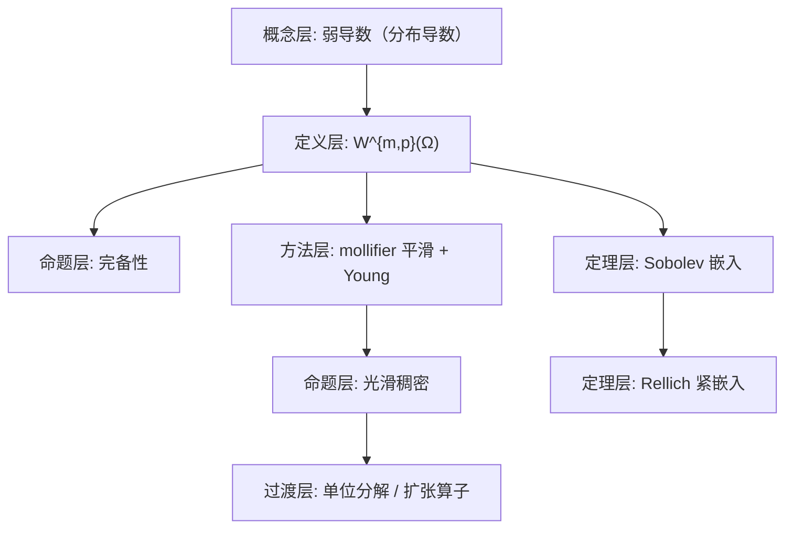

**相关笔记：** [[4.1 广义函数的概念]]｜[[4.3 广义函数的运算]]｜[[4.4 S上的Fourier变换]]｜[[第04章 广义函数与Sobolev空间 — 章节汇总]]

> [!abstract] 概览
> 本节把“弱导数（分布导数）”与 $L^p$ 结合，定义 Sobolev 空间 $W^{m,p}(\Omega)$，并给出三件核心事实：  
> 1) $W^{m,p}(\Omega)$ 在自然范数下完备；  
> 2) 在适当几何条件下，光滑函数在 $W^{m,p}$ 中稠密（Meyers–Serrin + 单位分解/扩张算子）；  
> 3) **嵌入定理**（正则性提升：$W^{m,p}\hookrightarrow L^q$ 或 $C^k$）与 **Rellich 紧嵌入**（有界域上紧性）。  
> - 关键门槛条件：几何（有界/可扩张）、指数关系（例如 $m>n/p$）、以及“弱导数”定义的对偶结构  
> - 与后续接口：频域 $H^s$ 观点（4.4）与负阶空间 $H^{-m}$（习题4.5.7）是做 PDE/变分的标准语言
> ^overview

---

# 1. 本节主题定位

- **本节的核心问题**
  1) 如何用“分布导数在 $L^p$”来定义函数空间？  
  2) 为什么这个定义给出完备空间（可做极限/变分）？  
  3) 什么条件下 $W^{m,p}$ 函数具有更强的可积性/连续性（嵌入）？  
  4) 何时嵌入是紧的（Rellich），从而能抽收敛子列？

- **本节在本章知识链中的位置**
  - 4.1–4.3：提供分布与弱导数的定义工具  
  - 4.4：提供频域刻画（尤其 $H^s$）  
  - 4.5：把这些工具凝结为 Sobolev 正则性理论（PDE/变分的入口）

## 二、核心思想

> [!tip] Sobolev 的一句话：把“可微”替换成“分布可微且导数可积”
> $$
> u\in W^{m,p}(\Omega)\quad\Longleftrightarrow\quad \partial^\alpha u\ \text{在分布意义下存在且属于 }L^p,\ |\alpha|\le m.
> $$
> 它允许“不可经典可微”的 $u$ 参与微分方程，并且通过嵌入定理把“弱信息”升级成“强正则性”。

> [!warning] 最易造成“看懂但不会用”的点
> - 以为 $W^{m,p}$ 的元素一定有点值/边界值：实际上需要额外嵌入条件（如 $m>n/p$）与迹理论。  
> - 以为“稠密性”总成立：对一般开集，$H_0^{m,p}$ 与 $W_0^{m,p}$ 的关系可能失败；需要可扩张（extension domain）或边界正则性。

---

# 2. 内容分层图

---

# 3. 定义系统

## 3.1 Sobolev 空间 $W^{m,p}(\Omega)$

> [!quote] 原文直接信息（定义4.5.1）
> 设 $\Omega\subset\mathbb R^n$ 为开集，$m$ 非负整数，$1\le p<\infty$。称集合
> $$
> W^{m,p}(\Omega)=\{u\in L^p(\Omega):\ \widetilde{\partial^\alpha}u\in L^p(\Omega),\ |\alpha|\le m\}
> $$
> 按范数
> $$
> \|u\|_{m,p}=\Big(\sum_{|\alpha|\le m}\|\widetilde{\partial^\alpha}u\|_{L^p(\Omega)}^p\Big)^{1/p}
> $$
> 构成的空间为 Sobolev 空间，记作 $W^{m,p}(\Omega)$（或 $W_p^m(\Omega)$）。

- **定义对象是什么**：$L^p$ 函数 + 其（分布）导数也在 $L^p$。  
- **关键条件作用**
  - $u\in L^p$：保证基本可积性；  
  - “分布导数 $\in L^p$”：把“弱可微”转成 $L^p$ 控制；  
  - 多重指标 $|\alpha|\le m$：把“直到 $m$ 阶”作为正则性等级。  
- **最小例子**：$C_c^\infty(\Omega)\subset W^{m,p}(\Omega)$。  
- **边界/非例**：$\delta$ 等分布一般不在 $W^{m,p}$，因为不属于 $L^p$。  
- **误区**：把 $\widetilde{\partial^\alpha}u$ 当成逐点导数；它是通过对偶定义的弱导数，只有在额外正则性下才等于 a.e. 导数。

---

# 4. 定理/命题系统

## 4.1 定理4.5.2：$W^{m,p}(\Omega)$ 完备

> [!quote] 原文直接信息（定理4.5.2）
> 空间 $W^{m,p}(\Omega)$ 是完备的。

- **条件作用**
  - $L^p(\Omega)$ 完备是基石；  
  - 分布导数定义用于把“导数极限=极限的导数”写出来（通过测试函数配对）。

- **证明骨架（Step 1/2/3）**
  1) 取 $W^{m,p}$ 的基本列 $\{u_k\}$，则对每个 $|\alpha|\le m$，$\{\widetilde{\partial^\alpha}u_k\}$ 在 $L^p$ 中 Cauchy；  
  2) 用 $L^p$ 完备性得存在 $g_\alpha\in L^p$ 使 $\widetilde{\partial^\alpha}u_k\to g_\alpha$；并令 $u_k\to u$ 于 $L^p$；  
  3) 用分布导数定义：对 $\varphi\in\mathcal D(\Omega)$，
 
$$
\langle g_\alpha,\varphi\rangle=\lim_k\langle \widetilde{\partial^\alpha}u_k,\varphi\rangle
=\lim_k(-1)^{|\alpha|}\langle u_k,\partial^\alpha\varphi\rangle
=(-1)^{|\alpha|}\langle u,\partial^\alpha\varphi\rangle,
$$
 
     从而 $g_\alpha=\widetilde{\partial^\alpha}u$，即 $u\in W^{m,p}$ 且 $u_k\to u$。

## 4.2 定理4.5.3：$C^\infty(\Omega)\cap W^{m,p}(\Omega)$ 在 $W^{m,p}$ 中稠密（基本逼近思想）

> [!quote] 原文直接信息（定理4.5.3，摘意）
> $\mathcal D(\Omega)$ 在 $W^{m,p}(\Omega)$ 中稠密（在适当论证下）。

> [!note] 条件作用提示
> 稠密性的证明通常分两步：  
> 1) mollifier 平滑（局部）；  
> 2) 用截断/单位分解解决边界与支撑问题。一般域上需要几何条件与单位分解（定理4.5.4/4.5.5）。

## 4.3 定理4.5.9：Sobolev 嵌入（本节主结论）

> [!quote] 原文直接信息（定理4.5.9，意旨）
> 在适当指数关系与域的条件下，$W^{m,p}(\Omega)$ 连续嵌入到更强的空间（$L^q$ 或 $C^k$）；例如当 $m>n/p$ 时可嵌入连续函数空间。

- **条件逐条解释（为什么需要）**
  - 指数关系（如 $m>n/p$）：保证频域权重或局部积分估计可收敛；本质是“导数的 $L^p$ 控制足以压住维数带来的体积增长”。  
  - 域的有界性/正则性：用于把局部估计拼接成全局估计，并保证常数可控。  

- **最关键的一跳**
  - 把 $u$ 的某种“能量”估计转成点值/更高可积性，常通过 Fourier 权重估计或 Gagliardo–Nirenberg 型插值实现。

## 4.4 定理4.5.10：Rellich 紧嵌入（紧性来源）

> [!quote] 原文直接信息（定理4.5.10，意旨）
> 在有界域上，某些 Sobolev 嵌入不仅连续，而且是紧的（Rellich）。

- **条件作用**
  - 有界域：防止“质量跑到无穷远”的逃逸；  
  - 指数差：目标空间更弱，允许用紧性工具（Kolmogorov–Riesz/对角线抽取）。  

---

# 5. 例子与反例系统

- **关键例子**
  - $H^s(\mathbb R^n)$ 的频域定义（来自 4.4），是 $W^{m,2}$ 的自然延拓。  
  - 半空间/可扩张域上稠密性可直接用“平移 + mollifier”（习题4.5.1）。

- **反例提醒**
  - 在无界域上，嵌入通常不紧：平移可以制造无收敛子列（与 4.1 的“支撑跑动不收敛”同源）。

---

# 6. 本节逻辑链复原

1) 用分布导数定义 $W^{m,p}$，把“弱可微”变成可用的范数结构。  
2) 证明完备性：确保变分/极限过程合法。  
3) 用 mollifier 与单位分解建立光滑逼近：把“弱对象”替换成“可计算对象”。  
4) 给出嵌入定理：说明 $W^{m,p}$ 控制了多少“经典正则性”。  
5) 给出 Rellich：在有界域上进一步获得紧性，从而能抽收敛子列。

---

# 7. 本节高风险误区（≥5 条）

1) **误读点**：把弱导数当成逐点导数。  
   - **正确理解**：弱导数通过对测试函数的积分恒等式定义；只有在额外正则性下才与 a.e. 导数一致。  

2) **误读点**：认为 $W^{m,p}$ 的元素必连续。  
   - **正确理解**：需要 $m>n/p$（或更精细的嵌入指数条件）。  

3) **误读点**：以为 $\mathcal D(\Omega)$ 总在 $W^{m,p}$ 中稠密。  
   - **正确理解**：一般域上需单位分解/扩张条件；否则 $H_0^{m,p}$ 与 $W_0^{m,p}$ 可能不同。  

4) **误读点**：把 Rellich 当成“任何嵌入都紧”。  
   - **正确理解**：无界域或指数不降时不紧；紧性依赖“有界 + 正则性有富余”。  

5) **误读点**：不知道“迹/边界值”从何而来。  
   - **正确理解**：边界值是额外理论（迹定理）；在 1D 情形可用绝对连续性直接看到（习题4.5.5）。  

---

# 8. 知识库拆分建议

- **A类：概念卡**
  - $W^{m,p}(\Omega)$（弱导数定义）  
  - 可扩张域/扩张算子（extension operator）  
  - Sobolev 指数与嵌入关系图（$m,p,n\mapsto q,k$）  
  - 负阶空间 $H^{-m}$（与对偶/分布表述）

- **B类：定理卡**
  - 完备性（定理4.5.2）  
  - 稠密性（定理4.5.3/4.5.5）  
  - Sobolev 嵌入（定理4.5.9）  
  - Rellich 紧嵌入（定理4.5.10）

- **C类：留在本节页**
  - 证明骨架中 mollifier + Young + 单位分解的“拼接流程”

- **D类：专题综述候选**
  - “PDE 中的弱解框架：从 $W^{1,2}$ 到能量估计与紧性”

---

# 9. 后续学习接口

- **下一轮可展开证明点**
  - 单位分解（定理4.5.4）如何用于把局部构造拼成全局  
  - Sobolev 嵌入的频域证明（用 4.4 的 $H^s$）与时域证明（插值/覆盖）

- **适合出题的点**
  - 证明 $H^s$（$s>n/2$）函数连续（习题4.5.6）  
  - 用 Green 函数证明 1D Dirichlet 问题正则性（习题4.5.4）  

- **与前一节衔接**
  - 4.4 的 Plancherel 使 $H^s$ 的定义完全频域化；本节的嵌入常用这一点。  

---

# 10. 自测问题

## 10.A 自测问题（5题）

1) 写出 $W^{m,p}(\Omega)$ 的定义，并解释“弱导数 $\in L^p$”与经典导数的关系。  
2) 完备性证明中，哪一步用到了分布导数定义？为何能把极限交换到测试函数配对里？  
3) 给出一个你熟悉的嵌入条件（如 $m>n/p$），并解释它为何与维数有关。  
4) Rellich 紧嵌入为何需要“域有界”？给出“平移逃逸”反例思路。  
5) $H^{-m}$ 如何与“$L^2$ 导数的有限和”联系起来？

## 10.B 习题（完整解答，按教材编号全覆盖）

> [!tip] 编号门禁（4.5）
> - [x] 4.5.1
> - [x] 4.5.2
> - [x] 4.5.3
> - [x] 4.5.4
> - [x] 4.5.5
> - [x] 4.5.6
> - [x] 4.5.7
> - [x] 4.5.8

### 习题 4.5.1（半空间上的稠密性：验证定理4.5.5）
> [!problem] 题目
> 就 $\Omega=\mathbb R_+^n=\{(x_1,\dots,x_n)\in\mathbb R^n:\ x_n>0\}$ 的情形验证定理4.5.5。  
> 提示：对 $u\in W^{m,p}(\Omega)$、$\varepsilon>0$，考虑 $u_\varepsilon(x)=u(x',x_n+\varepsilon)$（其中 $x'\in\mathbb R^{n-1}$，$x_n>-\varepsilon$）。
>
> [!solution]- 完整过程解答
> 定理4.5.5（Meyers–Serrin 类型）在此情形的核心是：$W^{m,p}(\mathbb R_+^n)$ 中的函数可被光滑函数在 $W^{m,p}$ 范数下逼近。
> 
> **Step 1（向内平移避免边界）**  
> 定义 $u_\varepsilon(x',x_n)=u(x',x_n+\varepsilon)$（当 $x_n>0$ 时右侧在 $\Omega$ 内）。则 $u_\varepsilon\in W^{m,p}(\Omega)$，且当 $\varepsilon\to0$，
> $$
> \|u_\varepsilon-u\|_{W^{m,p}(\Omega)}\to 0.
> $$
> 证明思路：平移在 $L^p$ 中连续；并且 $\partial^\alpha u_\varepsilon = (\partial^\alpha u)_\varepsilon$（弱导数与平移可交换），因此对每个 $|\alpha|\le m$ 也成立 $L^p$ 连续性，合并得上式。
> 
> **Step 2（在全空间做 mollifier 平滑）**  
> 对固定 $\varepsilon>0$，$u_\varepsilon$ 的“活动区域”离边界有距离 $\varepsilon$。将 $u_\varepsilon$ 在全空间上用零延拓（或先乘一个截断到紧集），再与 $j_\delta$ 卷积得到 $(u_\varepsilon)_\delta$。由于卷积在远离边界处不会越界，且弱导数与卷积交换，可得 $(u_\varepsilon)_\delta\in C^\infty(\Omega)$ 且
> $$
> \|(u_\varepsilon)_\delta-u_\varepsilon\|_{W^{m,p}(\Omega)}\to0\quad(\delta\to0).
> $$
> 
> **Step 3（合并误差）**  
> 给定误差阈值 $\eta>0$，先取 $\varepsilon$ 使 $\|u_\varepsilon-u\|_{W^{m,p}}<\eta/2$，再取 $\delta$ 使 $\|(u_\varepsilon)_\delta-u_\varepsilon\|_{W^{m,p}}<\eta/2$。则 $(u_\varepsilon)_\delta\in C^\infty(\Omega)$ 且逼近 $u$。  
> 这正是定理4.5.5 在半空间情形的构造。

### 习题 4.5.2（截断：$\alpha u\in W^{m,p}$）
> [!problem] 题目
> 若 $\alpha\in\mathcal D(\mathbb R^n)$，$u\in W^{m,p}(\mathbb R^n)$，则 $\alpha u\in W^{m,p}(\mathbb R^n)$，并存在常数 $C$（依赖于 $\alpha$）使
> $$
> \|\alpha u\|_{W^{m,p}}\le C\|u\|_{W^{m,p}}.
> $$
>
> [!solution]- 完整过程解答
> 由 Leibniz 公式（弱导数同样满足）：
> $$
> \partial^\beta(\alpha u)=\sum_{\gamma\le \beta}\binom{\beta}{\gamma}(\partial^\gamma\alpha)(\partial^{\beta-\gamma}u),\qquad |\beta|\le m.
> $$
> 因为 $\alpha\in C_c^\infty$，其各阶导数有界：$\|\partial^\gamma\alpha\|_{L^\infty}\le C_\gamma$。因此
> $$\|\partial^\beta(\alpha u)\|_{L^p}\le \sum_{\gamma\le \beta}C_\gamma\|\partial^{\beta-\gamma}u\|_{L^p}
> \le C\sum_{|\eta|\le m}\|\partial^\eta u\|_{L^p}=C\|u\|_{W^{m,p}}.$$
> 对所有 $|\beta|\le m$ 求和（或取 $\ell^p$ 合成）得到所需不等式。

### 习题 4.5.3（$W^{m,p}\subset W^{1,p}$）
> [!problem] 题目
> 若 $m\ge 1$，求证：$W^{m,p}(\Omega)\subset W^{1,p}(\Omega)$。
>
> [!solution]- 完整过程解答
> 由定义：$u\in W^{m,p}$ 意味着对所有 $|\alpha|\le m$，$\partial^\alpha u\in L^p$。特别地对所有 $|\alpha|\le 1$ 也成立，因此 $u\in W^{1,p}$。并且显然有范数控制：
> $$
> \|u\|_{W^{1,p}}\le \|u\|_{W^{m,p}}.
> $$

### 习题 4.5.4（1D Dirichlet：$x''=f$ 的 $H^2$ 正则性）
> [!problem] 题目
> 设 $\Omega=(a,b)$，$f\in L^2(\Omega)$。求证：存在 $x\in H_0^1(\Omega)$ 使得
> $$
> \widetilde{\frac{d^2x}{dt^2}}=f,
> $$
> 并且算子 $T:f\mapsto x$ 是从 $L^2(\Omega)$ 到 $H^2(\Omega)$ 的连续线性算子。
>
> [!solution]- 完整过程解答
> **Step 1（显式构造 Green 函数解）**  
> 定义
> $$
> G(t,s)=\frac{1}{b-a}\begin{cases}(t-a)(b-s),& t\le s,\\ (s-a)(b-t),& t>s.\end{cases}
> $$
> 则 $G(\cdot,s)\in H_0^1(a,b)$，并满足 $-\frac{d^2}{dt^2}G(\cdot,s)=\delta_s$（分布意义），且边界为 0。令
> $$
> x(t)=\int_a^b G(t,s)f(s)\,ds.
> $$
> 这是线性的。
> 
> **Step 2（验证弱二阶导数）**  
> 对任意 $\varphi\in C_c^\infty(a,b)$，交换积分并用 $G$ 的性质：
> $$\int x(t)\varphi''(t)\,dt=\int_a^b\Big(\int_a^b G(t,s)\varphi''(t)\,dt\Big)f(s)\,ds
> =-\int_a^b \varphi(s)f(s)\,ds.$$
> 因此 $\widetilde{x''}=f$（符号按你采用的 Laplacian/二阶导数约定调整；题目给的是 $x''=f$ 的弱形式，上式正对应）。
> 同时由构造可见 $x(a)=x(b)=0$（迹意义），故 $x\in H_0^1$。
> 
> **Step 3（$H^2$ 正则性与连续性）**  
> 在 1D 中，若 $\widetilde{x''}\in L^2$，则 $x\in H^2$ 且 $\|x\|_{H^2}\lesssim \|x\|_{L^2}+\|x''\|_{L^2}$。这里 $x''=f$，因此
> $$
> \|x\|_{H^2(a,b)}\le C\|f\|_{L^2(a,b)}.
> $$
> 从而 $T:L^2\to H^2$ 连续线性。

### 习题 4.5.5（$H_0^1(-1,1)$ 的代表与迹）
> [!problem] 题目
> 设 $f\in H_0^1(-1,1)$，求证：  
> (1) $f(-1)=f(1)=0$；  
> (2) $f$ 绝对连续；  
> (3) $f'(x)\in L^2(-1,1)$（这里 $f'$ 指 a.e. 微商）。
>
> [!solution]- 完整过程解答
> **Step 1（$H^1$ 函数有绝对连续代表）**  
> 一维情形下，$H^1(-1,1)$ 的每个等价类都有一个绝对连续代表 $\tilde f$，并满足 $\tilde f'\in L^2$ 且弱导数等于 a.e. 导数。这可由密度（$C^\infty$ 在 $H^1$ 中稠密）+ 基本不等式推出：对光滑近似 $f_k$，有
> $$
> f_k(t)=f_k(s)+\int_s^t f_k'(r)\,dr,
> $$
> 再令 $k\to\infty$ 并用 $L^2$ 收敛得到同样公式对极限成立，从而得到绝对连续性与 a.e. 导数存在且属于 $L^2$。
> 
> **Step 2（迹为 0）**  
> $H_0^1$ 是 $C_c^\infty(-1,1)$ 在 $H^1$ 范数下的闭包。对每个近似 $f_k\in C_c^\infty(-1,1)$，显然 $f_k(\pm1)=0$。由 Step1 的表示公式与 $H^1$ 收敛可推出极限代表在边界处也取 0（迹连续性）。因此 $f(-1)=f(1)=0$。
> 
> **Step 3（结论汇总）**  
> (2)(3) 已在 Step1 给出；(1) 由 Step2 得证。

### 习题 4.5.6（$s>n/2$ 时 $H^s$ 连续：$\widehat f\in L^1$）
> [!problem] 题目
> 设 $f\in H^s(\mathbb R^n)$（定义见习题4.4.2），求证：当 $s>n/2$ 时  
> (1) $\widehat f\in L^1(\mathbb R^n)$；  
> (2) $f$ 与一个 $\mathbb R^n$ 上的连续有界函数几乎处处相等。
>
> [!solution]- 完整过程解答
> **(1) $\widehat f\in L^1$**  
> 用 Cauchy–Schwarz：
> $$
> \int |\widehat f(\xi)|\,d\xi=\int (1+|\xi|^2)^{-s/2}\cdot (1+|\xi|^2)^{s/2}|\widehat f(\xi)|\,d\xi
> $$
> $$
> \le \Big(\int (1+|\xi|^2)^{-s}\,d\xi\Big)^{1/2}\cdot \|(1+|\xi|^2)^{s/2}\widehat f\|_{L^2}.
> $$
> 第二因子正是 $\|f\|_s<\infty$。第一因子有限当且仅当 $s>n/2$（因为在无穷远处积分行为类似 $\int |\xi|^{-2s}d\xi$）。故 $\widehat f\in L^1$。
> 
> **(2) $f$ 有连续有界代表**  
> 因为 $\widehat f\in L^1$，Fourier 反演给出（以本书常数体系）
> $$
> \tilde f(x):=\int_{\mathbb R^n}\widehat f(\xi)e^{2\pi i x\cdot\xi}\,d\xi
> $$
> 对所有 $x$ 都绝对收敛，且由 dominated convergence 可知 $\tilde f$ 连续，并有
> $$
> \|\tilde f\|_\infty\le \|\widehat f\|_{L^1}.
> $$
> 再由 $L^2$ Fourier 理论可知 $\tilde f$ 与原 $f$ 在 $L^2$ 意义一致，从而几乎处处相等。故 $f$ 与连续有界函数 a.e. 相等。

### 习题 4.5.7（负阶空间 $H^{-m}$ 的导数表示）
> [!problem] 题目
> 设 $m\in\mathbb N$，又设
> $$
> H^{-m}=\Big\{f\in\mathcal S':\ (1+|\xi|^2)^{-m/2}\widehat f(\xi)\in L^2(\mathbb R^n)\Big\},
> $$
> 并定义范数
> $$
> \|f\|_{-m}=\|(1+|\xi|^2)^{-m/2}\widehat f\|_{L^2}.
> $$
> 求证：若 $f\in H^{-m}$，则 $f$ 可以表示为有限个 $L^2(\mathbb R^n)$ 函数的导数之和。
>
> [!solution]- 完整过程解答
> 令
> $$
> g(\xi)=(1+|\xi|^2)^{-m/2}\widehat f(\xi)\in L^2.
> $$
> 则 $\widehat f(\xi)=(1+|\xi|^2)^{m/2}g(\xi)$。若 $m$ 为偶数（否则可用等价范数把 $m$ 换成 $2m$ 处理），则
> $$
> (1+|\xi|^2)^{m/2}=\sum_{k=0}^{m/2}c_k|\xi|^{2k}
> $$
> 是多项式（或可写为多重指标和 $\sum_{|\alpha|\le m}c_\alpha\xi^\alpha$）。
> 因而
> $$
> \widehat f(\xi)=\sum_{|\alpha|\le m}c_\alpha \xi^\alpha g(\xi).
> $$
> 对每个 $\alpha$ 定义
> $$
> u_\alpha:=\mathcal F^{-1}(g)\in L^2(\mathbb R^n)
> $$
> （由 Plancherel）。注意 $\mathcal F^{-1}(\xi^\alpha g)=(2\pi i)^{-|\alpha|}\widetilde{\partial^\alpha}u_\alpha$（常数依本书体系）。于是
> $$
> f=\sum_{|\alpha|\le m}C_\alpha\,\widetilde{\partial^\alpha}u_\alpha,
> $$
> 即 $f$ 是有限个 $L^2$ 函数的分布导数之和。

### 习题 4.5.8（$A=\frac{d}{dx}$ 在 $L^2(\mathbb R)$ 的谱）
> [!problem] 题目
> 在空间 $L^2(-\infty,\infty)$ 上，考虑微分算子
> $$
> A=\widetilde{\frac{d}{dx}},\qquad D(A)=H^1(-\infty,\infty).
> $$
> 求证：  
> (1) $\rho(A)=\{\lambda\in\mathbb C:\ \mathrm{Re}\,\lambda\ne 0\}$；  
> (2) $\sigma_p(A)=\varnothing$；  
> (3) $\sigma(A)=\sigma_c(A)=\{\lambda\in\mathbb C:\ \mathrm{Re}\,\lambda=0\}$。
>
> [!solution]- 完整过程解答
> 用 Fourier 变换把 $A$ 对角化。对 $u\in H^1(\mathbb R)$，
> $$
> \widehat{Au}(\xi)=\widehat{u'}(\xi)=2\pi i\xi\,\widehat u(\xi).
> $$
> 因此 $A$ 在频域对应“乘子” $M(\xi)=2\pi i\xi$（纯虚值）。
> 
> **(1) Resolvent 集**  
> 求解 $(\lambda I-A)u=f$。频域为
> $$
> (\lambda-2\pi i\xi)\widehat u(\xi)=\widehat f(\xi)\quad\Rightarrow\quad
> \widehat u(\xi)=\frac{1}{\lambda-2\pi i\xi}\widehat f(\xi).
> $$
> 若 $\mathrm{Re}\,\lambda\ne 0$，则
> $$
> |\lambda-2\pi i\xi|\ge |\mathrm{Re}\,\lambda|,
> $$
> 从而乘子 $\frac{1}{\lambda-2\pi i\xi}$ 有界，定义了 $L^2$ 上有界算子，并且还能验证 $u\in H^1$（因为 $(1+|\xi|^2)^{1/2}\widehat u$ 仍在 $L^2$）。故此时 $\lambda\in\rho(A)$。
> 反之若 $\mathrm{Re}\,\lambda=0$，则存在 $\xi$ 使 $\lambda=2\pi i\xi$，乘子在该点发散，无法给出有界逆，因此不在 resolvent 集。故
> $$
> \rho(A)=\{\lambda:\mathrm{Re}\,\lambda\ne 0\}.
> $$
> 
> **(2) 点谱为空**  
> 若 $Au=\lambda u$，则频域 $(2\pi i\xi)\widehat u=\lambda \widehat u$，即 $(2\pi i\xi-\lambda)\widehat u(\xi)=0$ a.e.  
> 若 $\lambda$ 固定，则集合 $\{\xi:2\pi i\xi=\lambda\}$ 至多一个点，$L^2$ 函数在单点上支撑只能为 0，因此 $\widehat u=0$，$u=0$。无非零特征向量，故 $\sigma_p(A)=\varnothing$。
> 
> **(3) 连续谱**  
> 由 (1) 知谱包含虚轴；由 (2) 知虚轴上不是点谱。又虚轴上 $\lambda I-A$ 不是满射且逆不有界，因此落在连续谱，故
> $$
> \sigma(A)=\sigma_c(A)=\{\lambda:\mathrm{Re}\,\lambda=0\}.
> $$

## 10.C 引用与原文 PDF（末尾嵌入）

> [!quote]- 参考（教材分片）
> 1. 张恭庆，《泛函分析讲义（第二版）（上）》，第 4 章 §5：Sobolev 空间与嵌入定理。  
> 2. 本节对应分片 PDF：![[00-Raw素材/泛函分析讲义_张恭庆/章节内容/第四章_广义函数与Sobolev空间/4.5_Sobolev空间与嵌入定理.pdf]]
