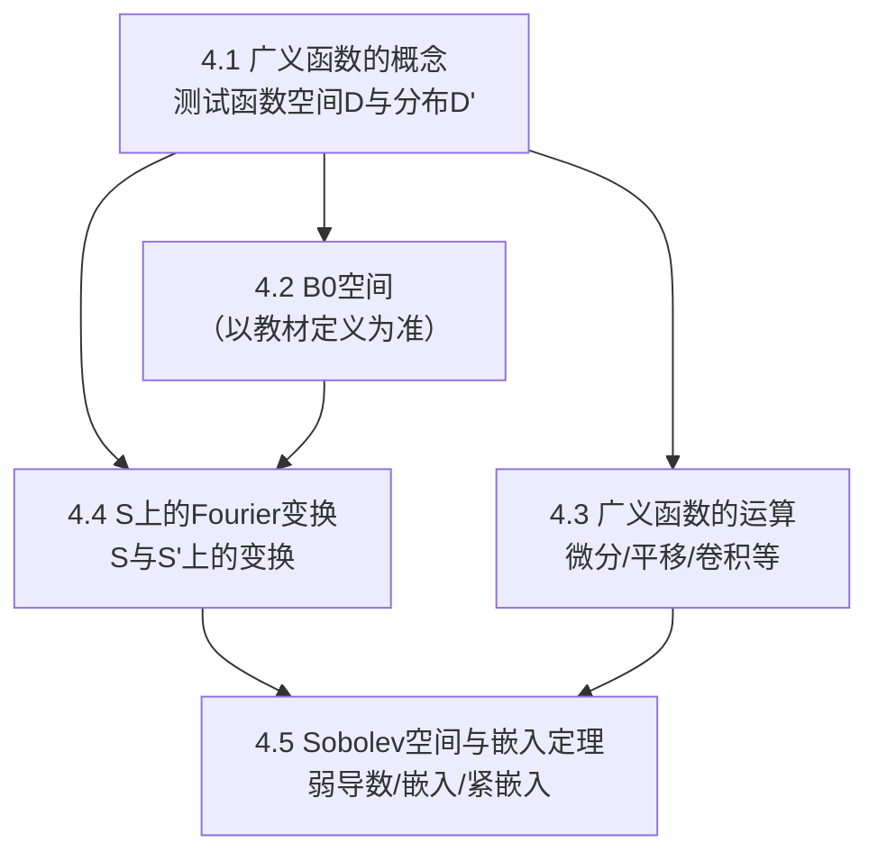

# 第04章 广义函数与Sobolev空间 — 章节汇总

**相关笔记：** [[第03章 紧算子与Fredholm算子 — 章节汇总]] | [[3.5 对椭圆型方程的应用]]

> [!abstract] 本章一句话
> 本章用“测试函数空间上的连续线性泛函”统一刻画广义函数/分布，并将 Fourier 变换扩展到温和分布；在此基础上引入 Sobolev 空间及其嵌入定理，形成 PDE/变分法中最核心的函数空间工具箱。

^overview

## 一、知识结构总览

## 二、各节入口（学习路线）

| 节 | 主题 | 你应带走的“可复用结论/接口” |
|---|---|---|
| [[4.1 广义函数的概念]] | 分布定义与收敛 | “分布 = 连续线性泛函”；弱导数与支撑的语言入口 |
| [[4.2 B0空间]] | 特定测试函数/分布框架 | 以教材为准的空间定义、嵌入/对偶/完备性接口 |
| [[4.3 广义函数的运算]] | 分布运算 | 微分（负号来源）、平移/伸缩、卷积与条件门禁 |
| [[4.4 S上的Fourier变换]] | Schwartz 与温和分布 | $\\mathcal{F}:S\\to S$ 与扩展到 $S'$；归一化常数门禁 |
| [[4.5 Sobolev空间与嵌入定理]] | Sobolev 与嵌入 | 弱导数定义、范数等价、嵌入/紧嵌入的条件与用途 |

## 三、各节概览（嵌入聚合）

- ![[4.1 广义函数的概念#^overview]]
- ![[4.2 B0空间#^overview]]
- ![[4.3 广义函数的运算#^overview]]
- ![[4.4 S上的Fourier变换#^overview]]
- ![[4.5 Sobolev空间与嵌入定理#^overview]]

## 四、自测清单（复习时逐条打勾）

- [ ] 我能清晰区分 $D$、$S$、$D'$、$S'$，并知道各自的收敛/拓扑口径。  
- [ ] 我能写出分布导数的定义，并解释“负号从何而来”。  
- [ ] 我能说明哪些运算需要条件（如卷积/乘法），并能指出失败点。  
- [ ] 我能写出 Fourier 变换的归一化，并知道如何扩展到 $S'$。  
- [ ] 我能给出 Sobolev 空间的定义（按教材口径）与嵌入定理的条件。  

## 五、引用（PDF）

![[00-Raw素材/泛函分析讲义_张恭庆/章节内容/第四章_广义函数与Sobolev空间/4.1_广义函数的概念.pdf]]
![[00-Raw素材/泛函分析讲义_张恭庆/章节内容/第四章_广义函数与Sobolev空间/4.2_B0空间.pdf]]
![[00-Raw素材/泛函分析讲义_张恭庆/章节内容/第四章_广义函数与Sobolev空间/4.3_广义函数的运算.pdf]]
![[00-Raw素材/泛函分析讲义_张恭庆/章节内容/第四章_广义函数与Sobolev空间/4.4_S上的Fourier变换.pdf]]
![[00-Raw素材/泛函分析讲义_张恭庆/章节内容/第四章_广义函数与Sobolev空间/4.5_Sobolev空间与嵌入定理.pdf]]

#学习/泛函分析/第04章
