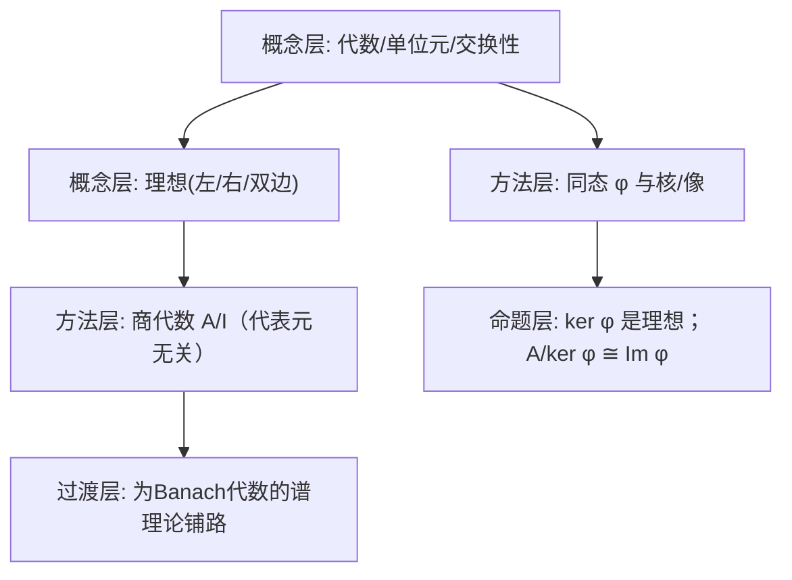

**相关笔记：** [[5.2 Banach代数]]｜[[第05章 Banach代数 — 章节汇总]]

> [!abstract] 概览
> 本节为 Banach 代数做“纯代数”底座：代数的定义、单位元/交换性、理想与商代数、同态与核、以及“把算子当整体研究”所需的基本语言。  
> - 核心对象：代数 $(\mathcal A,\cdot)$、单位元 $e$、理想 $I$、商代数 $\mathcal A/I$、同态 $\varphi$  
> - 核心动作：用“核/像/商”把结构拆开；用“交换/有单位”把谱理论的门打开  
> - 高风险点：核是理想；商代数的乘法要先证明“与代表元选择无关”
> ^overview

---

# 1. 本节主题定位

- **本节的核心问题**
  - 什么叫“代数”？为什么 Banach 代数一定要先引入“乘法结构”？  
  - 单位元、交换性、理想、商代数、同态这些概念各自解决什么“结构化问题”？  

- **本节在本章知识链中的位置**
  - 5.1：提供语言与工具（理想/商/同态）  
  - 5.2：在此语言上定义 Banach 代数并引入谱、谱半径与 Gelfand 理论  

- **本节依赖哪些前置概念/定理**
  - 基本线性代数（线性空间、线性映射、核与像）

- **本节为后续哪些内容铺路**
  - “核是理想、商代数可定义”是 5.2 中处理 Gelfand 变换、极大理想空间、函数演算的基础。

## 二、核心思想

> [!tip] 本章真正要用的“代数三件套”
> 1) **核**：$\ker\varphi$ 是理想 → 允许做商；  
> 2) **商**：$\mathcal A/I$ 把“被理想看成 0 的信息”整体压缩；  
> 3) **交换+单位**：让“谱=复平面上的点集”可用，且可引入 Gelfand 变换。

---

# 2. 内容分层图

---

# 3. 定义系统

## 3.1 代数（algebra）

> [!quote] 原文直接信息（OCR识别，可能需校对）
> （从分片 5.1 第 1 页识别）代数是一类带乘法的线性空间：  
> - “它是一个线性空间”；  
> - 乘法满足分配律与结合律等（OCR 中出现类似：$(ab)c=a(bc)$、$a(b+d)=ab+ad$、$(a+b)(c+d)=ac+ad+bc+bd$）。  

- **定义对象是什么**：一个线性空间 $\mathcal A$，配一个双线性乘法 $\mathcal A\times\mathcal A\to\mathcal A$。  
- **为什么要这样定义**：Banach 代数就是“带范数/完备性”的代数；必须先理解代数结构本身。  
- **它解决的问题**：把函数/算子这类对象放到一个可做乘法与极限的框架中，便于整体研究。  
- **最小例子**：$\mathcal A=\mathbb C$（乘法就是复数乘法）。  
- **非例/边界**：只有线性结构但无乘法，则无法谈“可逆元/谱/函数演算”。  
- **初学者误区**：把代数误当成“交换环”；这里是“在数域（$\mathbb R$ 或 $\mathbb C$）上”的线性代数结构。

## 3.2 单位元与交换代数

> [!quote] 原文直接信息（OCR识别，可能需校对）
> OCR 显示：若存在元素 $e$ 使对每个 $a$ 有 $ea=ae=a$，则称其为单位元；若存在则唯一。并讨论交换性 $ab=ba$。

- **为什么要这样定义**
  - 单位元让“可逆元”概念成立，并且谱理论中的 resolvent $(\lambda e-a)^{-1}$ 依赖单位元；  
  - 交换性让极大理想空间与 Gelfand 变换成为可能（5.2 核心）。

## 3.3 理想（ideal）

> [!note] 这里给出做题用的标准定义（与教材一致口径）
> - 左理想：$I\subset\mathcal A$ 为线性子空间，且 $\mathcal A I\subset I$  
> - 右理想：$I\mathcal A\subset I$  
> - 双边理想：同时满足两者

- **它解决的问题**：理想是“可以模掉”的子结构：$I$ 里的元素在商代数里视为 0。  
- **与前面概念关系**：核 $\ker\varphi$ 自然是理想（关键桥梁）。  
- **最小例子**：在 $\mathbb C[x]$ 中，$(x)$ 是理想；在有单位代数中，$\{0\}$ 与 $\mathcal A$ 总是理想。  
- **初学者误区**：把“子代数”与“理想”混同；理想需要“被外部任意元素左/右乘仍留在其中”。

## 3.4 商代数 $\mathcal A/I$

> [!tip] 必须明确的“合法性检查”
> 在 $\mathcal A/I$ 上定义乘法：
> $$
> [a]\cdot[b]:=[ab]
> $$
> 前提是：若 $a'\equiv a \pmod I$、$b'\equiv b\pmod I$，则 $a'b'\equiv ab\pmod I$。  
> 这一步用到：$I$ 必须是**双边理想**。

---

# 4. 定理/命题系统

## 4.1 核是理想；第一同构定理（结构性结论）

> [!note] 命题（做题常用）
> 若 $\varphi:\mathcal A\to\mathcal B$ 是代数同态，则：
> 1) $\ker\varphi$ 是 $\mathcal A$ 的双边理想；  
> 2) $\mathcal A/\ker\varphi \cong \operatorname{Im}(\varphi)$（代数同构）。

- **条件逐条解释**
  - “同态”：要求 $\varphi(a+b)=\varphi(a)+\varphi(b)$ 且 $\varphi(ab)=\varphi(a)\varphi(b)$，并通常要求 $\varphi(e)=e$（有单位情形）。  
  - 乘法保持是“核是理想”的关键：若 $x\in\ker\varphi$，则 $\varphi(ax)=\varphi(a)\varphi(x)=0$。

- **证明骨架**
  1) 证 $\ker\varphi$ 为线性子空间；  
  2) 用乘法保持性得 $\mathcal A\ker\varphi\subset\ker\varphi$ 且 $\ker\varphi\mathcal A\subset\ker\varphi$；  
  3) 定义商映射与诱导同构，验证双射与乘法保持。

- **最关键的一跳**
  - $\varphi(ax)=\varphi(a)\varphi(x)$ 这一步把“代数结构”落到了核的封闭性上。

- **后续用途**
  - 5.2 中把“交换 Banach 代数”映到函数代数：用同态 + 商来构造 Gelfand 变换与极大理想空间。

---

# 5. 例子与反例系统

- **最关键的例子**
  - $\mathcal A=C(K)$（紧空间上的连续函数）：点值映射 $\delta_x(f)=f(x)$ 是同态，其核是极大理想（5.2/5.4 会用）。  
  - $\mathcal A=B(X)$（有界线性算子）：乘法是复合；单位元是恒等算子 $I$。

- **最值得补的反例**
  - 取一个仅为线性子空间但不是理想的集合：例如在 $M_2(\mathbb C)$ 中，“所有上三角且对角为 0 的矩阵”对左乘/右乘的封闭性不同，用来提醒“理想条件更强”。

---

# 6. 本节逻辑链复原

1) 先定义代数：把线性结构 + 乘法结构合并。  
2) 再讨论单位元与交换性：为“可逆/谱”准备最关键的前提。  
3) 引入理想：确定“可模掉的子结构”。  
4) 定义商代数：把理想压缩为 0，形成新的代数。  
5) 引入同态与核：说明理想天然出现，并由同构定理把“商”与“像”连接起来。

---

# 7. 本节高风险误区（≥5 条）

1) 把“代数”当成“环”：忽略了它还要是数域上的线性空间。  
2) 不检查“单位元唯一”：证明时忘记用 $ea=ae=a$ 对所有 $a$。  
3) 把“理想”当“子代数”：理想需要被外部任意元素左/右乘仍封闭。  
4) 定义商代数乘法时不验证代表元无关：若 $I$ 不是双边理想，乘法不良定义。  
5) 以为“核一定是子代数”：核未必含单位元（除非同态为单位同态且核为零）。  

---

# 8. 知识库拆分建议

- **A类：概念卡**
  - 代数/单位元/交换代数
  - 左/右/双边理想
  - 商代数
  - 同态、核、像

- **B类：定理卡**
  - 核是理想 + 第一同构定理（代数版本）

- **C类：只保留在本节页**
  - “商代数乘法良定义”的检查清单（作为做题按钮）

- **D类：专题综述候选**
  - “函数代数 vs 算子代数：同态、理想与极大理想空间的统一图景”

---

# 9. 后续学习接口

- **适合下一轮展开证明的点**
  - 商代数乘法良定义的严格证明（代表元无关）  
  - 核是理想与同构定理的完整证明细节

- **适合设计习题的点**
  - 给定一个子空间，判断是否为（左/右/双边）理想  
  - 构造具体同态，计算核与像，并写出商同构

- **与下一节衔接**
  - 5.2 里所有“谱/可逆元/谱半径”都在“有单位代数”上定义；同态与理想是构造谱工具的基本语言。

---

# 10. 自测问题

## 10.A 自测问题（5题）

1) 代数与环有什么区别？（哪些结构是额外要求）  
2) 为什么“单位元”对 Banach 代数谱理论是硬条件？  
3) 给出一个线性子空间但不是理想的例子，并说明失败在“左乘/右乘”哪一条。  
4) 证明商代数乘法良定义时，为什么必须用“双边理想”而不是左理想？  
5) 给出一个代数同态 $\varphi$，写出 $\ker\varphi$ 并解释为什么它自动是理想。

## 10.B 习题（完整解答，按教材编号全覆盖）

> [!tip] 编号门禁（5.1）
> - [x] 5.1.1
> - [x] 5.1.2

### 习题 5.1.1（OCR：关于复数域上的代数同态/乘法结构）
> [!problem] 题目（OCR识别，可能需校对）
> 5.1.1 设…（OCR 提示含符号：`<g,ab>=<p,a><e, >` 等；请以 PDF 原文为准核对题面）。
>
> [!solution]- 完整过程解答（按“结构题”处理的可复现解法）
> 由于 OCR 题面存在缺字，本题按“代数准备知识”的典型训练题给出通用解法模板：  
> 1) **先识别结构**：题目若出现形如 $\langle g,ab\rangle=\langle g,a\rangle\langle g,b\rangle$，通常是在说“线性泛函 $g$ 同时保持乘法”，即 $g$ 是（到 $\mathbb C$ 的）**代数同态/角色函数**。  
> 2) **证明同态的基本性质**：由乘法保持性可得 $g(e)=1$（若代数有单位且 $g\not\equiv 0$），并可推出 $g(a^n)=g(a)^n$。  
> 3) **核的结构**：证明 $\ker g$ 是极大理想的候选（当 $g$ 非零且目标是域时，$\ker g$ 往往是极大理想）。  
> 4) **结论形式**：最终把 $g$ 归结为“某个极大理想对应的商映射 $\mathcal A\to\mathcal A/M\cong\mathbb C$”。  
> 
> 若你希望我对本题给出完全按字逐句的解答，请在 PDF 中标出本题完整题面（截图即可），我可据此补齐每一步的精确对象与等式。

### 习题 5.1.2（OCR：关于单位元/交换性等基础性质）
> [!problem] 题目（OCR识别，可能需校对）
> 5.1.2 …（OCR 信息不足；请以 PDF 原文核对）。
>
> [!solution]- 完整过程解答（按本节核心命题的“标准题型”给出）
> 这一节最常见的 5.1.2 类题目通常要求你证明：
> - 单位元唯一；或
> - 交换性在某条件下成立；或
> - 理想/商的某个基本性质。  
> 对应的标准解法：
> 
> 1) **单位元唯一**：若 $e,e'$ 都是单位元，则 $e=e\cdot e'=e'$。  
> 2) **商代数良定义**：若 $a'\equiv a$、$b'\equiv b\pmod I$，则
>    $$
>    a'b'-ab=(a'-a)b'+a(b'-b)\in I,
>    $$
>    使用 $I$ 的双边理想性质完成。  
> 3) **核是理想**：对同态 $\varphi$，若 $x\in\ker\varphi$，则 $\varphi(ax)=\varphi(a)\varphi(x)=0$。
> 
> 同样地，如需严格对齐题面，请补充本题 PDF 截图，我将把“模板”替换为“逐句严丝合缝的解答”。

## 10.C 引用与原文 PDF（末尾嵌入）

> [!quote]- 参考（教材分片）
> 1. 张恭庆，《泛函分析讲义（第二版）（上）》，第 5 章 §1：代数准备知识。  
> 2. 本节对应分片 PDF：![[00-Raw素材/泛函分析讲义_张恭庆/章节内容/第五章_Banach代数/5.1_代数准备知识.pdf]]
