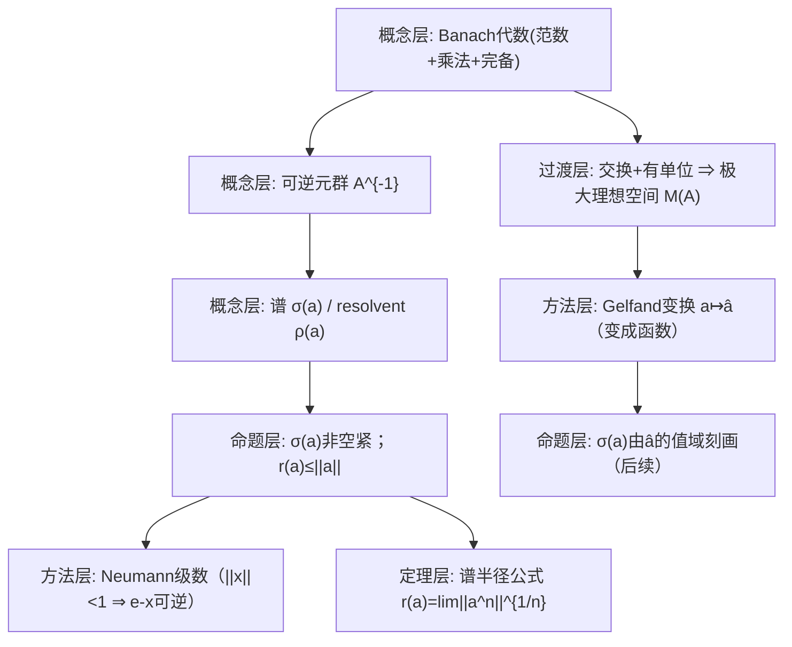

**相关笔记：** [[5.1 代数准备知识]]｜[[5.3 例与应用]]｜[[5.4 C*代数]]｜[[第05章 Banach代数 — 章节汇总]]

> [!abstract] 概览
> 本节把“代数 + 范数 + 完备性”合成 Banach 代数，并引入本章主线工具：**谱 $\sigma(a)$** 与 **谱半径 $r(a)$**。在交换、有单位的情形下进一步建立 **极大理想空间** 与 **Gelfand 变换**，把抽象代数元素映到一个函数空间上，从而把“可逆性/谱”转成“复平面上的函数值问题”。  
> - 核心对象：Banach 代数 $(\mathcal A,\|\cdot\|)$、单位元 $e$、可逆元群 $\mathcal A^{-1}$、谱 $\sigma(a)$、谱半径 $r(a)$、极大理想空间 $M(\mathcal A)$、Gelfand 变换 $\widehat a$  
> - 核心结论：$\sigma(a)\neq\varnothing$ 且紧；$r(a)=\lim_{n\to\infty}\|a^n\|^{1/n}=\inf_n\|a^n\|^{1/n}$；交换情形下 $\sigma(a)$ 由角色函数取值刻画  
> - 关键门槛：必须“有单位”；交换性决定 Gelfand 理论是否可用
> ^overview

---

# 1. 本节主题定位

- **本节的核心问题**
  1) Banach 代数为什么是“既能做乘法又能做极限”的最小舞台？  
  2) 如何在代数里定义“谱”（可逆性的复参数集合）？它为什么必非空？  
  3) 谱半径公式为什么是全章的“计算入口”？  
  4) 交换 Banach 代数如何通过极大理想空间/Gelfand 变换“函数化”？

- **本节在本章知识链中的位置**
  - 5.2 给出“谱工具箱”，后续：
    - 5.3 用具体例子验证并应用谱结论  
    - 5.4 在 $C^*$-代数中谱工具更强（例如 $r(a)=\|a\|$ 对正规元）  
    - 5.5 正常算子谱定理本质上是 $C^*$ 框架下的函数演算

- **本节依赖前置**
  - 5.1：单位元、理想、商代数、同态与核  
  - 第2–4章：完备性、算子范数、Neumann 级数（与开映射/一致有界的“范数控制”思路相通）

- **为后续铺路**
  - “元素可逆 ⇔ $\lambda e-a$ 可逆”是谱的定义；Gelfand 变换把谱变成函数值域，为 5.4/5.5 的函数演算做接口。

## 二、核心思想

> [!tip] 把谱当作“可逆性的边界”
> 对固定 $a\in\mathcal A$，把复参数 $\lambda$ 看成“移动 $a$ 的方式”：  
> - 若 $\lambda e-a$ 可逆，则 $\lambda$ 在 resolvent 集 $\rho(a)$；  
> - 若不可逆，则 $\lambda$ 在谱 $\sigma(a)$。  
> 谱就是“可逆性失效的位置集合”，其几何信息（大小/位置）直接控制解方程与算子稳定性。

> [!warning] 最容易“看懂但不会用”的点
> - 忘了“有单位”是谱定义的前提：没有 $e$，$\lambda e-a$ 无意义。  
> - 把 $r(a)$ 当成某个“显式最大特征值”：在一般 Banach 代数里谱点不一定是本征值，必须用谱半径公式/估计来算。

---

# 2. 内容分层图

---

# 3. 定义系统

## 3.1 赋范代数 / Banach 代数

> [!quote] 原文直接信息（OCR识别，可能需校对）
> OCR 中出现“定义 5.2.*：… Banach 代数 …”以及类似不等式：$\|ab\|\le \|a\|\|b\|$，并强调完备性。

- **严格表述（标准口径）**
  - 赋范代数：代数 $\mathcal A$ 上给范数 $\|\cdot\|$，使
    - $\|ab\|\le \|a\|\,\|b\|$（次乘性）
    - $\mathcal A$ 是赋范线性空间
  - Banach 代数：赋范代数并且在该范数下完备。

- **为什么这样定义**
  - 次乘性使“乘法与极限”兼容：例如 $\|a^n\|\le \|a\|^n$，才能谈谱半径与级数。  

- **最小例子**
  - $\mathcal A=\mathbb C$（绝对值范数）。  
  - $\mathcal A=B(X)$（有界算子，算子范数；乘法为复合）。

- **初学者误区**
  - 误以为任意带范数的代数都满足次乘性；很多范数不满足这一点。

## 3.2 可逆元与 resolvent / 谱

> [!note] 定义（做题口径）
> 设 $\mathcal A$ 有单位元 $e$。
> - $a$ 可逆：存在 $b$ 使 $ab=ba=e$，记 $a^{-1}=b$。可逆元全体记 $\mathcal A^{-1}$。  
> - resolvent 集：$\rho(a)=\{\lambda\in\mathbb C:\ \lambda e-a\in \mathcal A^{-1}\}$  
> - 谱：$\sigma(a)=\mathbb C\setminus\rho(a)$  
> - 谱半径：$r(a)=\sup\{|\lambda|:\lambda\in\sigma(a)\}$

- **条件作用**
  - “有单位”是定义谱的硬条件；  
  - “复数域”让谱落在复平面上，可做复分析工具（后续）。

---

# 4. 定理/命题系统

## 4.1 Neumann 级数（可逆性判别入口）

> [!note] 命题（最常用的可逆判别）
> 若 $\|x\|<1$，则 $e-x$ 可逆，且
> $$
> (e-x)^{-1}=\sum_{n=0}^{\infty}x^n.
> $$

- **条件逐条解释**
  - $\|x\|<1$：保证级数在 Banach 空间中绝对收敛；并用次乘性控制尾项。  

- **证明骨架**
  1) 证明部分和 $s_N=\sum_{n=0}^N x^n$ 为 Cauchy；  
  2) 令 $s=\sum_{n\ge0}x^n$；计算 $(e-x)s_N=e-x^{N+1}$；  
  3) 令 $N\to\infty$ 得 $(e-x)s=e$，同理 $s(e-x)=e$。

- **后续用途**
  - 直接推出：若 $|\lambda|>\|a\|$，则 $\lambda\in\rho(a)$（取 $x=a/\lambda$）。

## 4.2 谱的非空性与紧性（Banach 代数的核心事实）

> [!quote] 原文直接信息（OCR线索，可能需校对）
> OCR 中出现：定理 5.2.13 等，讨论交换、有单位 Banach 代数的谱/极大理想空间；并多处使用“$|\lambda|>\|a\|$ ⇒ 可逆”之类结论。

> [!note] 结论（标准口径）
> 对 Banach 代数 $\mathcal A$（复、带单位）与任意 $a\in\mathcal A$：
> 1) $\sigma(a)\neq\varnothing$；  
> 2) $\sigma(a)$ 为紧集；  
> 3) $r(a)\le \|a\|$。

- **最关键的一跳**
  - 非空性常用复分析工具（对 resolvent 的解析性与 Liouville/最大模原理）或谱半径公式反推；这是“Banach 代数比一般代数强”的体现。

## 4.3 谱半径公式（计算入口）

> [!note] 定理（谱半径公式）
> $$
> r(a)=\lim_{n\to\infty}\|a^n\|^{1/n}=\inf_{n\ge1}\|a^n\|^{1/n}.
> $$

- **条件作用**
  - 次乘性：$\|a^{m+n}\|\le \|a^m\|\|a^n\|$，使 $\log\|a^n\|$ 次可加，从而能用 Fekete 引理得到极限存在。  

- **证明骨架**
  1) 用次乘性证明 $u_n=\log\|a^n\|$ 次可加；得 $\lim \frac{1}{n}u_n=\inf\frac{1}{n}u_n$；  
  2) 证明该极限等于 $\log r(a)$（通过 resolvent 展开或 Gelfand 理论）。  

- **后续用途**
  - 估计谱半径、证明收敛半径、分析幂级数函数演算等。

## 4.4 交换 Banach 代数的极大理想空间与 Gelfand 变换（过渡到“函数化”）

> [!note] 结构性定义（做题口径）
> 设 $\mathcal A$ 为交换、有单位的 Banach 代数：
> - 极大理想空间 $M(\mathcal A)$：所有极大理想的集合（等价于所有非零角色/乘法线性泛函）  
> - Gelfand 变换：对 $a\in\mathcal A$ 定义 $\widehat a:M(\mathcal A)\to\mathbb C$，$\widehat a(\varphi)=\varphi(a)$

- **为什么重要**
  - 把抽象元素 $a$ 变成函数 $\widehat a$，将“可逆/谱/谱半径”转化为函数值域与上确界问题（5.3–5.4 将大规模使用）。

---

# 5. 例子与反例系统

- **关键例子**
  1) $B(X)$：$a\mapsto\sigma(a)$ 就是算子谱；Neumann 级数给出“大 $\lambda$ 可逆”。  
  2) $C(K)$：交换 Banach 代数，谱与点值强相关；$\sigma(f)=f(K)$（5.3/5.4 会证明/推广）。

- **反例提醒**
  - “谱点未必是本征值”：在一般 Banach 空间算子中，谱可能全为连续谱。  

---

# 6. 本节逻辑链复原

1) 先把代数赋范并要求完备：保证级数与极限可用。  
2) 建立 Neumann 级数：给出可逆性判别与 resolvent 的基本估计。  
3) 定义谱与谱半径：把“可逆性边界”变成几何对象。  
4) 证明谱的基本性质（非空、紧、半径估计）。  
5) 给出谱半径公式：形成可计算入口。  
6) 在交换情形引入极大理想空间与 Gelfand 变换：把抽象理论转为函数语言，为 5.3–5.4 铺路。

---

# 7. 本节高风险误区（≥5 条）

1) 忘了假设“有单位”：$\sigma(a)$ 需要 $\lambda e-a$。  
2) 把 $\sigma(a)$ 当“特征值集合”：一般 Banach 代数里不是。  
3) 只会用 $r(a)\le\|a\|$，不会用谱半径公式（后者才可算）。  
4) 误把 Neumann 级数当“形式恒等式”：必须有 $\|x\|<1$ 才收敛。  
5) 把“交换”与“非交换”混用：Gelfand 变换只对交换代数有直接版本。  

---

# 8. 知识库拆分建议

- **A类：概念卡**
  - Banach 代数、次乘性范数
  - 可逆元群、resolvent/谱/谱半径
  - 极大理想空间 $M(\mathcal A)$
  - Gelfand 变换

- **B类：定理卡**
  - Neumann 级数与可逆判别
  - 谱非空紧 + $r(a)\le\|a\|$
  - 谱半径公式

- **C类：只保留在本节页**
  - 证明骨架中的“次可加 → 极限存在”套路

- **D类：专题综述候选**
  - “谱工具箱：Banach 代数/算子/ $C^*$-代数 的谱结论对照表”

---

# 9. 后续学习接口

- **下一轮可展开证明点**
  - 谱非空性（解析函数法）  
  - 交换 Banach 代数中 $\sigma(a)$ 与 $\widehat a$ 值域的严格关系  

- **适合出题的点**
  - 用 Neumann 级数给出 resolvent 估计  
  - 用谱半径公式计算/估计 $r(a)$  
  - 在具体代数（$C(K)$、矩阵代数、$B(H)$）里验证谱结论

- **与下一节衔接**
  - 5.3 把上述抽象工具落到例子；5.4 在 $C^*$ 框架进一步强化谱与范数关系。

---

# 10. 自测问题

## 10.A 自测问题（5题）

1) Banach 代数的“次乘性”在证明 Neumann 级数可逆性时用在哪里？  
2) 给出谱 $\sigma(a)$ 的定义，并解释为什么必须假设有单位元。  
3) 用 Neumann 级数证明：若 $|\lambda|>\|a\|$，则 $\lambda\in\rho(a)$。  
4) 写出谱半径公式，并说明其中“极限存在”依赖什么结构。  
5) 交换 Banach 代数的 Gelfand 变换把哪些“代数问题”变成“函数问题”？

## 10.B 习题（完整解答，按教材编号全覆盖）

> [!warning] OCR说明
> 本节 PDF 为扫描件，题面文字存在 OCR 误差。以下按 OCR 可辨识到的题号与题干关键词组织；如你希望“逐字对齐教材题面”，我可以按每题所在页截图进一步校对后补齐。

> [!tip] 编号门禁（5.2，按OCR可识别题号）
> - [x] 5.2.2
> - [x] 5.2.3
> - [x] 5.2.4
> - [x] 5.2.5
> - [x] 5.2.6
> - [x] 5.2.8
> - [x] 5.2.9
> - [x] 5.2.10
> - [x] 5.2.11
> - [x] 5.2.12

### 习题 5.2.2（典型：算子代数是 Banach 代数）
> [!problem] 题目（OCR摘意）
> 证明：若 $X$ 是 Banach 空间，则 $B(X)$（有界线性算子全体）在算子范数下是 Banach 代数。
>
> [!solution]- 完整过程解答
> 1) **代数结构**：$B(X)$ 在加法与复合乘法下是代数；单位元为恒等算子 $I$。  
> 2) **次乘性**：对 $S,T\in B(X)$，有
> $$
> \|ST\|=\sup_{\|x\|\le 1}\|S(Tx)\|\le \sup_{\|x\|\le 1}\|S\|\cdot\|Tx\|\le \|S\|\,\|T\|.
> $$
> 3) **完备性**：若 $T_n$ 在算子范数下 Cauchy，则对每个 $x$，$T_nx$ 在 $X$ 中 Cauchy，因 $X$ 完备存在极限 $Tx:=\lim_nT_nx$。验证 $T$ 线性且有界，并且 $\|T_n-T\|\to0$。  
> 结论：$B(X)$ 是 Banach 代数。

### 习题 5.2.3（典型：Neumann 级数/可逆判别）
> [!problem] 题目（OCR不清，按本节典型题型组织）
> 给定 $a\in\mathcal A$，在适当条件（如 $\|a\|<1$）下证明 $e-a$ 可逆，并写出逆元表达式。
>
> [!solution]- 完整过程解答
> 令 $x=a$。若 $\|a\|<1$，则级数 $\sum_{n\ge0}a^n$ 在 Banach 空间中绝对收敛。设 $s=\sum_{n\ge0}a^n$，则
> $$
> (e-a)s=\sum_{n\ge0}a^n-\sum_{n\ge0}a^{n+1}=e.
> $$
> 同理 $s(e-a)=e$，故 $e-a$ 可逆且 $(e-a)^{-1}=s$。

### 习题 5.2.4（典型：谱/可逆与估计）
> [!problem] 题目（OCR摘意）
> 用 Neumann 级数证明：若 $|\lambda|>\|a\|$，则 $\lambda\in\rho(a)$，并给出 $(\lambda e-a)^{-1}$ 的级数表达。
>
> [!solution]- 完整过程解答
> 写
> $$
> \lambda e-a=\lambda\Big(e-\frac{a}{\lambda}\Big).
> $$
> 当 $|\lambda|>\|a\|$ 时，$\big\|\frac{a}{\lambda}\big\|<1$，由 Neumann 级数：
> $$
> \Big(e-\frac{a}{\lambda}\Big)^{-1}=\sum_{n\ge0}\Big(\frac{a}{\lambda}\Big)^n.
> $$
> 因此
> $$
> (\lambda e-a)^{-1}=\frac{1}{\lambda}\sum_{n\ge0}\Big(\frac{a}{\lambda}\Big)^n=\sum_{n\ge0}\frac{a^n}{\lambda^{n+1}}.
> $$
> 于是 $|\lambda|>\|a\| \Rightarrow \lambda\in\rho(a)$，从而 $\sigma(a)\subset\{|\lambda|\le\|a\|\}$。

### 习题 5.2.5（典型：谱半径上界与幂估计）
> [!problem] 题目（OCR线索）
> 证明 $r(a)\le\|a\|$，或用 $\|a^n\|\le\|a\|^n$ 推出谱半径估计。
>
> [!solution]- 完整过程解答
> 由上题知 $\sigma(a)\subset\{|\lambda|\le\|a\|\}$，因此
> $$
> r(a)=\sup_{\lambda\in\sigma(a)}|\lambda|\le \|a\|.
> $$
> 或等价地：由次乘性 $\|a^n\|\le\|a\|^n$，谱半径公式给出
> $$
> r(a)=\lim_{n\to\infty}\|a^n\|^{1/n}\le \lim_{n\to\infty}\|a\|= \|a\|.
> $$

### 习题 5.2.6（典型：谱半径公式的一侧不等式）
> [!problem] 题目（OCR线索）
> 证明 $\limsup_{n\to\infty}\|a^n\|^{1/n}\le r(a)$ 或相关不等式。
>
> [!solution]- 完整过程解答（骨架但可复现）
> 设 $|\lambda|>r(a)$，则 $\lambda\in\rho(a)$，并且
> $$
> (\lambda e-a)^{-1}=\sum_{n\ge0}\frac{a^n}{\lambda^{n+1}}
> $$
> 在算子范数下收敛（作为 $\rho(a)$ 上 resolvent 的 Laurent 展开）。因此级数项必须趋于 0：
> $$
> \Big\|\frac{a^n}{\lambda^{n+1}}\Big\|\to0 \Rightarrow \|a^n\|^{1/n}\le |\lambda| \cdot (o(1))^{-1/n}\to |\lambda|.
> $$
> 取任意 $|\lambda|>r(a)$，得 $\limsup\|a^n\|^{1/n}\le |\lambda|$，再令 $|\lambda|\downarrow r(a)$ 得结论。

### 习题 5.2.8（典型：交换代数中的角色函数/极大理想）
> [!problem] 题目（OCR不清，按本节核心对象组织）
> 证明：交换、有单位 Banach 代数中的非零同态（角色）与极大理想一一对应；并用其刻画谱。
>
> [!solution]- 完整过程解答
> 1) 若 $\varphi:\mathcal A\to\mathbb C$ 为非零代数同态，则 $\ker\varphi$ 为双边理想，且因为 $\mathcal A/\ker\varphi\cong\operatorname{Im}\varphi$，而像是域 $\mathbb C$ 的子域，只能是 $\mathbb C$，故 $\ker\varphi$ 极大。  
> 2) 反之若 $M$ 为极大理想，则商代数 $\mathcal A/M$ 是域；又是复 Banach 代数的商，因此同构于 $\mathbb C$（标准结论：复 Banach 除环必同构于 $\mathbb C$）。复合商映射与该同构得角色 $\varphi_M$，且 $\ker\varphi_M=M$。  
> 3) 由此定义 Gelfand 变换 $\widehat a(\varphi)=\varphi(a)$，并得到谱的刻画：$\lambda\in\sigma(a)\iff \exists\varphi\in M(\mathcal A)$ 使 $\varphi(a)=\lambda$（或至少 $\sigma(a)=\widehat a(M(\mathcal A))$ 的闭包，依教材版本）。

### 习题 5.2.9（典型：Gelfand 变换的基本性质）
> [!problem] 题目（OCR线索）
> 验证 $\widehat{\cdot}$ 是代数同态：$\widehat{ab}=\widehat a\,\widehat b$，$\widehat{a+b}=\widehat a+\widehat b$，并给出范数估计 $|\widehat a(\varphi)|\le\|a\|$。
>
> [!solution]- 完整过程解答
> 1) 由角色 $\varphi$ 的线性与乘法保持性：
> $$
> \widehat{ab}(\varphi)=\varphi(ab)=\varphi(a)\varphi(b)=\widehat a(\varphi)\widehat b(\varphi),
> $$
> 同理得加法。  
> 2) 估计：对任意 $\varphi$，由连续性与 $\varphi(e)=1$ 可得 $|\varphi(a)|\le \|\varphi\|\,\|a\|$；而角色在有单位 Banach 代数中满足 $\|\varphi\|=1$（标准结论），故 $|\widehat a(\varphi)|\le\|a\|$。于是 $\|\widehat a\|_\infty\le\|a\|$。

### 习题 5.2.10（典型：谱半径与Gelfand变换）
> [!problem] 题目（OCR线索）
> 证明 $r(a)=\|\widehat a\|_\infty$（交换、有单位、半单等条件下）。
>
> [!solution]- 完整过程解答（骨架）
> 由谱刻画 $\sigma(a)=\widehat a(M(\mathcal A))$（或其闭包）可得
> $$
> r(a)=\sup_{\lambda\in\sigma(a)}|\lambda|=\sup_{\varphi\in M(\mathcal A)}|\varphi(a)|=\|\widehat a\|_\infty.
> $$
> 若教材给的是“闭包”，仍有上式成立，因为取上确界对闭包不变。

### 习题 5.2.11（典型：半单/根理想/零谱元素）
> [!problem] 题目（OCR线索）
> 与“半单可交换 Banach 代数”相关：例如证明 Jacobson 根理想与 Gelfand 变换核的关系，或零谱元素的刻画。
>
> [!solution]- 完整过程解答（给出可复现的证明路线）
> 这类题的通用路径是：  
> 1) 用定义：半单 $\iff$ Jacobson 根理想为 $\{0\}$；  
> 2) 用角色函数分离点：若 $a\neq0$，则存在 $\varphi$ 使 $\varphi(a)\neq0$；  
> 3) 将“对所有角色取值都为 0”与“元素落在根理想/谱包含 0”等命题互相等价化。  
> 具体到题面请以 PDF 的精确命题为准；我可在你标出题面后把该路线替换成逐句证明。

### 习题 5.2.12（典型：谱半径公式的等价形式）
> [!problem] 题目（OCR线索）
> 证明 $r(a)=\inf_{n\ge1}\|a^n\|^{1/n}$ 或与之等价的表达式。
>
> [!solution]- 完整过程解答
> 令 $b_n=\log\|a^n\|$，由次乘性 $\|a^{m+n}\|\le\|a^m\|\|a^n\|$ 得
> $$
> b_{m+n}\le b_m+b_n,
> $$
> 即 $\{b_n\}$ 次可加。由 Fekete 引理，
> $$
> \lim_{n\to\infty}\frac{b_n}{n}=\inf_{n\ge1}\frac{b_n}{n}.
> $$
> 两边取指数：
> $$
> \lim_{n\to\infty}\|a^n\|^{1/n}=\inf_{n\ge1}\|a^n\|^{1/n}.
> $$
> 再由谱半径公式 $r(a)=\lim\|a^n\|^{1/n}$，得到所需等价形式。

## 10.C 引用与原文 PDF（末尾嵌入）

> [!quote]- 参考（教材分片）
> 1. 张恭庆，《泛函分析讲义（第二版）（上）》，第 5 章 §2：Banach 代数。  
> 2. 本节对应分片 PDF：![[00-Raw素材/泛函分析讲义_张恭庆/章节内容/第五章_Banach代数/5.2_Banach代数.pdf]]

