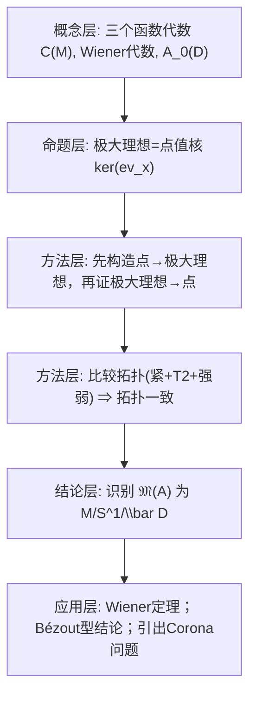

**相关笔记：** [[5.2 Banach代数]]｜[[5.4 C*代数]]｜[[第05章 Banach代数 — 章节汇总]]

> [!abstract] 概览
> 本节用三个“函数代数”把 5.2 的抽象工具落地：  
> 1) 连续函数代数 $C(M)$：证明其极大理想空间 $\mathfrak M(C(M))$ 与 $M$ 同胚（角色=点值）。  
> 2) 绝对收敛 Fourier 级数代数（Wiener 代数）：同样得到 $\mathfrak M\simeq S^1$，并推出 **Wiener 定理**（无零点 ⇒ 逆元仍在代数内）。  
> 3) 解析函数代数 $A_0(D)$（圆盘代数）：$\mathfrak M\simeq \overline D$，并推出一个 Bézout 型结论；替换为 $H^\infty(D)$ 就导向著名的 **Corona 问题**。  
> ^overview

---

# 1. 本节主题定位

- **本节的核心问题**
  1) 给定一个“具体的交换 Banach 代数 $\mathcal A$”，如何**计算/识别**它的极大理想空间 $\mathfrak M(\mathcal A)$？  
  2) 如何把“抽象角色 $\varphi\in\mathfrak M(\mathcal A)$”解释成“对某个空间上的点值/取值”？  
  3) 把 $\mathfrak M(\mathcal A)$ 识别出来后，如何反过来得到可用结论（典型：Wiener 定理、Bézout/Corona 类型命题）？

- **本节在本章知识链中的位置**
  - 5.2 构造了谱 $\sigma(a)$、极大理想空间 $\mathfrak M(\mathcal A)$ 与 Gelfand 变换 $a\mapsto\widehat a$。  
  - 5.3 通过“函数代数”告诉你：在很多自然例子里，$\mathfrak M(\mathcal A)$ **并不神秘**，往往就是“定义代数时本来就出现的那个空间”。  

- **本节依赖哪些前置概念/定理**
  - 5.2：交换、有单位 Banach 代数；角色（非零连续同态）与 Gelfand 拓扑；Gelfand 变换。  
  - 拓扑：紧致性、$T_2$（Hausdorff）、连续函数；Urysohn 引理（在证明 $\mathfrak M(C(M))\simeq M$ 时用）。  
  - 分析：Fourier 级数与绝对收敛；复变函数基本概念（单位圆盘、解析、边界连续等）。

- **本节为后续哪些内容铺路**
  - 5.4（$C^*$-代数）与 5.5（正常算子）本质上都是“把算子生成的代数函数化”，理解本节的“$\mathfrak M$=几何空间”是进入谱定理/函数演算的入口。

## 二、核心思想

> [!tip] 角色就是“点值算子”，但点在哪里要靠证明找出来
> 在交换、有单位 Banach 代数中，$\mathfrak M(\mathcal A)$ 是“所有角色（非零连续同态）”的集合。  
> 本节的套路是：先猜测“角色应当等于点值 $f\mapsto f(x)$”，再证明：
> 1) 每个点值确实给出一个极大理想；  
> 2) 每个极大理想都来自某个点；  
> 3) 拓扑也一致（用紧致性 + Hausdorff 性把两种拓扑压成同一个）。

> [!warning] 本段最可能造成“看懂但不会用”的地方
> - 你可能把“$\mathfrak M(\mathcal A)$ 的点”误认为就是“$\mathcal A$ 的元素”，从而分不清“代数元素 $a$”与“角色 $\varphi$”。  
> - 证明里出现“紧致性/ Urysohn 引理/ 拓扑强弱比较”，读时像“拓扑小技巧”，但它们的作用是：**把代数刻画（极大理想）转回几何刻画（点）**，少一个条件就可能出现“额外的幽灵点”（例如 Stone–Čech 紧化）。

---

# 2. 内容分层图

---

# 3. 定义系统

## 3.1 连续函数代数 $C(M)$（例1）

> [!quote] 原文直接信息（例1：连续函数代数 $C(M)$）
> 设 $M$ 是一个 $T_2$ 紧拓扑空间，$\mathcal A=C(M)$，其中范数  
> $$
> \|f\|=\max_{x\in M}|f(x)|.
> $$

- **定义对象是什么**
  - 对象：$M$ 上的复值连续函数，代数运算为点态加法与乘法。
- **为什么要这样定义 / 它解决什么问题**
  - 用上确界范数把 $C(M)$ 变成 Banach 空间；点态乘法与范数相容（$\|fg\|\le \|f\|\|g\|$）。  
  - 这是“函数代数”的最基本原型：把抽象 Banach 代数理解成“某个空间上的函数”。
- **与前面概念的关系**
  - 5.2：在交换、有单位 Banach 代数中，$\mathfrak M(\mathcal A)$ 与 Gelfand 变换定义良好；本例中将证明 $\mathfrak M(C(M))\simeq M$，从而 $\widehat f$ 可理解为 $f$ 自身的“点值函数”。
- **最小例子**
  - $M=\{1\}$：$C(M)\cong\mathbb C$。
- **非例/边界**
  - 若 $M$ 非紧，仅考虑 $C_b(M)$（有界连续函数）时，极大理想空间通常会变成 $M$ 的 Stone–Čech 紧化（出现“额外点”）。
- **初学者误区**
  - 误以为“所有极大理想都来自点值”永远成立；紧致性/分离性是关键。

## 3.2 Wiener 代数（绝对收敛 Fourier 级数代数，例2）

> [!quote] 原文直接信息（例2：绝对收敛 Fourier 级数代数）
> $$
> \mathcal A=\Bigl\{f\in C(S^1)\ \bigm|\ f(e^{i\theta})=\sum_{n=-\infty}^{\infty}c_ne^{in\theta},\ \sum_{n=-\infty}^{\infty}|c_n|<\infty\Bigr\}.
> $$
> 其范数
> $$
> \|f\|=\sum_{n=-\infty}^{\infty}|c_n|.
> $$

- **定义对象是什么**
  - 对象：单位圆 $S^1$ 上连续函数中，Fourier 系数绝对可和者。
- **为什么要这样定义**
  - “系数 $\ell^1$”使得卷积与乘法兼容，也方便对可逆性做估计（典型：Neumann 级数/谱半径工具）。
- **它解决了什么问题**
  - 提供一个“可计算”的 Banach 代数：许多代数性质可转成 Fourier 系数上的性质。
- **最小例子**
  - 常值函数 $f\equiv 1$（系数 $c_0=1$）。
- **非例/边界**
  - 仅 $f\in C(S^1)$ 且无零点，并不保证 $1/f$ 的 Fourier 系数绝对可和；Wiener 定理的“前提是 $f\in\mathcal A$”不可省。
- **初学者误区**
  - 把“无零点 ⇒ 1/f 连续”误读为“无零点 ⇒ 1/f 仍在同一个 Fourier-可和代数”。

## 3.3 圆盘代数（解析函数代数）$A_0(D)$（例3）

> [!quote] 原文直接信息（例3：解析函数代数）
> $$
> A_0(D)=\{f:\ D\to\mathbb C\mid f\ \text{在 }D\text{内解析},\ f\ \text{在 }\overline D\text{上连续}\}.
> $$
> 其中 $D$ 是 $\mathbb C$ 上的开单位圆盘，它的范数
> $$
> \|f\|=\max_{|z|\le 1}|f(z)|.
> $$

- **定义对象是什么**
  - 对象：单位圆盘内解析、闭圆盘上连续的函数（典型“解析 + 边界连续”函数代数）。
- **为什么要这样定义**
  - 这是连接“Banach 代数谱工具”与“复分析”最自然的桥梁：点值同态与最大模原理等工具会自然出现。
- **最小例子**
  - 多项式全体在 $A_0(D)$ 中（并且稠密是后续 5.4/Stone–Weierstrass 思想的前奏）。
- **非例/边界**
  - $H^\infty(D)$：仅要求在 $D$ 内解析且有界，不要求边界连续；对应的极大理想空间更复杂，导向 Corona 问题。
- **初学者误区**
  - 把“解析”与“边界连续”混为一谈：$H^\infty(D)$ 并不保证可连续延拓到 $\overline D$。

---

# 4. 定理/命题系统

## 4.1 定理 5.3.1：$\mathfrak M(C(M))\simeq M$

> [!quote] 原文直接信息（定理 5.3.1）
> $\mathfrak M=M$（同胚）。

- **条件逐条解释**
  - $M$ 为 $T_2$：保证点值同态的核能“分离点”，并用于拓扑比较（后续引理 5.3.2）。  
  - $M$ 紧：在“反证极大理想来自某点”时，需要用有限子覆盖把局部信息拼成全局矛盾。
- **结论到底在说什么**
  - 角色 $\varphi:C(M)\to\mathbb C$ 都是“对某个点 $x\in M$ 取值”：$\varphi(f)=f(x)$。
- **为什么重要**
  - 这是“Gelfand 理论 = 代数化的拓扑”的原型：极大理想空间不再抽象，而是与几何空间 $M$ 同一个东西。
- **证明骨架（Step 1/2/3）**
  - Step 1（点 $\Rightarrow$ 极大理想）：对 $x_0\in M$，定义评价同态 $\varphi_{x_0}(f)=f(x_0)$，则 $I_{x_0}=\ker\varphi_{x_0}=\{f:\ f(x_0)=0\}$ 是极大理想。  
  - Step 2（极大理想 $\Rightarrow$ 点）：设 $I$ 为极大理想，若对每个 $x\in M$ 存在 $f_x\in I$ 但 $f_x(x)\ne 0$，则由连续性得邻域 $U_x$ 上 $f_x\ne 0$，紧致性取有限子覆盖，构造 $f=\sum |f_{x_k}|^2\in I$ 且 $f>0$，从而 $f^{-1}\in C(M)$，推出 $1\in I$ 矛盾。  
  - Step 3（同胚）：把 $\mathfrak M$ 上的 Gelfand 拓扑与 $M$ 的原拓扑比较，结合引理 5.3.2 得到一致。
- **证明中最关键的一跳**
  - “紧致性 + 有限子覆盖”将“每点局部不为零”升级为“全局正下界”，从而 $f^{-1}\in C(M)$，逼出矛盾。
- **后续用途**
  - 5.3 后两例基本复制该模板；5.4/5.5 的“函数化”也依赖同一个思想。
- **若条件削弱，哪里可能出问题**
  - 去掉紧致性：可能出现“极大理想不是点值核”（出现额外角色，对应某种紧化）。

## 4.2 引理 5.3.2：两种拓扑在“紧 + Hausdorff + 强弱”下必相同

> [!quote] 原文直接信息（引理 5.3.2）
> 设 $Y$ 是一个集合，在 $Y$ 上给定两个拓扑 $\tau_1$ 与 $\tau_2$。如果 $Y$ 按 $\tau_1$ 是 $T_2$ 的，而按 $\tau_2$ 是紧的，又 $\tau_1$ 比 $\tau_2$ 强（记作 $\tau_1\supset\tau_2$），则 $\tau_1$ 与 $\tau_2$ 等价。

- **条件逐条解释**
  - $\tau_2$ 紧：保证“任意开覆盖有有限子覆盖”，从而能把“$\tau_2$-连续”转成“$\tau_1$-闭集结构控制”。  
  - $\tau_1$ 为 $T_2$：保证紧集在 $T_2$ 空间里是闭的，便于比较闭集。  
  - $\tau_1$ 强于 $\tau_2$：说明 $\tau_1$ 开集更多（更细），要证明“其实没多出来”。
- **结论到底在说什么**
  - 这是“把 Gelfand 拓扑与原空间拓扑压平”的工具：只要能证明其中一个拓扑是紧的、另一个是 $T_2$ 的且更细，就能推出二者相同。
- **证明骨架（Step 1/2/3）**
  - Step 1：证明任意 $\tau_2$-闭集在 $\tau_1$ 下仍闭（利用紧致性）。  
  - Step 2：由 $\tau_1$ 更细知 $\tau_1$-闭集 $\subset$ $\tau_2$-闭集。  
  - Step 3：闭集族相同 ⇒ 拓扑相同。
- **关键一跳**
  - 在 $T_2$ 空间中紧集必闭，这是把“紧”转成“闭集控制”的关键。

## 4.3 定理 5.3.3：Wiener 代数的极大理想空间 $\mathfrak M\simeq S^1$

> [!quote] 原文直接信息（定理 5.3.3）
> $\mathfrak M=S^1$（同胚）。

- **条件逐条解释**
  - 代数定义在 $S^1$ 上：天然候选角色为点值 $f\mapsto f(e^{i\theta})$。  
  - Fourier 系数 $\ell^1$：保证代数运算与范数可控，从而角色连续性与构造性论证可推进。
- **结论到底在说什么**
  - Wiener 代数中，每个极大理想都是“在某个 $e^{i\theta_0}$ 处取零”的集合。
- **为什么重要**
  - 一旦 $\mathfrak M$ 被识别，代数可逆性与“函数是否有零点”就会强耦合，从而直接导出 Wiener 定理。
- **证明骨架（Step 1/2/3）**
  - Step 1：对每个 $e^{i\theta_0}$，点值同态 $\varphi_{\theta_0}(f)=f(e^{i\theta_0})$ 给出极大理想 $I_{\theta_0}=\ker\varphi_{\theta_0}$。  
  - Step 2：对任意角色 $\varphi$，考虑 $\varphi(e^{in\theta})$ 的性质（模长受控、乘法性），推出存在 $e^{i\theta_0}$ 使 $\varphi=\varphi_{\theta_0}$。  
  - Step 3：比较拓扑（同引理 5.3.2 的思路）得同胚。
- **证明中最关键的一跳**
  - 利用角色的乘法性把它在基函数 $e^{i\theta}$ 上的值限制为单位圆上的点（否则会导致幂次增长与有界性冲突）。
- **后续用途**
  - 直接推出 Wiener 定理 5.3.4。

## 4.4 定理 5.3.4（Wiener）：无零点 ⇒ 逆元仍有绝对收敛 Fourier 级数

> [!quote] 原文直接信息（定理 5.3.4（Wiener））
> 设 $f\in\mathcal A$ 满足 $f(e^{i\theta})\ne 0,\ \forall e^{i\theta}\in S^1$，则 $1/f\in\mathcal A$，即 $1/f$ 的 Fourier 级数也是绝对收敛的。

- **条件逐条解释**
  - $f\in\mathcal A$：保证我们讨论的是“Wiener 代数内部的可逆性”，不是仅在 $C(S^1)$ 中。  
  - “处处非零”：在 $C(S^1)$ 里等价于“点态可逆”，但要推出“代数内可逆”，需要结合 $\mathfrak M(\mathcal A)\simeq S^1$。
- **结论到底在说什么**
  - 把“$f$ 没有零点”升级为“$f$ 在 Banach 代数中可逆”，并且逆元仍有 $\ell^1$ Fourier 系数。
- **为什么重要**
  - 这是 Banach 代数谱工具的“教科书级应用”：用 $\mathfrak M$ 的识别把可逆性变成零点问题。
- **证明骨架（Step 1/2/3）**
  - Step 1：由定理 5.3.3，$\mathfrak M(\mathcal A)\simeq S^1$，角色就是点值。  
  - Step 2：处处非零意味着对所有角色 $\varphi$，$\varphi(f)\ne 0$。  
  - Step 3：由 5.2（交换 Banach 代数中可逆性的角色刻画/谱刻画），推出 $f$ 可逆且 $f^{-1}\in\mathcal A$。
- **最关键的一跳**
  - “$\forall\varphi\in\mathfrak M,\ \varphi(f)\ne 0$ ⇒ $f$ 可逆”，这一步本质上用到了 5.2 的谱/角色理论。
- **若条件削弱，哪里可能出问题**
  - 若仅知 $f\in C(S^1)$ 无零点，无法保证 $1/f$ 的 Fourier 系数绝对可和。

## 4.5 定理 5.3.5：圆盘代数 $A_0(D)$ 的极大理想空间 $\mathfrak M\simeq\overline D$

> [!quote] 原文直接信息（定理 5.3.5）
> $\mathfrak M=\overline D$（同胚），其中 $\mathfrak M$ 是 $A_0(D)$ 的极大理想集合。

- **条件逐条解释**
  - $f$ 在 $D$ 内解析且在 $\overline D$ 连续：使得“点值同态”在闭圆盘上都有意义，并可用最大模原理/复分析技巧控制同态取值。
- **结论到底在说什么**
  - $A_0(D)$ 的所有角色都来自闭圆盘上的点值：$\varphi_{w_0}(f)=f(w_0)$（$w_0\in\overline D$）。
- **证明骨架（Step 1/2/3）**
  - Step 1：对 $w_0\in\overline D$ 定义 $\varphi_{w_0}(f)=f(w_0)$，核 $I_{w_0}$ 为极大理想。  
  - Step 2：反过来给定极大理想/角色，先用“角色在多项式上的取值”逼出一个 $w_0$（满足 $|w_0|\le 1$），再扩展到整个代数。  
  - Step 3：用引理 5.3.2 比较 Gelfand 拓扑与 $\overline D$ 的拓扑，得同胚。
- **证明中最关键的一跳**
  - 把抽象角色在坐标函数 $z$ 上的取值记为 $w_0$，再用范数控制推出 $|w_0|\le 1$，从而锁定角色“落在闭圆盘里”。
- **后续用途**
  - 直接推出 Bézout/Corona 型结论（定理 5.3.6），并为 5.4–5.5 的函数演算提供直觉。

## 4.6 定理 5.3.6：无公共零点 ⇒ Bézout 型恒等式（并引出 Corona 问题）

> [!quote] 原文直接信息（定理 5.3.6）
> 设 $f_1,\dots,f_n\in A_0(D)$，若 $f_1,\dots,f_n$ 没有公共的零点，则必存在 $g_1,\dots,g_n\in A_0(D)$ 使得
> $$
> g_1f_1+\cdots+g_nf_n=1.
> $$

- **条件逐条解释**
  - “无公共零点”：等价于“由 $f_1,\dots,f_n$ 生成的理想不被任何点值极大理想包含”，这是把几何条件转回代数条件的关键。  
  - 工作在 $A_0(D)$：保证极大理想空间就是 $\overline D$（定理 5.3.5），从而“极大理想包含 ⇔ 在某点同时为零”。
- **结论到底在说什么**
  - 这是一个“代数版的分割单位”：没有公共零点就能线性组合出 $1$，等价于“理想=整个代数”。
- **为什么重要**
  - 它展示了：识别 $\mathfrak M(\mathcal A)$ 后，很多“存在性命题”都能用“极大理想 + 反证”一把推出。  
  - 也是 Corona 问题的有限维原型。
- **证明骨架（Step 1/2/3）**
  - Step 1：设由 $f_1,\dots,f_n$ 生成的理想 $I=(h_1f_1+\cdots+h_nf_n:\ h_i\in A_0(D))$。  
  - Step 2：若结论不成立，则 $1\notin I$，即 $I\ne A_0(D)$，故 $I$ 被某个极大理想 $I_0$ 包含。  
  - Step 3：由定理 5.3.5，存在 $w_0\in\overline D$ 使 $I_0=\ker\varphi_{w_0}$，于是 $f_i(w_0)=0$（$i=1,\dots,n$），得到公共零点，矛盾。
- **最关键的一跳**
  - “真理想 ⊂ 极大理想” + “极大理想=点值核”，把纯代数矛盾转成“公共零点”矛盾。
- **后续用途**
  - 下一步自然问题：把 $A_0(D)$ 换成 $H^\infty(D)$，结论是否仍成立？这就是 Corona 问题。
- **若条件削弱，哪里可能出问题**
  - 允许公共零点：显然不可能线性组合出 $1$（在公共零点处取值直接矛盾）。  
  - 换成极大理想空间更复杂的代数（如 $H^\infty$）：即使无公共零点，也可能需要额外的“下界条件”来保证可解。

> [!note] Corona 问题（本节原文提到的接口）
> 原文指出：当用 $H^\infty(D)$（单位圆盘内有界解析函数）代替 $A_0(D)$ 时，上述命题成为著名的 Corona 问题；并给出典型形式：对 $f_1,\dots,f_n\in H^\infty(D)$，若存在 $\delta>0$ 使得  
> $$
> \inf_{z\in D}\sum_{i=1}^n|f_i(z)|\ge\delta,
> $$
> 则问是否存在 $g_1,\dots,g_n\in H^\infty(D)$ 使 $\sum f_ig_i=1$。该问题由 Carleson 解决（原文给出历史注记与参考）。

---

# 5. 例子与反例系统

- **本节最关键的例子**
  1) $C(M)$：极大理想 $I_{x_0}=\{f:\ f(x_0)=0\}$，角色 $\varphi_{x_0}(f)=f(x_0)$。  
     - 服务点：把“角色”具体化为“点值”，并展示紧致性如何把局部拼成全局。  
  2) Wiener 代数：无零点 ⇒ 代数内可逆 ⇒ 逆元 Fourier 系数仍绝对可和。  
     - 服务点：把 5.2 的“抽象可逆性判别”落成“零点判别”。  
  3) 圆盘代数：无公共零点 ⇒ 可表示 $1$（Bézout）。  
     - 服务点：展示“极大理想空间识别 + 反证”能推出强存在性结论。

- **本节最值得补的反例**
  1) **非紧空间的连续函数代数**：若 $M$ 非紧，考虑 $C_b(M)$，其极大理想空间一般比 $M$ 大（出现紧化的额外点）。  
     - 服务点：解释定理 5.3.1 中“紧致性”的不可省。  
  2) **Wiener 定理的前提不可省**：存在 $f\in C(S^1)$ 处处非零，但 $f\notin\mathcal A$，此时 $1/f$ 仍连续却无法保证 Fourier 系数绝对可和。  
     - 服务点：防止把“连续可逆”误用成“代数可逆”。  
  3) **定理 5.3.6 的几何条件不可省**：若 $f_1,\dots,f_n$ 有公共零点 $w_0$，则任何组合 $\sum g_if_i$ 在 $w_0$ 都为 $0$，不可能等于 $1$。  
     - 服务点：清晰说明“公共零点”在证明中的作用点。

---

# 6. 本节逻辑链复原（按作者推进顺序）

## 6.1 原文推进清单（保序抓手）
1) 例1：$C(M)$（定义范数与代数结构）  
2) 定理 5.3.1：$\mathfrak M(C(M))\simeq M$（先点→极大理想，再极大理想→点；再证同胚）  
3) 引理 5.3.2：拓扑比较工具（紧 + $T_2$ + 强弱 ⇒ 拓扑相同）  
4) 例2：绝对收敛 Fourier 级数代数（Wiener 代数）  
5) 定理 5.3.3：$\mathfrak M\simeq S^1$  
6) 定理 5.3.4（Wiener）：无零点 ⇒ 逆元仍在代数内  
7) 例3：解析函数代数 $A_0(D)$（圆盘代数）  
8) 定理 5.3.5：$\mathfrak M\simeq\overline D$  
9) 定理 5.3.6：无公共零点 ⇒ Bézout 型恒等式  
10) 备注：替换为 $H^\infty(D)$ 引出 Corona 问题（历史注记 + 参考）  
11) 习题 5.3.1–5.3.6（围绕“构造具体 Banach 代数并计算 $\mathfrak M$/Gelfand 变换/闭理想结构”）

## 6.2 作者为什么这样安排（链条）
1) 先用 $C(M)$ 给你“最干净的样板”：角色=点值，且证明里清晰暴露“紧致性/分离性”的作用。  
2) 接着用同一套路处理 Wiener 代数，马上得到一个“能用的产出”（Wiener 定理），展示谱工具不是抽象游戏。  
3) 然后把舞台换到复变函数代数 $A_0(D)$：极大理想空间识别带来 Bézout/Corona 型问题，暗示后续章节（$C^*$ 与算子谱）同样走“代数→几何→应用”的路线。  

---

# 7. 本节高风险误区（≥5）

1) **误把“角色”当成“代数元素”**
   - 为什么容易误读：符号都在 $\mathcal A$、$\mathfrak M(\mathcal A)$ 之间来回跳。  
   - 正确理解：$a\in\mathcal A$ 是被研究对象；$\varphi\in\mathfrak M(\mathcal A)$ 是“观测方式”（同态），$\widehat a(\varphi)=\varphi(a)$ 才是函数。

2) **以为 $\mathfrak M(C(M))=M$ 对所有 $M$ 成立**
   - 为什么：直觉上“连续函数由点值决定”。  
   - 正确理解：定理 5.3.1 需要紧致性与 $T_2$；非紧时会出现“额外点”（紧化）。

3) **把“$f$ 在 $C(S^1)$ 里可逆”误用成“$f$ 在 Wiener 代数里可逆”**
   - 为什么：两者都叫“无零点”。  
   - 正确理解：Wiener 定理要求 $f\in\mathcal A$（Fourier 系数绝对可和）；否则 $1/f$ 未必仍在该代数内。

4) **忽略引理 5.3.2 的角色：它是同胚证明的“拓扑封口”**
   - 为什么：引理看起来像“拓扑技巧”。  
   - 正确理解：它保证“你证明出来的双射”不仅是集合对应，还能把 Gelfand 拓扑与原拓扑对齐。

5) **把定理 5.3.6 当作纯复分析结论**
   - 为什么：形式像 Bézout 恒等式。  
   - 正确理解：核心是 Banach 代数的“理想 ⊂ 极大理想”结构 + “极大理想=点值核”；几何条件（无公共零点）正是为了排除“落入某个点值极大理想”。

6) **把 $A_0(D)$ 与 $H^\infty(D)$ 混用**
   - 为什么：都是“圆盘内解析”。  
   - 正确理解：$A_0(D)$ 要求边界连续，因此 $\mathfrak M\simeq\overline D$；$H^\infty$ 的极大理想空间更复杂，Corona 问题正来自这种复杂性。

---

# 8. 知识库拆分建议

- **A类：应独立成概念卡**
  - 极大理想空间 $\mathfrak M(\mathcal A)$（角色集合）  
  - 点值同态（evaluation）与核理想 $I_x=\ker(\mathrm{ev}_x)$  
  - Wiener 代数（绝对收敛 Fourier 级数代数）  
  - 圆盘代数 $A_0(D)$ 与 $H^\infty(D)$（对比接口）  
  - Corona 问题（作为“问题型概念卡/专题入口”）

- **B类：应独立成定理卡**
  - 定理 5.3.1（$\mathfrak M(C(M))\simeq M$）  
  - 引理 5.3.2（拓扑强弱压平引理）  
  - 定理 5.3.3（Wiener 代数 $\mathfrak M\simeq S^1$）  
  - 定理 5.3.4（Wiener 定理）  
  - 定理 5.3.5（圆盘代数 $\mathfrak M\simeq\overline D$）  
  - 定理 5.3.6（Bézout/Corona 原型）

- **C类：只保留在本节页中**
  - “点→极大理想→同胚”的证明套路清单（可作为做题模板）  
  - 误区与用法按钮（例如 Wiener 定理如何用在可逆性判断）

- **D类：建议作为专题综述页候选节点**
  - “函数代数与极大理想空间：从 $C(M)$ 到 $H^\infty$”  
  - “谱/可逆性判别在不同代数中的几何意义（零点集/值域/公共零点）”

---

# 9. 后续学习接口

- **适合下一轮展开证明的点**
  - 定理 5.3.1 的反证部分：如何从“局部不为零”构造“全局可逆函数”（紧致性 + 有限子覆盖 + 构造 $f>0$）。  
  - 定理 5.3.3：如何从角色对 $e^{i\theta}$ 的取值限制推出“角色=点值”。  
  - 定理 5.3.5：角色在坐标函数 $z$ 上的取值为何必在闭圆盘内（范数控制的关键一步）。

- **适合设计习题的点**
  - 模仿本节三例：给一个“定义在某个空间上的函数代数”，让你计算 $\mathfrak M$ 与 Gelfand 变换。  
  - 习题接口：教材习题 5.3.1–5.3.6（聚焦：构造 Banach 代数、计算极大理想空间、闭理想分类）。

- **适合与前一节做比较的点（5.2）**
  - 5.2 给出抽象的 $\mathfrak M(\mathcal A)$ 与 $\widehat a$；5.3 告诉你在函数代数中 $\widehat f$ 往往就是“原函数本身”。  
  - “$\forall\varphi,\ \varphi(f)\ne 0$ ⇒ $f$ 可逆”在 5.3.4 中被具体化为“处处无零点”。

- **适合与下一节做衔接的点（5.4）**
  - 5.4 会引入对合与 $C^*$ 恒等式，使谱工具更强；本节的“函数化直觉”会在 $C^*$-代数中变成更系统的函数演算与表示理论。

---

# 10. 自测问题

## 10.A 自测问题（由浅到深 5 题）
1) 在 $C(M)$ 中，对 $x_0\in M$，为什么 $\varphi_{x_0}(f)=f(x_0)$ 是连续同态？它的核是什么？  
2) 定理 5.3.1 的反证步骤中，“紧致性”具体在哪一步被使用？如果 $M$ 不紧会发生什么风险？  
3) Wiener 定理的逻辑骨架是什么：你需要哪些输入（$\mathfrak M$ 的识别 + 5.2 的哪个工具）才能推出 $1/f\in\mathcal A$？  
4) 在 $A_0(D)$ 中，为什么“无公共零点”应当与“生成的理想=整个代数”等价？这一步依赖定理 5.3.5 的哪句话？  
5) 解释：为什么把 $A_0(D)$ 换成 $H^\infty(D)$ 后就会出现 Corona 问题？从“极大理想空间的复杂性”角度说清楚。

## 10.B 引用与原文 PDF（分片）
![[00-Raw素材/泛函分析讲义_张恭庆/章节内容/第五章_Banach代数/5.3_例与应用.pdf]]
