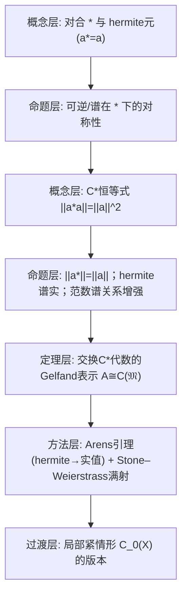

**相关笔记：** [[5.3 例与应用]]｜[[5.5 Hilbert空间上的正常算子]]｜[[第05章 Banach代数 — 章节汇总]]

> [!abstract] 概览
> 本节在 Banach 代数上加入“对合运算 $*$”，并用一个极强的范数公理（$C^*$ 恒等式）把谱理论推到“几乎等同于函数空间”的强度：  
> - 先定义对合与 hermite（自伴）元，并总结它们与可逆/谱的关系。  
> - 定义 $C^*$-代数：$$
> \|a^*a\|=\|a\|^2.
> $$  
> - 交换 $C^*$-代数：Gelfand 表示把代数等距同构到某个 $C(M)$，并把 $*$ 对应成复共轭。  
> - 以 Stone–Weierstrass 定理收束：解释“什么时候一个子代数就已经等于 $C(M)$ / $C_0(X)$”。  
> ^overview

---

# 1. 本节主题定位

- **本节的核心问题**
  1) 在 Banach 代数里加入一个“像共轭/伴随那样”的运算 $*$，能额外得到哪些结构？  
  2) 哪个条件能把 $*$ 与范数锁死，使得谱与范数之间出现强关系（例如后续正常元满足 $r(a)=\|a\|$）？  
  3) 交换 $C^*$-代数为何本质上就是某个紧空间上的连续函数代数 $C(M)$？

- **本节在本章知识链中的位置**
  - 5.2–5.3：交换 Banach 代数的谱与 Gelfand 理论（但仍可能“抽象、不可计算”）。  
  - 5.4：引入 $C^*$ 结构后，交换情形直接“函数化”为 $C(M)$；非交换情形也由 Gelfand–Naimark 定理说明它可表示为算子代数（为 5.5 正常算子铺路）。

- **本节依赖哪些前置概念/定理**
  - 5.2：谱、极大理想空间 $\mathfrak M$、Gelfand 变换与其拓扑。  
  - 5.3：函数代数例子（$C(M)$、$A_0(D)$）与“$\mathfrak M$ 识别”套路。  
  - 拓扑与逼近：紧空间、局部紧空间；Stone–Weierstrass 的思想背景。

- **本节为后续哪些内容铺路**
  - 5.5 正常算子 $N^*N=NN^*$：由其生成的最小 $C^*$-代数可做连续函数演算；这正是谱定理的代数表达。

## 二、核心思想

> [!tip] $C^*$ 恒等式把“代数”“范数”“谱”锁成一体
> 仅有 Banach 代数时，范数与谱半径之间一般只有不等式；  
> 加上 $C^*$ 恒等式后，尤其对 hermite/正常元，谱会强烈控制范数（后续 5.5 的谱定理就是这种“控制”的极致形态）。

> [!warning] 本段最可能造成“看懂但不会用”的地方
> - 容易把“对合 $*$”当作可有可无的符号操作，而忽略它在结论中真正的作用点：例如“$\lambda\in\sigma(a)\Leftrightarrow\overline\lambda\in\sigma(a^*)$”这类谱对称性。  
> - Stone–Weierstrass 看似是逼近定理，但在本节里它是“证明 Gelfand 表示是满射”的关键封口：没有它，你只能得到“嵌入到 $C(M)$”，不能得到“等于 $C(M)$”。

---

# 2. 内容分层图

---

# 3. 定义系统

## 3.1 对合（involution）与对合代数

> [!quote] 原文直接信息（定义 5.4.1：对合）
> 设 $\mathcal A$ 是一个代数，映射 $*: \mathcal A\to\mathcal A$ 称为一个对合，是指 $\forall a,b\in\mathcal A,\ \forall\lambda\in\mathbb C$，
> $$
> (a+b)^*=a^*+b^*,\\
> (\lambda a)^*=\overline\lambda\,a^*,\\
> (ab)^*=b^*a^*,\\
> (a^*)^*=a.
> $$

- **定义对象是什么**
  - 对象：一个“共轭线性、反乘法、二次为恒等”的运算 $*$。
- **为什么要这样定义**
  - 抽象化“复共轭”“Hilbert 空间伴随算子”等操作：它们共同满足上述四条公理。
- **它解决了什么问题**
  - 为“自伴/正常/正元”等谱性质提供代数语言，并使可逆性与谱出现共轭对称等结构性结论。
- **与前面概念的关系**
  - 5.3 的函数代数中自然有 $f^*=\overline f$；5.5 的算子代数中自然有伴随 $A^*$。
- **最小例子**
  - $\mathcal A=\mathbb C$，$a^*=\overline a$。
- **非例/边界**
  - 任意线性映射都不是对合：关键是“共轭线性 + 反乘法”。
- **初学者误区**
  - 把 $(ab)^*=a^*b^*$ 写错；正确是 **反序**：$(ab)^*=b^*a^*$。

## 3.2 hermite 元（自伴元）

> [!quote] 原文直接信息（定义 5.4.4：hermite 元）
> 设 $\mathcal A$ 是一个带有对合映射 $*$ 的代数，$\mathcal A$ 中元 $a$ 称为 hermite 元（或自伴元），若
> $$
> a^*=a.
> $$

- **定义对象是什么**
  - 对象：在 $*$ 下不变的元素（函数代数里对应“实值函数”，算子代数里对应“自伴算子”）。
- **为什么要这样定义**
  - hermite 元的谱具有实性/对称性，是后续正常算子与谱定理的入口。
- **最小例子**
  - $C(M)$ 中实值连续函数满足 $f^*=\overline f=f$。
- **边界/非例**
  - 一般复值函数不是 hermite；算子中非自伴算子也不具备“谱实”性质。
- **初学者误区**
  - 把“hermite”理解为“范数最小/正定”等；它只是对合意义下的对称性。

## 3.3 $C^*$-代数

> [!quote] 原文直接信息（定义 5.4.6：$C^*$-代数）
> 设 $\mathcal A$ 是一个带有对合运算 $*$ 的有幺 Banach 代数，如果满足
> $$
> \|a^*a\|=\|a\|^2,\quad \forall a\in\mathcal A,
> $$
> 则称 $\mathcal A$ 为一个 $C^*$ 代数。

- **定义对象是什么**
  - 对象：带对合的 Banach 代数，并且范数与对合满足 $C^*$ 恒等式。
- **为什么要这样定义**
  - 该恒等式把范数与“正元 $a^*a$”绑定，使范数可通过代数结构恢复（极强约束）。
- **它解决了什么问题**
  - 使许多谱结论变得“刚性”：交换情形可完全函数化；一般情形可算子化（Gelfand–Naimark）。
- **最小例子**
  - $C(M)$（$f^*=\overline f$）与 $L(H)$（$A^*$ 为伴随）都是典型来源。
- **初学者误区**
  - 误以为“任意带对合的 Banach 代数都自动满足 $C^*$ 恒等式”；这是额外强公理。

---

# 4. 定理/命题系统

## 4.1 例 5.4.2 / 例 5.4.3：两个标准对合

> [!quote] 原文直接信息（例 5.4.2）
> 设 $\mathcal A=C(M)$，则 $C(M)$ 上的共轭运算 $f\mapsto\overline f$ 使 $C(M)$ 成为一个对合。

> [!quote] 原文直接信息（例 5.4.3）
> 设 $\mathcal A=L(\mathcal H)$，其中 $\mathcal H$ 是一个 Hilbert 空间，定义 $*:A\mapsto A^*$，则 $*$ 是 $\mathcal A$ 上一个对合。

- **条件作用**
  - $C(M)$：共轭确保 $(fg)^*=\overline{fg}=\overline g\,\overline f=g^*f^*$。  
  - $L(\mathcal H)$：伴随算子天然满足反序与共轭线性。
- **后续用途**
  - 这两例是“交换 $C^*$ 代数=函数代数”和“任意 $C^*$ 代数=算子代数”的原型。

## 4.2 引理 5.4.5：$*$ 与谱/可逆性的基本关系

> [!quote] 原文直接信息（引理 5.4.5，节选）
> 设 $\mathcal A$ 是一个带有对合运算 $*$ 的有幺 Banach 代数，$a\in\mathcal A$，则  
> 1) $a+a^*$、$i(a-a^*)$、$a^*a$ 均是 hermite 元；  
> 2) $a$ 唯一分解为 $a=u+iv$，其中 $u,v$ 均为 hermite 元；  
> 4) $a$ 在 $\mathcal A$ 中可逆当且仅当 $a^*$ 可逆，此时 $(a^*)^{-1}=(a^{-1})^*$；  
> 5) $\lambda\in\sigma(a)\Leftrightarrow\overline\lambda\in\sigma(a^*)$。

- **条件逐条解释**
  - “有幺”：讨论可逆元需要单位元。  
  - “Banach”：用于谱、可逆集合的拓扑性质（虽此引理多为代数操作，但谱定义依赖有幺 Banach 代数框架）。
- **结论到底在说什么**
  - $*$ 把“谱/可逆性”做共轭对称；并允许把任意元素拆成“实部 + 虚部”（hermite 部分）。
- **为什么重要**
  - 它解释了：在 $C^*$ 语境下，研究一般元往往可以先研究 hermite 元（谱更好控制）。
- **证明骨架（Step 1/2/3）**
  - Step 1：直接用 $*$ 公理验证 (1)。  
  - Step 2：取 $u=(a+a^*)/2$、$v=(a-a^*)/(2i)$ 得到分解；唯一性由比较两种分解后取 hermite/反 hermite 部分推出。  
  - Step 3：用 $(ab)^*=b^*a^*$ 推出可逆等价与逆元公式；谱对称由 $\lambda e-a$ 与 $\overline\lambda e-a^*$ 的关系得到。
- **证明中最关键的一跳**
  - “反序”公理用于把 $(a^{-1})^*$ 识别为 $(a^*)^{-1}$，进而把可逆性在 $*$ 下传递。
- **后续用途**
  - 5.4.9（Arens）要对 hermite 元证明“Gelfand 变换取值为实”；5.5 中“正常算子”的谱性质也从这些对称性出发。
- **若条件削弱，哪里可能出问题**
  - 没有单位元：可逆性与谱的定义直接失效。

## 4.3 引理 5.4.7：$C^*$ 恒等式的直接推论

> [!quote] 原文直接信息（引理 5.4.7，节选）
> 设 $\mathcal A$ 是 $C^*$ 代数，则  
> 1) $\|a^*\|=\|a\|,\ \forall a\in\mathcal A$；  
> 2) 若 $a$ 是 hermite 元，则 $\|a^2\|=\|a\|^2$。

- **条件逐条解释**
  - 关键是 $C^*$ 恒等式：$\|a^*a\|=\|a\|^2$，它把 $a$ 与 $a^*$ 的范数强制绑定。
- **结论到底在说什么**
  - $*$ 是等距的；对 hermite 元，平方不会“丢范数信息”（为后续把谱半径与范数联系起来铺路）。
- **证明骨架（Step 1/2/3）**
  - Step 1：由 $\|a\|^2=\|a^*a\|\le\|a^*\|\|a\|$ 得 $\|a\|\le\|a^*\|$；同理交换 $a,a^*$ 得反向不等式。  
  - Step 2：若 $a^*=a$，则 $\|a\|^2=\|a^*a\|=\|a^2\|$。
- **关键一跳**
  - 把 $C^*$ 恒等式与 Banach 代数的次乘性合用，瞬间得到等距性质。

## 4.4 定理 5.4.8（Gelfand–Naimark，交换情形）：$\mathcal A\simeq C(\mathfrak M)$

> [!quote] 原文直接信息（定理 5.4.8（Gelfand–Naimark））
> 设 $\mathcal A$ 是一个交换的 $C^*$ 代数，则它的 Gelfand 表示 $\Gamma:\mathcal A\to C(\mathfrak M)$ 是一个等距同构，即  
> 1) $\Gamma(a^*)(J)=\overline{a(J)},\ \forall J\in\mathfrak M$；  
> 2) $\Gamma$ 是单上映射；  
> 3) $\|\Gamma a\|_{C(\mathfrak M)}=\|a\|,\ \forall a\in\mathcal A$。

- **条件逐条解释**
  - 交换性：保证 $\mathfrak M$（角色空间）足够丰富，并使 Gelfand 变换是代数同态到标量函数。  
  - $C^*$ 条件：提供“等距”与“满射”所需的刚性（特别是 hermite 元的谱实性与 Stone–Weierstrass 的闭包论证）。
- **结论到底在说什么**
  - 抽象交换 $C^*$ 代数完全等同于某个紧空间上的连续函数代数：  
    - 代数元素 $a$ ↔ 函数 $\widehat a$；  
    - 对合 $*$ ↔ 复共轭；  
    - 范数 ↔ 上确界范数。
- **为什么重要**
  - 它把“交换 $C^*$ 代数的谱理论”彻底转成“函数空间的点值几何”，是后续谱定理/函数演算的基础语言。
- **证明骨架（Step 1/2/3）**
  - Step 1（等距）：先证 (3)。对一般 $a$，考虑 $a^*a$ 是 hermite/正元，利用 $C^*$ 结构与谱半径公式把 $\|a\|$ 与 $\|\widehat a\|_\infty$ 对齐。  
  - Step 2（$*$ 对应共轭）：由 $\varphi(a^*)=\overline{\varphi(a)}$（对角色取值的共轭关系）得到 (1)。  
  - Step 3（满射）：证明 $\Gamma(\mathcal A)$ 是 $C(\mathfrak M)$ 的一个“闭的、含常数、对共轭封闭、分离点”的子代数，应用 Stone–Weierstrass（定理 5.4.10）推出 $\Gamma(\mathcal A)=C(\mathfrak M)$。
- **证明中最关键的一跳**
  - 证明 hermite 元的 Gelfand 变换取值为实（Arens 引理 5.4.9），从而能验证“对共轭封闭”等 Stone–Weierstrass 条件。
- **后续用途**
  - 5.5 正常算子：由其生成的交换 $C^*$ 代数经此定理“函数化”，直接导向谱定理。
- **若条件削弱，哪里可能出问题**
  - 非交换：Gelfand 变换不再落到标量函数；需要用算子表示（一般的 Gelfand–Naimark 定理）而不是 $C(\mathfrak M)$。

## 4.5 引理 5.4.9（Arens）：hermite 元的 Gelfand 变换为实值

> [!quote] 原文直接信息（引理 5.4.9（Arens））
> 设 $a\in\mathcal A$ 是 hermite 元，则 $\Gamma a$ 是 $\mathfrak M$ 上的实值连续函数。

- **条件逐条解释**
  - hermite：$a^*=a$，这是“实值性”的代数化前提。  
  - $C^*$：用于范数估计，排除“非零虚部”。
- **证明骨架（Step 1/2/3）**
  - Step 1：对任意角色 $\varphi$，设 $\varphi(a)=\alpha+i\beta$（$\alpha,\beta\in\mathbb R$）。  
  - Step 2：由 $C^*$ 结构与对合性质得到对 $t\in\mathbb R$ 的估计：$|\varphi(a+it e)|\le \|a+it e\|$，并把右端与 $|a^2+t^2e|$ 联系。  
  - Step 3：若 $\beta\ne 0$，选取合适 $t$ 推出矛盾，故 $\beta=0$，即 $\varphi(a)\in\mathbb R$。
- **最关键的一跳**
  - 用“对所有 $t$ 都成立的范数/谱估计”逼迫虚部为零；这是把 $C^*$ 约束转成“数值刚性”的典型操作。

## 4.6 定理 5.4.10（Stone–Weierstrass）

> [!quote] 原文直接信息（定理 5.4.10（Stone–Weierstrass 定理））
> 设 $\mathcal A$ 是 $C(M)$ 上的一个闭子代数，其中 $M$ 是一个 $T_2$ 紧空间，满足  
> 1) $\mathcal A$ 有幺元，即 $1\in\mathcal A$；  
> 2) $\mathcal A$ 对复共轭运算是封闭的，即 $f\in\mathcal A\Rightarrow\overline f\in\mathcal A$；  
> 3) $\mathcal A$ 分离 $M$ 中的点：若 $x\ne y$，则存在 $f\in\mathcal A$ 使 $f(x)\ne f(y)$；  
> 则 $\mathcal A=C(M)$。

- **条件逐条解释**
  - 闭性：把“可一致逼近”升级为“极限仍在子代数”。  
  - 含常数：保证能做平移/归一化。  
  - 共轭封闭：保证能生成实值函数与格运算（max/min），逼近任意连续函数。  
  - 分离点：防止子代数过小（至少要能区分不同点）。
- **结论到底在说什么**
  - 满足上述三条的子代数已经“没有缺信息”，它就是整个 $C(M)$。
- **为什么重要（在本章中的作用）**
  - 在定理 5.4.8 中，$\Gamma(\mathcal A)$ 已知是 $C(\mathfrak M)$ 的闭子代数；要把它从“嵌入”升级为“满射”，必须用 Stone–Weierstrass 封口。
- **证明骨架（Step 1/2/3）**
  - Step 1：先证能逼近绝对值 $|f|$（从而得到格运算）。  
  - Step 2：用格运算构造在给定有限点集上插值的函数。  
  - Step 3：由紧致性与一致连续性，推出对任意 $h\in C(M)$ 与 $\varepsilon>0$，存在 $f\in\mathcal A$ 使 $\|h-f\|<\varepsilon$；闭性给出 $h\in\mathcal A$。
- **证明中最关键的一跳**
  - 把“代数闭合”转成“格闭合”（max/min），再用格结构完成逼近；这一步依赖共轭封闭。

## 4.7 Stone–Weierstrass 的两个变体（5.4.10' 与 5.4.11）

> [!quote] 原文直接信息（定理 5.4.10'，实值版本，节选）
> 设 $C(M)_r$ 表示实值连续函数代数。设 $\mathcal A$ 是 $C(M)_r$ 的一个闭子代数，满足定理 5.4.10 中条件 (1) 与 (3)，则 $\mathcal A=C(M)_r$。

> [!quote] 原文直接信息（定理 5.4.11，局部紧版本，节选）
> 设 $X$ 是局部紧 $T_2$ 拓扑空间，$\mathcal A$ 是 $C_0(X)$ 的子代数，若 $\mathcal A$ 分离 $X$ 中的点，且对每个 $x\in X$，存在 $f\in\mathcal A$ 使 $f(x)\ne 0$，则 $\mathcal A=C_0(X)$。

- **条件逐条解释**
  - 5.4.10'：在实值情形，“共轭封闭”自动满足，因此只需含常数 + 分离点。  
  - 5.4.11：局部紧时使用 $C_0(X)$（无穷远处趋零），并用“一点紧化”把问题化归到紧空间版本。
- **后续用途**
  - 为后续“把抽象代数识别为具体函数空间”提供更一般的逼近框架（不仅限于紧空间）。

---

# 5. 例子与反例系统

- **本节最关键的例子**
  1) $C(M)$ 上 $f^*=\overline f$：对合把“实值函数”刻画为 hermite 元。  
  2) $L(\mathcal H)$ 上 $A^*$：对合把“自伴算子”刻画为 hermite 元，为 5.5 的正常算子铺路。  
  3) 交换 $C^*$ 代数经 Gelfand 表示等同于 $C(\mathfrak M)$：把抽象 $C^*$ 代数完全函数化。

- **本节最值得补的反例**
  1) **仅有对合但非 $C^*$**：很多带对合的 Banach 代数不满足 $\|a^*a\|=\|a\|^2$，此时 $\|a^*\|=\|a\|$、hermite 谱实等结论都可能失败。  
     - 服务点：解释 $C^*$ 恒等式的“刚性来源”。  
  2) **Stone–Weierstrass 条件缺失会导致严格子代数**：例如在 $C([0,1])$ 中只取偶函数或只取常值函数，它们不分离点，因此不会等于全体。  
     - 服务点：说明“分离点/含常数/共轭封闭”各自不可少。

---

# 6. 本节逻辑链复原（按作者推进顺序）

## 6.1 原文推进清单（保序抓手）
1) 定义 5.4.1：对合 $*$ 的四条公理  
2) 例 5.4.2：$C(M)$ 的共轭运算是对合  
3) 例 5.4.3：$L(\mathcal H)$ 的伴随运算是对合  
4) 定义 5.4.4：hermite（自伴）元 $a^*=a$  
5) 引理 5.4.5：分解 $a=u+iv$；可逆/谱与 $*$ 的关系  
6) 定义 5.4.6：$C^*$ 恒等式与 $C^*$ 代数  
7) 引理 5.4.7：$\|a^*\|=\|a\|$；hermite 元满足 $\|a^2\|=\|a\|^2$  
8) 交换 $C^*$ 代数的 Gelfand–Naimark 表示（定理 5.4.8）  
9) Arens 引理 5.4.9（hermite→实值）  
10) Stone–Weierstrass 定理 5.4.10 与变体（5.4.10'、5.4.11）  
11) 习题 5.4.1–5.4.7

## 6.2 作者为什么这样安排（链条）
1) 先把“对合”抽象化，给出最常见的两类来源（函数共轭、算子伴随）。  
2) 再在一般对合 Banach 代数中提炼可逆/谱的共轭对称性，并把任意元素拆成 hermite 部分。  
3) 引入 $C^*$ 恒等式后，立刻得到等距与更强的范数-谱关系。  
4) 然后集中火力证明：交换 $C^*$ 代数经 Gelfand 变换不仅能嵌入 $C(\mathfrak M)$，而且能“满射等距同构”；Arens + Stone–Weierstrass 是这个证明的两块拼图。  
5) 最后把 Stone–Weierstrass 推广到实值与局部紧版本，为后续分析对象（如 $C_0(X)$、算子代数）留接口。

---

# 7. 本节高风险误区（≥5）

1) **把 $(ab)^*=a^*b^*$ 写成不反序**
   - 为什么容易：受“共轭是乘法同态”的直觉影响。  
   - 正确理解：对合是反同态，必须 $(ab)^*=b^*a^*$。

2) **忽略“有幺”在可逆/谱命题中的位置**
   - 为什么容易：阅读时把单位元 $1$ 当背景。  
   - 正确理解：引理 5.4.5(4)(5) 涉及可逆与谱，都依赖单位元存在。

3) **误以为 hermite 元就是“实数”**
   - 为什么容易：在 $C(M)$ 里确实对应实值函数。  
   - 正确理解：hermite 是“$*$-对称”，在算子代数里对应自伴算子；它的“实性”体现在谱与角色取值上（Arens 引理），不是元素本身属于实数域。

4) **把 $C^*$ 恒等式当作次乘性的一个小变形**
   - 为什么容易：式子看起来像估计。  
   - 正确理解：$\|a^*a\|=\|a\|^2$ 是强公理，能推出 $\|a^*\|=\|a\|$ 等刚性结论；一般 Banach 代数不成立。

5) **读懂 Stone–Weierstrass 的陈述但不知道在 5.4.8 里怎么用**
   - 为什么容易：逼近定理与代数表示似乎是两件事。  
   - 正确理解：在 5.4.8 中需要证明 $\Gamma(\mathcal A)$=全体 $C(\mathfrak M)$；Stone–Weierstrass 正是用来从“闭子代数 + 分离点 + 共轭封闭 + 含常数”推出“等于全体”的。

6) **把“交换 $C^*$ 代数=函数代数”误用到非交换**
   - 为什么容易：Gelfand 变换形式相似。  
   - 正确理解：非交换时不能期望落到标量函数；正确框架是算子表示（一般的 Gelfand–Naimark 定理）。

---

# 8. 知识库拆分建议

- **A类：应独立成概念卡**
  - 对合（involution）  
  - hermite/自伴元  
  - $C^*$ 恒等式与 $C^*$-代数  
  - Gelfand 表示（交换 $C^*$）  
  - Stone–Weierstrass（含局部紧/实值版本）

- **B类：应独立成定理卡**
  - 引理 5.4.5（对合下的分解、可逆与谱对称）  
  - 引理 5.4.7（$C^*$ 推论）  
  - 定理 5.4.8（交换情形的 Gelfand–Naimark）  
  - 引理 5.4.9（Arens）  
  - 定理 5.4.10 / 5.4.10' / 5.4.11（Stone–Weierstrass 系列）

- **C类：只保留在本节页中**
  - “用 Stone–Weierstrass 证明满射”的证明套路清单  
  - 易错点（例如反序、公理使用点）

- **D类：建议作为专题综述页候选节点**
  - “从 Banach 代数到 $C^*$-代数：谱理论为何突然变强”  
  - “交换 vs 非交换：函数代数表示与算子代数表示的分野”

---

# 9. 后续学习接口

- **适合下一轮展开证明的点**
  - Arens 引理 5.4.9 的“选参数 $t$ 逼出虚部为 0”的技巧。  
  - 5.4.8 的满射部分：如何验证 Stone–Weierstrass 的三个条件分别来自哪里。  
  - 5.4.11 的一点紧化思路：如何把 $C_0(X)$ 的问题化归紧空间。

- **适合设计习题的点**
  - 给一个具体的带 $*$ 的 Banach 代数，判断它是否为 $C^*$（是否满足 $C^*$ 恒等式）。  
  - 练习：教材习题 5.4.1–5.4.7（涵盖对合连续性、卷积代数、圆盘代数的 $C^*$ 性质、正规子集、正元等）。

- **适合与前一节做比较的点（5.3）**
  - 5.3 在函数代数里识别 $\mathfrak M$；5.4 则说明在交换 $C^*$ 情形不仅 $\mathfrak M$ 可识别，而且整个代数等距同构到 $C(\mathfrak M)$。

- **适合与下一节做衔接的点（5.5）**
  - 5.5 的正常算子生成的最小 $C^*$ 代数是交换的；用 5.4.8 可把它识别为 $C(\sigma(N))$，从而得到函数演算与谱定理的结构。

---

# 10. 自测问题

## 10.A 自测问题（由浅到深 5 题）
1) 写出对合 $*$ 的四条公理，并说明为什么必须有“反序”$(ab)^*=b^*a^*$。  
2) 在引理 5.4.5 中，把任意 $a$ 写成 $u+iv$，$u,v$ 的具体表达式是什么？唯一性在哪里用到？  
3) 仅用 $C^*$ 恒等式与次乘性证明：$\|a^*\|=\|a\|$。  
4) 定理 5.4.8 的满射部分，Stone–Weierstrass 的三个条件（含常数/共轭封闭/分离点）分别如何在 $\Gamma(\mathcal A)$ 中得到？  
5) 解释：为什么“交换 $C^*$ 代数 $\simeq C(\mathfrak M)$”会直接为正常算子的谱定理提供结构框架？

## 10.B 引用与原文 PDF（分片）
![[00-Raw素材/泛函分析讲义_张恭庆/章节内容/第五章_Banach代数/5.4_C*代数.pdf]]
