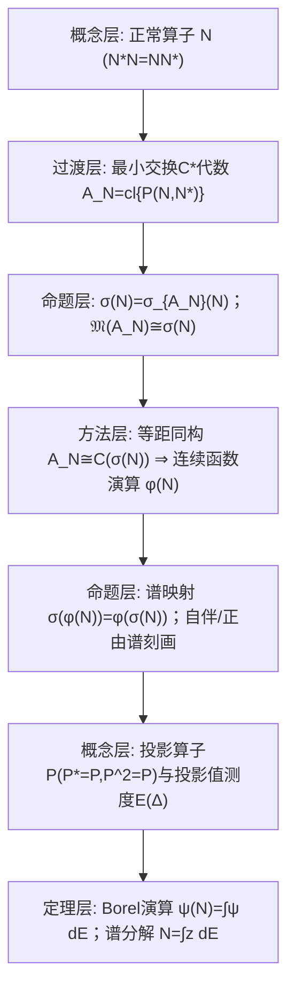

**相关笔记：** [[5.4 C*代数]]｜[[5.6 在奇异积分算子中的应用]]｜[[第05章 Banach代数 — 章节汇总]]

> [!abstract] 概览
> 本节把 5.4 的 $C^*$-代数框架专门应用到 Hilbert 空间上的**正常算子** $N$（满足 $N^*N=NN^*$），得到两条主线：  
> 1) **连续函数演算**：由 $N$ 生成的最小交换 $C^*$-代数 $\mathcal A_N$ 与 $C(\sigma(N))$ 等距同构，从而对任意 $\varphi\in C(\sigma(N))$ 定义算子 $\varphi(N)$，并满足谱映射等规则。  
> 2) **谱分解/谱测度**：把演算扩张到有界 Borel 函数 $\psi\in B(\sigma(N))$，得到投影值测度 $E(\cdot)$ 与积分表示
> $$
> \psi(N)=\int_{\sigma(N)}\psi(z)\,dE(z),
> $$
> 特别地 $N=\int z\,dE(z)$（谱分解定理）。  
> ^overview

---

# 1. 本节主题定位

- **本节的核心问题**
  1) 为什么“正常性 $N^*N=NN^*$”能让我们把 $N$ 的理论完全变成“在谱集 $\sigma(N)$ 上做函数运算”？  
  2) 如何从“抽象 $C^*$ 代数同构”得到可计算的工具（$\varphi(N)$、谱映射、正平方根、投影算子代数运算）？  
  3) 如何把连续演算扩张为 Borel 演算，并得到谱测度/谱分解？

- **本节在本章知识链中的位置**
  - 5.4：交换 $C^*$ 代数 $\simeq C(\mathfrak M)$；  
  - 5.5：对“由单个正常算子生成的交换 $C^*$ 代数”应用 5.4.8，从而把 $\mathfrak M$ 具体化为 $\sigma(N)$，并建立演算与谱分解。

- **本节依赖哪些前置概念/定理**
  - 5.4：$C^*$ 代数、交换情形的 Gelfand–Naimark 表示、Stone–Weierstrass。  
  - 第二章：算子谱集、点谱/连续谱/剩余谱（本节末会回接）。  
  - 测度与表示：Riesz 表示定理（把线性泛函表示为测度积分，用于谱测度构造）。

- **本节为后续哪些内容铺路**
  - 5.6 会把“谱工具 + 可逆性判别”用到更具体的算子（如奇异积分算子）上；本节提供其理论发动机。

## 二、核心思想

> [!tip] 正常性让 $\mathcal A_N$ 变成交换 $C^*$ 代数
> 令 $\mathcal A_N$ 为 $L(\mathcal H)$ 中包含恒同算子 $I$ 与 $N$ 的**最小闭 $*$-子代数**（等价地：由所有二元多项式 $P(N,N^*)$ 生成的闭包）。  
> 因为 $N$ 正常，$N$ 与 $N^*$ 可交换，从而 $\mathcal A_N$ 交换；于是 5.4.8 立即把它函数化为 $C(\mathfrak M(\mathcal A_N))$，并最终识别 $\mathfrak M(\mathcal A_N)\simeq\sigma(N)$。

> [!warning] 本段最可能造成“看懂但不会用”的地方
> - 把“$\varphi(N)$ 的定义”误认为是随便套公式；实际上它是通过 **等距同构 $\mathcal A_N\simeq C(\sigma(N))$** 定义的，核心是“先把代数认成函数空间”。  
> - 混淆三种对象：  
>   1) 复数函数 $\varphi(z)$；2) 算子 $\varphi(N)$；3) 谱测度 $E(\Delta)$。  
>   它们之间的接口是积分关系与“特征函数对应投影”。

---

# 2. 内容分层图

---

# 3. 定义系统

## 3.1 正常算子

> [!quote] 原文直接信息（§5 开头）
> 设 $\mathcal H$ 是一个 Hilbert 空间，$N$ 是 $\mathcal H$ 到自身的有界线性算子，如果它满足 $N^*N=NN^*$，就称 $N$ 是 $\mathcal H$ 上的一个正常算子。

- **定义对象是什么**
  - 对象：$L(\mathcal H)$ 中的算子，带对合 $*$（伴随）。
- **为什么要这样定义**
  - 正常性保证 $N$ 与 $N^*$ 可交换，从而由它们生成的 $C^*$ 代数是交换的，可用 5.4 的函数代数表示理论。
- **它解决什么问题**
  - 把“算子理论”转成“函数论”：对 $N$ 的研究转为在 $\sigma(N)$ 上研究函数。
- **最小例子**
  - 自伴算子、酉算子都是正常算子（原文举例：自伴、酉都是正常算子）。
- **边界/非例**
  - 非正常算子通常无法获得谱测度分解；函数演算也无法如此简单扩张。
- **初学者误区**
  - 把“$NN^*=N^*N$”误当成“$N$ 可对角化”；正常性是谱定理的条件，但仍需完整的谱测度框架。

## 3.2 由 $N$ 生成的最小交换 $C^*$-代数 $\mathcal A_N$

> [!quote] 原文直接信息（5.5.1）
> 在这个代数中对合是 $*:P(N,N^*)\mapsto P(N^*,N)$。

- **定义对象是什么**
  - 对象：$L(\mathcal H)$ 中包含 $I,N$ 且对 $*$ 封闭的最小闭子代数（可视为 $P(N,N^*)$ 的闭包）。
- **为什么要这样定义**
  - 它是“把 $N$ 变成交换 $C^*$ 代数对象”的最小舞台，之后所有 $\varphi(N)$ 都在此代数内完成。
- **与前面概念的关系**
  - 5.4.8 把交换 $C^*$ 代数 $\mathcal A_N$ 表示为 $C(\mathfrak M(\mathcal A_N))$；本节进一步识别 $\mathfrak M(\mathcal A_N)\simeq\sigma(N)$。

## 3.3 投影算子（projection）

> [!quote] 原文直接信息（定义 5.5.7）
> $P\in L(\mathcal H)$ 称为投影算子，若  
> 1) $P$ 是自伴算子；  
> 2) $P^2=P$。

- **为什么要这样定义**
  - 投影是谱测度 $E(\Delta)$ 的取值对象：把集合 $\Delta$ 映到一个正交投影。
- **初学者误区**
  - 误以为“幂等 $P^2=P$”就够了；在 Hilbert 空间谱理论中需要 **正交投影**（自伴 + 幂等）。

---

# 4. 定理/命题系统

## 4.1 引理 5.5.1（Shilov）：子代数中的谱与边界关系

> [!quote] 原文直接信息（引理 5.5.1（Shilov），节选）
> 设 $\mathcal A$ 是有幺 Banach 代数，$\mathcal B$ 是 $\mathcal A$ 的一个有幺闭子代数，则对每个 $a\in\mathcal B$，
> $$
> \partial\sigma_{\mathcal A}(a)\subset\sigma_{\mathcal B}(a)\subset\sigma_{\mathcal A}(a).
> $$

- **条件逐条解释**
  - “闭子代数”：保证极限过程不跑出 $\mathcal B$；  
  - “有幺”：谱的定义需要单位元。
- **结论到底在说什么**
  - 在较小代数里算出来的谱不会比在大代数里更大；但至少包含大代数谱的边界。
- **为什么重要（本节用法）**
  - 用于比较 $N$ 作为 $L(\mathcal H)$ 元素的谱与作为 $\mathcal A_N$ 元素的谱，从而最终识别 $\sigma(N)$。
- **证明骨架（Step 1/2/3）**
  - Step 1：利用 resolvent 集的开性与 Neumann 级数，在谱外小邻域建立可逆性。  
  - Step 2：用边界点的“逼近不可逆”性质推出包含关系。  
  - Step 3：结合谱的闭性得结论。
- **关键一跳**
  - 在边界点处，resolvent 不可能保持有界，从而逼出“在子代数中也不可逆”。

## 4.2 引理 5.5.2：$C^*$ 子代数中的可逆性/谱保持

> [!quote] 原文直接信息（引理 5.5.2，节选）
> 设 $\mathcal A$ 是一个 $C^*$ 代数，$\mathcal B$ 是 $\mathcal A$ 的一个关于对合 $*$ 封闭的闭交换子代数，则  
> 1) 对 $a\in\mathcal B$，若 $a$ 在 $\mathcal A$ 中可逆，则必有 $a^{-1}\in\mathcal B$；  
> 2) $\sigma_{\mathcal B}(a)=\sigma_{\mathcal A}(a)$。

- **条件逐条解释**
  - “交换 + $*$ 封闭 + 闭”：保证 $\mathcal B$ 本身是交换 $C^*$ 代数，可用 5.4.8 的函数化工具控制逆元结构。
- **结论到底在说什么**
  - 在 $C^*$ 语境下，闭 $*$-子代数对可逆性是“自洽”的：大代数里可逆 ⇒ 小代数里就有逆元。
- **本节直接推论**
  - 对正常算子 $N$，可得（原文式 (5.5.5)）：
  $$
  \sigma(N)=\sigma_{\mathcal A_N}(N).
  $$
- **证明骨架（Step 1/2/3）**
  - Step 1：用 $a^*a$ 的 hermite/正性把可逆性转成“谱不含 0”。  
  - Step 2：用 5.4 的谱对称性与子代数谱比较，证明 $0\notin\sigma_{\mathcal B}(a^*a)$。  
  - Step 3：在交换 $C^*$ 代数中由“谱不含 0”推出可逆，并把逆元落回 $\mathcal B$。
- **关键一跳**
  - 用 $C^*$ 结构把“可逆性”压到 $a^*a$ 这种正元上，使得谱比较可控。

## 4.3 定理 5.5.3：$\mathfrak M(\mathcal A_N)\simeq\sigma(N)$

> [!quote] 原文直接信息（定理 5.5.3，节选）
> 设 $N$ 是 $\mathcal H$ 上正常算子，$\mathcal A_N$ 为 $L(\mathcal H)$ 中由 $I$ 与 $N$ 生成的最小闭 $C^*$ 代数，$\mathfrak M$ 为 $\mathcal A_N$ 的极大理想空间，则
> $$
> \sigma(N)\cong\mathfrak M.
> $$

- **条件逐条解释**
  - 正常性：保证 $\mathcal A_N$ 交换，从而其极大理想空间与 Gelfand 变换可用。  
  - Hilbert 空间：保证 $L(\mathcal H)$ 是 $C^*$ 代数（伴随运算与算子范数满足 $C^*$ 恒等式）。
- **结论到底在说什么**
  - 由 $N$ 生成的交换 $C^*$ 代数的“几何空间”就是 $N$ 的谱集。
- **证明骨架（Step 1/2/3）**
  - Step 1：用 Gelfand 表示把每个极大理想 $J$ 映到 $N$ 的一个谱值（角色取值）。  
  - Step 2：证明该映射为双射（利用角色在 $N,N^*$ 上的取值约束）。  
  - Step 3：比较拓扑（与 5.3 的引理 5.3.2 类似）得到同胚。
- **关键一跳**
  - 把“角色 $\varphi$ 对 $N$ 的取值 $\varphi(N)$”锁定在 $\sigma(N)$ 内，并反过来对每个谱点构造对应角色。

## 4.4 推论 5.5.4：连续函数演算（$\mathcal A_N\simeq C(\sigma(N))$）

> [!quote] 原文直接信息（推论 5.5.4，节选）
> $\mathcal A_N$ 与 $C(\sigma(N))$ 等距 $*$ 上同构。

> [!note] 连续函数演算的定义（原文式 (5.5.8) 的精神）
> 对 $\varphi\in C(\sigma(N))$，定义
> $$
> \varphi(N)\ \text{为对应同构下的像（即把函数“搬回”算子）}.
> $$

- **它解决了什么问题**
  - 允许你把“在谱集上做函数运算”直接翻译成“对算子做运算”，并保证结果仍是有界算子。
- **关键规则（原文列出一组演算规则）**
  - 线性：$(\alpha\varphi+\beta\psi)(N)=\alpha\varphi(N)+\beta\psi(N)$  
  - 乘法：$(\varphi\psi)(N)=\varphi(N)\psi(N)$  
  - 对合：$\varphi(N)^*=\overline\varphi(N)$（函数取共轭对应算子取伴随）  
  - 常数与坐标函数：$1(N)=I,\ z(N)=N,\ \overline z(N)=N^*$

## 4.5 谱映射定理（连续函数演算）

> [!quote] 原文直接信息（式 (5.5.10) 的精神）
> 若 $\varphi\in C(\sigma(N))$，则
> $$
> \sigma(\varphi(N))=\varphi(\sigma(N)).
> $$

- **条件作用**
  - 连续性：保证 $\varphi$ 的值域是紧集，并与 $C(\sigma(N))$ 的谱结构匹配。  
  - 正常性：通过 $\mathcal A_N$ 的交换性把谱刻画落实为“函数值域”。
- **证明骨架（Step 1/2/3）**
  - Step 1：在 $C(\sigma(N))$ 中，元素的谱就是其值域。  
  - Step 2：用同构把结论搬回 $\mathcal A_N$。  
  - Step 3：识别 $\sigma(\varphi(N))$ 为 $\sigma_{\mathcal A_N}(\varphi(N))$，与 $L(\mathcal H)$ 中的谱一致。

## 4.6 定理 5.5.5：谱刻画自伴/正算子

> [!quote] 原文直接信息（定理 5.5.5，节选）
> 设 $N$ 是 $\mathcal H$ 上正常算子，则  
> 1) $N$ 自伴的充要条件是 $\sigma(N)\subset\mathbb R$；  
> 2) $N$ 为正（$N$ 自伴且 $(Nx,x)\ge 0$）的充要条件是 $\sigma(N)\subset\mathbb R_+$。

- **条件逐条解释**
  - 正常性：保证可用连续函数演算（尤其能构造 $N^{1/2}$ 等）。  
  - “正”的内积条件：把算子序结构引入（后续与谱测度的单调性对应）。
- **证明骨架（Step 1/2/3）**
  - Step 1：若 $N=N^*$，由 Arens 引理（5.4.9）思想，角色取值为实 ⇒ 谱实。  
  - Step 2：若谱实，用连续函数演算证明 $N^*=N$（利用复共轭对应伴随）。  
  - Step 3：正性与谱落在 $\mathbb R_+$ 的等价，通过构造平方根与函数 $t\mapsto\max(t,0)$ 等完成。
- **关键一跳**
  - 把“算子等式/不等式”转为“函数在谱上的性质”，再用演算搬回算子。

## 4.7 定理 5.5.14 / 5.5.15：Borel 演算与谱分解（弱/强形式）

> [!quote] 原文直接信息（定理 5.5.14，节选）
> 设 $N$ 是 Hilbert 空间上的正常算子，$(\mathbb C,\mathcal B,E)$ 是由 (5.5.18) 式定义的谱族，则对任意的 $\psi\in B(\sigma(N))$，存在唯一的算子 $\psi(N)\in L(\mathcal H)$，使得对任意 $x,y\in\mathcal H$，
> $$
> (\psi(N)x,y)=\int_{\sigma(N)}\psi(z)\,d(E(z)x,y).
> $$
> 并可记
> $$
> \psi(N)=\int_{\sigma(N)}\psi(z)\,dE(z).
> $$

- **条件逐条解释**
  - Hilbert 空间：需要内积以使用 Riesz 表示定理，把线性泛函表示成测度。  
  - 正常性：保证先有连续演算，并能构造投影值测度 $E$；非正常时一般不存在这样的谱测度。  
  - Borel 可测有界：保证积分与算子范数可控（原文给出 $\|\psi\|_\infty$ 的控制）。
- **结论到底在说什么**
  - 把连续函数演算扩张到有界 Borel 函数，并得到“算子=谱积分”的表示；特别地 $\chi_\Delta(N)=E(\Delta)$ 是投影算子。
- **证明骨架（Step 1/2/3）**
  - Step 1：先对连续函数（或简单函数）定义 $\psi(N)$，并验证估计与线性。  
  - Step 2：对任意 $x,y$，把 $\psi\mapsto (\psi(N)x,y)$ 看成 $C(\sigma(N))$ 上的有界线性泛函，Riesz 表示给出复 Borel 测度 $m_{x,y}$。  
  - Step 3：证明存在投影值测度 $E(\Delta)$ 使 $m_{x,y}(\Delta)=(E(\Delta)x,y)$，并以极限逼近扩张到全部 $B(\sigma(N))$。
- **证明中最关键的一跳**
  - 用 Riesz 表示把“算子演算产生的线性泛函”具体化为测度，再把“对所有 $x,y$ 的测度族”统一编码成投影值测度 $E$。
- **定理 5.5.15（更强意义）**
  - 原文进一步说明：上述积分可按“一致/算子范数意义”的极限理解，而不仅是弱意义（从而右端积分真正收敛到 $\psi(N)$）。

## 4.8 谱测度的直接后果（原文示例与公式）

> [!note] 你应当能随手推出的三条“可用按钮”
> - 取 $\psi(z)=z$：  
>   $$
>   N=\int_{\sigma(N)} z\,dE(z).
>   $$
> - 取特征函数 $\psi=\chi_\Delta$：  
>   $$
>   \chi_\Delta(N)=E(\Delta)\quad(\text{投影}).
>   $$
> - 自伴算子 $A$ 的谱族：令 $E_\lambda=E((-\infty,\lambda]\cap\sigma(A))$，则
>   $$
>   A=\int_{\sigma(A)}\lambda\,dE_\lambda.
>   $$

---

# 5. 例子与反例系统

- **本节最关键的例子**
  1) 自伴算子：$\sigma(A)\subset\mathbb R$，可用实轴上的谱族 $E_\lambda$ 写谱分解。  
  2) 酉算子：$\sigma(U)\subset S^1$，可用单位圆上的谱测度给出表示（原文给出类似 $U=\int e^{i\theta}\,dF_\theta$ 的形式）。

- **本节最值得补的反例**
  1) **非正常算子**：即使有谱 $\sigma(T)$，一般也不存在投影值测度 $E$ 使 $T=\int z\,dE$。  
     - 服务点：解释“正常性”在整套机器中的唯一关键作用：让生成代数交换，从而可函数化并可做投影测度。
  2) **无界算子**：本节在 $L(\mathcal H)$（有界算子）内工作；无界自伴算子需要更精细的理论（域、闭算子等）。

---

# 6. 本节逻辑链复原（按作者推进顺序）

## 6.1 原文推进清单（保序抓手）
1) 定义正常算子，并构造由 $N$ 生成的最小交换 $C^*$ 代数 $\mathcal A_N$  
2) 引理 5.5.1（Shilov）与引理 5.5.2：比较谱、保证逆元留在子代数内 ⇒ $\sigma(N)=\sigma_{\mathcal A_N}(N)$  
3) 定理 5.5.3：$\mathfrak M(\mathcal A_N)\simeq\sigma(N)$  
4) 推论：$\mathcal A_N\simeq C(\sigma(N))$ ⇒ 连续函数演算 $\varphi(N)$ 与谱映射  
5) 用连续演算给出自伴/正的谱刻画、平方根等应用  
6) 扩张到 Borel 演算：引入投影、谱测度 $E$，并得到谱分解定理 5.5.14/5.5.15  
7) 给出自伴/酉等特例的谱表示，并回接到第二章的谱分类与特征值判别（如定理 5.5.17）

---

# 7. 本节高风险误区（≥5）

1) **把“正常性”当成技术条件而忽略其结构作用**
   - 为什么：定义只有一行等式。  
   - 正确理解：它是“$\mathcal A_N$ 交换”的根源；没有交换性就没有 $C(\sigma(N))$ 的函数化与谱测度。

2) **混淆 $\sigma_{L(\mathcal H)}(N)$ 与 $\sigma_{\mathcal A_N}(N)$**
   - 为什么：都是“谱”。  
   - 正确理解：需要引理 5.5.2 才能断言两者相同；一般子代数并不自动保谱。

3) **把 $\varphi(N)$ 当作“把 $\varphi$ 的表达式代入 $N$”**
   - 为什么：多项式情形确实如此。  
   - 正确理解：对一般连续/Borel 函数，$\varphi(N)$ 是通过同构或谱积分定义的；“代入”只是直觉，不是定义。

4) **把“谱映射定理”只记成集合等式，不知道怎么用**
   - 为什么：看起来像形式恒等式。  
   - 正确理解：它是计算 $\sigma(\varphi(N))$ 的入口；典型用法是通过选择合适 $\varphi$ 把复杂算子变成可控谱的算子（如平方根、投影）。

5) **把投影算子仅当作幂等**
   - 为什么：线性代数里常见。  
   - 正确理解：谱测度需要正交投影（自伴 + 幂等）；否则无法保证测度的“正性/单调性/正交分解”。

6) **把谱分解积分理解成普通的逐点积分**
   - 为什么：形式像标量积分。  
   - 正确理解：这里是算子值积分；弱意义是对所有 $x,y$ 的内积积分，强意义则是算子范数意义的极限（教材在 5.5.14/5.5.15 区分）。

---

# 8. 知识库拆分建议

- **A类：应独立成概念卡**
  - 正常算子 / 自伴算子 / 酉算子 / 正算子  
  - 最小 $C^*$ 代数 $\mathcal A_N$（由 $N$ 生成）  
  - 连续函数演算（continuous functional calculus）  
  - 投影值测度（spectral measure）与谱族

- **B类：应独立成定理卡**
  - 引理 5.5.1（Shilov 谱边界）  
  - 引理 5.5.2（$C^*$ 子代数保逆/保谱）  
  - 定理 5.5.3（$\mathfrak M(\mathcal A_N)\simeq\sigma(N)$）  
  - 谱映射定理（连续/Borel）  
  - 定理 5.5.5（谱刻画自伴/正）  
  - 定理 5.5.14 / 5.5.15（谱分解定理，弱/强形式）

- **C类：只保留在本节页中**
  - “从 $C^*$ 同构到谱积分”的桥接路线图  
  - 常用按钮清单（$\chi_\Delta(N)=E(\Delta)$，$N=\int z\,dE$ 等）

- **D类：建议作为专题综述页候选节点**
  - “谱测度与函数演算：正常算子谱定理的统一视角”  
  - “Banach 代数谱 → $C^*$ 代数 → 算子谱定理”的知识链

---

# 9. 后续学习接口

- **适合下一轮展开证明的点**
  - 引理 5.5.2 中“可逆 ⇒ 逆元落回子代数”的关键使用点（借助 $a^*a$ 的正性与谱控制）。  
  - 谱测度构造中如何从 $m_{x,y}$（复测度族）抽象出投影值测度 $E$。

- **适合设计习题的点**
  - 用谱映射定理计算 $\sigma(\varphi(N))$（例如 $\varphi(z)=z^2$、$\varphi(z)=\overline z$、$\varphi(z)=|z|$ 等）。  
  - 证明：$\chi_\Delta(N)$ 是投影；并推导 $E(\Delta_1\cap\Delta_2)=E(\Delta_1)E(\Delta_2)$（在适当条件下）。

- **适合与前一节做比较的点（5.4）**
  - 5.4：交换 $C^*$ 代数 $\simeq C(\mathfrak M)$；  
  - 5.5：把 $\mathfrak M$ 具体识别为 $\sigma(N)$，并把“函数化”推进到“谱积分化”。

- **适合与下一节做衔接的点（5.6）**
  - 5.6 常需要判别某些算子是否可逆/谱是否避开 0；本节的谱映射与谱分解是构造性工具来源。

---

# 10. 自测问题

## 10.A 自测问题（由浅到深 5 题）
1) 为什么正常性 $N^*N=NN^*$ 能推出由 $N$ 生成的 $C^*$ 代数 $\mathcal A_N$ 是交换的？  
2) 引理 5.5.2 中，“$*$ 封闭 + 交换 + 闭”分别起什么作用？少一个会怎样？  
3) 给出连续函数演算的三条基本规则（线性、乘法、对合），并说明它们从哪里来（同构还是定义）。  
4) 用谱映射定理证明：若 $\sigma(N)\subset\mathbb R$，则 $N$ 必为自伴算子（指出关键一步在哪里用到“函数共轭对应伴随”）。  
5) 解释谱分解 $N=\int z\,dE(z)$ 的含义：  
   - 弱意义如何理解？  
   - 为什么特征函数 $\chi_\Delta$ 会对应投影 $E(\Delta)$？

## 10.B 引用与原文 PDF（分片）
![[00-Raw素材/泛函分析讲义_张恭庆/章节内容/第五章_Banach代数/5.5_Hilbert空间上的正常算子.pdf]]
