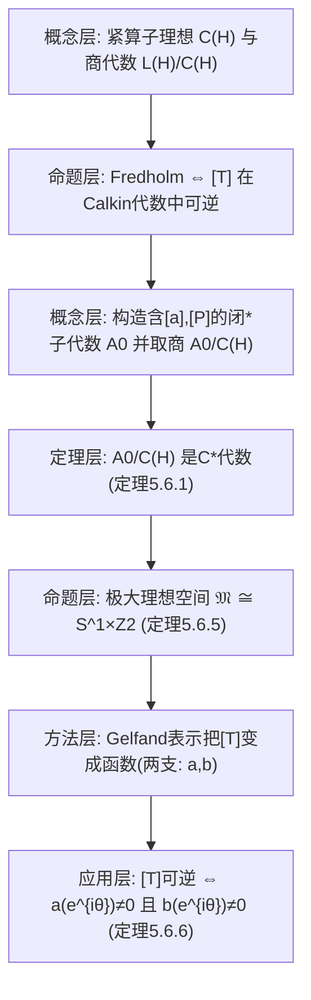

**相关笔记：** [[5.5 Hilbert空间上的正常算子]]｜[[第05章 Banach代数 — 章节汇总]]

> [!abstract] 概览
> 本节展示 Banach/$C^*$-代数工具在“算子可逆性/Fredholm 性判别”中的典型用法：  
> - 将 $L(\mathcal H)$ 的商代数 **Calkin 代数** $L(\mathcal H)/C(\mathcal H)$（紧算子理想的商）视作带 $*$ 的 Banach 代数，并证明它实际上是一个 $C^*$-代数。  
> - 在 Calkin 代数里把某类算子 $T=aP+b(I-P)+K$ 的像 $[T]$ 表示成一个交换 $C^*$-代数中的函数，从而把“$T$ 是 Fredholm”转化为两个函数值不为零的条件：$a(e^{i\theta})\ne 0,\ b(e^{i\theta})\ne 0$。  
> ^overview

---

# 1. 本节主题定位

- **本节的核心问题**
  1) 为什么 “$T$ 是 Fredholm” 可以通过商代数元素 $[T]$ 的可逆性来刻画？  
  2) 为什么即便出现非交换（例如 $[a,P]\ne 0$），仍可通过“取商/选闭 $*$-理想”把问题压到一个可函数化的交换 $C^*$-代数中？  
  3) 最终得到的判别条件（$a(e^{i\theta})\ne 0$、$b(e^{i\theta})\ne 0$）是如何从谱/极大理想空间推出来的？

- **本节在本章知识链中的位置**
  - 5.4 给出 $C^*$-代数的结构刚性；5.5 给出正常算子的谱分解与函数演算；  
  - 5.6 展示一个“工程化套路”：把算子问题变成商代数中的可逆性，再用 Gelfand 表示把可逆性变成“函数是否有零点”。

- **本节依赖哪些前置概念/定理**
  - 5.1：理想、商代数。  
  - 5.4：$C^*$-代数、交换情形的 Gelfand 表示；  
  - 5.5：连续函数演算/谱映射（作为“函数化”直觉背景）。
  - 线性算子理论：紧算子、Fredholm 算子（本节引用上一章/前章既结论）。

- **本节为后续哪些内容铺路**
  - 这套“商代数 + 角色空间 + 可逆性判别”的套路在算子理论与 PDE/积分方程中反复出现，是后续做题与进一步学习的通用框架。

## 二、核心思想

> [!tip] 先取商，再函数化：把“非交换的麻烦”隔离到理想里
> 在 $L(\mathcal H)$ 中很多自然子代数是非交换的；但紧算子理想 $C(\mathcal H)$ 常常被视为“可忽略误差”。  
> 通过把问题送到 Calkin 代数 $L(\mathcal H)/C(\mathcal H)$，你把“Fredholm 性”变成“商代数里可逆”。  
> 然后再挑选一个**关于对合 $*$ 封闭的闭子代数**，用 5.4.8 把它识别为某个函数代数，从而把可逆性变成“函数无零点”。

> [!warning] 本段最可能造成“看懂但不会用”的地方
> - 容易把 $[T]$ 当作“把紧算子直接删掉”，但在证明中必须清楚：  
>   1) $[T]$ 的范数如何定义；  
>   2) 为什么 $[T]$ 的可逆性等价于 $T$ 的 Fredholm 性（需要已知定理/先前结论支持）。  
> - 容易混淆三层代数：$L(\mathcal H)$、其闭子代数、以及商代数；每一步“可逆/谱”的传递都要点名使用哪个引理（如 5.5.2 的“$C^*$ 子代数保逆/保谱”）。

---

# 2. 内容分层图

---

# 3. 定义系统

## 3.1 Calkin 代数与商范数

> [!quote] 原文直接信息（商范数，式 (5.6.3)）
> 记
> $$
> \mathcal A_0=\mathcal A/C(\mathcal H),
> $$
> 则 $\mathcal A_0$ 是一个交换的带对合的 Banach 代数，具有商范数
> $$
> \|[A]\|=\inf_{K\in C(\mathcal H)}\|A-K\|.
> $$

- **定义对象是什么**
  - 对象：算子代数对“紧算子理想”的商；$[A]$ 表示 $A$ 在商中的等价类。
- **为什么要这样定义**
  - 商范数正是“忽略紧扰动”的定量方式：$[A]$ 的大小是 $A$ 到所有紧算子的最小距离。
- **它解决了什么问题**
  - 把“模紧等价”的可逆性问题放到一个真正的 Banach 代数中处理。
- **初学者误区**
  - 把 $\inf_{K}$ 误当成“取到某个最优 $K$”；一般只保证下确界存在。

---

# 4. 定理/命题系统

## 4.1 定理 5.6.1：商代数是 $C^*$-代数

> [!quote] 原文直接信息（定理 5.6.1）
> 设 $\mathcal A$ 是 $L(\mathcal H)$ 中一个关于对合 $*$ 封闭的闭子代数，包含 $C(\mathcal H)$，则 $\mathcal A/C(\mathcal H)$ 是一个 $C^*$ 代数。

- **条件逐条解释**
  - “关于 $*$ 封闭”：保证商代数仍有自然对合 $[A]^*=[A^*]$。  
  - “闭”：保证商范数下完备。  
  - “包含 $C(\mathcal H)$”：使得取商是合法的代数构造。
- **结论到底在说什么**
  - Calkin 结构不仅是 Banach 代数，而且满足 $C^*$ 恒等式（范数与对合强耦合）。
- **证明骨架（Step 1/2/3）**
  - Step 1：验证商上的对合良定义，并有 $\|[A]^*\|=\|[A]\|$。  
  - Step 2：由商范数与次乘性得 $\|[A]^*[A]\|\le \|[A]\|^2$。  
  - Step 3：证明反向不等式 $\|[A]^*[A]\|\ge \|[A]\|^2$（教材用谱/测度工具与自伴算子谱半径刻画来完成）。
- **证明中最关键的一跳**
  - 反向不等式需要把 $[A]^*[A]$ 的范数与谱联系起来（借助 5.5 的自伴算子谱/测度结论），从而把“下确界”变成“谱上界”。
- **后续用途**
  - 一旦是 $C^*$，就可以用 5.4.8 的函数化思路与 5.5.2 的保逆性把可逆性判别简化。

## 4.2 推论 5.6.3：$L(\mathcal H)/C(\mathcal H)$ 是 $C^*$-代数

> [!note] 重要特例（教材直接给出）
> 取 $\mathcal A=L(\mathcal H)$，则 Calkin 代数 $L(\mathcal H)/C(\mathcal H)$ 是一个 $C^*$-代数。

- **为什么重要**
  - 这使得“Fredholm ⇔ 商代数可逆”的判别拥有 $C^*$ 的强工具支持（谱/函数化/子代数保逆）。

## 4.3 定理 5.6.5：极大理想空间 $\mathfrak M\simeq S^1\times\mathbb Z_2$

> [!quote] 原文直接信息（定理 5.6.5，节选）
> $\mathfrak M\simeq S^1\times\mathbb Z_2$。

- **条件逐条解释**
  - 该结论依赖所构造的交换 $C^*$ 子代数包含两类“分支数据”：  
    - 来自乘法算子（函数 $a,b$ 在 $S^1$ 上的取值）；  
    - 来自投影 $P$（产生 $\mathbb Z_2=\{0,1\}$ 的二值信息）。
- **结论到底在说什么**
  - 角色空间由“角度 $\theta$”与“分支 $\varepsilon\in\{0,1\}$”共同参数化：$(e^{i\theta},\varepsilon)$。
- **证明骨架（Step 1/2/3）**
  - Step 1：对每个 $(e^{i\theta},\varepsilon)$ 构造一个角色 $\varphi_{\theta,\varepsilon}$（分别规定它在 $[a]$ 与 $[P]$ 上的取值）。  
  - Step 2：证明任一角色都由某个 $(e^{i\theta},\varepsilon)$ 给出（用生成元刻画）。  
  - Step 3：比较拓扑（用 5.3.2 类似的引理）得同胚。

## 4.4 定理 5.6.6：$T=aP+b(I-P)+K$ 的 Fredholm 判别

> [!quote] 原文直接信息（定理 5.6.6，节选）
> 对于
> $$
> T=aP+b(I-P)+K,
> $$
> $T$ 是 Fredholm 算子当且仅当对所有 $\theta$，
> $$
> a(e^{i\theta})\ne 0,\quad b(e^{i\theta})\ne 0.
> $$

- **条件逐条解释**
  - $K$ 为紧算子：确保 $[T]=[aP+b(I-P)]$，Fredholm 性只取决于商类。  
  - $P$ 为投影：在商代数中提供“二分支”结构（$\mathbb Z_2$）。  
  - $a,b$ 是乘法算子（来自 $C(S^1)$）：保证它们在角色空间上表现为点值函数。
- **结论到底在说什么**
  - “Fredholm 判别”被压成两个函数在 $S^1$ 上无零点：本质上是“商代数元素在所有角色下取值非零 ⇒ 可逆”。
- **证明骨架（Step 1/2/3）**
  - Step 1：由 Fredholm 理论（前章结论），$T$ Fredholm $\Leftrightarrow [T]$ 在 Calkin 代数中可逆。  
  - Step 2：把 $[T]$ 放入一个交换 $C^*$ 子代数并用 Gelfand 表示：在 $(e^{i\theta},0)$ 分支上取值为 $a(e^{i\theta})$，在 $(e^{i\theta},1)$ 分支上取值为 $b(e^{i\theta})$。  
  - Step 3：交换 $C^*$ 代数中“可逆 ⇔ 角色取值处处非零”，得到判别条件。
- **最关键的一跳**
  - 通过定理 5.6.5 把角色空间显式识别为 $S^1\times\mathbb Z_2$，从而把 $[T]$ 的所有角色取值“拆成两支”，最终归约为两个函数无零点。
- **若条件削弱，哪里可能出问题**
  - 若 $K$ 不是紧算子，则无法在商代数里消去它，判别条件不再只取决于 $a,b$。  
  - 若不能把代数压成交换 $C^*$，则“可逆 ⇔ 无零点”的简单刻画无法直接使用。

---

# 5. 例子与反例系统

- **本节最关键的例子**
  - $T=aP+b(I-P)+K$：展示“把 Fredholm 条件写成函数无零点”这一范式。

- **本节最值得补的反例**
  1) 若 $a(e^{i\theta_0})=0$，则在角色 $(e^{i\theta_0},0)$ 下 $[T]$ 取值为 0 ⇒ $[T]$ 不可逆 ⇒ $T$ 不是 Fredholm。  
  2) 若 $K$ 非紧，即使 $a,b$ 无零点，也可能因 $[K]\ne 0$ 破坏可逆性。

---

# 6. 本节逻辑链复原（按作者推进顺序）

## 6.1 原文推进清单（保序抓手）
1) 复回 5.5 的积分表示（5.5.14/5.5.15）作为本节工具接口  
2) 引入要研究的算子形式 $T=aP+b(I-P)+K$ 与 Fredholm 条件  
3) 构造包含 $C(\mathcal H)$ 的闭 $*$-子代数并取商，定义商范数 (5.6.3)  
4) 定理 5.6.1：证明该商代数是 $C^*$-代数（为后续函数化做准备）  
5) 识别极大理想空间（定理 5.6.5：$S^1\times\mathbb Z_2$）  
6) 用 Gelfand 表示计算 $[T]$ 的取值 ⇒ 得到 Fredholm 判别（定理 5.6.6）

---

# 7. 本节高风险误区（≥5）

1) **把“商类 $[A]$”当作“直接把紧算子删掉”**
   - 为什么：直觉上紧算子可忽略。  
   - 正确理解：删掉的方式必须通过商代数定义与商范数控制；很多推理依赖 $\|[A]\|=\inf\|A-K\|$。

2) **不知道 Fredholm ⇔ 商代数可逆需要外部定理支撑**
   - 为什么：教材一句话带过“上一章已证明”。  
   - 正确理解：本节是在使用已有判别；做题时必须先引用该定理/性质。

3) **混淆 $C(\mathcal H)$（紧算子理想）与 $C(S^1)$（连续函数代数）**
   - 为什么：符号都叫 $C(\cdot)$。  
   - 正确理解：一个是算子理想，一个是函数空间；本节两者都会出现，必须按上下文区分。

4) **误以为非交换就彻底不能用 Gelfand 理论**
   - 为什么：Gelfand 表示要求交换。  
   - 正确理解：策略是“选合适闭 $*$-理想取商/取交换子代数”，把关键对象压到可交换部分。

5) **把 $\mathfrak M\simeq S^1\times\mathbb Z_2$ 看成玄学结论**
   - 为什么：$\mathbb Z_2$ 从哪里来不直观。  
   - 正确理解：$\mathbb Z_2$ 的二值性来自投影 $P$ 在角色下只能取 0 或 1（投影的谱在 $\{0,1\}$），从而产生两条分支。

---

# 8. 知识库拆分建议

- **A类：应独立成概念卡**
  - Calkin 代数（$L(\mathcal H)/C(\mathcal H)$）与商范数  
  - Fredholm 算子与“模紧可逆”  
  - 投影算子与 $\mathbb Z_2$ 分支

- **B类：应独立成定理卡**
  - 定理 5.6.1（商代数是 $C^*$）  
  - 定理 5.6.5（$\mathfrak M\simeq S^1\times\mathbb Z_2$）  
  - 定理 5.6.6（Fredholm 判别）

- **C类：只保留在本节页中**
  - “取商→交换化→无零点判别”的通用流程图与检查清单

- **D类：建议作为专题综述页候选节点**
  - “Banach/$C^*$ 代数方法在算子 Fredholm 理论中的作用”  
  - “Calkin 代数与本质谱（essential spectrum）”专题接口

---

# 9. 后续学习接口

- **适合下一轮展开证明的点**
  - 定理 5.6.1 反向不等式 $\|[A]^*[A]\|\ge \|[A]\|^2$ 的证明细节（用到了 5.5 的谱测度/自伴谱半径刻画）。  
  - 定理 5.6.5 中“角色如何由 $(e^{i\theta},\varepsilon)$ 构造”的细节。

- **适合设计习题的点**
  - 给定一个算子 $T$，通过计算 $[T]$ 在各角色下的取值判别其 Fredholm 性。  
  - 练习：把投影 $P$ 的谱为何只能在 $\{0,1\}$（从而得到 $\mathbb Z_2$）写成一个短证明。

- **适合与前一节做比较的点（5.5）**
  - 5.5 用谱测度处理“正常算子”；5.6 用商代数处理“模紧可逆/本质谱”问题，本质上都是“把算子问题函数化”。

- **适合与下一章做衔接的点**
  - 本节最后自然连接到“无界算子”与更一般的算子理论（教材第6章开头也预告无界算子）。

---

# 10. 自测问题

## 10.A 自测问题（由浅到深 5 题）
1) 商范数 $\|[A]\|=\inf_{K\in C(\mathcal H)}\|A-K\|$ 的含义是什么？为什么它自然对应“忽略紧扰动”？  
2) 为什么投影算子在任何角色下的取值只能是 0 或 1？（提示：用 $p^2=p$ 的代数方程）  
3) 用“Fredholm ⇔ 商代数可逆”解释：为什么 $K$ 为紧算子时，$T$ 的 Fredholm 性不受 $K$ 影响？  
4) 在交换 $C^*$-代数中，如何用“角色取值处处非零”判别元素可逆？这条规则对应 5.2 的哪个结论？  
5) 解释定理 5.6.6 的逻辑链：$T$ Fredholm ⇔ $[T]$ 可逆 ⇔ Gelfand 表示对应函数无零点 ⇔ $a,b$ 在 $S^1$ 上无零点。

## 10.B 引用与原文 PDF（分片）
![[00-Raw素材/泛函分析讲义_张恭庆/章节内容/第五章_Banach代数/5.6_在奇异积分算子中的应用.pdf]]
