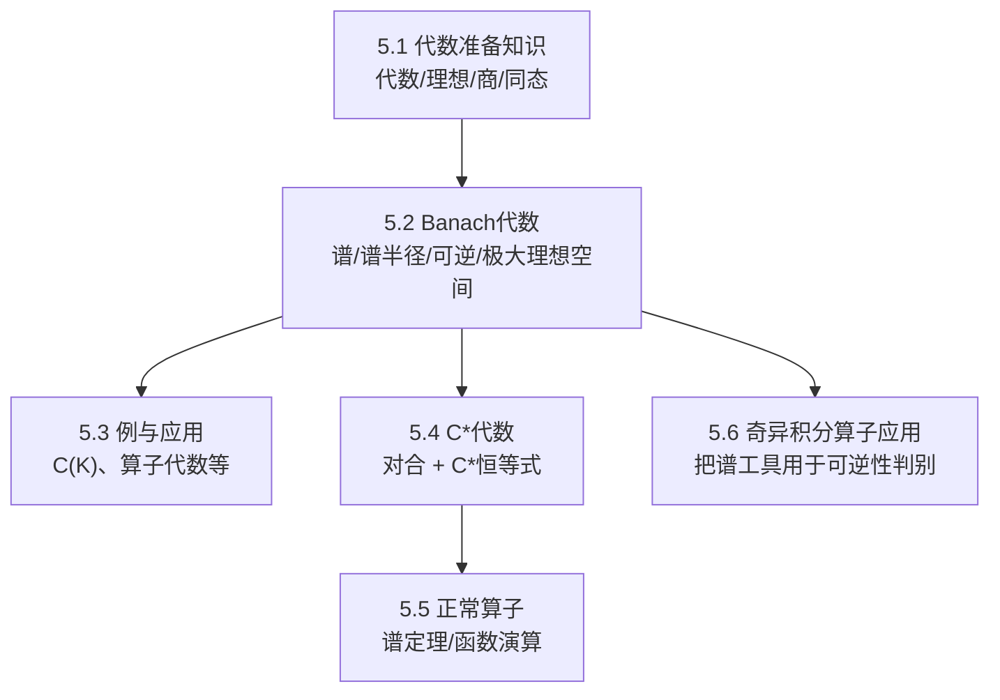

> [!abstract] 概览
> 本章把“算子当成一个个对象”升级为“把算子（或函数）组成的代数当成整体对象”来研究：  
> - 5.1：代数/理想/商代数/同态等准备  
> - 5.2：Banach 代数基本理论：谱、谱半径公式、可逆元、Gelfand 变换与极大理想空间  
> - 5.3：例与应用：把抽象理论落到具体代数（如 $C(K)$、算子代数等）  
> - 5.4：$C^*$-代数：对合结构 + 范数结构带来更强结论（Gelfand–Naimark、Stone–Weierstrass 等）  
> - 5.5：Hilbert 空间上的正常算子：谱定理与函数演算（与 $C^*$ 结构强耦合）  
> - 5.6：奇异积分算子中的应用：展示 Banach 代数/谱工具的“工程化”威力  
> ^overview

## 一、章节导航
- 课本分片PDF：见文末“引用与原文PDF”
- 本章笔记：
  - [[5.1 代数准备知识]]
  - [[5.2 Banach代数]]
  - [[5.3 例与应用]]
  - [[5.4 C*代数]]
  - [[5.5 Hilbert空间上的正常算子]]
  - [[5.6 在奇异积分算子中的应用]]

## 二、全章结构图（Mermaid）

## 三、各节概览（嵌入聚合）
- ![[5.1 代数准备知识#^overview]]
- ![[5.2 Banach代数#^overview]]
- ![[5.3 例与应用#^overview]]
- ![[5.4 C*代数#^overview]]
- ![[5.5 Hilbert空间上的正常算子#^overview]]
- ![[5.6 在奇异积分算子中的应用#^overview]]

## 四、引用与原文 PDF（分片）

> [!quote]- 第五章 Banach代数（教材分片PDF）
> ![[00-Raw素材/泛函分析讲义_张恭庆/章节内容/第五章_Banach代数/5.1_代数准备知识.pdf]]
> ![[00-Raw素材/泛函分析讲义_张恭庆/章节内容/第五章_Banach代数/5.2_Banach代数.pdf]]
> ![[00-Raw素材/泛函分析讲义_张恭庆/章节内容/第五章_Banach代数/5.3_例与应用.pdf]]
> ![[00-Raw素材/泛函分析讲义_张恭庆/章节内容/第五章_Banach代数/5.4_C*代数.pdf]]
> ![[00-Raw素材/泛函分析讲义_张恭庆/章节内容/第五章_Banach代数/5.5_Hilbert空间上的正常算子.pdf]]
> ![[00-Raw素材/泛函分析讲义_张恭庆/章节内容/第五章_Banach代数/5.6_在奇异积分算子中的应用.pdf]]

