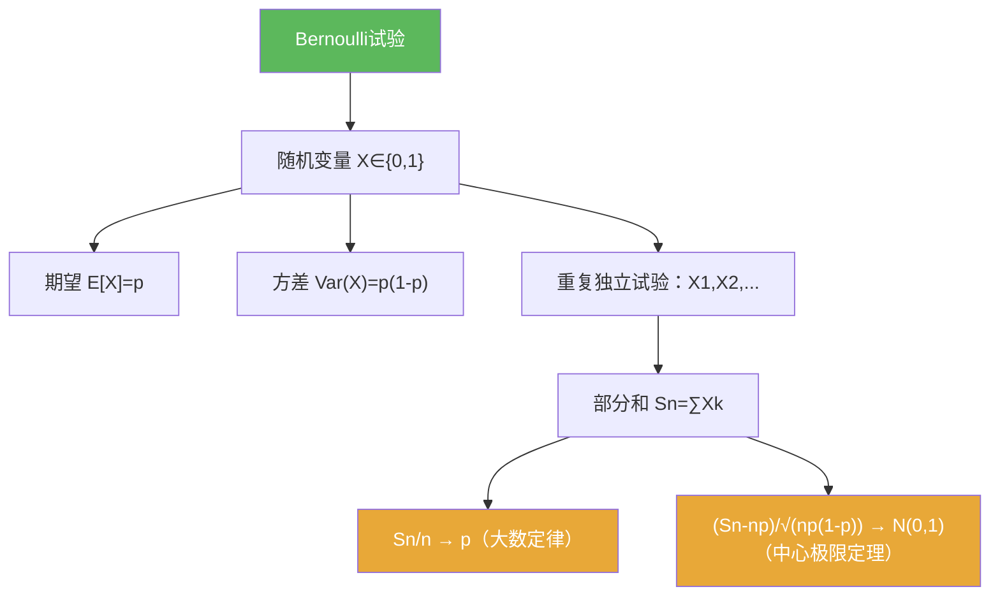

**相关笔记：** [[第04章 Baire纲定理的应用 — 章节汇总]] | [[5.2 独立随机变量的和]] | [[第05章 概率论基础 — 章节汇总]] | 预备：[[期望]] [[方差]] [[独立性]] [[随机变量]]

> [!abstract] 概览
> 本节用最经典的模型——==掷硬币（Bernoulli 试验）==——引入概率论的基本对象：概率空间、随机变量、分布、以及“重复试验”的极限定理（大数定律/中心极限定理）的直觉入口。
>
> - 概率空间 $(\Omega,\mathcal F,\mathbb P)$：事件的“可测结构”与概率测度
> - Bernoulli 随机变量：取值 $\{0,1\}$，参数 $p=\mathbb P(X=1)$
> - 重复独立试验：独立同分布（i.i.d.）序列 $X_1,X_2,\dots$
> - 部分和 $S_n=\sum_{k=1}^n X_k$ 与频率 $S_n/n$（通往==大数定律==）
> - 规范化的偏差 $(S_n-np)/\sqrt{np(1-p)}$（通往==中心极限定理==）

^overview

---

## 一、知识结构总览

---

## 二、核心思想

> [!tip] 方法论（把概率题写成“可复用的代数骨架”）
> 在重复独立试验里，最常见的写法是：**先把对象写成部分和 $S_n$，再用期望/方差的可加性建立尺度，最后做归一化**（频率/标准化偏差），再调用大数定律或中心极限定理。

### 1) 概率空间与随机变量（最小工具箱）

> [!def] 概率空间
> 三元组 $(\Omega,\mathcal F,\mathbb P)$：$\Omega$ 为样本空间，$\mathcal F$ 为事件 $\sigma$-代数，$\mathbb P$ 为概率测度，满足 $\mathbb P(\Omega)=1$。

> [!def] Bernoulli 随机变量
> 随机变量 $X$ 满足 $X\in\{0,1\}$，且
> $$\mathbb P(X=1)=p,\qquad \mathbb P(X=0)=1-p.$$
> 记作 $X\sim \mathrm{Bernoulli}(p)$。

### 2) 期望与方差（从 0/1 直接算出）

> [!example] 一步算出期望与方差
> 对 $X\sim \mathrm{Bernoulli}(p)$：
> $$\mathbb E[X]=p,\qquad \mathrm{Var}(X)=\mathbb E[X^2]-\mathbb E[X]^2=p-p^2=p(1-p).$$

> [!tip] 做题提示
> 0/1 变量的一个捷径：$X^2=X$，因此很多式子会自动简化。

### 3) 重复试验：i.i.d. 与部分和

> [!def] 独立同分布（i.i.d.）
> 随机变量列 $(X_n)$ 称为独立同分布，如果它们两两（更强：有限维）独立且各自分布相同。

> [!def] 部分和与频率
> 令 $S_n=\sum_{k=1}^n X_k$，则 $S_n$ 表示前 $n$ 次试验出现“1”的次数，$S_n/n$ 是出现“1”的频率。

> [!info] 两个马上要用的可加性
> 对独立随机变量，常用：
> - $\mathbb E[S_n]=\sum_{k=1}^n \mathbb E[X_k]=np$  
> - $\mathrm{Var}(S_n)=\sum_{k=1}^n \mathrm{Var}(X_k)=np(1-p)$

---

## 三、补充理解与易混淆点

> [!info] 为什么在本书里插入概率论？
> 这一章为后续“Brownian 运动引论”（raw 第06章）做预备：独立增量、部分和极限、以及中心极限定理的直觉都会在随机过程里反复出现。
>
> 参考（权威外链）：
> - https://en.wikipedia.org/wiki/Bernoulli_trial

> [!info] Bernoulli 与二项分布
> 若 $X_1,\dots,X_n$ i.i.d. 且为 Bernoulli$(p)$，则 $S_n=\sum_{k=1}^n X_k$ 服从二项分布 $\mathrm{Binomial}(n,p)$（本章后续会不断用到）。
>
> 参考（权威外链）：
> - https://en.wikipedia.org/wiki/Binomial_distribution

> [!warning] ❌“独立”不等于“互不相关”
> ✅ 独立 ⇒ 协方差为 0（不相关），但反过来不成立；做题时不要用“协方差为 0”替代独立性假设。

> [!warning] ❌把“频率 $S_n/n$”当成“概率 $p$”
> ✅ $S_n/n$ 是随机量；“趋于 $p$”是一个极限定理（大数定律），需要条件与证明，不能当作定义。

> [!quote]- 参考（讲义/课程笔记）
> - Stanford CS109：Bernoulli & Binomial（课程讲义入口）：https://web.stanford.edu/class/archive/cs/cs109/cs109.1166/
> - MIT 6.041：Random Variables（课程资料入口）：https://ocw.mit.edu/courses/6-041-probabilistic-systems-analysis-and-applied-probability-fall-2010/

---

## 四、习题精选

> [!todo] 习题概览
> | 题号 | 核心考点 | 难度 |
> |---|---|---|
> | 5.1.A | Bernoulli 的期望/方差计算 | ⭐⭐ |
> | 5.1.B | 二项分布与计数解释 | ⭐⭐⭐ |
> | 5.1.C | 用可加性控制部分和尺度 | ⭐⭐⭐ |

> [!problem] 练习 5.1.1（期望与方差）
> 设 $X\sim \mathrm{Bernoulli}(p)$。计算 $\mathbb E[X]$、$\mathrm{Var}(X)$，并给出一步解释为何 $X^2=X$。

> [!faq]- 提示
> 0/1 变量平方不变；用 $\mathrm{Var}(X)=\mathbb E[X^2]-\mathbb E[X]^2$。

> [!problem] 练习 5.1.2（二项分布）
> 设 $X_1,\dots,X_n$ i.i.d. 且 $X_k\sim \mathrm{Bernoulli}(p)$，令 $S_n=\sum_{k=1}^n X_k$。说明 $S_n$ 服从二项分布，并写出 $\mathbb P(S_n=m)$ 的表达式。

> [!faq]- 提示
> “出现 $m$ 次 1”需要选出哪 $m$ 次，再乘上对应概率：组合数 $\binom{n}{m}$。

> [!problem] 练习 5.1.3（部分和的尺度）
> 在上述设定下，计算 $\mathbb E[S_n]$ 与 $\mathrm{Var}(S_n)$，并解释为何它们的增长阶分别是 $n$。

> [!faq]- 提示
> 用期望可加性与（独立时）方差可加性；每项都是常数，累加得到线性增长。

---

## 五、引用

- 原始材料：![[00-Raw素材/泛函分析/05_第5章_概率论基础/5.1_Bernoulli试验.pdf]]

## 参见 Wiki

- concepts：[[Bernoulli试验]] [[随机变量]] [[独立性]] [[期望]] [[方差]]
- theorems：[[大数定律]] [[中心极限定理]]

