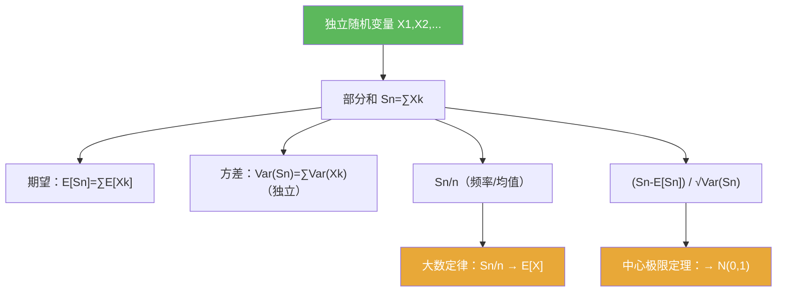

**相关笔记：** [[5.1 Bernoulli试验]] | [[5.3 习题]] | [[第05章 概率论基础 — 章节汇总]] | 预备：[[期望]] [[方差]] [[独立性]] [[随机变量]]

> [!abstract] 概览
> 本节把 5.1 的“掷硬币直觉”推广到更一般的==独立随机变量列==，核心围绕“部分和 $S_n$ 的归一化极限”展开：  
> - 期望/方差的可加性给出自然尺度（线性增长与平方根增长）
> - 大数定律：$S_n/n$ 的稳定性（频率趋于期望）
> - 中心极限定理：$S_n$ 的典型波动是 $\sqrt n$ 量级，归一化后趋向正态
> - 书中会把“大数定律”与遍历思想联系起来（此处只记住使用姿势）

^overview

---

## 一、知识结构总览

---

## 二、核心思想

> [!tip] 两个尺度：$n$ 与 $\sqrt n$
> 反复出现的核心观察是：
> - **均值规模**：$\mathbb E[S_n]$ 通常是 $O(n)$  
> - **波动规模**：$S_n-\mathbb E[S_n]$ 的典型大小是 $O(\sqrt n)$（因为方差加起来是 $O(n)$）  
> 因此：$S_n/n$ 会稳定（大数定律），而标准化偏差会有非平凡极限（中心极限定理）。

### 1) 同分布与独立（最小可用口径）

> [!def] 同分布
> 随机变量列 $(X_n)$ 称为同分布，如果它们的分布测度相同（等价地：对所有 Borel 集 $B$，$\mathbb P(X_n\in B)$ 与 $n$ 无关）。

> [!def] 独立
> $(X_n)$ 独立是指任取有限多个指标 $n_1,\dots,n_k$，事件 $\{X_{n_j}\in B_j\}$ 的概率可分解为乘积（对所有 Borel 集 $B_j$）。

> [!warning] ❌“两两独立”不等于“相互独立”
> ✅ 许多极限定理需要（有限维）相互独立，而非仅两两独立；做题时不要偷换。

### 2) 可加性工具箱（见到和就先拆）

> [!thm] 期望的可加性
> 若 $X,Y$ 可积，则 $\mathbb E[X+Y]=\mathbb E[X]+\mathbb E[Y]$（不需要独立）。

> [!thm] 方差的可加性（独立情形）
> 若 $X_1,\dots,X_n$ 独立且二阶可积，则
> $$\mathrm{Var}\!\left(\sum_{k=1}^n X_k\right)=\sum_{k=1}^n \mathrm{Var}(X_k).$$

> [!example] 部分和的“第一步写法”
> 只要题目出现 $\sum_{k=1}^n X_k$，先写出：
> $$\mathbb E[S_n]=\sum_{k=1}^n\mathbb E[X_k],\qquad \mathrm{Var}(S_n)=\sum_{k=1}^n\mathrm{Var}(X_k)\ \ (\text{独立时}).$$
> 这一步通常就给出了“该如何归一化”的尺度。

### 3) 大数定律与中心极限定理（本章的两个终点）

> [!thm] 大数定律（口径提示）
> 在适当条件下（例如 i.i.d. 且 $\mathbb E|X_1|<\infty$），有
> $$\frac{S_n}{n}\to \mathbb E[X_1]$$
> （收敛方式以书中叙述为准：可能是几乎处处或依概率）。

> [!thm] 中心极限定理（口径提示）
> 在适当条件下（例如 i.i.d. 且 $\mathbb E[X_1]=\mu$，$\mathrm{Var}(X_1)=\sigma^2>0$），有
> $$\frac{S_n-n\mu}{\sigma\sqrt n}\Rightarrow N(0,1).$$

> [!info] 做题提示：你不需要背全部条件
> 在本章的多数题里，“i.i.d. + 二阶矩存在”足以作为默认环境；更细条件若出现，会在题干中明确提醒。

---

## 三、补充理解与易混淆点

> [!info] 收敛方式的强弱（只记住一条链）
> 一般来说：几乎处处收敛 ⇒ 依概率收敛 ⇒ 依分布收敛。  
> 大数定律通常给出前两者之一，中心极限定理通常给出“依分布收敛”。
>
> 参考（权威外链）：
> - https://en.wikipedia.org/wiki/Convergence_of_random_variables

> [!info] 为什么会出现“遍历思想”？
> 从 OCR 抽取到的原文提示本节用遍历定理推导一般的大数定律；你此处只需记住：它提供了把“时间平均”变成“空间平均”的方法论背景。
>
> 参考（权威外链）：
> - https://en.wikipedia.org/wiki/Ergodic_theorem

> [!warning] ❌把 CLT 当成“概率趋于 0”
> ✅ CLT 是分布收敛：归一化后的随机变量分布趋向正态；它不是某个事件概率的直接极限式，需要你把问题改写成分布函数/尾概率形式才能使用。

> [!warning] ❌忘记中心化与标准化
> ✅ CLT 的标准形式必须“减去均值再除以标准差尺度”；不做中心化/标准化通常得不到非平凡极限。

> [!quote]- 参考（讲义/课程笔记）
> - Harvard Stat 110（CLT/LLN 讲义入口）：https://projects.iq.harvard.edu/stat110/lecture-notes
> - MIT 18.675（LLN/CLT 笔记入口）：https://ocw.mit.edu/courses/18-675-theory-of-probability-fall-2013/

---

## 四、习题精选

> [!todo] 习题概览
> | 题号 | 核心考点 | 难度 |
> |---|---|---|
> | 5.2.A | 期望/方差可加性与归一化尺度 | ⭐⭐⭐ |
> | 5.2.B | 大数定律：频率趋于期望的改写 | ⭐⭐⭐⭐ |
> | 5.2.C | CLT：把问题改写成标准化偏差 | ⭐⭐⭐⭐ |

> [!problem] 练习 5.2.1（尺度识别）
> 设 $X_1,\dots,X_n$ 独立同分布，$\mathbb E[X_1]=\mu$，$\mathrm{Var}(X_1)=\sigma^2$。令 $S_n=\sum_{k=1}^n X_k$。计算 $\mathbb E[S_n]$ 与 $\mathrm{Var}(S_n)$，并解释为何“中心化后”的典型尺度应为 $\sqrt n$。

> [!faq]- 提示
> 用可加性得到 $\mathbb E[S_n]=n\mu$、$\mathrm{Var}(S_n)=n\sigma^2$；标准差为 $\sigma\sqrt n$。

> [!problem] 练习 5.2.2（大数定律的题面改写）
> 对 i.i.d. 序列，说明“$S_n/n\to \mu$”可被用来解释“样本均值逼近总体均值”的统计直觉，并指出这句话里最关键的前提是什么。

> [!faq]- 提示
> 关键在于独立同分布与可积性（至少要求 $\mathbb E|X_1|<\infty$）。写作时强调“$S_n/n$ 是随机量”。

> [!problem] 练习 5.2.3（CLT 的标准化形式）
> 设 $X_k\sim\mathrm{Bernoulli}(p)$ i.i.d.，$S_n=\sum_{k=1}^n X_k$。写出把 $S_n$ 标准化为趋向 $N(0,1)$ 的表达式。

> [!faq]- 提示
> 用 $\mu=p$、$\sigma^2=p(1-p)$，写成 $(S_n-np)/\sqrt{np(1-p)}$。

---

## 五、引用

- 原始材料：![[00-Raw素材/泛函分析/05_第5章_概率论基础/5.2_独立随机变量的和.pdf]]

## 参见 Wiki

- concepts：[[随机变量]] [[独立性]] [[期望]] [[方差]] [[Bernoulli试验]]
- theorems：[[大数定律]] [[中心极限定理]]

