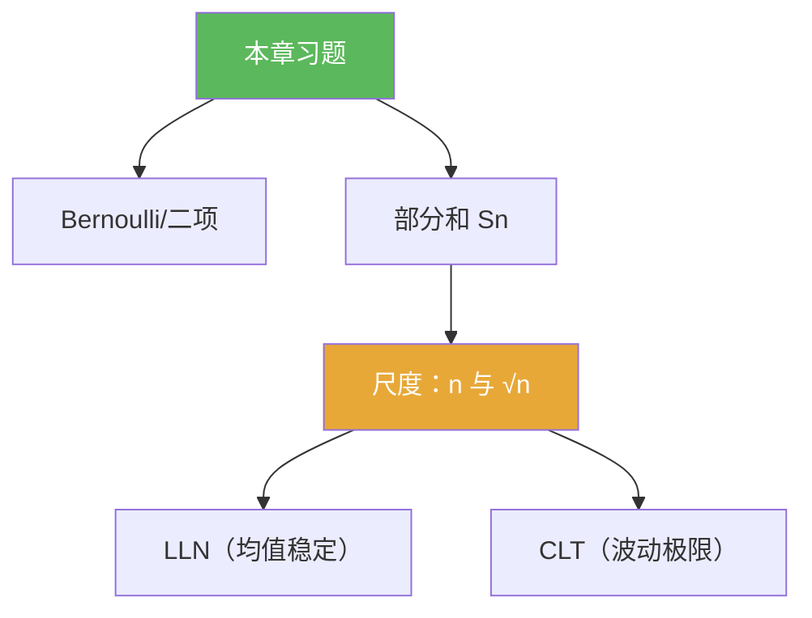

**相关笔记：** [[5.2 独立随机变量的和]] | [[5.4 问题]] | [[第05章 概率论基础 — 章节汇总]] | 回链：[[5.1 Bernoulli试验]]

> [!abstract] 概览
> 本节把第05章的题型压缩成“可复用套路清单”：  
> - Bernoulli/二项：计数解释 + 期望/方差计算  
> - 部分和：先写 $\mathbb E[S_n]$、$\mathrm{Var}(S_n)$ 再识别归一化尺度  
> - LLN/CLT：把题面改写成“样本均值/标准化偏差”的形式再调用结论  

^overview

---

## 一、知识结构总览

---

## 二、核心思想（题型套路清单）

> [!tip] 套路 1：出现“次数/频率”先引入 $S_n$
> 把“前 $n$ 次出现 1 的次数”写成 $S_n=\sum_{k=1}^n X_k$，把“频率”写成 $S_n/n$。

> [!tip] 套路 2：出现“偏离均值”先中心化
> 把 $S_n$ 换成 $S_n-\mathbb E[S_n]$；若要用 CLT，再除以标准差尺度 $\sqrt{\mathrm{Var}(S_n)}$。

> [!tip] 套路 3：不要偷换量词
> “对每个 $n$ 的不等式”与“$n\to\infty$ 的极限结论”是两件事；LLN/CLT 需要明确的收敛方式与条件。

---

## 三、补充理解与易混淆点

> [!info] 写作要求（对齐本库）
> 习题页不要求把所有长计算写完，但必须写出：关键记号、关键变形、以及为什么选择该归一化尺度。

> [!warning] ❌把“分布收敛”当作“数值收敛”
> ✅ CLT 给的是分布收敛；如果题目问概率极限，需要把事件写成标准化变量落在区间里的概率。

> [!quote]- 参考（权威外链）
> - https://en.wikipedia.org/wiki/Law_of_large_numbers
> - https://en.wikipedia.org/wiki/Central_limit_theorem

---

## 四、习题精选

> [!todo] 习题概览
> | 题号 | 覆盖内容 | 难度 |
> |---|---|---|
> | 5.3.A | 二项分布的计数解释 | ⭐⭐⭐ |
> | 5.3.B | 用可加性得到尺度 | ⭐⭐⭐ |
> | 5.3.C | LLN/CLT 的标准化改写 | ⭐⭐⭐⭐ |

> [!problem] 练习 5.3.1（二项分布）
> 设 $X_1,\dots,X_n$ i.i.d. 且为 Bernoulli$(p)$，$S_n=\sum_{k=1}^n X_k$。写出 $\mathbb P(S_n=m)$ 并解释组合数来源。

> [!faq]- 提示
> 选出出现“1”的 $m$ 次：$\binom{n}{m}$；每种序列概率为 $p^m(1-p)^{n-m}$。

> [!problem] 练习 5.3.2（尺度）
> 设 $X_k$ i.i.d.，$\mathbb E[X_1]=\mu$，$\mathrm{Var}(X_1)=\sigma^2$，$S_n=\sum_{k=1}^n X_k$。写出 $\mathbb E[S_n]$、$\mathrm{Var}(S_n)$，并解释为何“自然标准化”是除以 $n$（LLN）或除以 $\sqrt n$（CLT）。

> [!faq]- 提示
> $\mathbb E[S_n]=n\mu$，$\mathrm{Var}(S_n)=n\sigma^2$；均值是 $n$ 量级，标准差是 $\sqrt n$ 量级。

> [!problem] 练习 5.3.3（CLT 改写）
> 若题目给出“求 $\mathbb P(S_n\le a_n)$ 的极限”，说明你会如何用 CLT：写出标准化变量并把事件改写成它落在区间内的概率。

> [!faq]- 提示
> 写 $Z_n=(S_n-n\mu)/(\sigma\sqrt n)$，把 $S_n\le a_n$ 等价变形为 $Z_n\le (a_n-n\mu)/(\sigma\sqrt n)$，然后用 $Z_n\Rightarrow N(0,1)$。

---

## 五、引用

- 原始材料：![[00-Raw素材/泛函分析/05_第5章_概率论基础/5.3_习题.pdf]]

## 参见 Wiki

- concepts：[[Bernoulli试验]] [[随机变量]] [[独立性]] [[期望]] [[方差]]
- theorems：[[大数定律]] [[中心极限定理]]
