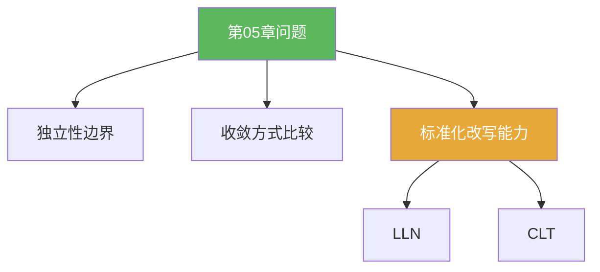

**相关笔记：** [[5.3 习题]] | [[第05章 概率论基础 — 章节汇总]] | 回链：[[5.1 Bernoulli试验]] [[5.2 独立随机变量的和]]

> [!abstract] 概览
> 本节用于建立“边界感”：  
> - 哪些结论依赖独立性？哪些只依赖可积性？  
> - 大数定律与中心极限定理在“收敛方式/结论强弱”上有什么区别？  
> - 如何把题面改写成“部分和的标准化形式”？  
> 这些问题不要求写满长证明，但必须写出清晰的逻辑链。

^overview

---

## 一、知识结构总览

---

## 二、核心思想（回答“问题”的模板）

> [!tip] 回答结构建议
> 1) 写出题目中的核心对象（通常是 $S_n=\sum_{k=1}^n X_k$ 或样本均值）  
> 2) 指出要用的结论（LLN/CLT/可加性）以及它需要的关键前提（独立/同分布/矩存在）  
> 3) 如果是概率极限，先把事件改写成标准化变量落在区间内  
> 4) 最后说明“收敛方式”与“结论强弱”的对应关系

---

## 三、补充理解与易混淆点

> [!info] LLN vs CLT（一句话区分）
> - 大数定律：$S_n/n$ 稳定到常数（均值层面）  
> - 中心极限定理：$S_n$ 的“典型波动”经 $\sqrt n$ 标准化后趋向正态（波动层面）

> [!warning] ❌“有界”不等于“可用 CLT”
> ✅ CLT 需要足够的矩条件（至少二阶矩）以及独立同分布或其推广；有界只是可能满足矩条件的一种方式。

> [!quote]- 参考（权威外链）
> - https://en.wikipedia.org/wiki/Law_of_large_numbers
> - https://en.wikipedia.org/wiki/Central_limit_theorem

---

## 四、习题精选

> [!todo] 问题概览
> | 题号 | 方向 | 难度 |
> |---|---|---|
> | 5.4.A | 独立性与可加性边界 | ⭐⭐⭐ |
> | 5.4.B | 收敛方式链条与应用 | ⭐⭐⭐⭐ |
> | 5.4.C | 事件标准化改写 | ⭐⭐⭐⭐ |

> [!problem] 问题 5.4.1（独立性的作用）
> 解释：为什么“$\mathrm{Var}(S_n)=\sum_{k=1}^n \mathrm{Var}(X_k)$”需要独立性？如果只假设两两不相关，哪些步骤还能保留？

> [!faq]- 提示
> 展开 $\mathrm{Var}(\sum X_k)$ 会出现协方差项 $\sum_{i\ne j}\mathrm{Cov}(X_i,X_j)$；独立会让这些项为 0。两两不相关也能让协方差项为 0，但它不足以推出很多极限定理（提示：独立更强）。

> [!problem] 问题 5.4.2（收敛方式的使用姿势）
> 给出一个你认为“CLT 只够用分布收敛，但不够用几乎处处收敛”的例子思路，并说明你如何从分布收敛推出某个概率极限。

> [!faq]- 提示
> 分布收敛适合处理形如 $\mathbb P(Z_n\le t)$ 的极限；如果题目问某区间概率，就先把事件改写成 $Z_n$ 落在区间里。

> [!problem] 问题 5.4.3（标准化改写）
> 设 $S_n=\sum_{k=1}^n X_k$，$\mathbb E[X_1]=\mu$，$\mathrm{Var}(X_1)=\sigma^2$。把“$\mathbb P(S_n\in [a_n,b_n])$”改写成标准化变量的概率表达式（只写改写步骤，不要求取极限）。

> [!faq]- 提示
> 用 $Z_n=(S_n-n\mu)/(\sigma\sqrt n)$，然后把区间端点也按同样方式中心化并除以 $\sigma\sqrt n$。

---

## 五、引用

- 原始材料：![[00-Raw素材/泛函分析/05_第5章_概率论基础/5.4_问题.pdf]]

## 参见 Wiki

- concepts：[[Bernoulli试验]] [[随机变量]] [[独立性]] [[期望]] [[方差]]
- theorems：[[大数定律]] [[中心极限定理]]
