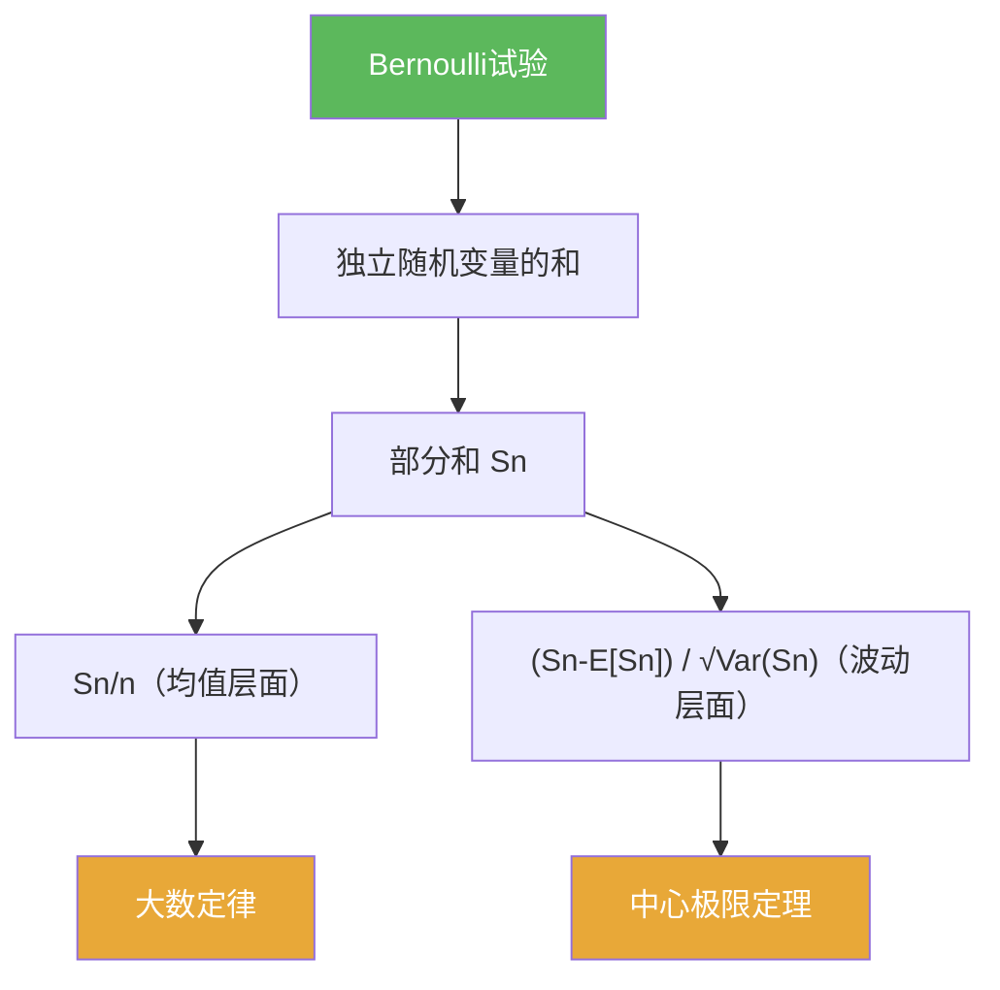

# 第05章 概率论基础 — 章节汇总

**相关笔记：** [[第04章 Baire纲定理的应用 — 章节汇总]] | [[Wiki/index]] | 后续预告：raw 第06章 Brownian运动引论

> [!abstract] 概览
> 本章用 Bernoulli 试验作为最小模型，建立“独立重复试验 → 部分和 → 极限定理”的思维链：  
> ==可加性（期望/方差）==给出尺度；==大数定律==解释均值稳定；==中心极限定理==解释典型波动。  
> 这些内容为后续随机过程（例如 Brownian 运动）的学习提供直觉与工具。

^overview

---

## 一、知识结构总览

---

## 二、各节入口（学习路线）

| 节 | 主题 | 你应带走的“可复用套路” |
|---|---|---|
| [[5.1 Bernoulli试验]] | 最小模型与直觉 | 0/1 变量的期望/方差；部分和 $S_n$ 与频率 $S_n/n$；二项分布计数解释 |
| [[5.2 独立随机变量的和]] | 一般化与归一化 | 先拆 $\mathbb E[S_n]$、$\mathrm{Var}(S_n)$ 决定尺度；LLN 与 CLT 的标准化写法 |
| [[5.3 习题]] | 题型训练 | 把题面改写成“频率/标准化偏差”；避免量词偷换 |
| [[5.4 问题]] | 边界感 | 独立性的作用；收敛方式强弱；事件标准化改写 |

---

## 三、跨章关联（你应看见的主线）

1) **与第04章的关系**  
第04章强调“完备性 → Baire 方法”的存在性工具；第05章进入概率论，是为了后续更偏分析的主题（例如 Brownian 运动）提供随机工具箱。

2) **与后续章节的关系（raw 第06章）**  
“独立增量/部分和极限/正态极限”是理解 Brownian 运动的核心直觉来源之一；本章先把最小版本学扎实。

---

## 四、自测清单（逐条打勾）

- [ ] 我能把掷硬币模型写成 Bernoulli 随机变量序列，并算出期望与方差。  
- [ ] 我能把“次数/频率/均值”统一写成 $S_n$ 与 $S_n/n$。  
- [ ] 我能快速写出 $\mathbb E[S_n]$ 与 $\mathrm{Var}(S_n)$ 并识别 $n$ 与 $\sqrt n$ 两个尺度。  
- [ ] 我能写出 Bernoulli 情形的标准化 CLT 表达式 $(S_n-np)/\sqrt{np(1-p)}$。  
- [ ] 我能说明 LLN 与 CLT 的差异（结论对象与收敛方式）。  

---

## 五、各节概览（快速回看）

- ![[5.1 Bernoulli试验#^overview]]
- ![[5.2 独立随机变量的和#^overview]]

---

## 六、本章索引（Wiki 导航）

**节笔记：** [[5.1 Bernoulli试验]] | [[5.2 独立随机变量的和]] | [[5.3 习题]] | [[5.4 问题]]

**concepts：** [[Bernoulli试验]] [[随机变量]] [[独立性]] [[期望]] [[方差]]

**theorems：** [[大数定律]] [[中心极限定理]]

---

## 七、引用（PDF）

![[00-Raw素材/泛函分析/05_第5章_概率论基础/5.1_Bernoulli试验.pdf]]
![[00-Raw素材/泛函分析/05_第5章_概率论基础/5.2_独立随机变量的和.pdf]]
![[00-Raw素材/泛函分析/05_第5章_概率论基础/5.3_习题.pdf]]
![[00-Raw素材/泛函分析/05_第5章_概率论基础/5.4_问题.pdf]]
