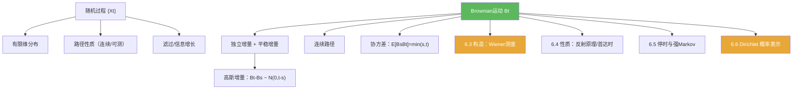

**相关笔记：** [[第05章 概率论基础 — 章节汇总]] | [[6.2 技巧准备]] | [[第06章 Brownian运动引论 — 章节汇总]] | 预备：[[随机过程]] [[Brownian运动]] [[Wiener测度]]

> [!abstract] 概览
> 本节搭建 Brownian 运动的“最小公理系统”与学习路线：把随机变量升级为==随机过程==，并用有限维分布、增量与路径连续性三条线把对象锁死。
>
> - 随机过程：$\{X_t\}_{t\ge 0}$ 是按时间参数索引的一族随机变量
> - Brownian 运动（Wiener 过程）的四个核心公理：$B_0=0$、独立增量、平稳增量（正态）、连续路径
> - 两个尺度：时间增量 $t-s$ 决定增量方差 $\mathbb E[(B_t-B_s)^2]=t-s$
> - 典型做题姿势：先写协方差 $\mathbb E[B_sB_t]=\min(s,t)$，再用高斯过程性质推分布
> - 这章的主线：6.3 构造（Wiener 测度）→ 6.4 性质（反射原理等）→ 6.5 停时强 Markov → 6.6 Dirichlet 概率表示

^overview

---

## 一、知识结构总览

---

## 二、核心思想

> [!tip] 方法论：把“过程题”降维成“增量题”
> 处理 Brownian 运动最稳的路线是：  
> 1) 把要研究的量写成增量的线性组合；  
> 2) 用独立/平稳增量把分布拆开；  
> 3) 若是高斯过程问题，用协方差矩阵唯一决定有限维分布。

### 1) 随机过程与滤过（最小口径）

> [!def] 随机过程
> 在概率空间 $(\Omega,\mathcal F,\mathbb P)$ 上，称族 $\{X_t\}_{t\in T}$ 为随机过程，若每个 $X_t$ 都是随机变量。

> [!def] 滤过（直觉）
> 滤过 $\{\mathcal F_t\}$ 表示“随时间增长的信息”，满足 $\mathcal F_s\subset \mathcal F_t$（$s\le t$）。  
> Brownian 的自然滤过常写为 $\mathcal F_t^B=\sigma(B_s:0\le s\le t)$（后续在 6.5 会变得关键）。

### 2) Brownian 运动的定义（可做题版本）

> [!def] Brownian运动（Wiener过程，提示性定义）
> 过程 $\{B_t\}_{t\ge 0}$ 称为 Brownian 运动，如果：
> 1) $B_0=0$；  
> 2) **独立增量**：对 $0\le t_0<t_1<\cdots<t_n$，增量 $B_{t_k}-B_{t_{k-1}}$ 相互独立；  
> 3) **平稳高斯增量**：$B_t-B_s\sim N(0,t-s)$（$s<t$）；  
> 4) **路径连续**：几乎处处 $\omega$ 下，$t\mapsto B_t(\omega)$ 连续。

> [!example] 两个立刻可用的推论
> - $\mathbb E[B_t]=0$，$\mathrm{Var}(B_t)=t$  
> - $\mathbb E[(B_t-B_s)^2]=t-s$

### 3) 协方差刻画（高斯过程的“身份证”）

> [!thm] 协方差公式（可直接引用）
> 对 Brownian 运动，有
> $$\mathbb E[B_sB_t]=\min(s,t).$$

> [!faq]- 一行证明骨架
> 不妨设 $s\le t$，则 $B_t=B_s+(B_t-B_s)$，且 $B_s$ 与 $B_t-B_s$ 独立且均值为 0，因此
> $$\mathbb E[B_sB_t]=\mathbb E[B_s^2]+\mathbb E[B_s(B_t-B_s)]=\mathbb E[B_s^2]=s.$$

---

## 三、补充理解与易混淆点

> [!info] Brownian 运动不是“处处可导”的曲线
> 直觉上它是连续但极不光滑的路径；“不可微性”是 6.4 常见性质之一（本节先记住：连续不代表光滑）。
>
> 参考（权威外链）：
> - https://en.wikipedia.org/wiki/Brownian_motion

> [!info] 过程的分布由什么决定？
> 高斯过程的有限维分布由“均值函数 + 协方差函数”决定；Brownian 的协方差 $\min(s,t)$ 是关键特征。
>
> 参考（权威外链）：
> - https://en.wikipedia.org/wiki/Gaussian_process

> [!warning] ❌把“独立增量”写成“两两独立”
> ✅ 独立增量是关于任意有限个不相交时间区间的联合独立性；做题时要按“区间切分”来使用。

> [!warning] ❌把 $B_t$ 当作“随时间独立”
> ✅ $B_t$ 与 $B_s$（$s<t$）不独立；只有增量 $B_t-B_s$ 与过去独立。

> [!quote]- 参考（课程讲义）
> - Brownian motion notes (PDF)：https://www.math.univ-toulouse.fr/~fchapon/files/teaching/M1-BM.pdf
> - Construction viewpoint (PDF)：https://people.math.wisc.edu/~roch/teaching_files/275b.1.12w/lect18-web.pdf

---

## 四、习题精选

> [!todo] 习题概览
> | 题号 | 核心考点 | 难度 |
> |---|---|---|
> | 6.1.A | 协方差 $\min(s,t)$ 的推导 | ⭐⭐⭐ |
> | 6.1.B | 增量视角的分布计算 | ⭐⭐⭐⭐ |
> | 6.1.C | 标准化与尺度识别 | ⭐⭐⭐ |

> [!problem] 练习 6.1.1（协方差）
> 证明对 Brownian 运动 $\mathbb E[B_sB_t]=\min(s,t)$。

> [!faq]- 提示
> 不妨设 $s\le t$，写 $B_t=B_s+(B_t-B_s)$，用独立性与零均值消去交叉项。

> [!problem] 练习 6.1.2（线性组合仍为高斯）
> 取 $0<t_1<\cdots<t_n$，说明向量 $(B_{t_1},\dots,B_{t_n})$ 是高斯向量，并写出其协方差矩阵元素。

> [!faq]- 提示
> 把 $(B_{t_1},\dots,B_{t_n})$ 写成增量向量的线性变换；增量是独立正态，因此线性像仍为高斯。

> [!problem] 练习 6.1.3（尺度）
> 说明为何 $\mathrm{Var}(B_t-B_s)=t-s$ 使得“典型波动规模”是 $\sqrt{t-s}$。

> [!faq]- 提示
> 正态变量的标准差就是典型波动尺度；这里标准差为 $\sqrt{t-s}$。

---

## 五、引用

- 原始材料：![[00-Raw素材/泛函分析/06_第6章_Brownian运动引论/6.1_框架.pdf]]

## 参见 Wiki

- concepts：[[Brownian运动]] [[随机过程]] [[滤过]] [[Wiener测度]]
- theorems：[[Kolmogorov扩张定理]] [[Kolmogorov连续性定理]]

