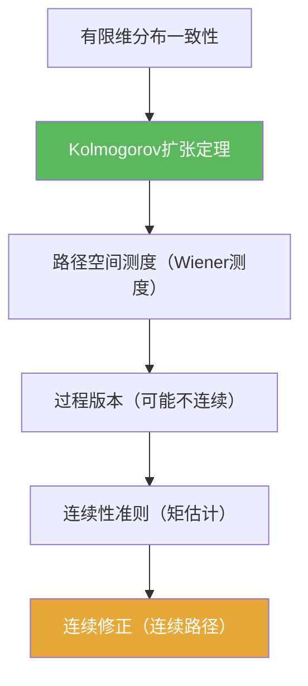

**相关笔记：** [[6.1 框架]] | [[6.3 Brownian运动的构造]] | [[第06章 Brownian运动引论 — 章节汇总]] | 预备：[[Kolmogorov扩张定理]] [[Kolmogorov连续性定理]]

> [!abstract] 概览
> 本节汇总“从有限维分布走到连续路径过程”时最常用的技术件：  
> - 一致性（consistency）：保证有限维分布能拼成路径空间测度（通往 Kolmogorov 扩张）  
> - 连续性准则：从矩估计推出存在连续修正（通往 Kolmogorov 连续性）  
> - 高斯矩估计：把路径模连续性控制在 $|t-s|^{1/2}$ 尺度上  
> - 做题策略：先要“版本”——需要的是连续修正？还是只要有限维分布？

^overview

---

## 一、知识结构总览

---

## 二、核心思想

> [!tip] 方法论：构造=两步走
> 1) **先有测度**：用一致的有限维分布得到路径空间上的概率测度（扩张定理）；  
> 2) **再要连续**：用矩估计 + 连续性定理把“某个版本”升级为“连续版本”。

### 1) 一致性（为什么能拼起来）

> [!def] 有限维分布的一致性（直觉版）
> 给定对每个时间网格 $(t_1,\dots,t_n)$ 的联合分布，若“边缘化掉一个坐标”与较低维分布一致，则称其一致。

> [!thm] Kolmogorov 扩张定理（用途口径）
> 一致的有限维分布族可定义在路径空间上一个概率测度，使得坐标过程具有给定的有限维分布。

### 2) 连续修正（为什么能得到连续路径）

> [!thm] Kolmogorov 连续性定理（用途口径）
> 若存在 $p>0$ 与常数 $C$ 使得
> $$\mathbb E|X_t-X_s|^p\le C|t-s|^{1+\alpha}$$
> （某个 $\alpha>0$）对所有 $s,t$ 成立，则过程存在 Hölder 连续修正（因此存在连续修正）。

> [!example] 高斯增量的矩估计（一句话）
> 对 Brownian 增量 $B_t-B_s\sim N(0,t-s)$，可得 $\mathbb E|B_t-B_s|^p \asymp |t-s|^{p/2}$，因此当 $p>2$ 时可满足连续性定理的指数要求。

---

## 三、补充理解与易混淆点

> [!info] “版本”是什么意思？
> 两个过程版本若对每个固定 $t$ 的随机变量几乎处处相等，则称它们是同一过程的两个版本；连续性定理说的是“存在一个更好的版本”。
>
> 参考（权威外链）：
> - https://en.wikipedia.org/wiki/Modification_(probability_theory)

> [!info] 连续性定理的地位
> 它是从“矩估计”到“路径性质”的桥梁：你不需要构造路径，只需要给出估计。
>
> 参考（权威外链）：
> - https://en.wikipedia.org/wiki/Kolmogorov_continuity_theorem

> [!warning] ❌把“有限维分布唯一”误当“路径唯一”
> ✅ 同一组有限维分布可以对应多个版本；要得到连续路径，需要额外工作（连续性定理）。

> [!warning] ❌在公式里使用“双反斜杠”换行
> ✅ 本库 KaTeX 门禁禁止双反斜杠；需要分行请拆成多个 `$$...$$` 段落。

> [!quote]- 参考（讲义）
> - Construction notes (PDF)：https://people.math.wisc.edu/~roch/teaching_files/275b.1.12w/lect18-web.pdf
> - Brownian motion notes (PDF)：https://www.math.univ-toulouse.fr/~fchapon/files/teaching/M1-BM.pdf

---

## 四、习题精选

> [!todo] 习题概览
> | 题号 | 核心考点 | 难度 |
> |---|---|---|
> | 6.2.A | 一致性（边缘化）检查 | ⭐⭐⭐ |
> | 6.2.B | 用高斯矩估计满足连续性条件 | ⭐⭐⭐⭐ |
> | 6.2.C | 版本/修正的量词理解 | ⭐⭐⭐ |

> [!problem] 练习 6.2.1（一致性）
> 写出“边缘化一致性”的数学表达：从 $(t_1,\dots,t_n)$ 的分布边缘化掉 $t_k$ 后，应与 $(t_1,\dots,\widehat{t_k},\dots,t_n)$ 的分布一致。

> [!faq]- 提示
> 用概率测度的 pushforward 表述：对任意 Borel 集 $A\subset\mathbb R^{n-1}$，两者取值相等。

> [!problem] 练习 6.2.2（高斯矩）
> 设 $Z\sim N(0,\sigma^2)$。说明为何存在常数 $C_p$ 使 $\mathbb E|Z|^p=C_p\sigma^p$，并据此得到 $\mathbb E|B_t-B_s|^p\asymp |t-s|^{p/2}$。

> [!faq]- 提示
> 用缩放：$Z=\sigma Z_0$，其中 $Z_0\sim N(0,1)$，再把 $\sigma^p$ 提出去。

> [!problem] 练习 6.2.3（版本）
> 解释：“存在连续修正”与“原过程连续”有什么区别？写出你认为最关键的一句话。

> [!faq]- 提示
> 连续修正允许你替换成另一版本；原过程只给定每个固定时刻的分布/随机变量，不自动给路径性质。

---

## 五、引用

- 原始材料：![[00-Raw素材/泛函分析/06_第6章_Brownian运动引论/6.2_技巧准备.pdf]]

## 参见 Wiki

- concepts：[[Wiener测度]] [[Brownian运动]]
- theorems：[[Kolmogorov扩张定理]] [[Kolmogorov连续性定理]]
