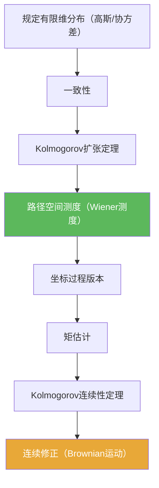

**相关笔记：** [[6.2 技巧准备]] | [[6.4 Brownian运动的进一步的性质]] | [[第06章 Brownian运动引论 — 章节汇总]] | 预备：[[Wiener测度]] [[Kolmogorov扩张定理]] [[Kolmogorov连续性定理]]

> [!abstract] 概览
> 本节回答“Brownian 运动是否真的存在”：用有限维分布拼出路径空间测度（Wiener 测度），再用连续性准则抽出连续版本。
>
> - Step 1：规定所有有限维分布（高斯、协方差 $\min(s,t)$）
> - Step 2：检验一致性 → 用 Kolmogorov 扩张定理得到路径空间上的概率测度
> - Step 3：用增量矩估计 + Kolmogorov 连续性定理得到连续修正
> - 最终产物：在 $C([0,\infty))$ 上的 Wiener 测度与坐标过程

^overview

---

## 一、知识结构总览

---

## 二、核心思想

> [!tip] 你需要会复述的“构造三句半”
> 1) 先在每个时间网格上定义一个高斯向量的分布；  
> 2) 检查这些分布在边缘化下相容；  
> 3) 用扩张定理得到路径空间测度；  
> 4) 再用连续性定理把版本升级成连续路径。

### 1) 有限维分布怎么规定

> [!def] Brownian 的有限维分布（提示性）
> 对 $0<t_1<\cdots<t_n$，令向量 $(B_{t_1},\dots,B_{t_n})$ 为均值 0 的高斯向量，协方差矩阵
> $$\Sigma_{ij}=\min(t_i,t_j).$$

### 2) 一致性与扩张（从网格到路径）

> [!thm] Kolmogorov 扩张定理（使用口径）
> 若有限维分布族满足一致性，则存在路径空间上的概率测度，使得坐标过程具有这些有限维分布。

> [!example] 一致性检查的典型写法
> “删掉一个坐标后得到的边缘分布”必须等于较低维时间网格上事先指定的分布；高斯向量的边缘仍为高斯，因此一致性通常可用协方差矩阵的子矩阵来验证。

### 3) 连续修正（从测度到连续路径）

> [!thm] Kolmogorov 连续性定理（使用口径）
> 用增量矩估计推出过程存在 Hölder 连续修正，从而得到连续路径 Brownian 运动。

> [!tip] 关键估计的形状
> Brownian 增量满足 $\mathbb E|B_t-B_s|^p \asymp |t-s|^{p/2}$；取 $p>2$ 即可满足连续性定理的指数要求。

---

## 三、补充理解与易混淆点

> [!info] Wiener 测度是什么？
> 它是定义在 $C([0,\infty))$（或 $C([0,T])$）上的概率测度，使得坐标映射 $\omega\mapsto \omega(t)$ 形成 Brownian 运动。
>
> 参考（权威外链）：
> - https://en.wikipedia.org/wiki/Wiener_measure

> [!info] 为什么要分两步（扩张→连续）？
> 扩张定理只保证存在某个版本，其路径性质可能很差；连续性定理才负责把“矩信息”变成“路径连续”。
>
> 参考（权威外链）：
> - https://en.wikipedia.org/wiki/Kolmogorov_extension_theorem

> [!warning] ❌不要把“过程等分布”当成“路径逐点相等”
> ✅ 构造阶段首先得到的是“分布层面的对象”；路径性质与版本问题必须单独处理。

> [!warning] ❌把连续性当成“显然”
> ✅ Brownian 的连续性来自非平凡的估计与定理（Kolmogorov 连续性/紧性抽取等），不是定义自动给出的。

> [!quote]- 参考（讲义）
> - Construction notes (PDF)：https://people.math.wisc.edu/~roch/teaching_files/275b.1.12w/lect18-web.pdf
> - Brownian motion notes (PDF)：https://www.math.univ-toulouse.fr/~fchapon/files/teaching/M1-BM.pdf

---

## 四、习题精选

> [!todo] 习题概览
> | 题号 | 核心考点 | 难度 |
> |---|---|---|
> | 6.3.A | 高斯有限维分布的一致性 | ⭐⭐⭐⭐ |
> | 6.3.B | 连续性定理的矩估计 | ⭐⭐⭐⭐ |
> | 6.3.C | Wiener 测度的坐标过程理解 | ⭐⭐⭐ |

> [!problem] 练习 6.3.1（边缘仍高斯）
> 说明：高斯向量的任意子向量仍是高斯向量，并且其协方差矩阵是原协方差矩阵的子矩阵。

> [!faq]- 提示
> 用特征函数或线性变换刻画：任何线性组合仍为正态；子向量等价于投影线性变换。

> [!problem] 练习 6.3.2（连续性估计的指数）
> 已知 $\mathbb E|B_t-B_s|^p=C_p|t-s|^{p/2}$。问：要满足 Kolmogorov 连续性定理，你至少需要 $p$ 多大？并说明理由。

> [!faq]- 提示
> 需要 $p/2>1$ 才能提供“多出一点”的指数余量，即 $p>2$。

> [!problem] 练习 6.3.3（坐标过程）
> 在 $C([0,T])$ 上，令 $X_t(\omega)=\omega(t)$。解释：给定 Wiener 测度后，“$X_t$ 是 Brownian 运动”这句话是什么意思？

> [!faq]- 提示
> 它指的是坐标过程的有限维分布满足 Brownian 的规定，并且在 $C([0,T])$ 上路径连续是内建的。

---

## 五、引用

- 原始材料：![[00-Raw素材/泛函分析/06_第6章_Brownian运动引论/6.3_Brownian运动的构造.pdf]]

## 参见 Wiki

- concepts：[[Wiener测度]] [[Brownian运动]] [[随机过程]]
- theorems：[[Kolmogorov扩张定理]] [[Kolmogorov连续性定理]]

