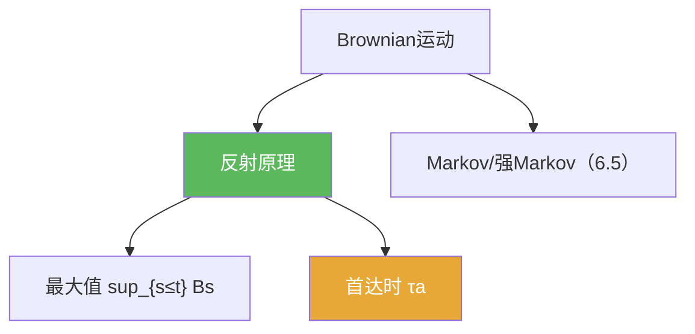

**相关笔记：** [[6.3 Brownian运动的构造]] | [[6.5 停时和强Markov性质]] | [[第06章 Brownian运动引论 — 章节汇总]] | 预备：[[反射原理]] [[停时]]

> [!abstract] 概览
> 本节把 Brownian 运动从“存在”推进到“可计算/可用”：用==反射原理==与 Markov 思想计算最大值与首达时等典型量。
>
> - 反射原理：把“越过某水平”的路径映射成另一条路径，进而计算概率
> - 最大值分布：$\sup_{s\le t}B_s$ 与 $B_t$ 的关系
> - 首达时：$\tau_a=\inf\{t:B_t=a\}$ 的分布/尾概率（做题高频）
> - 典型组合：反射原理 + 强 Markov（下一节）解决更复杂的停时题

^overview

---

## 一、知识结构总览

---

## 二、核心思想

> [!tip] 方法论：遇到“越过水平/最大值”就想反射
> 这类题往往把事件写成
> $$\{\sup_{s\le t}B_s\ge a\}$$
> 然后用反射原理把它与 $\{B_t\ge a\}$ 联系起来，从而把“路径事件”转成“单时刻正态尾概率”。

### 1) 反射原理（口径提示）

> [!thm] 反射原理（提示性表述）
> 对 $a>0$，有
> $$\mathbb P\Big(\sup_{0\le s\le t}B_s\ge a\Big)=2\,\mathbb P(B_t\ge a).$$

> [!example] 由此得到最大值的分布函数
> 由于 $B_t\sim N(0,t)$，可把右侧写成正态分布函数的尾概率，从而得到 $\sup_{s\le t}B_s$ 的分布。

### 2) 首达时（把“第一次到达”变成“最大值越过”）

> [!def] 首达时
> $$\tau_a:=\inf\{t\ge 0: B_t=a\}.$$

> [!tip] 关键等价
> $\{\tau_a\le t\}$ 与 $\{\sup_{s\le t}B_s\ge a\}$ 是同一事件，因此首达时的分布可由最大值分布得到。

---

## 三、补充理解与易混淆点

> [!info] 为什么反射原理这么强？
> 因为 Brownian 增量是对称高斯，且路径连续；“越过水平后的那段路径”可以镜像反射，从而得到一一对应的概率守恒。
>
> 参考（权威外链）：
> - https://en.wikipedia.org/wiki/Reflection_principle_(Wiener_process)

> [!info] 首达时的直觉
> 对 Brownian，首达时具有重尾（没有有限期望的情形会出现）；做题时更常用的是其分布函数/尾概率表达。
>
> 参考（权威外链）：
> - https://en.wikipedia.org/wiki/First-hitting_time

> [!warning] ❌把“最大值”当成“单时刻值”
> ✅ 最大值是路径函数；反射原理正是把路径事件转成单时刻事件的桥梁。

> [!warning] ❌忽略路径连续性
> ✅ 事件 $\{\tau_a\le t\}\Leftrightarrow \{\sup_{s\le t}B_s\ge a\}$ 用到了路径连续性；在跳过程里不再成立。

> [!quote]- 参考（讲义）
> - Brownian motion notes (PDF)：https://www.math.univ-toulouse.fr/~fchapon/files/teaching/M1-BM.pdf
> - Strong Markov notes (PDF)：https://mathweb.ucsd.edu/~pfitz/downloads/courses/spring03/math280c/strmark.pdf

---

## 四、习题精选

> [!todo] 习题概览
> | 题号 | 核心考点 | 难度 |
> |---|---|---|
> | 6.4.A | 反射原理计算最大值 | ⭐⭐⭐⭐ |
> | 6.4.B | 首达时事件改写 | ⭐⭐⭐ |
> | 6.4.C | 最大值与尾概率表达 | ⭐⭐⭐⭐ |

> [!problem] 练习 6.4.1（最大值公式）
> 用反射原理证明：$\mathbb P(\sup_{s\le t}B_s\ge a)=2\mathbb P(B_t\ge a)$。

> [!faq]- 提示
> 对“第一次越过水平 $a$ 的时刻”之后的路径做镜像反射，建立与 $\{B_t\le -a\}$ 的对应。

> [!problem] 练习 6.4.2（首达时分布）
> 证明 $\mathbb P(\tau_a\le t)=\mathbb P(\sup_{s\le t}B_s\ge a)$，并把它写成正态尾概率。

> [!faq]- 提示
> 由连续性：到达 $a$ 等价于最大值超过 $a$；再套 6.4 的最大值公式。

> [!problem] 练习 6.4.3（尺度检验）
> 设 $B_t\sim N(0,t)$。说明 $B_t/\sqrt t$ 的分布与 $t$ 无关，并解释这体现了 Brownian 的缩放性质。

> [!faq]- 提示
> 正态缩放：若 $Z\sim N(0,1)$，则 $\sqrt t Z\sim N(0,t)$；反过来 $B_t/\sqrt t\sim N(0,1)$。

---

## 五、引用

- 原始材料：![[00-Raw素材/泛函分析/06_第6章_Brownian运动引论/6.4_Brownian运动的进一步的性质.pdf]]

## 参见 Wiki

- concepts：[[Brownian运动]] [[停时]]
- theorems：[[反射原理]]

