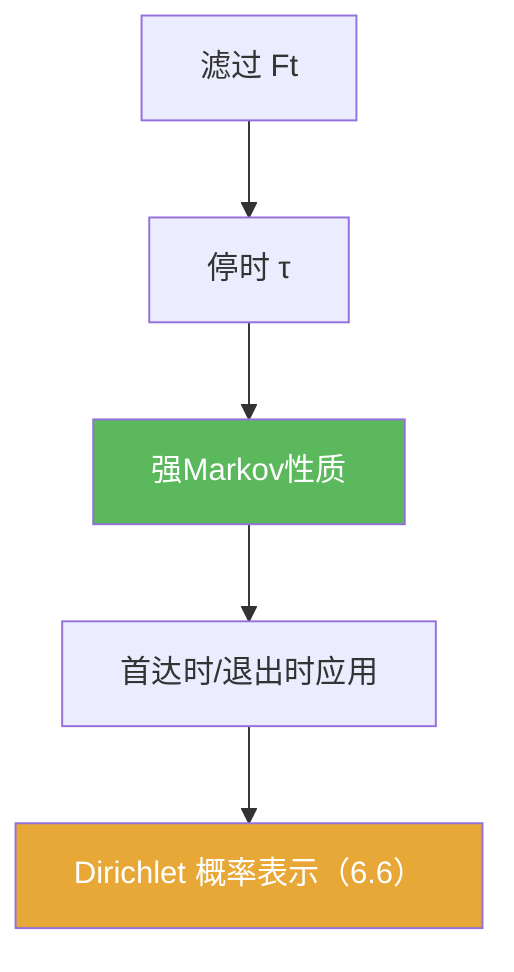

**相关笔记：** [[6.4 Brownian运动的进一步的性质]] | [[6.6 Dirichlet问题的解]] | [[第06章 Brownian运动引论 — 章节汇总]] | 预备：[[停时]] [[滤过]] [[强Markov性质]]

> [!abstract] 概览
> 本节把 Markov 性质升级到“随机时刻”：==强 Markov 性质==允许你在停时 $\tau$ 处把过程“切开重启”。  
> 这是做题最常用的结构性武器之一：首达时、退出时、反射原理的深度用法都要靠它闭环。
>
> - 停时：事件“$\tau\le t$”只依赖 $\mathcal F_t$ 的信息
> - 强 Markov：给定停时 $\tau$，过程 $(B_{\tau+t}-B_\tau)_{t\ge0}$ 在条件下仍是 Brownian 且与过去独立
> - 典型应用：首达时后“重新开始”；拼接路径；计算出口分布（通向 6.6）

^overview

---

## 一、知识结构总览

---

## 二、核心思想

> [!tip] 方法论：在停时处“切开重启”
> 遇到“第一次到达/第一次退出/随机时刻之后”的题，第一反应是：
> 1) 把随机时刻定义成停时；  
> 2) 用强 Markov 把“之后的部分”替换成一条独立的 Brownian；  
> 3) 把复杂路径问题转成条件化后的普通 Markov 计算。

### 1) 停时与自然滤过

> [!def] 停时（stopping time）
> 相对于滤过 $\{\mathcal F_t\}$，随机变量 $\tau:\Omega\to[0,\infty]$ 称为停时，如果对任意 $t$，
> $$\{\tau\le t\}\in\mathcal F_t.$$

> [!example] 首达时是停时
> $\tau_a=\inf\{t:B_t=a\}$ 满足 $\{\tau_a\le t\}=\{\sup_{s\le t}B_s\ge a\}\in\mathcal F_t$（由路径连续性与 $\mathcal F_t$ 的定义）。

### 2) 强 Markov 性质（使用口径）

> [!thm] 强Markov性质（提示性表述）
> 设 $B_t$ 是 Brownian 运动，$\tau$ 为相对于其自然滤过的停时。则条件于 $\mathcal F_\tau$，过程
> $$\widetilde B_t:=B_{\tau+t}-B_\tau$$
> 仍是 Brownian 运动，且与 $\mathcal F_\tau$ 独立。

---

## 三、补充理解与易混淆点

> [!info] “停时”为什么叫“可停”？
> 因为在时刻 $t$ 你能否判断“已经停了”（即 $\tau\le t$）只用到当前时刻的信息，不需要未来信息。
>
> 参考（权威外链）：
> - https://en.wikipedia.org/wiki/Stopping_time

> [!info] 强 Markov 的直觉
> Brownian 没有记忆：不但在固定时刻“未来增量与过去独立”，在随机时刻（只依赖过去的规则）也成立。
>
> 参考（权威外链）：
> - https://en.wikipedia.org/wiki/Markov_property

> [!warning] ❌“随机时刻”不一定是停时
> ✅ 若 $\tau$ 用到了未来信息（例如“最后一次到达 0 的时刻”），它通常不是停时，强 Markov 不能直接用。

> [!warning] ❌把“条件独立”写成“无条件独立”
> ✅ 强 Markov 的表述常带有“条件于 $\mathcal F_\tau$”；做题时要注意你在算的是条件概率还是边缘概率。

> [!quote]- 参考（讲义）
> - Strong Markov property notes (PDF)：https://mathweb.ucsd.edu/~pfitz/downloads/courses/spring03/math280c/strmark.pdf
> - Brownian motion notes (PDF)：https://www.math.univ-toulouse.fr/~fchapon/files/teaching/M1-BM.pdf

---

## 四、习题精选

> [!todo] 习题概览
> | 题号 | 核心考点 | 难度 |
> |---|---|---|
> | 6.5.A | 验证某随机时刻是停时 | ⭐⭐⭐ |
> | 6.5.B | 用强 Markov 重启过程 | ⭐⭐⭐⭐ |
> | 6.5.C | 首达时后拼接/分解计算 | ⭐⭐⭐⭐ |

> [!problem] 练习 6.5.1（停时检验）
> 说明：$\tau_a=\inf\{t:B_t=a\}$ 是停时。

> [!faq]- 提示
> 写 $\{\tau_a\le t\}=\{\sup_{s\le t}B_s\ge a\}$，右侧只依赖 $[0,t]$ 的路径信息。

> [!problem] 练习 6.5.2（重启）
> 设 $\tau$ 为停时。写出强 Markov 性质给出的“重启过程” $\widetilde B_t=B_{\tau+t}-B_\tau$ 的两个结论：分布与独立性。

> [!faq]- 提示
> 条件于 $\mathcal F_\tau$，$\widetilde B$ 是标准 Brownian；并与 $\mathcal F_\tau$ 独立（因此未来与过去断开）。

> [!problem] 练习 6.5.3（首达时之后）
> 设 $\tau_a$ 为首达时。用强 Markov 解释：从时刻 $\tau_a$ 开始，过程“看起来像”从 0 出发的 Brownian（再加上起点平移）。

> [!faq]- 提示
> 写 $B_{\tau_a+t}-B_{\tau_a}$ 是 Brownian；再用 $B_{\tau_a}=a$ 得到 $B_{\tau_a+t}=a+\widetilde B_t$。

---

## 五、引用

- 原始材料：![[00-Raw素材/泛函分析/06_第6章_Brownian运动引论/6.5_停时和强Markov性质.pdf]]

## 参见 Wiki

- concepts：[[停时]] [[滤过]] [[Brownian运动]]
- theorems：[[强Markov性质]]

