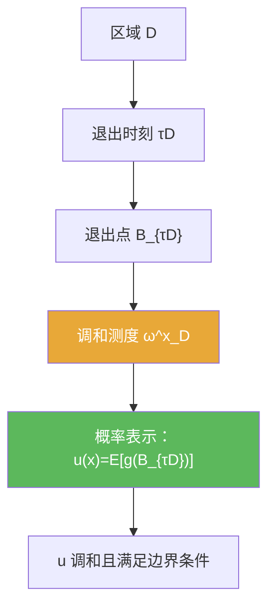

**相关笔记：** [[6.5 停时和强Markov性质]] | [[6.7 习题]] | [[第06章 Brownian运动引论 — 章节汇总]] | 预备：[[调和函数]] [[调和测度]] [[Dirichlet问题]]

> [!abstract] 概览
> 本节把 Brownian 运动与经典 PDE 边值问题连接起来：在区域 $D$ 内的 Brownian 退出分布给出 Dirichlet 问题解的概率表示（调和测度）。
>
> - Dirichlet 问题：在区域内调和，边界取给定值
> - 退出时刻 $\tau_D$ 与退出点 $B_{\tau_D}$
> - 调和测度：边界数据通过退出分布“平均”进来
> - 做题姿势：把 PDE 问题转成“出口分布的期望”并用强 Markov/停时工具箱处理

^overview

---

## 一、知识结构总览

---

## 二、核心思想

> [!tip] 方法论：把“边界值”变成“停时的期望”
> Dirichlet 问题里最关键的动作是：  
> **把边界函数 $g$ 拉回到 Brownian 的退出点上**，写成 $g(B_{\tau_D})$，再取期望得到区域内的函数 $u(x)$。

### 1) Dirichlet 问题（提示性表述）

> [!def] Dirichlet 问题（直觉版）
> 给定区域 $D\subset\mathbb R^d$ 与边界函数 $g$，求函数 $u$ 满足：
> - $u$ 在 $D$ 内调和（$\Delta u=0$）  
> - $u|_{\partial D}=g$（按合适意义取边界值）

### 2) 出口分布与调和测度

> [!def] 退出时刻与退出点
> $$\tau_D:=\inf\{t\ge 0: B_t\notin D\},\qquad B_{\tau_D}\in \partial D\ (\text{典型情形}).$$

> [!def] 调和测度（直觉）
> $\omega_D^x$ 是从 $x$ 出发的 Brownian 在退出时刻落到边界的分布：  
> $$\omega_D^x(A)=\mathbb P^x(B_{\tau_D}\in A),\qquad A\subset\partial D.$$

> [!thm] 概率表示（Dirichlet 的概率解，提示性表述）
> 设 $g$ 足够好，则
> $$u(x):=\mathbb E^x[g(B_{\tau_D})]$$
> 给出 Dirichlet 问题的解，并且 $u$ 在 $D$ 内调和。

---

## 三、补充理解与易混淆点

> [!info] 为什么 $u$ 会调和？
> 直觉：Brownian 的小时间增量“各向同性”，使得 $u(x)$ 满足均值性质（harmonic mean value property），从而调和。
>
> 参考（权威外链）：
> - https://en.wikipedia.org/wiki/Dirichlet_problem

> [!info] 调和测度是什么“测度”？
> 它是边界上的概率测度（对每个起点 $x$ 都不同）；它把边界数据映射成区域内调和函数。
>
> 参考（权威外链）：
> - https://en.wikipedia.org/wiki/Harmonic_measure

> [!warning] ❌不要忽略“边界取值”的精确含义
> ✅ 在一般区域上，$u|_{\partial D}=g$ 需要合适的逼近/极限解释（教材会给出足够条件；本节先掌握概率表示的主线）。

> [!warning] ❌把 $\tau_D$ 当作固定时间
> ✅ $\tau_D$ 是停时；需要用强 Markov/停时工具处理它的性质与条件化。

> [!quote]- 参考（讲义）
> - Strong Markov notes (PDF)：https://mathweb.ucsd.edu/~pfitz/downloads/courses/spring03/math280c/strmark.pdf
> - Brownian motion notes (PDF)：https://www.math.univ-toulouse.fr/~fchapon/files/teaching/M1-BM.pdf

---

## 四、习题精选

> [!todo] 习题概览
> | 题号 | 核心考点 | 难度 |
> |---|---|---|
> | 6.6.A | 退出时刻/出口分布的定义理解 | ⭐⭐⭐ |
> | 6.6.B | 概率表示的写作模板 | ⭐⭐⭐⭐ |
> | 6.6.C | 用强 Markov 做出口分布分解 | ⭐⭐⭐⭐ |

> [!problem] 练习 6.6.1（停时）
> 证明 $\tau_D=\inf\{t:B_t\notin D\}$ 是相对于自然滤过的停时。

> [!faq]- 提示
> 写 $\{\tau_D\le t\}=\{\exists s\le t,\ B_s\notin D\}$，用路径连续性与可测性把它写成可数并/交的形式并落到 $\mathcal F_t$。

> [!problem] 练习 6.6.2（概率表示的形式）
> 给定边界函数 $g$，写出候选解 $u(x)=\mathbb E^x[g(B_{\tau_D})]$，并解释它为何满足“边界数据被平均进来”的直觉。

> [!faq]- 提示
> $B_{\tau_D}$ 的分布就是调和测度 $\omega_D^x$；因此 $u(x)=\int_{\partial D} g(\xi)\,d\omega_D^x(\xi)$ 是边界值的加权平均。

> [!problem] 练习 6.6.3（强 Markov 的使用）
> 设 $D$ 分成两段退出（例如先出小球再出大域）。说明你会如何用强 Markov 把 $g(B_{\tau_D})$ 的期望分解成两步条件期望。

> [!faq]- 提示
> 在第一个退出停时 $\tau_{D_1}$ 处重启：条件于 $\mathcal F_{\tau_{D_1}}$，之后的过程从 $B_{\tau_{D_1}}$ 开始独立演化。

---

## 五、引用

- 原始材料：![[00-Raw素材/泛函分析/06_第6章_Brownian运动引论/6.6_Dirichlet问题的解.pdf]]

## 参见 Wiki

- concepts：[[Dirichlet问题]] [[调和函数]] [[调和测度]] [[停时]]
- theorems：[[强Markov性质]] [[Dirichlet问题的概率表示定理]]

