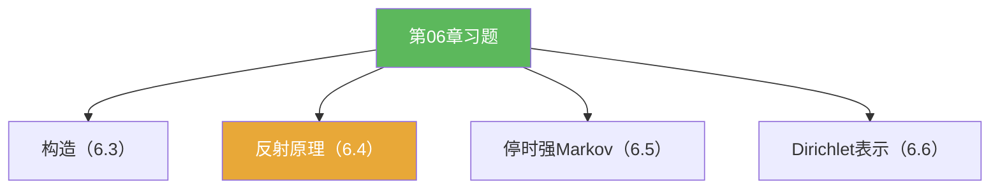

**相关笔记：** [[6.6 Dirichlet问题的解]] | [[6.8 问题]] | [[第06章 Brownian运动引论 — 章节汇总]] | 回链：[[6.4 Brownian运动的进一步的性质]] [[6.5 停时和强Markov性质]]

> [!abstract] 概览
> 本节把第06章的高频题型压缩成“套路地图”：
> - 构造题：一致性 + 扩张 + 连续修正  
> - 计算题：反射原理 / 最大值 / 首达时  
> - 结构题：停时 + 强 Markov 的重启  
> - PDE 题：出口分布 + 调和测度（概率表示）

^overview

---

## 一、知识结构总览

---

## 二、核心思想（题型套路清单）

> [!tip] 套路 1：路径事件→单时刻事件
> 一旦出现 $\sup_{s\le t}B_s$ 或“第一次越过”，优先尝试反射原理把它改写成关于 $B_t$ 的尾概率。

> [!tip] 套路 2：停时题先验“是否为停时”
> 先把 $\{\tau\le t\}$ 写成只依赖 $[0,t]$ 路径的事件；通过可数并/交落到 $\mathcal F_t$。

> [!tip] 套路 3：PDE 表示题先写出口期望
> 先写 $u(x)=\mathbb E^x[g(B_{\tau_D})]$，再讨论其调和性/边界条件（必要时用强 Markov 分解）。

---

## 三、补充理解与易混淆点

> [!info] 这章的“计算核心”
> 反射原理与强 Markov 是最常被调用的两个模块：一个把路径事件转成尾概率，一个把随机时刻之后“重启”。
>
> 参考（权威外链）：
> - https://en.wikipedia.org/wiki/Reflection_principle_(Wiener_process)

> [!warning] ❌把“定理记住”当成“题就会了”
> ✅ 本章题目更像“结构题”：要求你能识别该切分在哪里、该条件化在哪里。

> [!quote]- 参考
> - Strong Markov notes (PDF)：https://mathweb.ucsd.edu/~pfitz/downloads/courses/spring03/math280c/strmark.pdf
> - Harmonic measure (Wikipedia)：https://en.wikipedia.org/wiki/Harmonic_measure

---

## 四、习题精选

> [!todo] 习题概览
> | 题号 | 覆盖内容 | 难度 |
> |---|---|---|
> | 6.7.A | 反射原理与最大值/首达时 | ⭐⭐⭐⭐ |
> | 6.7.B | 强 Markov 的重启分解 | ⭐⭐⭐⭐ |
> | 6.7.C | Dirichlet 概率表示写作模板 | ⭐⭐⭐⭐ |

> [!problem] 练习 6.7.1（反射原理应用）
> 用反射原理把 $\mathbb P(\sup_{s\le t}B_s\ge a)$ 写成关于正态尾概率的表达式。

> [!faq]- 提示
> 套用 $\mathbb P(\sup_{s\le t}B_s\ge a)=2\mathbb P(B_t\ge a)$ 且 $B_t\sim N(0,t)$。

> [!problem] 练习 6.7.2（强 Markov 拼接）
> 设 $\tau$ 为停时。写出你会如何把 $\mathbb E[f(B_{\tau+t})]$ 分解成条件于 $\mathcal F_\tau$ 的表达式，并指出强 Markov 在哪一步使用。

> [!faq]- 提示
> 写 $\mathbb E[\mathbb E(f(B_{\tau+t})\mid\mathcal F_\tau)]$，并用 $B_{\tau+t}=B_\tau+\widetilde B_t$（$\widetilde B$ 独立 Brownian）。

> [!problem] 练习 6.7.3（Dirichlet 候选解）
> 给定区域 $D$ 与边界函数 $g$，写出候选解 $u(x)=\mathbb E^x[g(B_{\tau_D})]$，并说明它为什么“天然”满足边界平均直觉。

> [!faq]- 提示
> 引入调和测度 $\omega_D^x$：$u(x)=\int_{\partial D} g(\xi)\,d\omega_D^x(\xi)$。

---

## 五、引用

- 原始材料：![[00-Raw素材/泛函分析/06_第6章_Brownian运动引论/6.7_习题.pdf]]

## 参见 Wiki

- concepts：[[Brownian运动]] [[停时]] [[调和测度]]
- theorems：[[反射原理]] [[强Markov性质]] [[Dirichlet问题的概率表示定理]]
