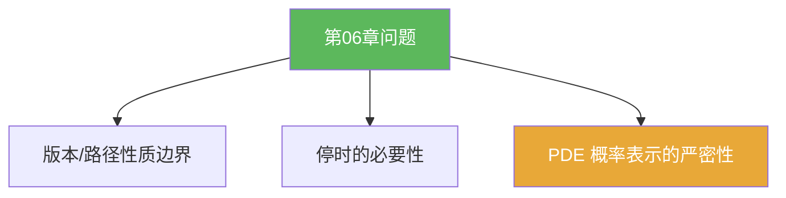

**相关笔记：** [[6.7 习题]] | [[第06章 Brownian运动引论 — 章节汇总]] | 回链：[[6.3 Brownian运动的构造]] [[6.6 Dirichlet问题的解]]

> [!abstract] 概览
> 本节用于建立“结构边界感”：  
> - 仅有限维分布能否决定路径性质？  
> - 为什么强 Markov 必须是停时？  
> - Dirichlet 概率表示的“可逆性”在哪里（调和性/边界条件的严格性）？  
> 这些问题更偏“解释型”，但要求你能给出清晰的逻辑链而不是口号。

^overview

---

## 一、知识结构总览

---

## 二、核心思想（回答模板）

> [!tip] 回答结构建议
> 1) 指出用到的对象与语言：有限维分布/版本/滤过/停时/出口分布  
> 2) 明确哪一步需要“只用过去信息”（停时）或“矩估计”（连续性）  
> 3) 给出能落到公式/事件上的关键一步（例如：$\{\tau\le t\}\in\mathcal F_t$、$u(x)=\mathbb E^x[g(B_{\tau_D})]$）

---

## 三、补充理解与易混淆点

> [!info] 版本问题是随机过程里最常被忽视的坑
> “同一组有限维分布”并不自动给出连续路径；连续性来自额外定理（例如 Kolmogorov 连续性）。
>
> 参考（权威外链）：
> - https://en.wikipedia.org/wiki/Modification_(probability_theory)

> [!warning] ❌“任意随机时刻都能用强 Markov”
> ✅ 强 Markov 需要停时；若随机时刻用到了未来信息，通常不成立。

> [!quote]- 参考
> - Strong Markov notes (PDF)：https://mathweb.ucsd.edu/~pfitz/downloads/courses/spring03/math280c/strmark.pdf
> - Harmonic measure (Wikipedia)：https://en.wikipedia.org/wiki/Harmonic_measure

---

## 四、习题精选

> [!todo] 问题概览
> | 题号 | 方向 | 难度 |
> |---|---|---|
> | 6.8.A | 有限维分布 vs 路径连续性 | ⭐⭐⭐⭐ |
> | 6.8.B | 停时的边界与反例意识 | ⭐⭐⭐⭐ |
> | 6.8.C | Dirichlet 概率表示的严密性 | ⭐⭐⭐⭐ |

> [!problem] 问题 6.8.1（为何需要连续性定理）
> 解释：为什么“用扩张定理得到的过程”还需要额外步骤才能得到连续路径？请指出关键缺口在哪里。

> [!faq]- 提示
> 扩张定理只给出有限维分布一致的版本；路径性质（连续/Hölder）需要矩估计 + 连续性定理来保证存在更好的修正。

> [!problem] 问题 6.8.2（非停时的反例意识）
> 给出一个你认为“用到了未来信息”的随机时刻例子，并说明为何它通常不是停时（写出 $\{\tau\le t\}$ 为什么不在 $\mathcal F_t$）。

> [!faq]- 提示
> 例如“最后一次到达某点的时刻”；判断它需要知道未来是否还会再次到达。

> [!problem] 问题 6.8.3（概率表示的两端）
> 解释：若令 $u(x)=\mathbb E^x[g(B_{\tau_D})]$，要把它变成 Dirichlet 问题的解，你觉得必须额外验证哪两件事？

> [!faq]- 提示
> 需要验证：$u$ 在 $D$ 内调和（或满足均值性质）；并且边界条件 $u|_{\partial D}=g$ 以合适方式成立（连续延拓/正则边界点等）。

---

## 五、引用

- 原始材料：![[00-Raw素材/泛函分析/06_第6章_Brownian运动引论/6.8_问题.pdf]]

## 参见 Wiki

- concepts：[[Wiener测度]] [[停时]] [[调和测度]] [[Dirichlet问题]]
- theorems：[[强Markov性质]] [[Dirichlet问题的概率表示定理]]
