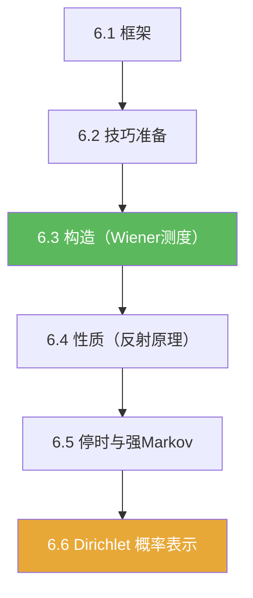

# 第06章 Brownian运动引论 — 章节汇总

**相关笔记：** [[第05章 概率论基础 — 章节汇总]] | [[泛函分析/index]] | [[Wiki/index]]

> [!abstract] 概览
> 本章把概率论的“独立和极限”升级为随机过程的核心模型：==Brownian 运动==。  
> 学习主线：定义与框架（6.1）→ 技巧准备（6.2）→ 构造（6.3）→ 计算性质（6.4）→ 停时强 Markov（6.5）→ Dirichlet 概率表示（6.6）。

^overview

---

## 一、知识结构总览

---

## 二、各节入口（学习路线）

| 节 | 主题 | 你应带走的“可复用套路/结论” |
|---|---|---|
| [[6.1 框架]] | 定义与协方差 | 增量视角；$\mathbb E[B_sB_t]=\min(s,t)$；高斯过程身份证 |
| [[6.2 技巧准备]] | 扩张与连续 | “先扩张后连续”：一致性→扩张；矩估计→连续修正 |
| [[6.3 Brownian运动的构造]] | Wiener 测度 | 有限维分布→路径测度→连续版本 |
| [[6.4 Brownian运动的进一步的性质]] | 可计算性质 | 反射原理；最大值/首达时的典型改写 |
| [[6.5 停时和强Markov性质]] | 结构工具箱 | 停时检验；强 Markov 重启；首达时后的拼接 |
| [[6.6 Dirichlet问题的解]] | PDE 概率表示 | 退出时刻/出口分布；调和测度；$u(x)=\mathbb E^x[g(B_{\tau_D})]$ |
| [[6.7 习题]] | 训练题地图 | 构造/反射/停时/Dirichlet 四类题型清单 |
| [[6.8 问题]] | 结构边界感 | 版本问题、停时必要性、概率表示的严密性 |

---

## 三、自测清单（逐条打勾）

- [ ] 我能写出 Brownian 运动的定义并解释“独立增量 vs 值不独立”。  
- [ ] 我能推导 $\mathbb E[B_sB_t]=\min(s,t)$ 并用它写有限维协方差矩阵。  
- [ ] 我能复述“扩张→连续修正”的两步构造逻辑。  
- [ ] 我能把最大值/首达时事件改写成反射原理可用的形式。  
- [ ] 我能判断一个随机时刻是否为停时，并能说清“只用过去信息”的位置。  
- [ ] 我能写出 Dirichlet 的概率候选解 $u(x)=\mathbb E^x[g(B_{\tau_D})]$ 并解释调和测度。  

---

## 四、各节概览（快速回看）

- ![[6.1 框架#^overview]]
- ![[6.2 技巧准备#^overview]]
- ![[6.3 Brownian运动的构造#^overview]]
- ![[6.4 Brownian运动的进一步的性质#^overview]]
- ![[6.5 停时和强Markov性质#^overview]]
- ![[6.6 Dirichlet问题的解#^overview]]

---

## 五、本章索引（Wiki 导航）

**节笔记：** [[6.1 框架]] | [[6.2 技巧准备]] | [[6.3 Brownian运动的构造]] | [[6.4 Brownian运动的进一步的性质]] | [[6.5 停时和强Markov性质]] | [[6.6 Dirichlet问题的解]] | [[6.7 习题]] | [[6.8 问题]]

**concepts（待编译）：** [[Brownian运动]] [[随机过程]] [[滤过]] [[停时]] [[Wiener测度]] [[调和函数]] [[调和测度]] [[Dirichlet问题]]

**theorems（待编译）：** [[Kolmogorov扩张定理]] [[Kolmogorov连续性定理]] [[反射原理]] [[强Markov性质]] [[Dirichlet问题的概率表示定理]]

---

## 六、引用（PDF）

![[00-Raw素材/泛函分析/06_第6章_Brownian运动引论/6.1_框架.pdf]]
![[00-Raw素材/泛函分析/06_第6章_Brownian运动引论/6.2_技巧准备.pdf]]
![[00-Raw素材/泛函分析/06_第6章_Brownian运动引论/6.3_Brownian运动的构造.pdf]]
![[00-Raw素材/泛函分析/06_第6章_Brownian运动引论/6.4_Brownian运动的进一步的性质.pdf]]
![[00-Raw素材/泛函分析/06_第6章_Brownian运动引论/6.5_停时和强Markov性质.pdf]]
![[00-Raw素材/泛函分析/06_第6章_Brownian运动引论/6.6_Dirichlet问题的解.pdf]]
![[00-Raw素材/泛函分析/06_第6章_Brownian运动引论/6.7_习题.pdf]]
![[00-Raw素材/泛函分析/06_第6章_Brownian运动引论/6.8_问题.pdf]]
