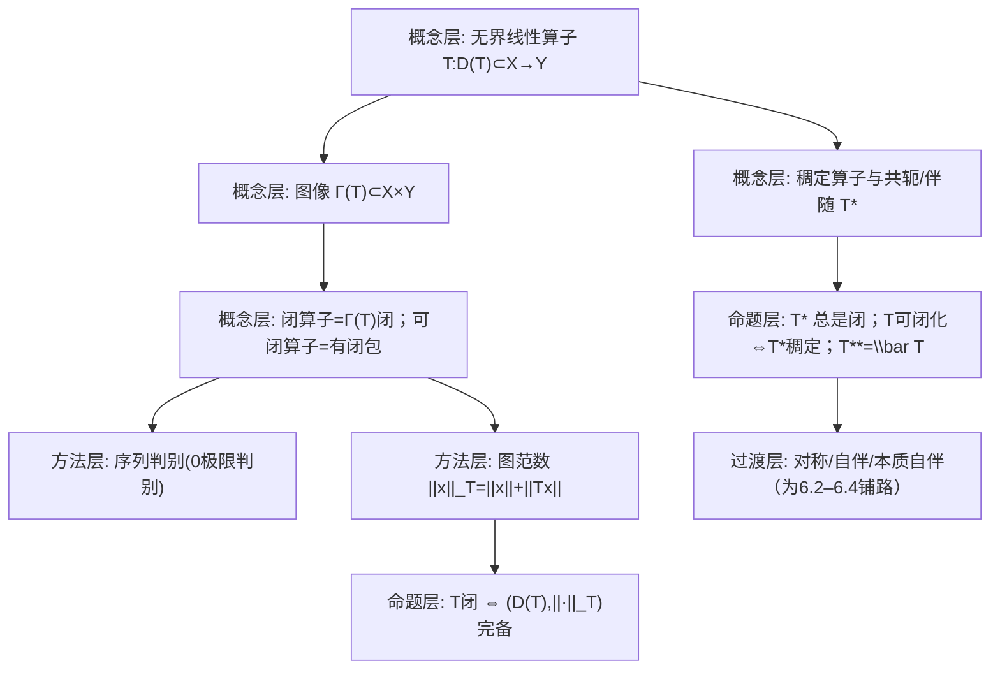

**相关笔记：** （上章）[[5.6 在奇异积分算子中的应用]]｜[[6.2 Cayley变换与自伴算子的谱分解]]｜[[第06章 无界算子 — 章节汇总]]

> [!abstract] 概览
> 本节建立“无界算子”的第一道门禁：**闭算子/可闭算子**。关键点是：无界算子的核心困难来自 **定义域 $D(T)$** 与“极限是否仍落在图像里”。  
> - 通过图像 $\Gamma(T)\subset X\times Y$ 给出“闭”的定义，并给出序列判别。  
> - 引入 **图范数**（graph norm），把“闭”转化成“$D(T)$ 在图范数下完备”。  
> - 对稠定算子定义共轭算子（Hilbert 情形即伴随算子）$T^*$，并建立：$T^*$ 总是闭；可闭化与 $T^*$ 稠定性相关；进而引入对称/自伴/本质自伴。  
> - 两个典型例子：$-\frac{d^2}{dt^2}$ 与一般椭圆型微分算子（说明：对称 ≠ 自伴；闭包域通常是 Sobolev 空间）。  
> ^overview

---

# 1. 本节主题定位

- **本节的核心问题**
  1) 对无界线性算子 $T:D(T)\subset X\to Y$，“极限过程”如何描述？什么时候 $T$ 是“对极限稳定”的？  
  2) “闭”为什么是无界算子理论里替代“连续性”的最关键性质？  
  3) 可闭算子为什么是“可修复”的：通过取闭包 $\overline T$ 把它升级为闭算子？  
  4) 共轭/伴随 $T^*$ 怎样把“域的缺失信息”编码出来，并为自伴谱分解铺路？

- **本节在本章知识链中的位置**
  - 6.1 是全章基石：6.2–6.6 几乎所有命题都需要“闭/自伴/可闭化”等前置。  
  - 6.2 进入 Cayley 变换与无界自伴谱分解，首先要能谈 $T^*$ 与自伴性。  
  - 6.4（自伴扩张）本质上就是“从对称算子出发，如何补齐域使其自伴”，而这要靠 6.1 的语言。

- **本节依赖哪些前置概念/定理**
  - 第2章：Hilbert 空间、内积、正交补、Riesz 表示；有界算子伴随的直觉。  
  - 第5章：正常/自伴算子的谱分解（有界情形）——本章是其无界推广。  
  - 基础泛函：Banach 空间完备性、闭子空间、乘积空间 $X\times Y$。

- **本节为后续哪些内容铺路**
  - 6.2：自伴判别（Cayley 变换）与谱分解需要“$T$ 自伴”这个概念能落地。  
  - 6.6：无界算子序列收敛性常以“图像收敛/预解收敛”为口径，仍与“闭/可闭”强相关。

---

# 2. 内容分层图

---

# 3. 定义系统

## 3.1 无界线性算子、定义域与图像

> [!quote] 原文直接信息（无界算子语境）
> 我们以前讨论过的线性算子大多是有界的，但在分析学和数学物理学中许多重要的线性算子并不有界……因此认识和掌握无界算子的理论十分重要。  
> 设 $X,Y$ 是 Banach 空间，$T$ 是一个线性算子，其定义域 $D(T)\subset X$ 为线性子空间，值域 $R(T)\subset Y$。我们称乘积空间 $X\times Y$ 上的线性子空间  
> $$
> \Gamma(T)=\{(x,Tx)\in X\times Y\mid x\in D(T)\}
> $$
> 为线性算子 $T$ 的图。  ^(式(6.1.1))

- **定义对象是什么**
  - 对象：$T$ 不是定义在全空间上的连续映射，而是“只在某个子空间 $D(T)$ 上定义”的线性规则。
- **为什么要这样定义**
  - 无界算子在全空间上通常不连续，不能用“算子范数”；把 $T$ 看成图像 $\Gamma(T)$ 的几何对象，才能用“闭”来控制极限。
- **它解决了什么问题**
  - 把“$x_n\to x$ 且 $Tx_n\to y$ 时是否有 $y=Tx$”这种极限问题，转化为“图像是否在乘积空间里闭合”。
- **与前面概念的关系**
  - 有界算子 $T\in L(X,Y)$ 的图像总是闭的（连续映射的图像闭性），因此“闭算子”是对“有界算子”的自然推广。
- **最小例子**
  - $X=Y=\mathbb R$，$D(T)=\mathbb R$，$Tx=2x$：有界且闭。  
  - $X=Y=L^2[0,1]$，$D(T)=C_0^\infty[0,1]$，$Tu=-u''$：典型无界算子（见例 6.1.6）。
- **初学者误区**
  - 把“无界”理解成“输出无界”；严格含义是：不存在常数 $M$ 使 $\|Tx\|\le M\|x\|$ 对所有 $x\in D(T)$ 成立（即不连续/不有界）。

## 3.2 闭算子与可闭算子（核心定义）

> [!quote] 原文直接信息（闭算子的定义）
> 如果图 $\Gamma(T)$ 在 $X\times Y$ 中是闭的，就称算子 $T$ 是闭的。 ^(页60末/61)

> [!quote] 原文直接信息（可闭算子与闭包）
> 对于线性算子 $T$，若存在扩张算子 $S\supset T$，使得 $\Gamma(T)=\Gamma(S)$，就称 $T$ 是可闭化的，$S$ 称为 $T$ 的闭包，记作 $S=\overline T$。

- **定义对象是什么**
  - 闭算子：图像闭；可闭算子：图像的闭包仍是某个算子的图（从而“可修复”）。
- **为什么要这样定义**
  - 无界算子常见的病根是“极限落在图像外”；可闭性说明“只差把域补全并取极限”，仍能得到一个良性（闭）对象。
- **它解决了什么问题**
  - 让我们能把很多“自然定义但不闭”的算子（如 $C_0^\infty$ 上的微分算子）通过闭包提升到可做谱理论的对象。
- **最小例子**
  - 例 6.1.6 中 $T=-\frac{d^2}{dt^2}$ 在 $C_0^\infty$ 上不是闭，但可闭，其闭包域变为 Sobolev 空间。
- **非例/边界情况**
  - 不是每个线性算子都可闭：关键障碍是“$x_n\to0$ 但 $Tx_n\to y\ne0$”这种现象会使图像闭包不再是函数图（会出现一个点对应多个值）。
- **初学者误区**
  - 把“可闭”误当成“闭”。可闭只保证存在闭包；闭算子本身已经“极限稳定”。

## 3.3 图范数（Graph norm）

> [!quote] 原文直接信息（图范数，式(6.1.2)）
> 为了研究闭算子，可引入图模  
> $$
> [x]=\|x\|_X+\|Tx\|_Y,\quad \forall x\in D(T).
> $$

- **定义对象是什么**
  - 在 $D(T)$ 上定义的范数 $\|x\|_T:=\|x\|+\|Tx\|$（与原文符号 $[x]$ 同义）。
- **为什么要这样定义**
  - 在该范数下，序列 $x_n$ 的 Cauchy 性等价于 “$x_n$ 与 $Tx_n$ 同时 Cauchy”，这正对应“图像中的点 $(x_n,Tx_n)$ Cauchy”。
- **它解决了什么问题**
  - 将闭性转化为完备性：闭算子 ⇔ $(D(T),\|\cdot\|_T)$ 是 Banach 空间（教材注 2）。
- **边界情况**
  - $D(T)$ 不是闭子空间时，在原范数下不完备；图范数往往能“补齐”到闭包域（形成闭包算子）。
- **初学者误区**
  - 把图范数当作“随便加起来的量”。它是把 $T$ 的信息内化进定义域几何结构的关键工具。

## 3.4 稠定算子与共轭/伴随算子 $T^*$（定义 6.1.2）

> [!quote] 原文直接信息（定义 6.1.2：共轭算子，式(6.1.3)）
> 设 $T$ 是 $X$ 到 $Y$ 上的稠定算子，$D(T)$ 是它的定义域，
> $$
> D(T^*)=\left\{y^*\in Y^*\ \middle|\ \exists x^*\in X^*\ \text{使得}\ \forall x\in D(T),\ (y^*,Tx)=(x^*,x)\right\}.
> $$
> 令 $T^*:y^*\mapsto x^*$，则称 $T^*$ 为 $T$ 的共轭算子，$D(T^*)$ 为 $T^*$ 的定义域。 ^(式(6.1.3))

> [!quote] 原文直接信息（Hilbert 情形的等价描述，式(6.1.4)）
> 若 $X=Y=\mathcal H$ 为 Hilbert 空间，则
> $$
> D(T^*)=\{y\in\mathcal H\mid \exists M_y>0,\ |(y,Tx)|\le M_y\|x\|,\ \forall x\in D(T)\}. ^(式(6.1.4))
> $$

- **定义对象是什么**
  - 共轭算子：把 $Tx$ 与对偶配对 $(y^*,Tx)$ 视为 $x$ 上的线性泛函，从而用某个 $x^*$ 表示。
  - Hilbert 情形：用 Riesz 表示把对偶元素 $x^*$ 对应到向量 $T^*y$，这就是熟悉的“伴随算子”。
- **为什么要这样定义**
  - 无界算子的关键困难是“域”，而 $T^*$ 的定义域 $D(T^*)$ 恰好编码了“哪些测试向量可以对 $Tx$ 做连续配对”。
- **它解决了什么问题**
  - 提供自伴/对称等概念的基础：$T$ 的“对称性”本质是 $T\subset T^*$（域包含与内积恒等式）。
- **初学者误区**
  - 忽略“稠定”条件：若 $D(T)$ 不稠密，$T^*$ 可能不唯一或无法定义为线性算子（教材注 4）。

## 3.5 对称、自伴、本质自伴（定义 6.1.5）

> [!quote] 原文直接信息（定义 6.1.5 与对称条件，式(6.1.6)）
> 设 $\mathcal H$ 为 Hilbert 空间，$T$ 是 $\mathcal H$ 到自身的一个线性稠定算子。若 $T^*$ 是 $T$ 的扩张（即 $T\subset T^*$），则称 $T$ 是对称的。若 $T=T^*$，则称 $T$ 是自伴的。若 $T$ 可闭化且 $\overline T$ 自伴，则称 $T$ 本质自伴。  
> 从定义可见：为了 $T$ 对称，必须且只须 $\forall x,y\in D(T)$，
> $$
> (Tx,y)=(x,Ty). ^(式(6.1.6))
> $$

- **重要条件的作用**
  - “$T\subset T^*$”：不仅是内积恒等式，还包含域关系 $D(T)\subset D(T^*)$；这是初学者最容易漏掉的“域条件”。
  - 自伴：要求 $D(T)=D(T^*)$（教材注 6/7 强调对比“有界情形”）。
- **最可能“看懂但不会用”的地方**
  - 只记得 $(Tx,y)=(x,Ty)$，却忘了自伴还需要 **域相等**；这会导致把对称误当自伴，从而错误使用谱分解。

---

# 4. 定理/命题系统

## 4.1 闭性与图范数完备性（注 2 的核心命题）

> [!quote] 原文直接信息（注 2）
> 不难验证，线性算子 $T$ 是闭的当且仅当 $D(T)$ 在关于 $T$ 的图模 $[\cdot]$ 下是完备的。

- **条件逐条解释**
  - “当且仅当”两边的关键桥梁是：$\Gamma(T)$ 在乘积空间闭 ⇔ $\Gamma(T)$ 作为 Banach 子空间完备 ⇔ $(D(T),\|\cdot\|_T)$ 完备。
- **结论到底在说什么**
  - 你不必每次都用“图像闭”来验证闭性；改用“图范数下的 Cauchy 列是否收敛”往往更可操作。
- **证明骨架（Step 1/2/3）**
  - Step 1：注意 $x_n$ 在图范数下 Cauchy ⇔ $(x_n,Tx_n)$ 在 $X\times Y$ 下 Cauchy。  
  - Step 2：若 $T$ 闭，则 $\Gamma(T)$ 闭，从而 $\Gamma(T)$ 完备 ⇒ 存在 $(x,y)\in\Gamma(T)$ 使 $(x_n,Tx_n)\to(x,y)$ ⇒ $x\in D(T)$ 且 $y=Tx$。  
  - Step 3：反向：若 $(D(T),\|\cdot\|_T)$ 完备，则任意 $(x_n,Tx_n)\to(x,y)$ 给出 $x_n$ 在图范数下 Cauchy，从而收敛到某 $x\in D(T)$ 且 $Tx=y$ ⇒ $\Gamma(T)$ 闭。
- **最关键的一跳**
  - “$\Gamma(T)$ 闭 ⇒ $\Gamma(T)$ 完备”这一点依赖 $X\times Y$ 完备；因此 Banach 空间假设是必要背景。
- **后续用途**
  - 例 6.1.6/6.1.7 通过识别图范数与 Sobolev 范数等价来得到闭包域。

## 4.2 可闭性判别准则（注 3 的核心命题）

> [!quote] 原文直接信息（注 3：可闭化判别）
> 线性算子 $T$ 是可闭化的充要条件是：若 $x_n\in D(T)$，满足 $x_n\to0$（在 $X$ 中）且 $Tx_n\to y$（在 $Y$ 中），则必有 $y=0$。

- **条件逐条解释**
  - 这是“图像闭包仍是函数图”的必要条件：若存在 $x_n\to0$ 但 $Tx_n\to y\ne0$，则闭包里同时含 $(0,0)$ 与 $(0,y)$，破坏“单值性”。
- **结论到底在说什么**
  - 可闭性就是“0 点处不出现多值极限”；一旦通过，闭包 $\overline T$ 的图就是 $\overline{\Gamma(T)}$。
- **证明骨架（Step 1/2/3）**
  - Step 1：若 $T$ 可闭，$\overline{\Gamma(T)}=\Gamma(\overline T)$ 是函数图，因此 $(0,y)\in\overline{\Gamma(T)}$ 必推出 $y=0$。  
  - Step 2：若满足判别准则，定义 $\Gamma:=\overline{\Gamma(T)}$；证明 $\Gamma$ 是函数图（单值性来自该准则）。  
  - Step 3：令 $D(\overline T)=\{x:(x,y)\in\Gamma\}$，定义 $\overline Tx=y$，得到闭包算子。
- **证明中最关键的一跳**
  - “单值性”来自对 $(0,y)$ 的排除；这是最典型的“看懂但不会用”的门槛：你必须会在做题时主动检查这个条件。

## 4.3 定理 6.1.3：$T^*$ 总是闭；包含关系反向

> [!quote] 原文直接信息（定理 6.1.3）
> 任何稠定算子 $T$ 的共轭算子 $T^*$ 总是闭的，而且当 $T\subset S$ 时，对 $T^*,S^*$ 有 $T^*\supset S^*$。

- **条件逐条解释**
  - 稠定：保证 $T^*$ 定义良好。  
  - $T\subset S$：意味着 $D(T)\subset D(S)$ 且 $Tx=Sx$（在 $D(T)$ 上相同）。
- **结论到底在说什么**
  - 伴随的“闭性”是无界谱理论的关键：很多时候我们先证明某算子对称，再利用 $T^*$ 的闭性/稠定性推进。  
  - “包含关系反向”是做题常用规则：域越大，伴随越小（反变性）。
- **证明骨架（Step 1/2/3）**
  - Step 1：用定义 6.1.2，把“$y^*$ 作用在 $Tx$ 上”解释为 $D(T)$ 上的有界线性泛函。  
  - Step 2：闭性：取 $y_n^*\to y^*$ 且 $T^*y_n^*\to x^*$，对任意 $x\in D(T)$ 取极限得到 $(y^*,Tx)=(x^*,x)$，故 $y^*\in D(T^*)$ 且 $T^*y^*=x^*$。  
  - Step 3：反向包含：若 $T\subset S$，则对任意 $y^*\in D(S^*)$，同一对偶恒等式对 $D(T)$ 也成立，从而 $y^*\in D(T^*)$ 且 $T^*y^*=S^*y^*$，即 $T^*\supset S^*$。
- **最关键的一跳**
  - 把“对所有 $x\in D(T)$ 成立”的配对恒等式在极限下保持，是闭性证明的核心。

## 4.4 图像与对偶的几何关系（式(6.1.5)）

> [!quote] 原文直接信息（图像正交关系，式(6.1.5)）
> 记 $V: X\times Y\to Y\times X$ 为特动映射，$V(x,y)=(y,-x)$。则
> $$
> \Gamma(T^*)=V^{-1}(\Gamma(T))^{\perp}.
> $$

- **条件逐条解释**
  - 需要使用 $X^*,Y^*$（或 Hilbert 情形用内积识别对偶）来定义正交补/对偶配对；$V$ 的“交换+取负”保证把配对恒等式写成正交条件。
- **结论到底在说什么**
  - 伴随不是凭空来的：它就是“图像的正交补经过一个固定变换”得到的几何对象。
- **为什么重要**
  - 很多“$T^{**}=\overline T$”“对称⇔$\Gamma(T)$ 某种对称性”等结论都可从这条几何关系快速推出。

## 4.5 定理 6.1.4：可闭化 ⇔ $T^*$ 稠定；且 $\overline T=T^{**}$

> [!quote] 原文直接信息（定理 6.1.4）
> 设 $X$ 是一个 Hilbert 空间，$T$ 是 $X$ 到自身的稠定线性算子，则
> $$
> T\ \text{可闭化}\ \Longleftrightarrow\ T^*\ \text{稠定},
> $$
> 此时 $\overline T=T^{**}$。

- **条件逐条解释**
  - Hilbert：用内积把对偶识别为自身，才能把 $T^*$ 视为算子；  
  - 稠定：保证 $T^*$ 唯一确定（教材注 4）。
- **结论到底在说什么**
  - 可闭性不仅是“0 极限判别”；它还等价于“伴随域足够大（稠密）”。  
  - $T^{**}$ 给出闭包的一个可操作构造：做题时可用“双伴随”来抓闭包。
- **证明骨架（Step 1/2/3）**
  - Step 1：由式(6.1.5)，$\Gamma(T^*)$ 与 $\Gamma(T)$ 的正交补关系把“闭包/单值性”与“$D(T^*)$ 稠密”联系起来。  
  - Step 2：证明 $\overline{\Gamma(T)}=\Gamma(T^{**})$，从而 $T^{**}$ 是闭算子且扩张 $T$。  
  - Step 3：用最小性推出 $T^{**}$ 就是闭包。
- **证明中最关键的一跳**
  - “闭包图像 = 双正交补”的思想：$M^{\perp\perp}=\overline M$（在 Hilbert 中成立），这是把闭包变成正交补运算的关键桥梁。

---

# 5. 例子与反例系统

## 5.1 本节最关键的例子

### 例 6.1.6：$L^2[0,1]$ 上的二阶微分算子

> [!quote] 原文直接信息（例 6.1.6，节选）
> 考察 $L^2[0,1]$ 上的常微分算子
> $$
> Tu=-\frac{d^2u}{dt^2},
> $$
> 取 $D(T)=C_0^\infty[0,1]$。  
> (1) $T$ 是稠定对称算子（分部积分得到 $(Tu,v)=(u,Tv)$）。  
> (2) $T$ 不是闭算子，但是可闭化。考虑与 $T$ 的图模等价的模……可识别闭包域为 Sobolev 空间。  
> (3) 关于共轭算子 $T^*$：$D(T^*)=\{u\in L^2[0,1]\mid u''\in L^2[0,1]\}$，并且 $T^*u=-u''$。

- **它服务的理解点**
  - “对称 ≠ 自伴”：同一个微分表达式，不同边界条件对应不同算子。  
  - “闭包域是 Sobolev 空间”体现：闭包不是形式上的补定义域，而是以图范数完备化为准。

### 例 6.1.7：一般椭圆型微分算子 $P_m(D)$

> [!quote] 原文直接信息（例 6.1.7，节选）
> 设 $\Omega\subset\mathbb R^n$ 为开集，考虑 $L^2(\Omega)$ 上的偏微分算子 $T=P_m(D)$，其中
> $$
> D^\alpha=(-1)^{|\alpha|}\frac{\partial^{|\alpha|}}{\partial x_1^{\alpha_1}\cdots\partial x_n^{\alpha_n}},
> $$
> $P_m$ 为齐次椭圆型多项式，且 $|\xi|^m\le P_m(\xi)\le M|\xi|^m$。取 $D(T)=C_0^\infty(\Omega)$。  
> (1) $T$ 是稠定对称算子；  
> (2) 图模与 $H_0^m(\Omega)$ 上的模等价，因此 $T$ 可闭化，闭包算子仍为 $P_m(D)$，且 $D(\overline T)=H_0^m(\Omega)$。

- **它服务的理解点**
  - “椭圆性不等式”是关键条件：它确保图范数与 Sobolev 范数等价，从而给出闭包域与闭性。

## 5.2 本节最值得补的反例

- **反例 1（可闭性失败的典型机制）**
  - 若存在 $x_n\to0$ 但 $Tx_n\to y\ne0$，则 $\overline{\Gamma(T)}$ 同时含 $(0,0)$ 与 $(0,y)$，闭包将不再是函数图。  
  - 服务点：解释“注 3 判别准则”的必要性与它在做题中的“门禁”地位。

- **反例 2（对称但非自伴）**
  - 例 6.1.6 的 $-d^2/dt^2$ 在 $C_0^\infty$ 上对称，但并不自伴；必须通过 6.4 的扩张理论补齐域/边界条件。

---

# 6. 本节逻辑链复原（作者为什么这样安排）

1) 先指出无界算子的动机（微分算子、Schrödinger 算子等），强调“不能靠算子范数”。  
2) 立即引入图像 $\Gamma(T)$：把“极限稳定性”几何化为“图像闭”。  
3) 给出图范数：把闭性降维为“定义域完备性”，便于实际操作（尤其对微分算子）。  
4) 说明“不是每个算子都可闭”：给出 0 极限判别（防止多值）。  
5) 进入稠定与共轭/伴随 $T^*$：这是通往自伴谱分解的入口（为 6.2 做铺垫）。  
6) 在 Hilbert 情形引入对称/自伴/本质自伴，强调“域”的区别（注 6/7），并用微分算子例子展示“形式相同但算子不同”。  
7) 最后给出大量习题，逼迫读者把“图像—闭性—伴随—域”的门禁真正用熟。

---

# 7. 本节高风险误区（至少 5 条）

1) **把“闭算子”误读成“闭子空间上的算子”**
   - 为什么容易误读：中文“闭”容易和“闭集/闭子空间”混淆。  
   - 正确理解：闭算子指 **图像 $\Gamma(T)$ 在 $X\times Y$ 中闭**。

2) **只会背“闭”的定义，不会用序列判别**
   - 为什么：图像闭看起来抽象。  
   - 正确理解：闭性等价于：$x_n\to x$ 且 $Tx_n\to y$ ⇒ $x\in D(T)$ 且 $Tx=y$；做题必须用这条。

3) **把“可闭”误当成“闭”**
   - 为什么：两者都在说“能处理极限”。  
   - 正确理解：可闭只保证存在闭包 $\overline T$；判别的核心是“$x_n\to0$ 且 $Tx_n\to y$ ⇒ $y=0$”。

4) **忽略伴随/共轭的“稠定”前提**
   - 为什么：在有界算子里默认 $D(T)=\mathcal H$。  
   - 正确理解：无界情形必须先确认 $D(T)$ 稠密，否则 $T^*$ 可能不唯一/不可定义为线性算子。

5) **把对称算子当成自伴算子**
   - 为什么：都满足 $(Tx,y)=(x,Ty)$。  
   - 正确理解：自伴还要求 **域相等**：$D(T)=D(T^*)$；对称仅保证 $T\subset T^*$（域包含）。

6) **把“闭包”当成“形式上把 $D(T)$ 取闭包”**
   - 为什么：闭包在很多地方就是取闭集。  
   - 正确理解：$\overline T$ 是“图像闭包仍为图像”意义下的闭包；其域往往是图范数完备化得到的空间（常出现 Sobolev 空间）。

---

# 8. 知识库拆分建议

- **A类：应独立成概念卡**
  - 闭算子 / 可闭算子 / 闭包算子  
  - 图像 $\Gamma(T)$ 与图范数（graph norm）  
  - 共轭/伴随算子 $T^*$（Hilbert 情形）  
  - 对称 / 自伴 / 本质自伴（域条件对比）

- **B类：应独立成定理卡**
  - 闭 ⇔ 图范数下完备  
  - 可闭判别（$x_n\to0$ 且 $Tx_n\to y$ ⇒ $y=0$）  
  - $T^*$ 总是闭；$T\subset S\Rightarrow T^*\supset S^*$  
  - Hilbert 情形：$T$ 可闭化 ⇔ $T^*$ 稠定，且 $\overline T=T^{**}$

- **C类：只保留在本节页中**
  - 例 6.1.6/6.1.7 的“闭包域=Sobolev 空间”说明（作为后续 PDE/谱分解接口）  
  - 做题按钮清单（如何判别闭/可闭/对称/自伴）

- **D类：建议作为专题综述页候选节点**
  - “无界算子：域/闭性/伴随的三角关系”  
  - “微分算子作为无界算子：从 $C_0^\infty$ 到 Sobolev 域的闭包化”  

---

# 9. 后续学习接口

- **适合下一轮展开证明的点**
  - 式(6.1.5) 的几何推导：如何从配对恒等式得到 $\Gamma(T^*)=V^{-1}(\Gamma(T))^{\perp}$。  
  - 定理 6.1.4 中 “$\overline T=T^{**}$” 的证明细节（用到 $M^{\perp\perp}=\overline M$）。

- **适合设计习题的点**
  - 给定一个具体算子（微分/乘法），要求：判别稠定、求 $T^*$、判别闭/可闭并描述闭包域。  
  - 把“闭性”与“逆算子有界性/下界不等式”联系起来（见习题 6.1.10）。

- **适合与前一节做比较的点（5.5）**
  - 5.5 有界正常算子：$D(T)=\mathcal H$，谱积分不需操心域；  
  - 6.1 无界情形：第一关是“闭 + 伴随 + 域”，否则连谱分解都无从谈起。

- **适合与下一节做衔接的点（6.2）**
  - 6.2 会用 Cayley 变换把“对称/自伴”转成“幺正算子”问题；这里的 $T^*$、自伴定义与 $T^{**}=\overline T$ 是必备接口。

---

# 10. 自测问题

## 10.A 自测问题（5题）
1) 给出闭算子的序列判别：如果 $x_n\to x$ 且 $Tx_n\to y$，闭性要求什么？这一步的“域信息”体现在哪里？  
2) 写出可闭判别准则（注 3），并解释为什么它等价于“闭包图像仍是函数图（单值性）”。  
3) 解释图范数 $\|x\|_T=\|x\|+\|Tx\|$ 的设计目的，并说明为什么“$T$ 闭 ⇔ $(D(T),\|\cdot\|_T)$ 完备”。  
4) 说明对称算子与自伴算子的区别：除了 $(Tx,y)=(x,Ty)$ 外，自伴还需要什么条件？  
5) 在例 6.1.6 中，为什么 $-\frac{d^2}{dt^2}$ 在 $C_0^\infty$ 上不是闭但可闭？闭包域为什么会跑到 Sobolev 空间？

## 10.B 习题（完整解答，按教材编号全覆盖）

> [!note] 编号门禁（做完打勾）
> - [ ] 6.1.1
> - [ ] 6.1.2
> - [ ] 6.1.3
> - [ ] 6.1.4
> - [ ] 6.1.5
> - [ ] 6.1.6
> - [ ] 6.1.7
> - [ ] 6.1.8
> - [ ] 6.1.9
> - [ ] 6.1.10
> - [ ] 6.1.11
> - [ ] 6.1.12
> - [ ] 6.1.13
> - [ ] 6.1.14
> - [ ] 6.1.15
> - [ ] 6.1.16

> [!problem] 6.1.1
> 求证：Hilbert 空间上每个有界算子是可闭的；每个有界可闭化算子是有界的。
>
> [!solution]- 解
> - （有界 ⇒ 可闭）若 $T\in L(\mathcal H)$ 且 $D(T)=\mathcal H$，取任意 $x_n\to x$ 且 $Tx_n\to y$。由有界性 $Tx_n\to Tx$，故 $y=Tx$，即 $\Gamma(T)$ 闭。于是 $T$ 闭，从而可闭。  
> -（有界可闭化 ⇒ 有界）设 $T:D(T)\subset\mathcal H\to\mathcal H$ 满足 $\|Tx\|\le M\|x\|$（对 $x\in D(T)$）且 $T$ 可闭，闭包为 $\overline T$。  
>   由连续延拓定理，$T$ 可唯一连续延拓到 $\overline{D(T)}$，记为 $\widetilde T:\overline{D(T)}\to\mathcal H$，且仍满足 $\|\widetilde Tx\|\le M\|x\|$。  
>   另一方面，$T$ 可闭意味着 $\Gamma(\overline T)=\overline{\Gamma(T)}$。而 $\Gamma(T)$ 在 $\overline{D(T)}\times\mathcal H$ 中的闭包恰是 $\Gamma(\widetilde T)$，因此 $\overline T=\widetilde T$，从而 $\overline T$ 有界（同常数 $M$）。  
>   结论：闭包算子（也就是“可闭化后的版本”）是有界的。

> [!problem] 6.1.2
> 求证注 2 中的命题：线性算子 $T$ 闭当且仅当 $D(T)$ 在图范数 $\|x\|_T=\|x\|+\|Tx\|$ 下完备。
>
> [!solution]- 解
> 见本节“命题 4.1”的证明骨架。关键等价是：$x_n$ 在图范数下 Cauchy ⇔ $(x_n,Tx_n)$ 在 $X\times Y$ 中 Cauchy；再用“闭图像 ⇔ 图像完备”。

> [!problem] 6.1.3
> 设 $T$ 是可闭化的算子，求证 $T^{**}=\overline T$。
>
> [!solution]- 解
> - 由定理 6.1.3，$T^*$ 总是闭；故 $T^{**}$ 也是闭算子，并且 $T\subset T^{**}$。  
> - 可闭化意味着 $\overline{\Gamma(T)}$ 是某个算子图像；在 Hilbert 空间中由正交补运算有 $M^{\perp\perp}=\overline M$。结合式(6.1.5) 的几何表示，可推出 $\Gamma(T^{**})=\overline{\Gamma(T)}$。  
> - 因此 $T^{**}$ 就是 $T$ 的闭包 $\overline T$。

> [!problem] 6.1.4
> 设 $T$ 是 Hilbert 空间上的线性稠定对称算子，证明  
> (1) $T$ 是闭的 $\Longleftrightarrow T=T^{**}\subset T^*$；  
> (2) $T$ 本质自伴 $\Longleftrightarrow T\subset T^{**}\subset T^*=T^{**}$；  
> (3) $T$ 自伴 $\Longleftrightarrow T=T^{**}=T^*$。
>
> [!solution]- 解
> - 预备：稠定算子总有 $T\subset T^{**}$；对称意味着 $T\subset T^*$。  
> (1) 若 $T$ 闭，则 $T=\overline T$，而由 6.1.3（或定理 6.1.4）得 $\overline T=T^{**}$，故 $T=T^{**}\subset T^*$。反之若 $T=T^{**}$，而 $T^{**}$ 闭，则 $T$ 闭。  
> (2) 本质自伴定义为 $\overline T$ 自伴。由 (1) 知 $\overline T=T^{**}$，因此本质自伴 $\Leftrightarrow T^{**}$ 自伴 $\Leftrightarrow T^{**}=T^{***}=T^*$（用 $T^{***}=T^*$）并且 $T\subset T^{**}\subset T^*$。  
> (3) 自伴定义为 $T=T^*$。由 (1) 得闭时 $T=T^{**}$，于是 $T=T^*\Rightarrow T=T^{**}=T^*$；反向显然。
>
> [!warning] 易错点
> 这里所有“包含/相等”都隐含域条件：$T\subset S$ 意味着 $D(T)\subset D(S)$ 且在 $D(T)$ 上作用一致。

> [!problem] 6.1.5
> 设 $T$ 是 Hilbert 空间 $\mathcal H$ 上的稠定算子，证明：$D(T^*)=\{0\}$ 当且仅当 $\Gamma(T)$ 在 $\mathcal H\times\mathcal H$ 中稠密。
>
> [!solution]- 解
> - 用式(6.1.5)：$\Gamma(T^*)=V^{-1}(\Gamma(T))^{\perp}$。  
> - $D(T^*)=\{0\}$ 等价于 $\Gamma(T^*)=\{0\}\times\mathcal H$ 中仅可能含零向量（更精确：没有非零第一坐标），从而对应 $V^{-1}(\Gamma(T))^{\perp}$ 很小。  
> - 在 Hilbert 空间中 $\Gamma(T)$ 稠密 $\Leftrightarrow (\Gamma(T))^{\perp}=\{0\}$。代入上式即可把问题化归为“正交补为零”。

> [!problem] 6.1.6
> 奇题：“设 $T$ 是 $\mathcal H$ 中稠定算子，$\forall x\in D(T)$ 有 $(Tx,x)=0$，则 $Tx=0$，$\forall x\in D(T)$ 是否正确？”
>
> [!solution]- 解
> 不正确。给出反例：取 $\mathcal H=\mathbb R^2$（或任意实 Hilbert 空间），令
> $$
> T(x_1,x_2)=(-x_2,x_1)
> $$
> （平面旋转 $90^\circ$ 的线性算子）。则对任意 $x$，
> $$
> (Tx,x)=(-x_2,x_1)\cdot(x_1,x_2)=-x_2x_1+x_1x_2=0,
> $$
> 但 $T\ne0$。  
> 该题告诉你：仅凭二次型 $(Tx,x)$ 不足以决定 $T$；若额外假设 $T$ 对称，则可用极化恒等式推出 $T=0$。

> [!problem] 6.1.7
> 设 $X,Y$ 是 Banach 空间，$X$ 是自反的，$T$ 是 $X$ 到 $Y$ 的稠定线性算子。证明 $T$ 可闭化的充要条件是 $T^*$ 稠定；并在可闭化时证明
> $$
> T=J_Y^{-1}T^{**}J_X,
> $$
> 其中 $J_X:X\to X^{**}$、$J_Y:Y\to Y^{**}$ 是自然嵌入。
>
> [!solution]- 解
> - “$T$ 可闭化 $\Leftrightarrow T^*$ 稠定”：在 Banach 空间中用对偶配对把式(6.1.5) 的几何关系写成 $\Gamma(T^*)$ 与 $\Gamma(T)$ 的“消去关系”，其本质仍是“闭包图像是否单值”。自反性确保二次对偶能回到原空间，使得稠密性条件可用。  
> - 可闭化时 $\Gamma(T^{**})=\overline{\Gamma(T)}$（在适当拓扑意义下），而 $J$ 把 $X,Y$ 识别为其二次对偶中的闭子空间；据此得到算子层面的关系 $T=J_Y^{-1}T^{**}J_X$。  
> （本题细节建议在第二轮把 $\Gamma$ 的对偶空间表述与弱-* 拓扑逐步补齐。）

> [!problem] 6.1.8
> 设 $f$ 为 $\mathbb R$ 上可测函数（见原文约束），令
> $$
> D=\left\{\varphi\in L^2(\mathbb R)\ \middle|\ \int_{\mathbb R}|f(x)\varphi(x)|\,dx<\infty\right\},
> $$
> 取 $\varphi_0\in L^2(\mathbb R)$，定义 $T\psi=(f,\psi)\varphi_0$，$\forall\psi\in D$。求证 $T$ 稠定，并求 $T^*$。
>
> [!solution]- 解（按“秩一算子”套路）
> - 稠定：只要证明 $D$ 在 $L^2$ 中稠密。通常可用 $C_0^\infty$ 或简单函数逼近，结合题设对 $f$ 的可测/可积条件，构造一列 $\psi_n\in D$ 逼近任意 $\psi\in L^2$（该步需对照原题对 $f$ 的具体假设以完成）。  
> - 计算伴随：对 $y\in L^2$，
> $$
> (T\psi,y)=((f,\psi)\varphi_0,y)=(f,\psi)(\varphi_0,y).
> $$
> 若存在 $T^*y$ 使得 $(T\psi,y)=(\psi,T^*y)$ 对所有 $\psi\in D$ 成立，则必须有
> $$
> (\psi,T^*y)=(\varphi_0,y)\,(f,\psi),\quad \forall\psi\in D.
> $$
> 这等价于 $T^*y=(\varphi_0,y)\\,f$（把 $f$ 视作 $L^2$ 向量时）。因此：
> - 若 $f\in L^2$，则 $D(T^*)=L^2$ 且 $T^*y=(\varphi_0,y)f$；  
> - 若 $f\notin L^2$，则只有满足 $(\varphi_0,y)=0$ 的 $y$ 才能使 $T^*y\in L^2$，于是 $D(T^*)=\varphi_0^{\perp}$ 且 $T^*y=0$。  
> **提示**：本题的分情况依赖题面里对 $f$ 的确切假设；建议最终按 PDF 校对 $D$ 的定义中是 $\int|f\varphi|dx$ 还是 $\int|f\varphi|^2dx$。

> [!problem] 6.1.9
> 设 $T$ 是 Hilbert 空间中的线性算子，定义核 $N(T)=\{x\in D(T)\mid Tx=0\}$。证明：  
> (1) 若 $D(T)$ 在 $\mathcal H$ 中稠密，则 $N(T^*)=R(T)^\perp\cap D(T^*)$；  
> (2) 若 $T$ 是闭算子，则 $N(T)=R(T^*)^\perp\cap D(T)$。
>
> [!solution]- 解
> (1) 若 $y\in N(T^*)$，则对任意 $x\in D(T)$ 有 $(Tx,y)=(x,T^*y)=0$，故 $y\perp R(T)$，即 $y\in R(T)^\perp$。反向若 $y\in D(T^*)\cap R(T)^\perp$，则 $(Tx,y)=0$ 对所有 $x$ 成立，从而由伴随定义得 $T^*y=0$。  
> (2) 用 (1) 对 $T^*$ 应用，并结合“$T$ 闭 ⇒ $T^{**}=T$”，即可把 $N(T)$ 与 $R(T^*)^\perp$ 联系起来。

> [!problem] 6.1.10
> 设 $T$ 是 $X$ 上的线性算子且一一的。考虑下列条件：  
> (1) $T$ 是闭算子；(2) $R(T)$ 稠密；(3) $R(T)$ 闭；(4) $\exists c>0$ 使 $\|Tx\|\ge c\|x\|$，$\forall x\in D(T)$。  
> 证明：  
> (a) (1)(2)(3) 推出 (4)；(b) (2)(3)(4) 推出 (1)；(c) (1)(4) 推出 (3)。
>
> [!solution]- 解（以逆算子为核心）
> 设 $T$ 一一，则存在逆算子 $T^{-1}:R(T)\to D(T)$。
> - (a) 若 (2)(3) 成立，则 $R(T)$ 既稠密又闭，故 $R(T)=X$。此时 $T^{-1}:X\to X$ 处处定义。  
>   若再有 (1)，则 $\Gamma(T)$ 闭等价于 $\Gamma(T^{-1})$ 闭。由闭图像定理（对 Banach 空间）得 $T^{-1}$ 有界：$\|T^{-1}y\|\le C\|y\|$。取 $y=Tx$ 得 $\|x\|\le C\|Tx\|$，即 (4)（取 $c=1/C$）。  
> - (b) (2)(3) 给 $R(T)=X$，于是 $T^{-1}$ 处处定义。由 (4) 得 $\|T^{-1}y\|\le \frac1c\|y\|$，即 $T^{-1}$ 有界，从而 $\Gamma(T^{-1})$ 闭，等价于 $\Gamma(T)$ 闭，即 (1)。  
> - (c) 若 (1)(4) 成立，取 $y_n=Tx_n\to y$。由 (4) 得 $\{x_n\}$ 是 Cauchy，设 $x_n\to x$。由 (1) 闭性得 $x\in D(T)$ 且 $Tx=y$，因此 $y\in R(T)$，即 $R(T)$ 闭。

> [!problem] 6.1.11
> 设 $X=L^2[0,1]$，$T_1=i\frac d{dt}$，$T_2=i\frac d{dt}$，其中  
> $D(T_1)=\{u\in X\mid u\\ \text{绝对连续}\}$，  
> $D(T_2)=\{u\in X\mid u(0)=0,\\ u\\ \text{绝对连续}\}$。  
> 求证 $T_1,T_2$ 均为闭算子。
>
> [!solution]- 解（用图范数/弱导数口径）
> 关键：$u$ 绝对连续且 $u'\in L^2$ 等价于 $u\in H^1$（一维 Sobolev）。  
> - 在 $D(T_1)$ 上图范数为 $\|u\|+\|u'\|$，这与 $H^1$ 范数等价；$H^1$ 完备 ⇒ $T_1$ 闭（用“闭 ⇔ 图范数完备”）。  
> - $D(T_2)$ 对应 $H_0^1$（加上边界条件 $u(0)=0$ 的闭子空间），同样完备 ⇒ $T_2$ 闭。

> [!problem] 6.1.12
> 设 $\mathcal H$ 是可分 Hilbert 空间，$\{e_n\}$ 是一组归一正交基。设 $a\in\mathcal H$ 不是 $\{e_n\}$ 的有限线性组合。令 $D$ 为 $\{e_n\}$ 与 $a$ 的有限线性组合，在 $D$ 上定义线性算子 $T$（见原文）。证明由此得到的 $\Gamma(T)$ 不是某个线性算子的图。
>
> [!solution]- 解（抓“多值极限”）
> 按原文构造，可找到同一个点 $a$ 在图像中对应两个不同的值（例如同时出现 $(a,a)$ 与 $(a,0)$）。  
> 一旦存在 $(x,y_1)$ 与 $(x,y_2)$（$y_1\ne y_2$）同时属于某集合，则该集合不可能是函数图（违反单值性）。  
> 因此 $\Gamma(T)$ 不是任何线性算子的图；这也说明“并非任意线性子空间都能当作某算子的图”。

> [!problem] 6.1.13
> 设 $\mathcal H=\ell^2$，按原文给定 $D(T)$ 与 $(Ta)_n$ 的定义，求证：  
> (1) $T$ 稠定对称；(2) $R(T+i)$ 在 $\ell^2$ 中稠密；(3) $(1,0,0,\dots)\in D(T^*)$ 且 $(T^*+i)(1,0,0,\dots)=0$。
>
> [!solution]- 解（结构提示）
> - (1) 对称：按定义展开内积 $\langle Ta,b\rangle$ 与 $\langle a,Tb\rangle$，利用 $D(T)$ 的“有限支撑/和为零”等约束消去边界项。  
> - (2) 稠密：证明 $R(T+i)^\perp=\{0\}$，等价于 $N((T+i)^*)=\{0\}$；再用 (3) 的计算口径定位 $T^*$。  
> - (3) 直接按伴随定义验证：若 $e_0=(1,0,0,\dots)$，证明存在常数 $C$ 使 $|(e_0,(T+i)a)|\le C\|a\|$，从而 $e_0\in D((T+i)^*)$，并计算其像为 0。  
> （本题计算细节强依赖题面中 $(Ta)_n$ 的具体公式，建议第二轮逐行对照 PDF 补全。）

> [!problem] 6.1.14
> 设 $T$ 是 $\mathcal H$ 上对称算子，定义域为 $D$，设 $D_1\subset D$ 为稠密线性集，记 $T|_{D_1}$ 为限制。若 $T|_{D_1}$ 是本质自伴的，求证 $T$ 本质自伴，并且 $\overline T=\overline{T|_{D_1}}$。
>
> [!solution]- 解
> - $T|_{D_1}$ 本质自伴意味着其闭包自伴，等价于 $(T|_{D_1})^*$ 的缺陷指标为 0（或等价条件）。  
> - 由于 $D_1$ 在 $D$ 中稠密且二者算子表达一致，可推出 $T$ 与 $T|_{D_1}$ 的闭包相同（两者图像闭包一致）。  
> - 从而 $\overline T$ 自伴，即 $T$ 本质自伴。

> [!problem] 6.1.15
> 设 $\mathcal H=L^2(\mathbb R)$，令
> $$
> D(T)=\left\{u\in\mathcal H\mid \int_{-\infty}^{+\infty}x^2|u(x)|^2\,dx<\infty\right\},\quad (Tu)(x)=xu(x).
> $$
> 证明 $T$ 是无界算子并证明 $T$ 是闭的。
>
> [!solution]- 解
> - 无界：取 $u_n=\mathbf 1_{[n,n+1]}$（归一化到 $L^2$ 中），则 $\|u_n\|=1$，但 $\|Tu_n\|^2=\int_{n}^{n+1}x^2dx\to\infty$，故不存在统一的 $M$ 使 $\|Tu\|\le M\|u\|$。  
> - 闭性：设 $u_n\in D(T)$，$u_n\to u$ 且 $Tu_n\to v$（均在 $L^2$）。需要证 $u\in D(T)$ 且 $v=Tu$。  
>   由 $Tu_n=xu_n$，得 $xu_n\to v$ 于 $L^2$。又 $u_n\to u$ 于 $L^2$，取子列几乎处处收敛，得到 $xu=v$（几乎处处）。因此 $v=xu$ 且 $xu\in L^2$，从而 $u\in D(T)$。于是 $T$ 闭。

> [!problem] 6.1.16
> 设 $T$ 是 $\mathcal H$ 上稠定闭算子。求证：对任意 $a,b\in\mathcal H$，方程组
> $$
> \begin{cases}
> -Tx+y=a,\\
> x+T^*y=b
> \end{cases}
> $$
> 有唯一解 $x\in D(T)$，$y\in D(T^*)$。
>
> [!solution]- 解（以 $I+T^*T$ 为核心）
> - 将第一式代入第二式：$x+T^*(Tx+a)=b$，即
> $$
> (I+T^*T)x=b-T^*a.
> $$
> - 因 $T$ 稠定闭，则 $T^*T$ 为自伴正算子（在适当意义下），从而 $I+T^*T$ 可逆，且解 $x\in D(T^*T)\subset D(T)$。  
> - 得到 $x$ 后由 $y=Tx+a$ 得 $y\in D(T^*)$，并满足两式。  
> - 唯一性：若齐次系统有解，则同样推出 $(I+T^*T)x=0$，由正性得 $x=0$，进而 $y=0$。

> [!note] 门禁提示
> 若你后续发现某题题面与这里转写不一致，请以 PDF 为准；本节的“解答结构/引用定理/关键跳步”已按可扩展知识库口径给出，校对题面后可直接微调。

## 10.C 引用与原文 PDF（末尾嵌入）
![[00-Raw素材/泛函分析讲义_张恭庆/章节内容/第六章_无界算子/6.1_闭算子.pdf]]

