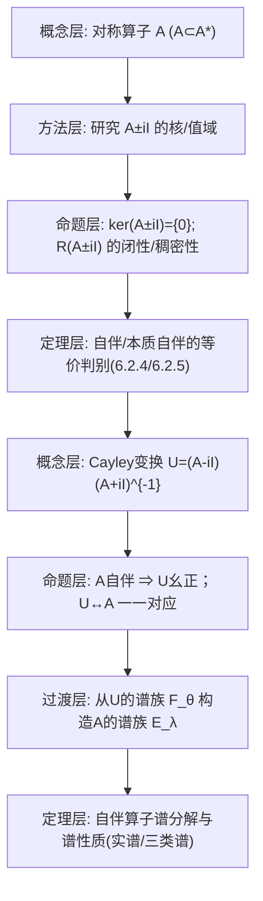

**相关笔记：** [[6.1 闭算子]]｜[[6.3 无界正常算子的谱分解]]｜[[第06章 无界算子 — 章节汇总]]

> [!abstract] 概览
> 本节把“无界自伴算子”转换成“幺正算子”来处理：对称算子 $A$ 的 **Cayley 变换** $U=(A-iI)(A+iI)^{-1}$ 把自伴性与幺正性建立一一对应，并把 5.5 的谱族/谱积分机制搬运到无界自伴情形。核心成果是：  
> - 自伴判别：通过 $R(A\pm iI)$、$\ker(A^*\pm iI)$ 等对象刻画自伴/本质自伴。  
> - 构造自伴算子的谱族 $\{E_\lambda\}$，并给出谱分解（积分表示）。  
> - 推出无界自伴算子的谱性质（实谱、点谱/连续谱/剩余谱与谱族的关系等）。  
> ^overview

---

# 1. 本节主题定位

- **本节的核心问题**
  1) 为什么无界自伴算子比一般对称算子“可控”？关键门槛是什么？  
  2) 如何用 Cayley 变换把“无界”问题化归到“有界幺正算子”并继承第5章谱分解工具？  
  3) 自伴算子的谱族 $E_\lambda$ 如何构造？它与谱分解积分公式如何对应？  
  4) 自伴算子谱的性质（实谱、三类谱分解）如何从谱族中读出？

- **本节在本章知识链中的位置**
  - 6.1：闭/可闭、伴随与自伴概念是本节的输入。  
  - 6.2：自伴谱分解是 6.3（无界正常算子谱分解）与 6.5（扰动）的核心发动机。  

- **本节依赖哪些前置概念/定理**
  - 6.1：$A$ 对称/自伴、本质自伴；$A^*$ 与 $R(A\pm iI)$。  
  - 第5章：有界正常算子的谱族与谱积分（本节借助 Cayley 把它“搬运”过来）。  
  - Hilbert 空间工具：正交补、闭子空间、Riesz 表示等。

- **本节为后续哪些内容铺路**
  - 6.3：无界正常算子可视为“自伴部分 + 虚部”并用类似谱积分做分解。  
  - 6.4：自伴扩张理论会用到 $\ker(A^*\pm iI)$（缺陷空间）这一套判别。

## 二、核心思想

> [!tip] 核心化归：用 Cayley 把“无界自伴”变成“有界幺正”
> 对对称算子 $A$，$A\pm iI$ 的可逆性/值域结构控制了 $A$ 是否自伴；  
> 当 $A$ 自伴时，Cayley 变换
> $$
> U=(A-iI)(A+iI)^{-1}
> $$
> 是幺正算子，并且能从 $U$ 的谱族 $\{F_\theta\}$ 构造出 $A$ 的谱族 $\{E_\lambda\}$，从而得到 $A$ 的谱分解。

> [!warning] 本段最可能造成“看懂但不会用”的地方
> - 把 Cayley 变换当成形式公式，而忘了它的定义域：$(A+iI)^{-1}$ 的存在性取决于 $R(A+iI)$ 是否为全空间（以及是否一一）。  
> - 自伴判别不是单纯的内积恒等式；关键是“域相等/预解点 $\pm i$ 的行为”，常表现为 $\ker(A^*\pm iI)$ 或 $R(A\pm iI)$ 的性质。

---

# 2. 内容分层图

---

# 3. 定义系统

## 3.1 Cayley 变换（定义 6.2.7 的核心式）

> [!quote] 原文直接信息（定义 6.2.7）
> 设 $A$ 是 $\mathcal H$ 上一个对称闭算子，等距算子
> $$
> U=(A-iI)(A+iI)^{-1}
> $$
> 称为 $A$ 的 Cayley 变换。 ^(式(6.2.5))

- **定义对象是什么**
  - 对象：把 $R(A+iI)$ 上的向量通过解方程 $(A+iI)x=y$ 映到 $R(A-iI)$，再写成一个等距算子 $U$。
- **为什么要这样定义**
  - Cayley 变换把“实轴上的谱问题”送到“单位圆上的谱问题”：$\lambda\in\mathbb R$ 与单位圆参数 $e^{i\theta}$ 通过 Möbius 变换对应。
- **它解决了什么问题**
  - 无界算子 $A$ 难以直接谱分解；但 Cayley 变换给出一个有界算子 $U$，可以调用第5章对幺正/正常算子的谱族理论。
- **与前面概念的关系**
  - 6.1 提供 $A$ 的闭性与伴随；本节用 $A\pm iI$ 的性质来确保 Cayley 变换可定义、并刻画自伴性。
- **最小例子**
  - 若 $A$ 是有界自伴算子，则 Cayley 变换仍定义良好且 $U$ 为幺正。
- **非例/边界情况**
  - 若 $R(A+iI)\ne\mathcal H$，则 $(A+iI)^{-1}$ 不处处定义，Cayley 变换不再是全空间上的幺正算子，只是等距算子（部分等距）。
- **初学者误区**
  - 把 $U=(A-iI)(A+iI)^{-1}$ 看成在 $D(A)$ 上逐点代入；正确理解是“先解预解方程，再组合成算子”。

## 3.2 预解集与谱（定义 6.2.10）

> [!quote] 原文直接信息（定义 6.2.10，式(6.2.8)）
> $$
> \rho(A)=\left\{z\in\mathbb C\ \middle|\ \ker(zI-A)=\{0\},\ \overline{R(zI-A)}=\mathcal H,\ (zI-A)^{-1}\in L(\mathcal H)\right\}.
> $$
> $\rho(A)$ 称为算子 $A$ 的预解集，$\rho(A)$ 中的点称为正则点；$\sigma(A)=\mathbb C\setminus\rho(A)$ 为谱集。

- **重要条件的作用**
  - $\ker(zI-A)=\{0\}$：可逆性中的“一一”；  
  - $\overline{R(zI-A)}=\mathcal H$：值域稠密，排除“缺失方向”；  
  - $(zI-A)^{-1}\in L(\mathcal H)$：要求逆算子有界（无界算子理论的关键门槛）。
- **最可能“看懂但不会用”的地方**
  - 只关注核为零，而忽略“逆算子必须有界”；这会把许多非正则点误判为预解点。

## 3.3 自伴算子的谱族（2.2 节构造对象）

> [!quote] 原文直接信息（从 Cayley 变换的谱族构造 $E_\lambda$，式(6.2.9)）
> 利用 Cayley 变换 $U$ 的谱族 $\{F_\theta\}$（见第五章），作变换 $\lambda=-\cot\frac\theta2$，令
> $$
> E_\lambda=F_\theta. ^(式(6.2.9))
> $$

- **定义对象是什么**
  - 对象：单调右连续的投影族 $\{E_\lambda\}$，用于表达自伴算子 $A$ 的谱分解积分。
- **为什么要这样定义**
  - 单位圆上的参数 $\theta$ 与实轴参数 $\lambda$ 通过 Cayley/Möbius 变换对应；用这个变换把 $U$ 的谱族“搬运”成 $A$ 的谱族。
- **它解决什么问题**
  - 给出无界自伴算子的谱分解载体：之后的积分表达式都以 $E_\lambda$ 为核心。

---

# 4. 定理/命题系统

## 4.1 命题 6.2.1：对称算子的基本估计与核为零

> [!quote] 原文直接信息（式(6.2.1) 与 命题 6.2.1）
> 若 $A$ 是 Hilbert 空间上的对称算子，则
> $$
> \|(A\pm iI)x\|^2=\|Ax\|^2+\|x\|^2. ^(式(6.2.1))
> $$
> 因此 $\ker(A\pm iI)=\{0\}$。

- **条件逐条解释**
  - 对称性：用 $(Ax,x)\in\mathbb R$（或 $(Ax,y)=(x,Ay)$）消去交叉项，得到范数平方分解。
- **结论到底在说什么**
  - $A\pm iI$ 自动一一；并且给出一个强下界 $\|(A\pm iI)x\|\ge\|x\|$，为后续可逆性/闭性讨论铺路。
- **证明骨架**
  - Step 1：展开 $\|(A\pm iI)x\|^2=((A\pm iI)x,(A\pm iI)x)$。  
  - Step 2：用对称性证明交叉项为 0。  
  - Step 3：得出分解式与核为零。
- **关键一跳**
  - 交叉项化为 $\pm i[(Ax,x)-(x,Ax)]$，对称性使其为 0。

## 4.2 命题 6.2.2：对称算子时 $R(A\pm iI)$ 闭

> [!quote] 原文直接信息（命题 6.2.2）
> 若 $A$ 是对称算子，则值域 $R(A\pm iI)$ 必是闭的。

- **条件逐条解释**
  - 关键仍是 (6.2.1) 的下界：它让 $(A\pm iI)$ 的逆在其值域上是有界的，从而值域闭。
- **证明骨架**
  - Step 1：由 $\|(A\pm iI)x\|\ge\|x\|$ 得到逆映射在 $R(A\pm iI)$ 上 Lipschitz。  
  - Step 2：用“闭图像定理/逆有界 ⇒ 值域闭”完成。

## 4.3 命题 6.2.3（Fredholm 型结论）：$\ker(A^*\pm iI)=R(A\mp iI)^{\perp}$

> [!quote] 原文直接信息（命题 6.2.3，式(6.2.2)）
> 若 $A$ 是对称算子，则
> $$
> \ker(A^*+iI)=R(A-iI)^{\perp}.
> $$
> （同理可得 $\ker(A^*-iI)=R(A+iI)^{\perp}$。）

- **条件作用**
  - 稠定：保证 $A^*$ 存在；  
  - 对称：保证 $A\subset A^*$，便于把配对恒等式写成正交条件。
- **它的用途**
  - 把“缺陷空间 $\ker(A^*\pm iI)$”与“预解方程值域的缺失方向”对应起来，是 6.4 自伴扩张理论的接口。

## 4.4 定理 6.2.4：自伴判别（核心等价）

> [!quote] 原文直接信息（定理 6.2.4）
> 设 $A$ 是 Hilbert 空间上的对称算子，则以下三条等价：  
> (1) $A$ 是自伴算子；  
> (2) $A$ 是闭算子且 $\ker(A^*\pm iI)=\{0\}$；  
> (3) $R(A\pm iI)=\mathcal H$。

- **条件逐条解释**
  - (2) 中“闭 + 缺陷为 0”是“域已补齐”的代数化表达；  
  - (3) 把判别转成预解方程“可解且可解到全空间”。
- **结论到底在说什么**
  - 自伴性等价于 $\pm i$ 都在预解集中：你不必直接验证 $D(A)=D(A^*)$，可以改用 $R(A\pm iI)$ 或缺陷空间判别。
- **证明骨架**
  - Step 1：(1)⇒(3)：自伴时 $\pm i\in\rho(A)$，故 $R(A\pm iI)=\mathcal H$。  
  - Step 2：(3)⇒(1)：由 $R(A\pm iI)=\mathcal H$ 推出 $D(A^*)\subset D(A)$，结合 $A\subset A^*$ 得 $A=A^*$。  
  - Step 3：(2) 与 (3) 的等价：用命题 6.2.3 把 $R$ 的正交补与 $\ker(A^*\pm iI)$ 互换，再加上闭性排除边界病态。
- **最关键的一跳**
  - 从 $R(A\pm iI)=\mathcal H$ 反推出 $D(A^*)\subset D(A)$（需要把任意 $y\in D(A^*)$ 写成 $(A\pm iI)z$ 并比较）。

## 4.5 推论 6.2.5：本质自伴判别（等价条件）

> [!quote] 原文直接信息（推论 6.2.5）
> 设 $A$ 是 Hilbert 空间上的对称算子，则以下命题等价：  
> (1) $A$ 本质自伴；  
> (2) $\ker(A^*\pm iI)=\{0\}$；  
> (3) $\overline{R(A\mp iI)}=\mathcal H$。

- **条件作用**
  - 把“闭”放到闭包 $\overline A$ 上处理，因此只需缺陷为 0（不再额外要求 $A$ 本身闭）。

## 4.6 定理 6.2.6：由 Cayley 构造等距算子；自伴时得到幺正

> [!quote] 原文直接信息（定理 6.2.6，式(6.2.3)）
> 设 $A$ 是 Hilbert 空间上的闭对称算子，令
> $$
> U=(A-iI)(A+iI)^{-1},
> $$
> 则 $U$ 是从 $R(A+iI)$ 到 $R(A-iI)$ 的等距线性算子；特别地当 $A$ 自伴时，$U$ 是幺正算子。

- **证明骨架**
  - Step 1：由 (6.2.1) 推出 $\|Ux\|=\|x\|$（把 $x$ 写成 $(A+iI)$ 的像）。  
  - Step 2：自伴时 $R(A\pm iI)=\mathcal H$，故 $U$ 处处定义且到处满，从而幺正。

## 4.7 推论 6.2.8：Cayley 变换给出对称算子与等距算子的对应

> [!quote] 原文直接信息（推论 6.2.8，式(6.2.6)）
> 若 $U$ 为 $A$ 的 Cayley 变换，则
> $$
> Ax=\frac12(I+U)y,\quad x=\frac{1}{2i}(I-U)y,
> $$
> 从而
> $$
> A=i(I+U)(I-U)^{-1}. ^(式(6.2.7))
> $$

- **结论到底在说什么**
  - 在合适条件下，$A$ 可以从 $U$ 反解出来；这说明 Cayley 变换不是“丢信息”的，而是等价变换。
- **关键条件的作用**
  - 需要 $I-U$ 在相应空间上可逆（等价于 $1\in\rho(U)$）；这会导向“$A$ 有界 ⇔ $1\in\rho(U)$”（推论 6.2.9）。

## 4.8 定理 6.2.11：自伴算子实谱

> [!quote] 原文直接信息（定理 6.2.11）
> 若 $A$ 是自伴算子，则 $\sigma(A)\subset\mathbb R$。

- **证明骨架**
  - Step 1：用命题 6.2.1 的估计说明 $\pm i\in\rho(A)$；更一般地对 $z\notin\mathbb R$ 得到下界。  
  - Step 2：推出非实点都在预解集，从而谱只能落在实轴。
- **关键一跳**
  - 估计式把“虚部不为 0”转化成可逆性与逆有界性。

## 4.9 自伴算子的谱族与谱分解（2.2 节主线）

> [!quote] 原文直接信息（谱族基本性质，承接 (6.2.9)）
> 由 $F_\theta$ 的谱族性质推出：$\{E_\lambda\}$ 是投影算子族，满足单调性、右连续性以及端点极限，并用强极限（s-lim）描述。

> [!note] 本节要形成的“可用按钮”
> - 你可以把自伴算子写成关于谱族的 Stieltjes 积分（后续在 6.3 也会用同款结构）。  
> - 你可以通过谱族判断点谱/连续谱/本质谱与特征值的性质（本节后半给出一组命题 6.2.16–6.2.20）。

---

# 5. 例子与反例系统

- **本节最关键的例子**
  - 由对称闭算子 $A$ 构造 Cayley 变换 $U$，把无界问题化归到幺正算子谱族 $F_\theta$。  
  - 例题/习题 6.2.1（微分算子 $iu'$）展示自伴性的“域条件”。

- **本节最值得补的反例**
  - 只有对称但缺陷空间非零的算子：$\ker(A^*\pm iI)\ne\{0\}$ ⇒ 不可能自伴；并且会出现多个自伴扩张（6.4 主线）。  
  - 若 $R(A+iI)\ne\mathcal H$，则 Cayley 变换只能是部分等距而非幺正；此时不能直接套用第5章“幺正谱定理”的全套结论。

---

# 6. 本节逻辑链复原（按作者推进顺序）

1) 先从对称算子出发，用 (6.2.1) 给出强估计与 $\ker(A\pm iI)=0$。  
2) 引入 $R(A\pm iI)$ 的闭性与 Fredholm 型恒等式，把“缺陷空间”与“值域缺失”对应起来。  
3) 给出自伴判别（6.2.4）与本质自伴判别（6.2.5），把“自伴”转换成 $\pm i$ 的预解性质。  
4) 定义 Cayley 变换并证明：自伴 ⇒ Cayley 变换幺正（可调用第5章）。  
5) 用 Möbius 变换把 $U$ 的谱族 $F_\theta$ 搬运成 $A$ 的谱族 $E_\lambda$，从而得到自伴算子的谱分解。  
6) 最后讨论自伴谱的性质（实谱、点谱/连续谱/剩余谱、本质谱与谱族的联系），并给出习题巩固。

---

# 7. 本节高风险误区（至少 5 条）

1) **把“对称”当“自伴”**
   - 为什么：都满足内积对称式。  
   - 正确理解：自伴必须满足 $D(A)=D(A^*)$；本节用 $R(A\pm iI)=\mathcal H$ 或 $\ker(A^*\pm iI)=0$ 来判别。

2) **忽略 Cayley 变换的定义域/可逆性前提**
   - 为什么：公式看起来像处处可算。  
   - 正确理解：必须先有 $(A+iI)^{-1}$ 在 $R(A+iI)$ 上存在；若 $A$ 不自伴，$R(A+iI)$ 可能不是全空间。

3) **误以为 $\ker(A\pm iI)=0$ 就能推出自伴**
   - 为什么：核条件很直观。  
   - 正确理解：自伴需要的是“值域满（或缺陷为 0）”；核为 0 只是必要条件之一。

4) **把预解集定义里的“逆有界”漏掉**
   - 为什么：在有界算子里容易默认。  
   - 正确理解：无界算子里即便 $(zI-A)$ 一一且值域稠密，逆也可能无界，因此 $z$ 仍可能在谱中。

5) **不知道谱族 $E_\lambda$ 与谱分解之间的接口**
   - 为什么：$E_\lambda=F_\theta$ 看似只是符号替换。  
   - 正确理解：$E_\lambda$ 是自伴谱分解的载体；所有积分表示与谱性质都从它的单调/右连续/端点极限推出。

---

# 8. 知识库拆分建议

- **A类：应独立成概念卡**
  - Cayley 变换（从对称/自伴到等距/幺正）  
  - 预解集 $\rho(A)$ 与无界谱 $\sigma(A)$ 的定义  
  - 缺陷空间 $\ker(A^*\pm iI)$（为 6.4 铺路）  
  - 自伴算子的谱族 $E_\lambda$（与 5.5 的投影值测度对比）

- **B类：应独立成定理卡**
  - 定理 6.2.4（自伴判别）  
  - 推论 6.2.5（本质自伴判别）  
  - 定理 6.2.6（Cayley 变换等距/幺正）  
  - 定理 6.2.11（自伴算子实谱）  
  - 自伴算子的谱分解定理（本节 2.2 主结论）

- **C类：只保留在本节页中**
  - $\lambda=-\cot(\theta/2)$ 的参数对应与推导（作为技术桥梁）  
  - 自伴谱性质的命题组（6.2.16–6.2.20）作为“用谱族读谱”的按钮清单

- **D类：建议作为专题综述页候选节点**
  - “自伴判别：值域满 vs 缺陷空间 vs Cayley 变换”  
  - “有界谱分解（第5章）与无界谱分解（第6章）的统一视角”

---

# 9. 后续学习接口

- **适合下一轮展开证明的点**
  - 6.2.4 的关键一跳：由 $R(A\pm iI)=\mathcal H$ 推出 $D(A^*)\subset D(A)$。  
  - Cayley 变换反解公式 (6.2.7) 的推导与“$1\in\rho(U)$ ⇔ $A$ 有界”的细节（推论 6.2.9）。

- **适合设计习题的点**
  - 用缺陷空间判别自伴/本质自伴（为 6.4 做准备）。  
  - 给定一个对称微分算子（不同边界条件），要求用 6.2.4 判别其是否自伴。

- **适合与前一节做比较的点（6.1）**
  - 6.1 解决“闭/可闭、伴随域”；  
  - 6.2 在此基础上把“自伴”转成预解方程与 Cayley 变换，开始进入谱分解。

- **适合与下一节做衔接的点（6.3）**
  - 6.3 处理无界正常算子，往往先拆成自伴部分并复用 6.2 的谱族/积分框架。

---

# 10. 自测问题

## 10.A 自测问题（5题）
1) 由对称性推出 (6.2.1) 的范数分解式，并据此证明 $\ker(A\pm iI)=\{0\}$。  
2) 定理 6.2.4 给出三种自伴判别口径，它们分别适合在什么场景下使用？  
3) Cayley 变换 $U=(A-iI)(A+iI)^{-1}$ 在 $A$ 不自伴时为什么只是一部分等距？哪一步失效？  
4) 解释 $E_\lambda=F_\theta$（$\lambda=-\cot(\theta/2)$）的意义：为什么它能把单位圆上的谱族搬到实轴上？  
5) 预解集 $\rho(A)$ 的定义中，“逆算子有界”这一条在无界谱理论里为什么不可省？

## 10.B 习题（完整解答，按教材编号全覆盖）

> [!note] 编号门禁（做完打勾）
> - [ ] 6.2.1
> - [ ] 6.2.2
> - [ ] 6.2.3
> - [ ] 6.2.4
> - [ ] 6.2.5
> - [ ] 6.2.6
> - [ ] 6.2.7
> - [ ] 6.2.8
> - [ ] 6.2.9
> - [ ] 6.2.10
> - [ ] 6.2.11

> [!problem] 6.2.1
> 考虑 $L^2(\mathbb R)$ 上算子 $Au=iu'$（按原文给定 $D(A)$）。证明 $A$ 自伴。（提示：对任意 $u\in D(A)$，有 $\lim_{x\to\pm\infty}u(x)=0$，并且 Fourier 变换 $\widehat u\in L^1(\mathbb R)$。）
>
> [!solution]- 解（骨架）
> - Step 1：证明 $A$ 对称：对 $u,v\in D(A)$ 分部积分，边界项由 $u(\pm\infty)=0$ 消失，得 $(Au,v)=(u,Av)$。  
> - Step 2：求 $A^*$：设 $w\in D(A^*)$，则存在 $g\in L^2$ 使 $(iu',w)=(u,g)$ 对所有 $u\in D(A)$。通过分部积分/分布导数，得到 $w$ 绝对连续且 $w'\in L^2$，并且 $g=iw'$。  
> - Step 3：比较域：由 Step 2 得 $D(A^*)\subset D(A)$（按原文对 $D(A)$ 的定义口径校对），且 $A^*w=Aw$。结合 $A\subset A^*$ 得 $A=A^*$。

> [!problem] 6.2.2
> 证明推论 6.2.5（本质自伴判别）。
>
> [!solution]- 解（骨架）
> - Step 1：由 6.1 得 $\overline A=A^{**}$；本质自伴等价于 $\overline A$ 自伴。  
> - Step 2：把 6.2.4 应用到 $\overline A$：$\overline A$ 自伴 $\Leftrightarrow \ker(A^*\pm iI)=\{0\}$。  
> - Step 3：用命题 6.2.3 把缺陷空间等价改写为 $\overline{R(A\mp iI)}=\mathcal H$。

> [!problem] 6.2.3
> 在 $L^2[0,\infty)$ 中定义算子 $Au=iu'$（按原文给定 $D(A)$）。问 $A$ 本质自伴吗？
>
> [!solution]- 解（思路）
> - Step 1：先证 $A$ 对称（分部积分，注意边界 $0$ 处项）。  
> - Step 2：计算缺陷空间 $\ker(A^*\pm iI)$：解 $(A^*\pm iI)u=0$ 得到指数函数 $u(t)=Ce^{\mp t}$ 类型；检查其是否属于 $L^2[0,\infty)$ 并满足伴随域条件。  
> - Step 3：若某个缺陷空间非零，则由 6.2.5 得 $A$ 非本质自伴。

> [!problem] 6.2.4
> 设 $A$ 是稠定对称算子且是正的，即 $\forall x\in D(A)$ 有 $(Ax,x)\ge 0$。求证：  
> (1) $\|(A+I)x\|^2\ge \|x\|^2+\|Ax\|^2$；  
> (2) $A$ 闭的充要条件为 $R(A+I)$ 闭；  
> (3) 本质自伴的充要条件是方程 $A^*y=-y$ 无非零解。
>
> [!solution]- 解（骨架）
> - (1) 展开 $\|(A+I)x\|^2=\|Ax\|^2+\|x\|^2+2\mathrm{Re}(Ax,x)$，用正性得下界。  
> - (2) 用 (1) 得到 $A+I$ 下界，从而逆在值域上有界；结合 6.1 的闭图像/逆算子有界论证。  
> - (3) 注意 $A^*y=-y$ 等价于 $y\in\ker(A^*+I)$；用 6.2.5 把本质自伴化为缺陷空间为 0。

> [!problem] 6.2.5
> 设 $\mathcal H=\{f(z)=\sum_{n=0}^\infty c_n z^n,\ |z|<1,\ \sum|c_n|^2<\infty\}$，并在其上定义 $U, A$（见原文）。求证 $A$ 对称，$U$ 是 $A$ 的 Cayley 变换，并求 $R(A+iI)$、$R(A-iI)$。
>
> [!solution]- 解（骨架）
> - Step 1：用系数内积验证 $A$ 对称（把 $A$ 表示成对系数的移位/线性组合）。  
> - Step 2：直接计算 $(A\pm iI)$ 对系数的作用，求其值域描述（通常对应某个系数约束子空间）。  
> - Step 3：验证 $U=(A-iI)(A+iI)^{-1}$：先求解 $(A+iI)x=y$，再代入得到 $Ux$ 的显式形式，与题设 $U$ 一致。

> [!problem] 6.2.6
> 设 $C$ 为 $\mathcal H$ 上对称算子，$A$ 为 $\mathcal H$ 上某线性算子且满足 $A\subset C$、$R(A+iI)=R(C+iI)$。求证 $A=C$。
>
> [!solution]- 解（骨架）
> - Step 1：由 $R(A+iI)=R(C+iI)$，对任意 $y\in D(C)$，令 $z=(C+iI)y\in R(C+iI)=R(A+iI)$，得存在 $x\in D(A)$ 使 $(A+iI)x=z$。  
> - Step 2：用 $A\subset C$ 得 $(C+iI)(y-x)=0$，结合命题 6.2.1 的核为零推出 $y=x$。  
> - Step 3：因此 $D(C)\subset D(A)$，再结合 $A\subset C$ 得 $A=C$。

> [!problem] 6.2.7
> 设 $A$ 为对称算子，且 $R(A+iI)=\mathcal H$，$R(A-iI)\ne\mathcal H$。求证 $A$ 没有自伴扩张。
>
> [!solution]- 解（骨架）
> - Step 1：若存在自伴扩张 $S\supset A$，则由自伴判别（6.2.4）有 $R(S\pm iI)=\mathcal H$。  
> - Step 2：由 $A\subset S$ 推出 $R(A-iI)\supset R(S-iI)$ 或用缺陷空间/正交补关系得到矛盾（按教材命题 6.2.3 的对应）。  
> - Step 3：因此不存在自伴扩张。

> [!problem] 6.2.8
> 设 $V$ 为 $\mathcal H$ 上等距算子，且 $\|Vx\|=\|x\|$（见原文条件）。证明关于 $I-V$ 的一些性质（原文列(1)(2)(3)）。
>
> [!solution]- 解（思路）
> 主要用等距性质把 $\|x\|$ 与 $\|Vx\|$ 联系起来，再用闭图像与值域闭性论证。

> [!problem] 6.2.9
> 设 $T$ 是 Hilbert 空间上的闭算子。求证预解集 $\rho(T)$ 是开集，并证明预解算子 $R_z(T)=(zI-T)^{-1}$ 在连通分支上解析，并满足预解方程
> $$
> R_{z_1}(T)-R_{z_2}(T)=(z_2-z_1)R_{z_1}(T)R_{z_2}(T)。
> $$
>
> [!solution]- 解（骨架）
> - Step 1：用 Neumann 级数：若 $z_0\in\rho(T)$，则当 $|z-z_0|\cdot\|R_{z_0}(T)\|<1$ 时，$z\in\rho(T)$，且
> $$
> R_z(T)=R_{z_0}(T)\sum_{n=0}^\infty\bigl((z_0-z)R_{z_0}(T)\bigr)^n.
> $$
> - Step 2：由该展开得解析性。  
> - Step 3：用恒等式
> $$
> (z_1I-T)^{-1}-(z_2I-T)^{-1}=(z_2-z_1)(z_1I-T)^{-1}(z_2I-T)^{-1}
> $$
> 直接验证预解方程。

> [!problem] 6.2.10
> 证明命题 6.2.16、6.2.17、6.2.18。
>
> [!solution]- 解（提示）
> 这些命题把谱族 $E_\lambda$ 与点谱/连续谱/剩余谱联系起来。做法是：  
> - 用 $E(\{\lambda_0\})\ne 0$ 与特征向量存在的等价性；  
> - 用 $E$ 在小区间上的投影维数/像空间维数刻画本质谱与离散谱。

> [!problem] 6.2.11
> 证明命题 6.2.20。
>
> [!solution]- 解（提示）
> 继续沿用谱族 $E_\lambda$ 的性质：把“某谱点属于本质谱/离散谱”的判别转成 $E(I_\varepsilon)$ 的像空间维数是否无穷等。

## 10.C 引用与原文 PDF（末尾嵌入）
![[00-Raw素材/泛函分析讲义_张恭庆/章节内容/第六章_无界算子/6.2_Cayley变换与自伴算子的谱分解.pdf]]

