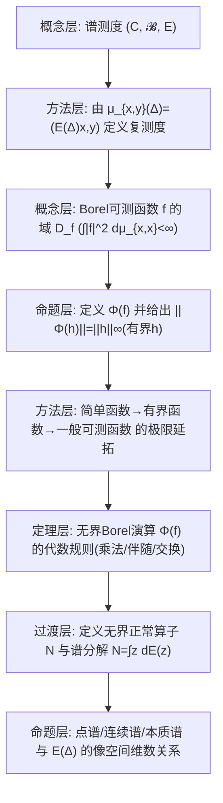

**相关笔记：** [[6.2 Cayley变换与自伴算子的谱分解]]｜[[6.4 自伴扩张]]｜[[第06章 无界算子 — 章节汇总]]

> [!abstract] 概览
> 本节把 6.2 的“自伴谱分解”推广到 **无界正常算子 $N$**：核心是先建立一个投影值测度 $E$（谱测度），再对 Borel 可测函数 $f$ 定义无界算子 $\Phi(f)$，并证明它满足乘法、伴随、范数/域控制等演算规则；最后把 $N$ 写成谱积分（谱分解）。  
> 你需要牢牢记住两层结构：  
> - “测度层”：$E(\Delta)$ 是投影；对 $x,y$，复测度 $\mu_{x,y}(\Delta)=(E(\Delta)x,y)$。  
> - “算子层”：对可测 $f$，先定义域
> $$
> D_f=\left\{x\in\mathcal H\ \middle|\ \int |f|^2\,d\mu_{x,x}<\infty\right\},
> $$
> 再用积分定义 $\Phi(f)$ 并得到 $N=\Phi(z)$。  
> 本节同时给出谱的细分：点谱/连续谱/本质谱与谱测度的关系，并配套 6.3.1–6.3.8 习题巩固。  
> ^overview

---

# 1. 本节主题定位

- **本节的核心问题**
  1) 对无界正常算子 $N$，如何在不先“对角化”的情况下构造谱测度 $E$？  
  2) 如何对一般 Borel 可测函数 $f$ 定义 $f(N)$（无界函数演算），并控制其定义域？  
  3) 如何把谱分解写成统一的积分形式（弱意义/强意义）？  
  4) 点谱/连续谱/本质谱如何从 $E$ 的投影像空间维数等量读出？

- **本节在本章知识链中的位置**
  - 6.2：自伴谱分解（实谱 + Cayley）是本节的模型；  
  - 6.3：推广到复谱（正常算子），并建立 Borel 演算；  
  - 6.4：自伴扩张中会用到“缺陷空间/谱判别”，与本节的谱测度刻画形成互证。

- **本节依赖哪些前置概念/定理**
  - 5.5：有界正常算子谱积分（直觉模板）。  
  - 6.2：无界自伴谱族与积分表示（作为“先在实轴做，再推广到复平面”的参照）。  
  - 测度论：Borel 集、Radon–Nikodym（教材正文用到；只抽骨架）。

- **本节为后续哪些内容铺路**
  - 6.5 扰动与 6.6 收敛性都需要用预解算子/谱测度来控制极限与谱变化。

---

# 2. 内容分层图

---

# 3. 定义系统

## 3.1 谱测度与复测度 $\mu_{x,y}$

> [!quote] 原文直接信息（§3 开头，式(6.3.1)）
> 设 $\mathcal H$ 是 Hilbert 空间，$(\mathbb C,\mathcal B,E)$ 是一个谱族（$E$ 为取值于投影算子的测度）。设 $f$ 是有界 Borel 可测函数，对 $x,y\in\mathcal H$，
> $$
> \int_{\mathbb C} f(z)\,d(E(z)x,y)
> $$
> 是 $\mathcal H$ 上的双线性泛函，因此唯一存在算子 $\Phi(f)\in L(\mathcal H)$ 使得
> $$
> (\Phi(f)x,y)=\int_{\mathbb C} f(z)\,d(E(z)x,y). \quad (6.3.1)
> $$

- **定义对象是什么**
  - $E(\Delta)$：对每个 Borel 集 $\Delta$ 给出一个正交投影；  
  - $\mu_{x,y}(\Delta):=(E(\Delta)x,y)$：对固定 $x,y$ 得到一个复测度。
- **为什么要这样定义**
  - 把“算子问题”转成“测度积分”：对 $f$ 的作用通过积分对 $E$ 加权得到 $\Phi(f)$。
- **初学者误区**
  - 把 $d(E(z)x,y)$ 当成普通函数的微分；它是复测度的积分记号。

## 3.2 有界 Borel 演算 $\Phi(f)$（有界情形）

> [!quote] 原文直接信息（引理 6.3.1 的结论式）
> $\Phi(f)$ 满足：线性、乘法、伴随、并且
> $$
> \|\Phi(f)\|=\|f\|_{\infty}. \quad (6.3.7)
> $$

- **条件作用**
  - $f$ 有界：保证积分泛函对 $x,y$ 有界，从而由 Riesz 表示得到有界算子。
- **它解决什么问题**
  - 为无界情形打底：先在有界函数上建立代数规则，再通过截断极限扩展到无界可测函数。

## 3.3 无界 Borel 可测函数的域 $D_f$（引理 6.3.2）

> [!quote] 原文直接信息（引理 6.3.2，式(6.3.8)）
> 设 $f$ 是复数域 $\mathbb C$ 上 Borel 可测函数，令
> $$
> D_f=\left\{x\in\mathcal H\ \middle|\ \int |f|^2\,d(E(z)x,x)<\infty\right\}. \quad (6.3.8)
> $$
> 则 $D_f$ 是 $\mathcal H$ 中稠集。

- **为什么要这样定义**
  - 无界 $f$ 时，$\Phi(f)$ 不可能处处定义；用二次积分可积性定义“允许对 $x$ 作用”的最大自然域。
- **它解决了什么问题**
  - 给出无界函数演算的“域门禁”：后续每条乘法/伴随公式都必须声明域（否则容易误用）。
- **初学者误区**
  - 忘记域：把 $\Phi(f)\Phi(g)=\Phi(fg)$ 当作处处成立；实际上通常需要 $D_{fg}$ 或 $D_f\cap D_g$ 等域条件。

---

# 4. 定理/命题系统

## 4.1 引理 6.3.1：有界 Borel 演算的基本规则

> [!quote] 原文直接信息（引理 6.3.1，式(6.3.2)–(6.3.6)）
> $\Phi(f)$ 满足：  
> (1) $\|\Phi(f)x\|^2=\int |f|^2\,d\|E(z)x\|^2$；  
> (2) $\Phi(\overline f)=\Phi(f)^*$；  
> (3) 线性：$\Phi(\alpha f+\beta g)=\alpha\Phi(f)+\beta\Phi(g)$；  
> (4) 乘法：$\Phi(fg)=\Phi(f)\Phi(g)$；  
> (5) $\|\Phi(f)\|=\|f\|_{\infty}$；  
> (6) 交换性：$T$ 与 $E(\Delta)$ 交换当且仅当对一切有界 Borel 可测 $f$，$T\Phi(f)=\Phi(f)T$。

- **条件逐条解释**
  - $f$ 有界：保证 $\Phi(f)$ 有界，从而 (5) 才有意义。  
  - (6) 把“与所有投影交换”升级为“与所有函数演算交换”，是后续“由交换性导出正常性/谱分解”常用按钮。
- **证明骨架（Step 1/2/3）**
  - Step 1：先对简单函数 $h=\sum a_i\chi_{C_i}$ 定义 $\Phi(h)=\sum a_iE(C_i)$，逐条验证。  
  - Step 2：用一致逼近把结论从简单函数推广到有界 Borel 函数。  
  - Step 3：(6) 用简单函数产生的投影线性组合逼近一般 $f$。
- **关键一跳**
  - 乘法性：对简单函数先证 $\Phi(h)\Phi(k)=\Phi(hk)$，再用逼近极限推广。

## 4.2 引理 6.3.2：$D_f$ 稠密与积分估计（域的可用性）

> [!quote] 原文直接信息（引理 6.3.2，式(6.3.9) 与 (6.3.10)）
> 对 $x\in D_f$、$y\in\mathcal H$，有积分估计
> $$
> \int |f|\,|d(E(z)x,y)|\le \|y\|\left(\int |f|^2\,d(E(z)x,x)\right)^{1/2}. \quad (6.3.9)
> $$
> 若 $f$ 有界且 $v=\Phi(f)y$，则
> $$
> d(E(z)x,v)=f\,d(E(z)x,y). \quad (6.3.10)
> $$

- **重要条件的作用**
  - (6.3.9) 是把“无界 $f$ 的积分”压到可控的二次积分上；  
  - (6.3.10) 是后续证明乘法/伴随/交换性时的关键计算规则。

## 4.3 定理 6.3.3：无界 Borel 演算 $\Phi(f)$ 的存在与基本等式

> [!quote] 原文直接信息（定理 6.3.3，式(6.3.11)–(6.3.12)）
> 设 $f$ 是 Borel 可测函数，则对应一个 $\mathcal H$ 上稠定闭算子 $\Phi(f)$，$D(\Phi(f))=D_f$，并满足
> $$
> (\Phi(f)x,y)=\int f(z)\,d(E(z)x,y),\quad \forall x\in D_f,\ y\in\mathcal H, \quad (6.3.11)
> $$
> 且
> $$
> \|\Phi(f)x\|^2=\int |f|^2\,d(E(z)x,x),\quad \forall x\in D_f. \quad (6.3.12)
> $$

- **条件逐条解释**
  - “Borel 可测”：保证可通过简单函数截断逼近。  
  - “稠定闭算子”：无界演算的输出必须闭（以便做谱理论/预解理论）。
- **证明骨架（Step 1/2/3）**
  - Step 1：用截断 $f_n=\chi_{\Delta_n}f$（$|f|\le n$ 的部分）得到有界算子 $\Phi(f_n)$。  
  - Step 2：对 $x\in D_f$，证明 $\Phi(f_n)x$ 在 $\mathcal H$ 中 Cauchy，并定义 $\Phi(f)x:=\lim\Phi(f_n)x$。  
  - Step 3：证明该定义与积分公式一致，且 $\Phi(f)$ 闭（利用 (6.3.12) 的范数等式）。
- **最关键的一跳**
  - 证明极限定义不依赖截断序列（用 (6.3.9) 控制差异），并能推出闭性（用图像判别）。

## 4.4 定理 6.3.4 / 推论 6.3.5：无界演算的代数规则（含域）

> [!quote] 原文直接信息（定理 6.3.4，式(6.3.13)）
> 对应关系 $f\mapsto\Phi(f)$ 满足（典型）：
> $$
> \Phi(f)^*=\Phi(\overline f), \quad (6.3.14)
> $$
> 并给出乘法与域关系，例如
> $$
> D(\Phi(f)\Phi(g))=D_f\cap D_{fg},\quad \Phi(f)\Phi(g)\subset\Phi(fg). \quad (6.3.13)
> $$

- **条件逐条解释**
  - 这里最关键的是“域”：无界算子相乘需要保证 $x$ 同时在相应域里。
- **结论到底在说什么**
  - $\Phi$ 是一个“* 表示”（在域意义下）：共轭对应伴随、乘法对应复合（在可定义的域上）。
- **证明骨架**
  - Step 1：先对截断 $f_n,g_n$ 使用有界情形引理 6.3.1。  
  - Step 2：用 (6.3.9)(6.3.10) 把极限交换到积分中。  
  - Step 3：追踪域的变化，得到“包含关系”与域交。

## 4.5 无界正常算子与谱分解（§3.2 主线）

> [!quote] 原文直接信息（定义 6.3.8 与 定理 6.3.9 的入口）
> 设 $T$ 是 Hilbert 空间 $\mathcal H$ 上的稠定闭算子，如果满足
> $$
> T^*T=TT^*, \quad (6.3.16)
> $$
> 就称 $T$ 是无界正常算子。  
> 若 $N$ 是无界正常算子，则（列出与 $N,N^*$ 的域/范数关系与闭性性质）。

- **它最终要导出的结论（本节核心输出）**
  - 存在谱测度 $E$ 使
  $$
  N=\int z\,dE(z),
  $$
  并且对所有 Borel 可测 $f$，有 $f(N)=\Phi(f)$（在域意义下）。

---

# 5. 例子与反例系统

- **本节最关键的例子**
  - 从谱测度 $E$ 出发构造 $\Phi(f)$：这是把“测度→算子”的核心例子（比具体算子更重要）。  
  - 取 $f=\chi_{\Delta}$：得到投影 $\Phi(\chi_{\Delta})=E(\Delta)$（把集合变成投影）。

- **本节最值得补的反例**
  - 忘记域：即使 $\Phi(f)$ 与 $\Phi(g)$ 都能作用于某个 $x$，也不保证 $\Phi(f)\Phi(g)x$ 有意义（需要 $\Phi(g)x\in D_f$）。  
  - 非正常闭算子：即便闭，也不保证存在投影值测度使 $T=\int z\,dE$。

---

# 6. 本节逻辑链复原

1) 先从谱测度 $E$ 出发，利用 Riesz 表示把有界 Borel 函数 $f$ 映到有界算子 $\Phi(f)$（引理 6.3.1），并建立代数规则。  
2) 然后引入域 $D_f$，用二次可积性控制无界函数的积分，从而把 $\Phi$ 延拓到无界 Borel 函数（引理 6.3.2 + 定理 6.3.3）。  
3) 给出无界演算的乘法/伴随等规则，并特别强调“域的追踪”（定理 6.3.4/推论 6.3.5）。  
4) 最后把“无界正常算子”作为满足 $T^*T=TT^*$ 的闭算子，借助上述演算与投影测度结构得到谱分解（§3.2）。  
5) 章末用一组习题把“正常性、域等式、极分解、谱的细分判别”固化为可用按钮。

---

# 7. 本节高风险误区（≥5）

1) **把 $\Phi(f)$ 当成处处定义的算子**
   - 为什么容易：有界情形确实如此。  
   - 正确理解：无界 $f$ 只在 $D_f$ 上定义，且 $D_f$ 必须在公式里随时跟踪。

2) **忽略“闭算子”在无界谱分解中的地位**
   - 为什么：很多教材直接写积分公式。  
   - 正确理解：闭性是使得极限与图像判别可用的基础；定理 6.3.3 明确输出的是“稠定闭算子”。

3) **混淆三种对象：投影 $E(\Delta)$、复测度 $\mu_{x,y}$、算子 $\Phi(f)$**
   - 为什么：符号都写成 $d(E(z)x,y)$。  
   - 正确理解：$E(\Delta)$ 是投影；$\mu_{x,y}$ 是它诱导的测度；$\Phi(f)$ 才是通过积分定义的算子。

4) **把乘法公式 $\Phi(f)\Phi(g)=\Phi(fg)$ 当成无条件等号**
   - 为什么：有界情形是等号。  
   - 正确理解：一般只有包含关系，且域为交（如 (6.3.13)）；需要检查 $D_{fg}$ 与 $D_g$ 的关系。

5) **把“正常性 $T^*T=TT^*$”仅当作代数等式，不检查域**
   - 为什么：在有界算子里域是全空间。  
   - 正确理解：无界情形中 $T^*T$ 与 $TT^*$ 的定义域本身就是约束的一部分。

---

# 8. 知识库拆分建议

- **A类：应独立成概念卡**
  - 谱测度 $E$ 与 $\mu_{x,y}$  
  - 无界 Borel 演算的定义域 $D_f$  
  - 无界正常算子（定义域条件 + $T^*T=TT^*$）

- **B类：应独立成定理卡**
  - 引理 6.3.1（有界 Borel 演算基本规则）  
  - 定理 6.3.3（无界 Borel 演算存在性与范数等式）  
  - 定理 6.3.4/推论 6.3.5（乘法/伴随/域规则）  
  - 无界正常算子的谱分解定理（§3.2 主结论）

- **C类：只保留在本节页中**
  - Radon–Nikodym 在证明 (6.3.9) 中的使用（作为技术细节接口）  
  - “截断 $f_n$ 延拓”的证明套路（作为做题模板）

- **D类：建议作为专题综述页候选节点**
  - “从有界谱积分到无界 Borel 演算：域如何被测度控制”  
  - “正常性与极分解：无界情形的域问题”

---

# 9. 后续学习接口

- **适合下一轮展开证明的点**
  - 引理 6.3.2 的 (6.3.9)：Radon–Nikodym 的具体用法与为何能选到 $|u|=1$ 的密度函数。  
  - 定理 6.3.3 的闭性证明：如何从 (6.3.12) 直接得到图像闭。

- **适合设计习题的点**
  - 用截断逼近证明 $\Phi(f_n)x\to \Phi(f)x$；并练习域 $D_f$ 的判别。  
  - 证明“若 $N$ 正常则 $N^*$ 正常”“极分解 $N=UP$”等（见习题 6.3.1–6.3.6）。

- **适合与前一节做比较的点（6.2）**
  - 6.2：谱在实轴，自伴谱族 $E_\lambda$；  
  - 6.3：谱在复平面，谱测度在 $\mathbb C$ 上，演算对象从连续函数扩张到 Borel 可测函数。

- **适合与下一节做衔接的点（6.4）**
  - 6.4 研究“对称算子何时可扩张为自伴”，核心工具仍是 $A^*$ 与缺陷空间；本节对域/闭性/伴随的严密追踪能直接复用。

---

# 10. 自测问题

## 10.A 自测问题（5题）
1) 为什么无界 Borel 演算必须先定义域 $D_f$？用“$\int|f|^2d\mu_{x,x}$”解释其自然性。  
2) 在引理 6.3.1 中，为什么先从简单函数开始定义 $\Phi(h)=\sum a_iE(C_i)$？这一步的好处是什么？  
3) 说明 (6.3.12) 的意义：它如何同时给出“域判别”与“闭性证明”的关键估计？  
4) 无界情形下，为什么 $\Phi(f)\Phi(g)$ 通常只能得到包含关系？请明确指出需要检查的域条件。  
5) 无界正常性 $T^*T=TT^*$ 在无界情形中隐含了哪些域条件？为什么不能只看形式等式？

## 10.B 习题（完整解答，按教材编号全覆盖）

> [!note] 编号门禁（做完打勾）
> - [ ] 6.3.1
> - [ ] 6.3.2
> - [ ] 6.3.3
> - [ ] 6.3.4
> - [ ] 6.3.5
> - [ ] 6.3.6
> - [ ] 6.3.7
> - [ ] 6.3.8

> [!problem] 6.3.1
> 设 $N$ 是正常算子，求证 $N^*$ 也是正常算子。
>
> [!solution]- 解
> 正常性为 $N^*N=NN^*$。对两边取伴随并用 $(AB)^*=B^*A^*$ 得
> $$
> (N^*N)^*=N^*N^{**}=N^*N,\quad (NN^*)^*=N^{**}N^*=NN^*,
> $$
> 因此同一等式也可写为 $NN^*=N^*N$，从而 $N^*$ 满足 $(N^*)^*N^*=N^*(N^*)^*$，即 $N^*$ 正常。

> [!problem] 6.3.2
> 设 $T$ 是稠定闭算子，且 $D(T)=D(T^*)$、$\|Tx\|=\|T^*x\|$（$\forall x\in D(T)$）。证明 $T$ 正常。（提示：先证 $(Tx,Ty)=(T^*x,T^*y)$）
>
> [!solution]- 解（骨架）
> - Step 1：用极化恒等式把范数相等转成内积相等：
> $$
> \|Tx+Ty\|^2-\|Tx-Ty\|^2=4\mathrm{Re}(Tx,Ty),
> $$
> 同理对 $T^*$。由 $\|T(\cdot)\|=\|T^*(\cdot)\|$ 得 $\mathrm{Re}(Tx,Ty)=\mathrm{Re}(T^*x,T^*y)$，再用 $x\pm iy$ 得虚部也相等，从而
> $$
> (Tx,Ty)=(T^*x,T^*y).
> $$
> - Step 2：对任意 $x\in D(T^*T)$，有 $Tx\in D(T^*)=D(T)$，并对任意 $y\in D(T)$：
> $$
> (T^*Tx,y)=(Tx,Ty)=(T^*x,T^*y)=(TT^*x,y),
> $$
> 推出 $T^*T\subset TT^*$。  
> - Step 3：同理反向包含，得 $T^*T=TT^*$，即 $T$ 正常。

> [!problem] 6.3.3
> 设 $L\in L(\mathcal H)$，$M,N$ 是 $\mathcal H$ 上无界正常算子，若 $LM\subset NL$，求证 $LM^*\subset N^*L$。
>
> [!solution]- 解（骨架）
> 对 $x$ 属于适当域，利用 $L$ 有界可与内积换位：
> $$
> (LM^*x,y)=(M^*x,L^*y)=(x,ML^*y),
> $$
> 再用 $LM\subset NL$ 转写为 $M L^*\subset L^* N$（取伴随并注意包含反向），最终得到
> $$
> (LM^*x,y)=(x,L^*N y)=(N^*Lx,y),
> $$
> 从而 $LM^*\subset N^*L$。

> [!problem] 6.3.4
> 求证：$\mathcal H$ 上稠定算子 $N$ 是无界正常算子的充要条件是同时满足  
> (1) $D(N)\subset D(N^*)$；  
> (2) $N+N^*$、$i(N-N^*)$ 是自伴的，且它们的谱族可交换。
>
> [!solution]- 解（骨架）
> - (⇒) 若 $N$ 正常，则由正常性导出 $D(N)=D(N^*)$（教材定理 6.3.9 的 (1)），并且可将 $N$ 分解为
> $$
> N=A+iB,\quad A=\frac{N+N^*}{2},\ B=\frac{N-N^*}{2i},
> $$
> 其中 $A,B$ 自伴且可交换（谱族可交换等价于强可交换）。  
> - (⇐) 反向：由谱族可交换推出 $A,B$ 强可交换，从而 $A+iB$ 正常；结合域包含与闭性得到 $N$ 正常。

> [!problem] 6.3.5
> 求证：$\mathcal H$ 上稠定算子 $N$ 是无界正常算子的充要条件是存在分解 $N=A+iB$，其中 $A,B$ 自伴且它们的谱族可交换。
>
> [!solution]- 解（骨架）
> - (⇒) 同 6.3.4 的构造 $A,B$。  
> - (⇐) 若 $A,B$ 自伴且谱族可交换，则由联合谱测度可定义 $N=A+iB$ 的谱测度，从而推出 $N$ 正常（关键在于强可交换保证 $AB=BA$ 并可同时函数演算）。

> [!problem] 6.3.6
> 设 $N$ 是无界正常算子，求证存在酉算子 $U$ 与正的自伴算子 $P$ 使 $D(P)=D(N)$ 且
> $$
> N=UP=PU.
> $$
>
> [!solution]- 解（骨架：极分解）
> - Step 1：定义 $P=(N^*N)^{1/2}$（正自伴平方根，由自伴谱分解保证存在）。  
> - Step 2：在 $R(P)$ 上定义 $Ux:=Nx$（严格：定义 $U(Px)=Nx$），用 $\|Nx\|^2=(N^*Nx,x)=(P^2x,x)=\|Px\|^2$ 证明该定义等距并可延拓为酉算子。  
> - Step 3：验证 $N=UP$ 且 $PU=UP$（正常性保证可交换关系；细节按教材证明追踪域）。

> [!problem] 6.3.7
> 设 $N$ 是无界正常算子，$(\mathbb C,\mathcal B,E)$ 是它的谱族。证明：  
> (1) $z\in\sigma_p(N)\Longleftrightarrow E(\{z\})\ne 0$；  
> (2) $\sigma_r(N)=\varnothing$；  
> (3) $z\in\sigma(N)\Longleftrightarrow \forall$ Borel 邻域 $\Delta\ni z$，有 $E(\Delta)\ne 0$。
>
> [!solution]- 解（骨架）
> - (1) 若 $E(\{z\})\ne0$，取 $0\ne x\in R(E(\{z\}))$，则由谱积分 $Nx=zx$；反向若 $Nx=zx$，则谱测度集中在 $\{z\}$ 上，从而 $E(\{z\})x=x\ne0$。  
> - (2) 正常算子没有剩余谱：因 $R(N-zI)$ 的正交补等于 $\ker((N-zI)^*)=\ker(N^*-\overline z I)$，而正常性使得该核为 0 时值域稠密且闭，从而排除剩余谱。  
> - (3) 用 (1)(2) 与谱测度的局部非零性刻画谱点。

> [!problem] 6.3.8
> 设 $N$ 是无界正常算子，$E$ 是它的谱族。定义本质谱
> $$
> \sigma_{ess}(N)=\left\{z\in\sigma(N)\ \middle|\ \forall\text{ Borel 邻域 }\Delta\ni z,\ \dim R(E(\Delta))=+\infty\right\},
> $$
> 并令 $\sigma_d(N)=\sigma(N)\setminus\sigma_{ess}(N)$。说明：$\sigma_d(N)$ 的点正是“孤立且有限重特征值”，并给出其与 $E(\{z\})$ 的关系。
>
> [!solution]- 解（骨架）
> - Step 1：若 $z$ 是孤立谱点且 $\dim R(E(\{z\}))<\infty$，则对足够小邻域 $\Delta$ 有 $E(\Delta)=E(\{z\})$，于是 $z\notin\sigma_{ess}$。  
> - Step 2：若 $z\in\sigma_d$，则存在邻域使 $R(E(\Delta))$ 有限维；借助谱测度正交分解可推出 $z$ 为特征值且孤立、有限重。  
> - Step 3：把“有限重”具体化为 $\dim R(E(\{z\}))$。

## 10.C 引用与原文 PDF（末尾嵌入）
![[00-Raw素材/泛函分析讲义_张恭庆/章节内容/第六章_无界算子/6.3_无界正常算子的谱分解.pdf]]

