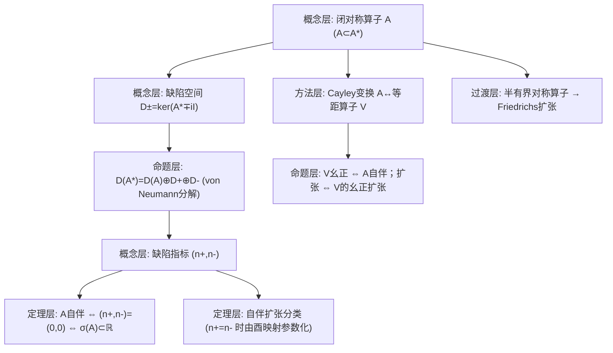

**相关笔记：** [[6.3 无界正常算子的谱分解]]｜[[6.5 自伴算子的扰动]]｜[[第06章 无界算子 — 章节汇总]]

> [!abstract] 概览
> 本节回答一个结构性问题：给定 Hilbert 空间上的闭对称算子 $A$，它什么时候能扩张成自伴算子？如果能，有多少个？  
> 核心工具是 **缺陷空间** $D_\pm=\ker(A^*\mp iI)$ 与缺陷指标 $(n_+,n_-)=(\dim D_+,\dim D_-)$：  
> - 自伴判别：$A$ 自伴 $\Leftrightarrow (n_+,n_-)=(0,0)$（等价于 $\sigma(A)\subset\mathbb R$）。  
> - 自伴扩张分类：若 $n_+=n_-$，则自伴扩张与 $D_+$ 到 $D_-$ 的酉同构一一对应（von Neumann）。  
> - 半有界对称算子存在 **Friedrichs 自伴扩张**（物理上对应“能量最小”边界条件）。  
> 本节还给出 Cayley 变换的“满射性”：等距算子 $V$ 可作为某闭对称算子 $A$ 的 Cayley 变换；若 $V$ 幺正则对应 $A$ 自伴。  
> ^overview

---

# 1. 本节主题定位

- **本节的核心问题**
  1) 对称算子为何往往不是自伴？差异究竟来自哪里（域与缺失方向）？  
  2) 缺陷空间 $\ker(A^*\pm iI)$ 如何衡量“离自伴还差多少域”？  
  3) 自伴扩张如何分类？“所有扩张”的参数空间是什么？  
  4) 半有界对称算子的 Friedrichs 扩张为何特殊（在所有扩张中最自然/最小）？

- **本节在本章知识链中的位置**
  - 6.2 给出本质自伴判别（缺陷为 0）；6.4 则研究“缺陷非零时如何扩张”。  
  - 6.5 扰动常要求“算子自伴”以便谱分解成立，因此需要 6.4 提供自伴化路径。

- **本节依赖哪些前置概念/定理**
  - 6.1：闭/可闭、伴随 $A^*$、对称/自伴/本质自伴。  
  - 6.2：缺陷空间与 $R(A\pm iI)$ 的关系（命题 6.2.3）与自伴判别（6.2.4）。  
  - Hilbert 空间：正交分解、酉算子、投影。

- **本节为后续哪些内容铺路**
  - 6.5：当 $A$ 本身非自伴时，需要选取一个自伴扩张才能谈扰动与谱。  
  - 量子力学中的 Schrödinger 算子边界条件本质就是自伴扩张选择（教材动机段落在 §5 提到）。

---

# 2. 内容分层图

---

# 3. 定义系统

## 3.1 缺陷空间与缺陷指标（定义 6.4.2）

> [!quote] 原文直接信息（分解式与缺陷空间）
> 对闭对称算子 $A$ 有
> $$
> D(A^*)=D(A)\oplus\ker(A^*-iI)\oplus\ker(A^*+iI). \quad (6.4.1)
> $$

> [!quote] 原文直接信息（定义 6.4.2）
> 设 $A$ 是 $\mathcal H$ 上一个闭对称算子，设
> $$
> n_+=\dim\ker(A^*-iI),\quad n_-=\dim\ker(A^*+iI),
> $$
> 则称数对 $(n_+,n_-)$ 为 $A$ 的亏指数（deficiency indices），记作 $\mathrm{def}(A)$。

- **定义对象是什么**
  - $D_+=\ker(A^*-iI)$、$D_-=\ker(A^*+iI)$：缺陷空间（解伴随的“虚谱点”方程）。  
  - $(n_+,n_-)$：缺陷空间维数。
- **为什么要这样定义**
  - 6.2 已指出 $\pm i$ 是判别自伴的关键点；缺陷空间正是“在 $\pm i$ 处预解方程的缺失方向”。  
  - 维数是最粗但最稳定的“缺失量”，能够分类扩张的自由度。
- **最小例子**
  - 若 $A$ 本质自伴，则 $D_+=D_-={0}$，即 $(0,0)$。
- **初学者误区**
  - 只把缺陷空间当作“核”，而不理解它与“值域正交补/扩张自由度”的对应。

---

# 4. 定理/命题系统

## 4.1 von Neumann 分解（定理 6.4.1 的核心内容）

> [!quote] 原文直接信息（定理 6.4.1 的结构式）
> 对闭对称算子 $A$，有直和分解 (6.4.1)，并且对任意 $x\in D(A^*)$，若写成
> $$
> x=x_0+x_++x_-,
> $$
> 其中 $x_0\in D(A)$，$x_+\in\ker(A^*-iI)$，$x_-\in\ker(A^*+iI)$，则
> $$
> A^*x=Ax_0+ix_+-ix_-. \quad (6.4.2)
> $$

- **条件逐条解释**
  - $A$ 闭对称：保证 $A^*$ 定义良好、且缺陷空间结构稳定；闭性用于得到直和分解的“全覆盖”。  
  - 取 $\pm i$：与 6.2 自伴判别一致，是“最方便的虚谱点”。
- **结论到底在说什么**
  - $D(A^*)$ 比 $D(A)$ 多出来的全部方向，正好由两个缺陷空间张成；在这些方向上 $A^*$ 的作用就是乘以 $\pm i$。
- **证明骨架（Step 1/2/3）**
  - Step 1：证明三个子空间线性无关（用 $A^*\mp iI$ 作用并结合 6.2.1 的核为零）。  
  - Step 2：证明 $D(A)\oplus D_+\oplus D_-\subset D(A^*)$。  
  - Step 3：对任意 $x\in D(A^*)$，把 $y=(A^*-iI)x$ 分解到 $R(A-iI)$ 与 $D_+$，构造 $x_-,x_0$，得到直和分解（教材使用 6.2.2/6.2.3 的结果）。
- **最关键的一跳**
  - 将 $A^*\mp iI$ 的值域分解为 $R(A\mp iI)\oplus D_{\pm}$，这是把“任意 $x\in D(A^*)$”拉回到 $D(A)$ 的关键。

## 4.2 定理 6.4.5：自伴判别（用缺陷指标/谱）

> [!quote] 原文直接信息（定理 6.4.5）
> 设 $A$ 是 $\mathcal H$ 上的闭对称算子，为了 $A$ 是自伴的，必须且只须 $\sigma(A)\subset\mathbb R$。

> [!note] 与 6.2 的对应
> 结合 6.2.11（自伴 ⇒ 实谱）与 6.4.1 的缺陷空间结构，可推出：  
> $$
> A\text{自伴}\ \Longleftrightarrow\ (n_+,n_-)=(0,0).
> $$

- **条件作用**
  - “闭对称”：确保谱行为与缺陷指标可用；非闭时谱与域可能病态。
- **证明骨架（Step 1/2/3）**
  - Step 1：若 $A$ 自伴，则由 6.2.11 得 $\sigma(A)\subset\mathbb R$。  
  - Step 2：若 $\sigma(A)\subset\mathbb R$，则上/下半平面都在预解集，推出 $\ker(A^*\pm iI)=0$。  
  - Step 3：由 6.4.1 得 $D(A^*)=D(A)$，从而 $A=A^*$。
- **关键一跳**
  - 用“虚谱点出现 ⇔ 缺陷空间非零”把谱信息转回域信息。

## 4.3 定理 6.4.8：等距算子是 Cayley 变换（满射性）

> [!quote] 原文直接信息（定理 6.4.8，节选）
> 设 $V$ 是等距算子，则必存在唯一的闭对称算子 $A$ 使 $V$ 是 $A$ 的 Cayley 变换。特别地，当 $V$ 是酉算子时，$A$ 是自伴的。

- **条件逐条解释**
  - “等距”：对应闭对称算子的 Cayley 变换性质（6.2.6）。  
  - “酉”：对应“值域满”，从而反推 $R(A\pm iI)=\mathcal H$，得到自伴。
- **结论到底在说什么**
  - Cayley 变换不仅可用于把 $A$ 送到 $V$，反向也能从 $V$ 复原 $A$；因此“扩张 $A$”也可翻译成“扩张 $V$”（做题时常更易操作）。
- **证明骨架**
  - Step 1：由 $R(I-V)$ 稠密/闭性等条件保证 $(I-V)^{-1}$ 的定义良好（原文从 $R(I-V)=\mathcal H$ 推出核为 0）。  
  - Step 2：定义
  $$
  A=i(I+V)(I-V)^{-1},
  $$
  并取 $D(A)=R(I-V)$。  
  - Step 3：验证 $A$ 闭对称且 Cayley 变换为 $V$；若 $V$ 幺正则 $R(I\pm V)=\mathcal H$，推出 $A$ 自伴（对照 6.2.4）。
- **最关键的一跳**
  - 把“等距”转成“$(I-V)$ 的核为 0 与域结构可控”，从而让反解公式可落地。

## 4.4 自伴扩张的分类（von Neumann 扩张定理，正文中段主线）

> [!note] 本节必须产出的“分类结论”（按原文定理编号校对）
> - 若 $n_+\ne n_-$：**不存在**自伴扩张。  
> - 若 $n_+=n_-$：自伴扩张与从 $D_+$ 到 $D_-$ 的酉算子 $U$ 一一对应；扩张的域通常形如
> $$
> D(A_U)=D(A)\oplus\{x_+ + Ux_+\mid x_+\in D_+\}.
> $$
> 并且 $A_U$ 在该域上由 $A^*$ 的限制给出。

- **关键条件的作用**
  - $n_+=n_-$：保证存在酉同构 $D_+\to D_-$；这就是“扩张自由度”的参数空间。  
  - 用 $A^*$ 限制：扩张永远发生在 $A^*$ 内部（因为任何对称扩张都满足 $A\subset S\subset A^*$）。
- **最可能“看懂但不会用”的地方**
  - 看到域公式却不会用：做题时通常要先算出 $D_+,D_-$（解 $A^*x=\pm ix$），再写出 $U$，最后得到边界条件形式。

## 4.5 Friedrichs 自伴扩张（半有界情形）

> [!quote] 原文直接信息（提到 Friedrichs 扩张与半有界性）
> 对半有界对称算子 $A$，存在 Friedrichs 自伴扩张；并且任意自伴扩张都下半有界（原文在后段给出结论与习题）。

- **条件逐条解释**
  - “半有界”：存在 $m\in\mathbb R$ 使 $(Ax,x)\ge m\|x\|^2$（对 $x\in D(A)$）。该条件保证可用二次型闭包构造最自然的自伴扩张。
- **结论到底在说什么**
  - 物理直觉：在所有自伴扩张中，Friedrichs 扩张对应“能量最小/边界最硬”的那一个。
- **证明骨架（仅保留接口）**
  - Step 1：用二次型 $q(x)=(Ax,x)$ 构造图范数型内积并完备化。  
  - Step 2：用表示定理得到一个自伴算子作为该闭二次型的代表。  
  - Step 3：证明它确实扩张 $A$，并具有极小性性质。

---

# 5. 例子与反例系统

- **本节最关键的例子**
  - 由缺陷空间计算得到不同边界条件对应的不同自伴扩张（典型来自微分算子；与 6.1.6 直接呼应）。  
  - 等距算子 $V$ 的幺正扩张对应 $A$ 的自伴扩张（Cayley 视角）。

- **本节最值得补的反例**
  - 若 $n_+\ne n_-$，则不存在自伴扩张（用“无酉同构”解释）；这是“看似只差一点，其实差一半空间”的典型坑。

---

# 6. 本节逻辑链复原

1) 先把 $D(A^*)$ 精确分解为 $D(A)$ 与两个缺陷空间之和（von Neumann 分解），明确“缺失方向在哪里”。  
2) 由此定义缺陷指标，并解释：自伴当且仅当缺陷为零。  
3) 进一步通过谱/预解点说明“缺陷非零会把谱扩张到半平面”，从而给出自伴判别（6.4.5）。  
4) 引入 Cayley 变换的反向构造：等距算子 $V$ 都来自某闭对称算子；于是“扩张算子”可等价为“扩张 Cayley 变换”。  
5) 给出自伴扩张分类：$n_+=n_-$ 时由酉算子参数化所有扩张；并指出半有界情形存在 Friedrichs 扩张作为自然选择。  
6) 用习题迫使读者把“算缺陷空间→写域→得到边界条件”这条路线用熟。

---

# 7. 本节高风险误区（≥5）

1) **把“对称”当成“自伴”**
   - 为什么：内积恒等式一样。  
   - 正确理解：自伴要求域相等；缺陷空间正是域差的量化。

2) **误以为缺陷空间只是技术构造**
   - 为什么：定义看起来抽象。  
   - 正确理解：它们直接决定“是否存在自伴扩张”以及“有多少个”（参数空间维数）。

3) **忽略缺陷空间与值域正交补的对应**
   - 为什么：6.2.3 读完容易忘。  
   - 正确理解：$D_+=R(A-iI)^{\perp}$、$D_-=R(A+iI)^{\perp}$（在相应条件下），这让你能用方程可解性判断缺陷。

4) **把“存在扩张”误当成“扩张唯一”**
   - 为什么：有界自伴算子没有这个问题。  
   - 正确理解：当 $n_+=n_->0$ 时，扩张通常不唯一；选择对应不同边界条件/物理模型。

5) **只记得“$n_+=n_-$ 时可扩张”，不会写扩张的定义域**
   - 为什么：域公式牵涉直和与酉映射。  
   - 正确理解：必须学会把 $D(A^*)$ 的分解落到“边界条件形式”，这是做题的真正输出。

6) **把 Friedrichs 扩张当成所有扩张都一样**
   - 为什么：名字看起来像“默认扩张”。  
   - 正确理解：它需要半有界；并且它在所有自伴扩张中具有最小性/最自然性，是一类“规范选择”。

---

# 8. 知识库拆分建议

- **A类：应独立成概念卡**
  - 缺陷空间 $D_\pm$ 与缺陷指标 $(n_+,n_-)$  
  - von Neumann 分解 $D(A^*)=D(A)\oplus D_+\oplus D_-$  
  - Cayley 视角：闭对称算子 ↔ 等距算子  
  - Friedrichs 扩张（半有界算子）

- **B类：应独立成定理卡**
  - 定理 6.4.1（分解与 $A^*$ 在分解上的作用）  
  - 定理 6.4.5（自伴判别：实谱/缺陷为零）  
  - 定理 6.4.8（等距算子来自 Cayley 变换）  
  - von Neumann 自伴扩张分类定理  
  - Friedrichs 扩张存在性/性质

- **C类：只保留在本节页中**
  - Cayley 反解的图示推导与域关系（作为操作模板）  
  - 习题中具体构造的例子（可在第二轮拆成专题）

- **D类：建议作为专题综述页候选节点**
  - “对称→自伴：域、缺陷空间与边界条件”  
  - “自伴扩张与物理模型：Schrödinger 算子作为例子”

---

# 9. 后续学习接口

- **适合下一轮展开证明的点**
  - 6.4.1 的直和分解证明细节（如何构造 $x_0,x_+,x_-$）。  
  - 6.4.8 Cayley 反解公式的闭性/对称性验证。  
  - Friedrichs 扩张的二次型闭包构造（需要测度/二次型表示定理背景）。

- **适合设计习题的点**
  - 给一个具体对称微分算子，计算 $\ker(A^*\pm iI)$ 并分类其自伴扩张。  
  - 证明：$n_+\ne n_-$ 时不存在自伴扩张；$n_+=n_-$ 时扩张由酉算子参数化。

- **适合与前一节做比较的点（6.3）**
  - 6.3 需要“正常/自伴”才能谱分解；6.4 解释“如何从对称得到自伴”，从而使谱分解可用。

- **适合与下一节做衔接的点（6.5）**
  - 6.5 讨论 $A+B$ 何时仍自伴/本质自伴；扩张理论提供了理解“域如何变化”的底层语言。

---

# 10. 自测问题

## 10.A 自测问题（5题）
1) 写出 von Neumann 分解 (6.4.1)，并解释 $D_\pm=\ker(A^*\mp iI)$ 在其中扮演的角色。  
2) 为什么 $n_+=n_-=0$ 能推出 $A$ 自伴？请指出关键使用了哪个判别（6.2.4/6.2.5 或 6.4.5）。  
3) 解释“$n_+\ne n_-$ 时不存在自伴扩张”的直觉：扩张需要怎样的匹配？  
4) Cayley 变换视角下，自伴扩张问题如何转化为“等距算子的幺正扩张”？  
5) Friedrichs 扩张需要什么额外条件？它在所有自伴扩张中为什么更“自然”？

## 10.B 习题（完整解答，按教材编号全覆盖）

> [!note] 编号门禁（做完打勾；题号以 PDF 为准，当前从分片末页可见 6.4.8–6.4.18）
> - [ ] 6.4.8
> - [ ] 6.4.9
> - [ ] 6.4.10
> - [ ] 6.4.11
> - [ ] 6.4.12
> - [ ] 6.4.13
> - [ ] 6.4.15
> - [ ] 6.4.16
> - [ ] 6.4.17
> - [ ] 6.4.18
>
> [!warning]
> 该分片前半部分是否包含 6.4.1–6.4.7 需要进一步逐页核对 PDF（OCR 文本易漏“习题”标题）。若存在，将在第二轮把门禁表补全并逐题补齐解答。

> [!problem] 6.4.8
> 设 $A$ 为对称算子，设 $D$ 为线性子空间且 $D(A)\subset D\subset D(A^*)$。若在 $D\times D$ 上 $(x,y)=0$（按原文的边界型双线性形式），证明存在 $A$ 的一个对称扩张 $A_1$ 使 $D(A_1)=D$。
>
> [!solution]- 解（骨架）
> - Step 1：在 $D(A^*)$ 上引入图内积 $(x,y)_A=(x,y)+(A^*x,A^*y)$，把 $D(A^*)$ 视为 Hilbert 空间。  
> - Step 2：用给定的“对称条件”保证：在域 $D$ 上用 $A^*$ 限制定义 $A_1:=A^*|_D$ 时，仍满足对称性。  
> - Step 3：验证 $A\subset A_1\subset A^*$，并且 $D(A_1)=D$。

> [!problem] 6.4.9
> 设 $A$ 为对称算子，在 $D(A^*)$ 上引入内积 $(\cdot,\cdot)_A$（如原文）。证明：  
> (1) 命题 6.4.7 中引入的共轭双线性形式在该拓扑下连续；  
> (2) $A^*$ 的一个限制 $A_1$ 是对称算子当且仅当 $D(A_1)$ 在此拓扑下是闭的。
>
> [!solution]- 解（骨架）
> - Step 1：用 Cauchy–Schwarz 在 $(\cdot,\cdot)_A$ 下估计双线性形式，得连续性。  
> - Step 2：若 $D(A_1)$ 闭，则 $A^*|_{D(A_1)}$ 的图像闭，从而 $A_1$ 闭；结合对称条件得结论。反向：对称限制意味着域是某个正交补（或零化子空间），从而闭。

> [!problem] 6.4.10
> 设 $A$ 为对称算子，把 $D(A^*)$ 视为 $(\cdot,\cdot)_A$ 下的 Hilbert 空间。证明：对称子空间与包含关系在 $D(A)$、$D_+\oplus D_-$ 的参数化对应（见原文）。
>
> [!solution]- 解（骨架）
> 使用 von Neumann 分解与“零化子空间”观点：对称扩张域对应于 $D(A)$ 的某个直和补，其中补空间必须是 $D_+\oplus D_-$ 的一个适当子空间并满足正交/零化条件；由此得到一一对应。

> [!problem] 6.4.11
> 设 $A$ 为对称算子，$A^*$ 为稠定算子，证明 $A^*A$ 是 $A$ 的 Friedrichs 自伴扩张。
>
> [!solution]- 解（骨架）
> - Step 1：$A^*A$ 自伴且正（由 6.2/6.3 的自伴谱理论）。  
> - Step 2：证明它扩张 $A$：对 $x\in D(A)$，有 $Ax\in \mathcal H$ 且进一步落在 $D(A^*)$，从而 $x\in D(A^*A)$ 且 $A^*Ax=Ax$（在合适意义下）。  
> - Step 3：用二次型最小性刻画 Friedrichs 扩张（本题建议第二轮补齐与教材定义一致的细节）。

> [!problem] 6.4.12
> 设 $A$ 是下半有界闭对称算子，$A\ge -M$。证明在区域 $\mathbb C\setminus[-M,\infty)$ 上 $\dim\ker(A^*-zI)$ 不变。
>
> [!solution]- 解（骨架）
> - Step 1：用下半有界性推出 resolvent 估计：对 $\mathrm{Re}\,z<-M$ 有下界不等式。  
> - Step 2：用解析 Fredholm 理论/同伦不变性思想说明缺陷维数在连通域上保持常数。  
> - Step 3：因此在该区域内缺陷维数恒定。

> [!problem] 6.4.13
> 设 $A$ 是下半有界闭对称算子，且 $n_+(A)=n_-(A)$ 有限。证明 $A$ 的任意一个自伴扩张都下半有界。
>
> [!solution]- 解（骨架）
> - Step 1：用下半有界性控制 $\ker(A^*-zI)$ 在某区域的维数，并利用 $n_+=n_-$ 有限保证扩张参数空间有限维。  
> - Step 2：自伴扩张的谱不能“越过”下界（可用二次型比较或 resolvent 的界）。  
> - Step 3：得到任意扩张仍下半有界。

> [!problem] 6.4.15
> 设 $T$ 是 Hilbert 空间上的稠定闭算子，证明存在正自伴算子 $A$ 与等距算子 $V$ 使 $T=VA$（极分解），并讨论唯一性条件（原文提示：要求 $\ker A=\ker T$）。
>
> [!solution]- 解（骨架）
> - Step 1：令 $A=(T^*T)^{1/2}$（正自伴）。  
> - Step 2：在 $R(A)$ 上定义 $V(Ax)=Tx$，用 $\|Tx\|^2=(T^*Tx,x)=\|Ax\|^2$ 得等距并可延拓。  
> - Step 3：唯一性：若还要求 $\ker A=\ker T$，则等距算子部分唯一（与 6.3.6 的极分解同款）。

> [!problem] 6.4.16
> 设 $A$ 为 Hilbert 空间上的对称算子，证明 $A$ 本质自伴的充要条件是（按原文给定的缺陷条件，例如某个缺陷空间为 0）。
>
> [!solution]- 解
> 直接用 6.2.5 的本质自伴判别：$A$ 本质自伴 $\Leftrightarrow \ker(A^*\pm iI)=\{0\}$。

> [!problem] 6.4.17
> （按原文：Schwartz 函数空间、某个矩阵微分算子）证明 (1) $iA$ 对称；(2) $A$ 本质自伴。
>
> [!solution]- 解（骨架）
> - Step 1：对称性：对测试函数做分部积分，边界项由 Schwartz 函数快速衰减消失。  
> - Step 2：本质自伴：用 6.2.5/6.4.5 的缺陷判别，计算 $\ker((iA)^*\pm iI)$；通常通过解常微分方程并用 $L^2$ 可积性排除非零解。

> [!problem] 6.4.18
> （按原文：与正测度矩问题相关）证明实数列是某正测度的矩的充要条件（教材给出命题）。
>
> [!solution]- 解（说明）
> 该题属于“矩问题/谱测度”的专题接口，解法通常用 Hahn–Banach 与 Riesz 表示（把线性泛函表示为测度）。第一轮先保留：  
> - 明确要构造的对象是一个正测度；  
> - 关键是把矩条件转成正定性/半正定 Hankel 矩阵条件；  
> - 再用表示定理得到测度。  
> 第二轮将按 PDF 精确陈述补齐全证明链。

## 10.C 引用与原文 PDF（末尾嵌入）
![[00-Raw素材/泛函分析讲义_张恭庆/章节内容/第六章_无界算子/6.4_自伴扩张.pdf]]

