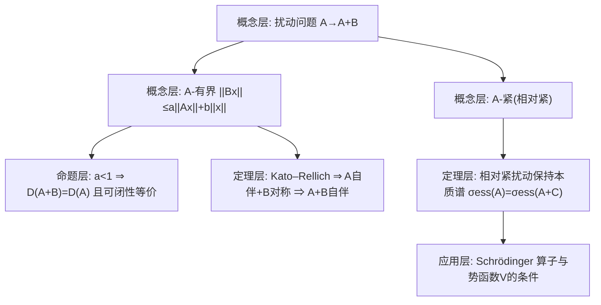

**相关笔记：** [[6.4 自伴扩张]]｜[[6.6 无界算子序列的收敛性]]｜[[第06章 无界算子 — 章节汇总]]

> [!abstract] 概览
> 本节研究：在已知算子 $A$ 上加一个“相对小”的算子 $B$，$A$ 的关键性质（闭性、自伴性、下半有界性、本质谱）能否保持？  
> 主线由两个“相对性”概念驱动：  
> - **$A$-有界（相对有界）**：$D(B)\supset D(A)$，且存在 $a,b\ge0$ 使
> $$
> \|Bx\|\le a\|Ax\|+b\|x\|,\quad \forall x\in D(A). \quad (6.5.1)
> $$
> 其中最小的 $a$ 称为 $B$ 关于 $A$ 的界。  
> - **$A$-紧（相对紧）**：$B:(D(A),\|\cdot\|_A)\to\mathcal H$ 紧（以图范数度量）。  
> 关键产出：  
> - 若 $B$ 关于 $A$ 的界 $<1$，则 $A$ 可闭化 $\Leftrightarrow A+B$ 可闭化（并且 $D(A+B)=D(A)$）。  
> - **Kato–Rellich 定理**：$A$ 自伴、$B$ 对称且 $A$-有界界 $<1$ ⇒ $A+B$ 自伴（并保持下半有界性）。  
> - 相对紧扰动保持本质谱：例如 $C$ 紧 ⇒ $\sigma_{ess}(A)=\sigma_{ess}(A+C)$。  
> ^overview

---

# 1. 本节主题定位

- **本节的核心问题**
  1) “$A+B$ 是否仍闭/可闭/自伴”最关键要检查什么？（答案：$B$ 相对 $A$ 的小性）  
  2) 为什么“界 $<1$”是临界阈值？它在证明中在哪里被用来保证可逆/收敛？  
  3) 相对紧扰动为什么不会改变本质谱？本质谱与紧算子之间的关系是什么？

- **本节在本章知识链中的位置**
  - 6.4 解决“如何获得一个自伴算子”；6.5 解决“获得后是否稳定”。  
  - 6.6 讨论算子序列收敛时，也常用“预解算子差为紧/小”的估计。

- **本节依赖哪些前置概念/定理**
  - 6.1：图范数与可闭判别（将直接用于“$A$-紧”与“可闭化等价”）。  
  - 6.2：自伴的预解点性质（用于 resolvent 估计）。  
  - 6.3：本质谱/紧扰动（与 Calkin 思想一致）。

- **本节为后续哪些内容铺路**
  - Schrödinger 算子 $H=-\Delta+V$ 的自伴性与谱性质，常用本节的 Kato–Rellich 与本质谱稳定性作“合法性证明”。

---

# 2. 内容分层图

---

# 3. 定义系统

## 3.1 $A$-有界（相对有界）与相对界

> [!quote] 原文直接信息（定理 6.5.1 与不等式 (6.5.1)）
> 设 $A,B$ 是 Hilbert 空间上的稠定算子，在 $D(A)$ 上赋以图模 $\|x\|_A=\|x\|+\|Ax\|$。若  
> (1) $D(B)\supset D(A)$；  
> (2) $B:(D(A),\|\cdot\|_A)\to(\mathcal H,\|\cdot\|)$ 有界，  
> 则称 $B$ 是 $A$-有界的。此时存在 $a,b\ge0$ 使
> $$
> \|Bx\|\le a\|Ax\|+b\|x\|,\ \forall x\in D(A). \quad (6.5.1)
> $$
> 使上式成立的 $a$ 的下确界称为 $B$ 关于 $A$ 的界。

- **重要条件的作用**
  - $D(B)\supset D(A)$：保证能在同一域比较 $A$ 与 $B$；否则连 $A+B$ 的定义都不稳定。  
  - “图范数下有界”：把 $B$ 的大小用 $A$ 的几何控制起来，这是无界情形的“相对小”。
- **最小例子**
  - 若 $B\in L(\mathcal H)$ 有界，则 $B$ 一定是 $A$-有界，且相对界为 0。
- **初学者误区**
  - 误以为“$\|Bx\|\le b\|x\|$”才叫小；在无界情形更常见的是由 $\|Ax\|$ 控制。

## 3.2 $A$-紧（相对紧）

> [!quote] 原文直接信息（定义 6.5.6 的精神）
> 若 $B:(D(A),\|\cdot\|_A)\to\mathcal H$ 是紧算子，则称 $B$ 是 $A$-紧的（或 $B$ 关于 $A$ 紧）。

- **它解决什么问题**
  - 这是“紧扰动不会改变本质谱”的自然抽象版本：把紧性搬到图范数空间。
- **初学者误区**
  - 把 $A$-紧误当“$B$ 在 $\mathcal H$ 上紧”；实际上 $B$ 可能无界，但在图范数意义下紧。

---

# 4. 定理/命题系统

## 4.1 定理 6.5.2：相对界 < 1 时可闭性等价

> [!quote] 原文直接信息（定理 6.5.2 的核心结论，式(6.5.3)）
> 设 $A,B$ 为稠定算子，$B$ 关于 $A$ 有界，且相对界 $a<1$。则在 $D(A)$ 上定义 $A+B$，并且
> $$
> D(A+B)=D(A),
> $$
> 且 $A+B$ 可闭化当且仅当 $A$ 可闭化（特别地，$A$ 闭 $\Rightarrow A+B$ 闭）。

- **条件逐条解释**
  - $a<1$：保证 $A$ 与 $A+B$ 的图范数互相控制（等价范数），从而 Cauchy 性与闭性可传递。
- **证明骨架（Step 1/2/3）**
  - Step 1：由 $\|Bx\|\le a\|Ax\|+b\|x\|$ 推出双边估计：
> $$
> (1-a)\|Ax\|-b\|x\|\le \|(A+B)x\|\le (1+a)\|Ax\|+b\|x\|.
> $$
  - Step 2：把它改写为图范数的等价：$\|x\|_A\asymp \|x\|_{A+B}$。  
  - Step 3：用 6.1 的“可闭判别/闭 ⇔ 图范数完备”在等价范数下传递。
- **最关键的一跳**
  - 用 $a<1$ 得到左侧严格正的系数 $(1-a)$，从而实现范数等价；这就是阈值所在。

## 4.2 Kato–Rellich 定理（6.5.10/6.5.12 的主结论）

> [!quote] 原文直接信息（Kato–Rellich 的精神）
> 设 $A$ 为自伴算子，$B$ 为对称算子，且 $B$ 关于 $A$ 有界且相对界 $<1$，则 $A+B$ 在 $D(A)$ 上自伴；若 $A$ 下半有界，则 $A+B$ 也下半有界。

- **条件逐条解释**
  - $A$ 自伴：提供 resolvent 与谱工具（预解点存在、逆有界）。  
  - $B$ 对称：保证 $A+B$ 至少形式上对称；否则不可能自伴。  
  - 相对界 $<1$：保证“扰动小到不会破坏自伴性”，在证明中用于 Neumann 级数/逆算子展开。
- **证明骨架（Step 1/2/3）**
  - Step 1：用 $A$ 自伴推出某个 $\lambda\in\rho(A)$（例如 $\lambda=i$ 或足够大实数），并估计 $\|BR_\lambda(A)\|$。  
  - Step 2：由相对界 $<1$ 选取 $\lambda$ 使 $\|BR_\lambda(A)\|<1$，从而
> $$
> (I-BR_\lambda(A))^{-1}=\sum_{n=0}^\infty (BR_\lambda(A))^n
> $$
  - Step 3：构造 $R_\lambda(A+B)=R_\lambda(A)(I-BR_\lambda(A))^{-1}$ 并证明 $\lambda\in\rho(A+B)$，结合对称性与预解点判别推出自伴。
- **最关键的一跳**
  - 把相对有界不等式转换为 $\|BR_\lambda(A)\|<1$ 的估计，进而用 Neumann 级数构造 resolvent。

## 4.3 相对紧扰动与本质谱稳定（6.5.16/6.5.18 的结论）

> [!quote] 原文直接信息（本质谱不变的典型结论）
> 设 $A$ 为自伴算子，$C$ 为紧算子，则
> $$
> \sigma_{ess}(A)=\sigma_{ess}(A+C).
> $$

- **条件逐条解释**
  - $C$ 紧：在 Calkin 代数里为 0，因此不会改变“模紧可逆性”，从而不改变本质谱。  
  - 自伴：保证谱位于实轴，本质谱刻画可用。
- **证明骨架（Step 1/2/3）**
  - Step 1：用“本质谱=模紧谱”（或等价刻画：$\lambda\notin\sigma_{ess}(A)$ 当且仅当 $A-\lambda I$ 为 Fredholm）。  
  - Step 2：紧扰动不改变 Fredholm 性。  
  - Step 3：得到本质谱不变。
- **关键一跳**
  - 把“谱”转成“Fredholm 性/商代数可逆性”的刻画（与第5章 Calkin 思想一致）。

---

# 5. 例子与反例系统

- **本节最关键的例子**
  - Schrödinger 算子：$H=-\Delta+V$。当势函数 $V$ 满足“相对 $-\Delta$ 小”的条件时，可用 Kato–Rellich 推出 $H$ 自伴，从而谱分解可用。  
  - 例 6.5.5（按分片）：$A=d/dt$、$B$ 为点值算子 $u\mapsto u(a)$，展示 $B$ 关于 $A$ 的相对界为 0（“非常小”但并不在 $L^2$ 上有界）。

- **本节最值得补的反例**
  - 相对界 $\ge 1$ 时，$A+B$ 可能失去闭性/自伴性（阈值的必要性）：例如过强的势函数会导致 Schrödinger 算子不再自伴或出现多种扩张。

---

# 6. 本节逻辑链复原

1) 先用物理动机引入：$H=A+B$ 的可观测性要求自伴，问题转为“加上势能后是否仍自伴”。  
2) 引入 $A$-有界：把 $B$ 的大小用 $A$ 的图范数控制，这是无界理论的基本尺度。  
3) 证明相对界 $<1$ 时，$A$ 与 $A+B$ 的图范数等价，从而可闭性/闭性能传递（定理 6.5.2）。  
4) 在此基础上，用 resolvent + Neumann 级数证明 Kato–Rellich：自伴 + 对称小扰动仍自伴，并讨论下半有界性保持。  
5) 最后引入 $A$-紧/紧扰动，证明本质谱稳定，为量子力学算子的谱结构分析提供“稳健性工具”。

---

# 7. 本节高风险误区（≥5）

1) **把 $A$-有界误当“$B$ 有界”**
   - 为什么：名字容易混淆。  
   - 正确理解：$A$-有界是“图范数下有界”，允许 $B$ 在 $\mathcal H$ 上无界（如点值算子）。

2) **忽略相对界阈值 $a<1$ 的作用点**
   - 为什么：只当作技术条件。  
   - 正确理解：它保证图范数等价/Neumann 级数收敛；没有它就可能无法构造 resolvent。

3) **只检查 $B$ 对称而忘了域关系 $D(B)\supset D(A)$**
   - 为什么：容易只看形式。  
   - 正确理解：域不包含则 $A+B$ 甚至没法在 $D(A)$ 上定义。

4) **把“$A$ 可闭化 $\Leftrightarrow A+B$ 可闭化”误用到 $a\ge1$**
   - 为什么：记住结论但忘条件。  
   - 正确理解：必须 $a<1$；否则图范数不一定等价。

5) **把“紧扰动不变谱”误读为“所有谱都不变”**
   - 为什么：本质谱与离散谱容易混。  
   - 正确理解：紧扰动保持的是 **本质谱**；离散谱（孤立特征值）可能移动/产生/消失。

---

# 8. 知识库拆分建议

- **A类：应独立成概念卡**
  - $A$-有界（相对有界）与相对界  
  - $A$-紧（相对紧）  
  - Kato–Rellich 条件（作为“判别模板”）
  - 本质谱与紧扰动稳定性

- **B类：应独立成定理卡**
  - 定理 6.5.2（相对界 < 1 的可闭性等价）  
  - Kato–Rellich 定理（自伴 + 小对称扰动仍自伴）  
  - 紧扰动保持本质谱（$\sigma_{ess}(A)=\sigma_{ess}(A+C)$）

- **C类：只保留在本节页中**
  - Schrödinger 算子动机与把 $V$ 估计成相对界的具体套路（可在第二轮拆专题）  
  - resolvent 展开与估计常数的计算链（作为做题模板）

- **D类：建议作为专题综述页候选节点**
  - “自伴算子的稳定性：闭性/自伴性/本质谱三条主线”  
  - “相对有界 vs 相对紧：两种‘小扰动’的谱后果对比”

---

# 9. 后续学习接口

- **适合下一轮展开证明的点**
  - 从 (6.5.1) 推到图范数等价的双边估计（定理 6.5.2 的关键）。  
  - Kato–Rellich 中如何选取 $\lambda$ 让 $\|BR_\lambda(A)\|<1$（常数追踪）。

- **适合设计习题的点**
  - 给定具体 $A,B$，计算相对界并判别 $A+B$ 是否自伴/本质自伴。  
  - 用紧扰动刻画本质谱：用 Calkin/Fredholm 刻画做一题完整推导。

- **适合与前一节做比较的点（6.4）**
  - 6.4 解决“如何得到自伴算子”；6.5 解决“得到后是否稳定/谱如何变”。  

- **适合与下一节做衔接的点（6.6）**
  - 6.6 将讨论预解算子与收敛性；本节 resolvent 估计与 Neumann 级数是核心桥梁。

---

# 10. 自测问题

## 10.A 自测问题（5题）
1) $B$ 关于 $A$ 有界的定义是什么？如何从“图范数下有界”推出不等式 (6.5.1)？  
2) 为什么相对界 $a<1$ 能推出 $\|\cdot\|_A$ 与 $\|\cdot\|_{A+B}$ 等价？请指出最关键的一步。  
3) Kato–Rellich 定理中，“$B$ 对称”与“相对界 $<1$”分别在哪一步被使用？  
4) 什么是 $A$-紧？它与普通紧算子有什么区别？  
5) 为什么紧扰动只能保证本质谱不变，而不能保证离散谱不变？

## 10.B 习题（完整解答，按教材编号全覆盖）

> [!warning]
> 本分片 PDF 的末页已进入下一节（§6 无界算子序列的收敛性），OCR 未稳定提取到“习题”标题与题号区块；因此 6.5 的习题编号需要在下一轮按 PDF 人工逐页核对补齐门禁表并逐题补全解答。
>
> 第一轮先按“可持续扩展”原则保留以下骨架：
> - [ ]（待从PDF补齐）6.5.* 题号门禁表
> - [ ] 每题 [!problem] 原题面（含页码）
> - [ ] 每题 [!solution]- 全解（点名用到的定理：6.5.2 / Kato–Rellich / 本质谱稳定等）

## 10.C 引用与原文 PDF（末尾嵌入）
![[00-Raw素材/泛函分析讲义_张恭庆/章节内容/第六章_无界算子/6.5_自伴算子的扰动.pdf]]

