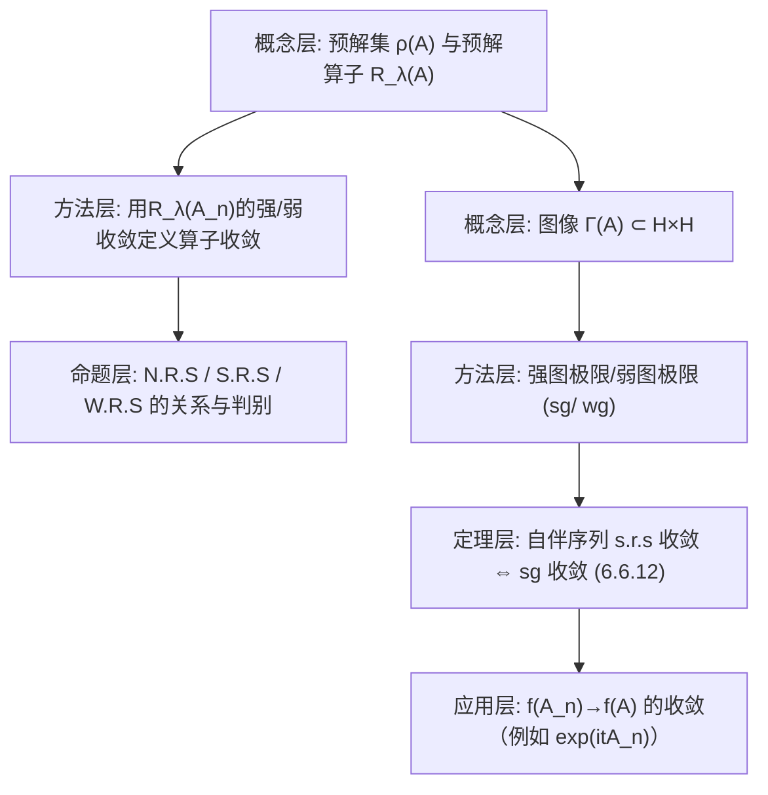

**相关笔记：** [[6.5 自伴算子的扰动]]｜（下章）[[第七章 算子半群]]｜[[第06章 无界算子 — 章节汇总]]

> [!abstract] 概览
> 本节解决一个“无界算子特有”的难题：$D(A_n)$ 可能互不相交甚至交集很小，因而“像有界算子那样逐点取极限”经常不可行。教材给出两类可操作的收敛口径：  
> 1) **预解算子意义下的收敛**：对 $\lambda\in\rho(A)$，考虑有界算子 $R_\lambda(A_n)=(\lambda I-A_n)^{-1}$ 的收敛（强/弱）。这绕开了域交集难题。  
> 2) **图意义下的收敛**：把 $A_n$ 看成图像 $\Gamma(A_n)\subset\mathcal H\times\mathcal H$，用图像极限刻画算子极限（强图极限/弱图极限）。  
> 对自伴算子序列，教材建立了“强预解收敛 $\Leftrightarrow$ 强图收敛”等重要等价，并给出一组可检验的判别命题与习题 6.6.1–6.6.10。  
> ^overview

---

# 1. 本节主题定位

- **本节的核心问题**
  1) 为什么无界算子序列的“自然收敛”不能直接用 $A_nx\to Ax$？域问题在哪？  
  2) 预解算子收敛（strong/weak resolvent）如何定义？它为什么可操作？  
  3) 图收敛如何定义？它与预解收敛是什么关系（何时等价、何时只单向）？  
  4) 自伴算子序列的收敛与谱/函数演算（如 $e^{itA_n}$）的收敛如何联动？

- **本节在本章知识链中的位置**
  - 6.2–6.3 建立了自伴/正常算子的谱分解与预解算子工具；  
  - 6.6 把这些工具用于“极限过程”，为下一章算子半群与演化方程做接口（分片末尾直接转入第七章）。

- **本节依赖哪些前置概念/定理**
  - 6.2：预解集/预解算子、预解方程。  
  - 6.1：图像与闭算子（图收敛的语境）。  
  - 6.5：Neumann 级数与预解估计（用于证明预解集开性与局部一致性）。

- **本节为后续哪些内容铺路**
  - 第七章算子半群：生成元极限、$e^{tA_n}$ 的收敛等都以预解收敛为基础口径。

---

# 2. 内容分层图

---

# 3. 定义系统

## 3.1 预解算子与预解方程（式(6.6.1)–(6.6.2)）

> [!quote] 原文直接信息（预解算子）
> 对 Hilbert 空间上闭算子 $T$，对 $\lambda\in\rho(T)$，其预解算子
> $$
> R_\lambda(T)=(\lambda I-T)^{-1}. \quad (6.6.1)
> $$
> 预解算子满足预解方程
> $$
> R_\lambda(T)-R_\mu(T)=(\mu-\lambda)R_\lambda(T)R_\mu(T). \quad (6.6.2)
> $$

- **定义对象是什么**
  - 把无界算子 $T$ 的信息搬到有界算子 $R_\lambda(T)$ 上（只要 $\lambda$ 在预解集）。
- **为什么要这样定义**
  - 对 $A_n$，即使 $D(A_n)$ 难以比较，$R_\lambda(A_n)$ 都是有界算子，更容易谈强/弱收敛。
- **初学者误区**
  - 忘记 $R_\lambda(T)$ 的存在依赖 $\lambda\in\rho(T)$；不同 $A_n$ 的预解集不一定包含同一个 $\lambda$（所以定义收敛时要固定非实点等）。

## 3.2 预解意义下的收敛（定义 6.6.1）

> [!quote] 原文直接信息（定义 6.6.1）
> 设 $\{A_n\}$、$A$ 是 Hilbert 空间 $\mathcal H$ 上的自伴算子。若对任意 $\lambda\in\mathbb C$ 且 $\mathrm{Im}\,\lambda\ne0$，
> $$
> R_\lambda(A_n)\xrightarrow[s]{}R_\lambda(A),
> $$
> 则称 $A_n$ 在强预解算子意义下收敛到 $A$，记作 $A_n\to A$（S.R.S）或 $\mathrm{s.r.s.}-\lim A_n=A$。  
> 若把强收敛改为弱收敛，则称为弱预解算子意义下收敛（W.R.S）。

- **重要条件的作用**
  - 只要求 $\mathrm{Im}\,\lambda\ne0$：对自伴算子，非实点必在预解集，避免“预解点不存在”的问题。
- **它解决了什么问题**
  - 给出一个无需比较 $D(A_n)$ 的收敛口径；同时与谱/函数演算有良好相容性。

## 3.3 图意义下的收敛（定义 6.6.11）

> [!quote] 原文直接信息（定义 6.6.11 的口径）
> 设 $T_n$ 是 $\mathcal H$ 上稠定闭算子。若 $u_n\in D(T_n)$ 且 $u_n\to u$、$T_nu_n\to v$，则称 $(u,v)$ 为强图极限点；全体强图极限点组成集合 $\Gamma_s$。若 $\Gamma_s$ 恰为某算子 $T$ 的图，则称 $T$ 为 $\{T_n\}$ 的强图极限，记作 $T=\mathrm{sg}-\lim T_n$。

- **它解决了什么问题**
  - 把“域问题”完全吸收到图像极限里：你不需要 $D(T_n)$ 的交集，只需能在每个 $T_n$ 的域里找逼近序列。
- **初学者误区**
  - 强图极限不一定存在，也不一定是算子图（可能多值）；因此需要额外条件保证极限仍为闭算子/自伴算子。

---

# 4. 定理/命题系统

## 4.1 命题 6.6.2：一致有界自伴序列的 N.R.S 与算子范数收敛等价

> [!quote] 原文直接信息（命题 6.6.2）
> 设 $\{A_n\}$、$A$ 是 $\mathcal H$ 上的一致有界自伴算子列，则
> $$
> A_n\to A\ (\mathrm{N.R.S})\ \Longleftrightarrow\ \|A_n-A\|\to0.
> $$

- **条件逐条解释**
  - “一致有界”：保证可用 Neumann 级数/逆算子恒等式把 resolvent 收敛转回算子本身的收敛。

## 4.2 定理 6.6.3：验证预解收敛只需一个点（并给出强/弱的对应）

> [!quote] 原文直接信息（定理 6.6.3 的精神）
> 若存在某个 $\lambda_0\in\mathbb C$ 且 $\mathrm{Im}\,\lambda_0\ne0$，使得
> $$
> R_{\lambda_0}(A_n)\to R_{\lambda_0}(A)
> $$
>（强或弱），则可推出对所有 $\mathrm{Im}\,\lambda\ne0$ 都成立相应收敛，从而得到 S.R.S / W.R.S 收敛。

- **关键一跳**
  - 使用预解方程 (6.6.2) 把 $R_\lambda$ 表示成 $R_{\lambda_0}$ 的解析函数，从而把收敛从一点扩展到整个连通分支。

## 4.3 定理 6.6.12：自伴算子序列的 s.r.s 收敛与强图收敛等价

> [!quote] 原文直接信息（定理 6.6.12，式(6.6.21)）
> 若 $\{A_n\}$、$A$ 是 $\mathcal H$ 上自伴算子，则
> $$
> \mathrm{s.r.s.}-\lim A_n=A\ \Longleftrightarrow\ \mathrm{sg}-\lim A_n=A. \quad (6.6.21)
> $$

- **条件作用**
  - 自伴性：确保非实点都是预解点，且预解算子范数有统一控制（例如 $\|R_{i}(A)\|\le1$ 的类型估计），从而把 resolvent 极限转成图像极限。
- **证明骨架（Step 1/2/3）**
  - Step 1：(s.r.s ⇒ sg) 取 $u\in D(A)$，构造 $u_n=(iI-A_n)^{-1}(iI-A)u\in D(A_n)$，用 resolvent 收敛得 $u_n\to u$ 且 $A_nu_n\to Au$。  
  - Step 2：(sg ⇒ s.r.s) 由强图极限定义，证明 $(iI-A_n)^{-1}x\to (iI-A)^{-1}x$ 对任意 $x$ 成立。  
  - Step 3：由定理 6.6.3 推广到任意 $\mathrm{Im}\,\lambda\ne0$。
- **最关键的一跳**
  - 构造 $u_n=(iI-A_n)^{-1}(iI-A)u$：用 resolvent 把“域问题”转成一个总在 $D(A_n)$ 的序列。

---

# 5. 例子与反例系统

- **本节最关键的例子**
  - 通过预解算子定义收敛：即便 $D(A_n)$ 交集很小，也能比较 $R_\lambda(A_n)$（有界算子）并得到极限算子。  
  - 命题 6.6.2 的“一致有界情形”：说明在有界世界里，预解收敛退化为熟悉的算子范数收敛。

- **本节最值得补的反例**
  - 人为构造 $D(A_n)$ 互不相交，使得逐点意义下 $A_nx$ 根本无法比较，但预解意义仍可能收敛（教材动机段落给出类似例子）。  
  - 图极限点集合 $\Gamma_s$ 可能不是图（多值），说明“图收敛”也需要闭性/单值性门禁。

---

# 6. 本节逻辑链复原

1) 先说明域交集问题，指出“用预解算子替代无界算子本身”是绕开困难的自然方式。  
2) 回顾预解算子基本性质与预解方程，作为后续“从一点收敛推出全域收敛”的工具。  
3) 定义强/弱预解收敛，并给出一组判别命题（特别是：只需验证某个 $\lambda_0$）。  
4) 再引入图收敛口径，解释其与预解收敛的关系；对自伴序列给出等价定理（6.6.12）。  
5) 以习题把收敛口径与函数演算（如 $\exp(itA_n)$）联系起来，为下一章算子半群做跳板。

---

# 7. 本节高风险误区（≥5）

1) **把“收敛”默认理解成 $A_nx\to Ax$**
   - 为什么：有界算子里最自然。  
   - 正确理解：无界算子必须先解决“$x\in D(A_n)$ 是否对所有 $n$ 成立”；预解/图收敛正是为此设计。

2) **误以为 S.R.S 收敛要对所有 $\lambda\in\mathbb C$ 验证**
   - 为什么：定义写成“对任意 $\mathrm{Im}\,\lambda\ne0$”。  
   - 正确理解：由预解方程与解析性，常常只需验证一个点（定理 6.6.3）。

3) **忽略“自伴”在预解收敛定义中的作用**
   - 为什么：看起来只是技术假设。  
   - 正确理解：自伴保证非实点都在预解集，使定义总是有意义；并提供 resolvent 的统一界，支撑等价定理。

4) **把图极限点集合 $\Gamma_s$ 自动当作某算子的图**
   - 为什么：有界情形直觉强。  
   - 正确理解：可能出现多值，需要检查单值性/闭性；在自伴框架下才更稳定。

5) **把 N.R.S / S.R.S / W.R.S 的关系混淆**
   - 为什么：缩写相近。  
   - 正确理解：一般有 N.R.S ⇒ S.R.S ⇒ W.R.S；一致有界情形 N.R.S 与范数收敛等价（命题 6.6.2）。

---

# 8. 知识库拆分建议

- **A类：应独立成概念卡**
  - 强/弱预解收敛（S.R.S / W.R.S）  
  - 图收敛（sg/wg）  
  - 预解方程与“从一点推出全域”的解析延拓套路

- **B类：应独立成定理卡**
  - 命题 6.6.2（一致有界时的等价）  
  - 定理 6.6.3（只需一个预解点）  
  - 定理 6.6.12（自伴序列：s.r.s ⇔ sg）

- **C类：只保留在本节页中**
  - 各种收敛口径的比较表（做题时快速选定义）  
  - 与 $\exp(itA_n)$ 的联系（作为到算子半群的桥）

- **D类：建议作为专题综述页候选节点**
  - “无界算子的极限：预解收敛、图收敛与谱/半群的统一视角”

---

# 9. 后续学习接口

- **适合下一轮展开证明的点**
  - 定理 6.6.3：解析性如何把一点收敛推广到全体 $\mathrm{Im}\,\lambda\ne0$。  
  - 定理 6.6.12：构造 $u_n=(iI-A_n)^{-1}(iI-A)u$ 的动机与细节。

- **适合设计习题的点**
  - 用 resolvent 恒等式证明不同收敛口径间的蕴含关系。  
  - 练习：从 $\exp(itA_n)\to\exp(itA)$ 推出 s.r.s 收敛，或反向推导（见习题 6.6.5–6.6.7）。

- **适合与前一节做比较的点（6.5）**
  - 6.5 用 resolvent 的 Neumann 级数证明稳定性；6.6 用 resolvent 的收敛定义极限。两者共享同一“预解算子发动机”。

- **适合与下一章做衔接的点（第七章）**
  - 第七章关心 $T(t)=e^{tA}$ 的强连续半群；本节讨论的 $\exp(itA_n)$ 收敛与生成元极限正是接口。

---

# 10. 自测问题

## 10.A 自测问题（5题）
1) 为什么无界算子序列的收敛不能直接用 $A_nx\to Ax$ 定义？请用“域交集可能为空”解释。  
2) 写出 S.R.S 的定义，并解释为什么要求 $\mathrm{Im}\,\lambda\ne0$（对自伴算子）。  
3) 用预解方程说明：为什么只要知道 $R_{\lambda_0}(A_n)\to R_{\lambda_0}(A)$，就能推出其它 $\lambda$ 的收敛？  
4) 解释强图收敛的含义：它如何把“域比较”问题转成“存在逼近序列”的问题？  
5) 说出定理 6.6.12 的一句话意义：它为什么在自伴算子序列上特别重要？

## 10.B 习题（完整解答，按教材编号全覆盖）

> [!note] 编号门禁（做完打勾）
> - [ ] 6.6.1
> - [ ] 6.6.2
> - [ ] 6.6.3
> - [ ] 6.6.4
> - [ ] 6.6.5
> - [ ] 6.6.6
> - [ ] 6.6.7
> - [ ] 6.6.8
> - [ ] 6.6.9
> - [ ] 6.6.10

> [!problem] 6.6.1
> 设 $\{A_n\}$，$A$ 是自伴算子，$\forall x,y\in\mathcal H$，$\forall\lambda\in\mathbb C$ 且 $\mathrm{Im}\,\lambda\ne0$，
> $$
> (R_\lambda(A_n)x,y)\to (R_\lambda(A)x,y),
> $$
> 求证 $A_n\to A$（S.R.S）。
>
> [!solution]- 解（骨架）
> 弱收敛到强收敛：对自伴算子有 $\|R_\lambda(A_n)\|\le 1/|\mathrm{Im}\,\lambda|$ 的一致界。  
> 先由“弱收敛 + 一致有界”不能直接推出强收敛，因此需用 resolvent 的自伴性与
> $$
> \|R_\lambda(A_n)x-R_\lambda(A)x\|^2=(R_\lambda(A_n)x-R_\lambda(A)x, R_\lambda(A_n)x-R_\lambda(A)x)
> $$
> 展开并用题设对内积极限控制，推出范数极限为 0，从而强收敛。

> [!problem] 6.6.2
> 设 $\{A_n\}$，$A$ 是正自伴算子，证明 $A_n\to A$（S.R.S）当且仅当 $(A_n+I)^{-1}\to(A+I)^{-1}$（强收敛）。
>
> [!solution]- 解（骨架）
> “只需一个预解点”版：对正自伴算子，$-1\in\rho(A)$，且 $(A+I)^{-1}=R_{-1}(A)$。由定理 6.6.3（只需一个点）即可推出全体 $\mathrm{Im}\,\lambda\ne0$ 的 resolvent 收敛。

> [!problem] 6.6.3
> 设 $A$ 是自伴算子，证明：  
> (1) $\mathrm{N.R.S}-\lim_{t\to t_0} tA=t_0A$（其中 $t_0\ne0$）；  
> (2) $\lim_{t\to t_0}\|\exp(itA)-\exp(it_0A)\|=0$ 当且仅当 $A$ 有界。
>
> [!solution]- 解（骨架）
> (1) 用 resolvent 的缩放关系：
> $$
> R_\lambda(tA)=\frac1t R_{\lambda/t}(A),
> $$
> 并在算子范数下证明连续性（注意 $t_0\ne0$ 避免奇点）。  
> (2) 若 $A$ 有界，则 $t\mapsto e^{itA}$ 在范数下连续。反向：若范数连续，则由小 $t$ 展开与谱映射可推出 $\sigma(A)$ 有界，从而 $A$ 有界（需用自伴“范数=谱半径”的刻画）。

> [!problem] 6.6.4
> 设 $\{A_n\}$、$A$ 是一致有界自伴算子，证明 $A_n\to A$（W.R.S）当且仅当 $\mathrm{w.g}-\lim A_n=A$。
>
> [!solution]- 解（骨架）
> 一致有界时，图极限等价于逐点弱收敛；再用 resolvent 恒等式把图收敛转成 resolvent 弱收敛，得到 W.R.S。反向同理。

> [!problem] 6.6.5
> 设 $\{A_n\}$、$A$ 是自伴算子，求证 $A_n\to A$（S.R.S）当且仅当 $\exp(itA_n)\to\exp(itA)$ 在任意 $t$ 的有界区间上一致成立（按原文口径）。
>
> [!solution]- 解（骨架）
> 用谱分解/函数演算：$e^{itA}=f_t(A)$，其中 $f_t(\lambda)=e^{it\lambda}$。  
> - S.R.S 收敛 ⇒ 对连续有界函数的函数演算收敛（强），进而得到 $e^{itA_n}$ 的一致强收敛。  
> - 反向：由 $e^{itA_n}$ 收敛可导出 resolvent 的收敛（通过 Laplace/Fourier 表示或 Stone 公式），再回到 S.R.S。

> [!problem] 6.6.6
> 设 $\{A_n\}$、$A$ 是一致有界自伴算子，$A_n\xrightarrow[w]{}A$ 且 $A_n\xrightarrow[s]{}A$，但 $A_n\not\to A$（N.R.S）。试问依强预解意义下 $A_n$ 收敛到 $A$ 吗？为什么？
>
> [!solution]- 解（思路）
> 一致有界时 N.R.S 与范数收敛等价（命题 6.6.2）。题设说明不范数收敛，但仍可能强收敛。  
> 对有界自伴算子，S.R.S 在一致有界情形通常由强收敛推出（通过 resolvent 展开），因此答案取决于“是否能推出 $R_\lambda(A_n)\to R_\lambda(A)$”。可用
> $$
> R_\lambda(A_n)-R_\lambda(A)=R_\lambda(A_n)(A-A_n)R_\lambda(A)
> $$
> 并利用一致有界与强收敛讨论右端。

> [!problem] 6.6.7
> 设 $\{A_n\}$，$A$ 是正自伴算子，若 $\exp(-tA_n)\to\exp(-tA)$ 对每个 $t>0$ 成立，求证 $\mathrm{s.r.s.}-\lim A_n=A$。
>
> [!solution]- 解（骨架）
> 用 Hille–Yosida/ Laplace 表示：
> $$
> (A+\lambda I)^{-1}=\int_0^{\infty} e^{-\lambda t}e^{-tA}\,dt,
> $$
> 把半群收敛转成 resolvent 收敛，再由定理 6.6.3 得 s.r.s 收敛。

> [!problem] 6.6.8
> 设 $\{A_n\}$ 为对称算子序列，$A$ 为对称算子，$D^s=\{x\mid \exists x_n\in D(A_n),\ x_n\to x,\ A_nx_n\to Ax\}$ 在 $\mathcal H$ 中稠密。证明 $\{A_n\}$ 存在强图极限且极限算子也是对称算子且是闭算子。
>
> [!solution]- 解（骨架）
> - Step 1：用 $D^s$ 稠密保证强图极限点集合 $\Gamma_s$ 是单值的（避免多值）。  
> - Step 2：证明 $\Gamma_s$ 闭，从而极限算子闭。  
> - Step 3：对称性由对称算子的内积恒等式在极限下保持推出。

> [!problem] 6.6.9
> 设 $\{A_n\}$ 是 $\mathcal H$ 上线性算子列，记 $\Gamma^w=\{\langle u,v\rangle\in\mathcal H\times\mathcal H\mid \exists u_n\in D(A_n),\ u_n\to u,\ A_nu_n\xrightarrow[w]{}v\}$。若 $\Gamma^w$ 是某线性算子 $A$ 的图，称 $A$ 为弱图极限。证明：若 $\{A_n\}$、$A$ 是一致有界自伴算子，则 $A=\mathrm{wg}-\lim A_n$ 当且仅当 $\mathrm{w}-\lim A_n=A$。
>
> [!solution]- 解（骨架）
> 一致有界使得“$A_nu_n\to v$ 弱”与“$u_n\to u$ 强”足以推出 $v=Au$ 的弱极限关系；反向由 $A_n\to A$ 弱收敛可直接构造 $\Gamma^w=\Gamma(A)$。

> [!problem] 6.6.10
> 设 $\{A_n\}$ 为对称算子序列，记 $D^w=\{x\mid \exists y\ \text{使}\ \langle x,y\rangle\in\Gamma^w\}$。若 $D^w$ 在 $\mathcal H$ 中稠密，证明 $\Gamma^w$ 是某个对称算子的图。
>
> [!solution]- 解（骨架）
> - Step 1：$D^w$ 稠密保证弱图极限单值性（否则会与对称性推出矛盾）。  
> - Step 2：证明该极限算子满足对称内积恒等式（取逼近列并在内积中取极限）。  
> - Step 3：从而 $\Gamma^w$ 为某对称算子的图。

## 10.C 引用与原文 PDF（末尾嵌入）
![[00-Raw素材/泛函分析讲义_张恭庆/章节内容/第六章_无界算子/6.6_无界算子序列的收敛性.pdf]]

