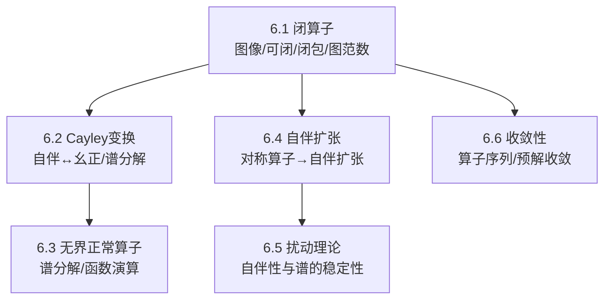

> [!abstract] 概览
> 本章进入“无界算子”的世界：核心困难不在于线性/连续本身，而在于 **定义域 $D(T)$** 与 **闭性/可闭性**。围绕自伴与正常算子，本章把第5章的谱分解思想推广到无界情形，并讨论自伴扩张、扰动与算子序列收敛等“稳定性问题”。  
> - 6.1：闭算子与可闭算子（图像闭性、图范数、闭包）  
> - 6.2：Cayley 变换与无界自伴算子的谱分解  
> - 6.3：无界正常算子的谱分解  
> - 6.4：自伴扩张（对称算子的扩张问题）  
> - 6.5：自伴算子的扰动（稳定性与谱变化）  
> - 6.6：无界算子序列的收敛性（图收敛/预解收敛等口径）  
> ^overview

## 一、章节导航
- 课本分片PDF：见文末“引用与原文PDF”
- 本章笔记：
  - [[6.1 闭算子]]
  - [[6.2 Cayley变换与自伴算子的谱分解]]
  - [[6.3 无界正常算子的谱分解]]
  - [[6.4 自伴扩张]]
  - [[6.5 自伴算子的扰动]]
  - [[6.6 无界算子序列的收敛性]]

## 二、全章结构图（Mermaid）

## 三、各节概览（嵌入聚合）
- ![[6.1 闭算子#^overview]]
- ![[6.2 Cayley变换与自伴算子的谱分解#^overview]]
- ![[6.3 无界正常算子的谱分解#^overview]]
- ![[6.4 自伴扩张#^overview]]
- ![[6.5 自伴算子的扰动#^overview]]
- ![[6.6 无界算子序列的收敛性#^overview]]

## 四、引用与原文 PDF（分片）

> [!quote]- 第六章 无界算子（教材分片PDF）
> ![[00-Raw素材/泛函分析讲义_张恭庆/章节内容/第六章_无界算子/6.1_闭算子.pdf]]
> ![[00-Raw素材/泛函分析讲义_张恭庆/章节内容/第六章_无界算子/6.2_Cayley变换与自伴算子的谱分解.pdf]]
> ![[00-Raw素材/泛函分析讲义_张恭庆/章节内容/第六章_无界算子/6.3_无界正常算子的谱分解.pdf]]
> ![[00-Raw素材/泛函分析讲义_张恭庆/章节内容/第六章_无界算子/6.4_自伴扩张.pdf]]
> ![[00-Raw素材/泛函分析讲义_张恭庆/章节内容/第六章_无界算子/6.5_自伴算子的扰动.pdf]]
> ![[00-Raw素材/泛函分析讲义_张恭庆/章节内容/第六章_无界算子/6.6_无界算子序列的收敛性.pdf]]

