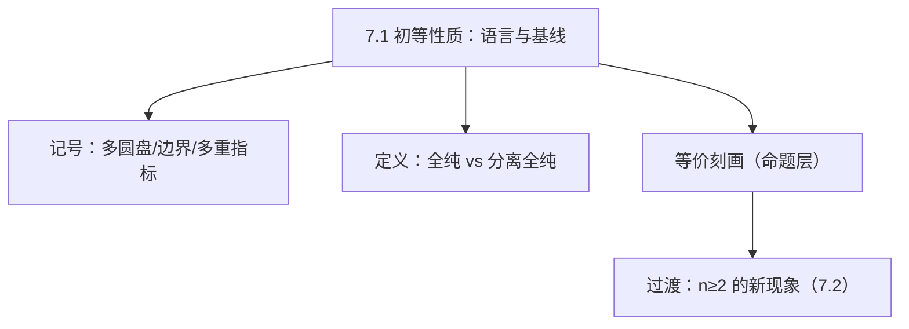

**相关笔记：** [[第06章 Brownian运动引论 — 章节汇总]] | [[7.2 Hartogs现象 一个例子]] | [[第07章 多复变引论 — 章节汇总]]

> [!abstract] 概览
> ==核心术语==：全纯（holomorphic）｜分离全纯（separately holomorphic）｜多重指标（multi-index）｜多圆盘（polydisc）
> - 本节回答：在 $\mathbb C^n$ 上“全纯”到底怎么定义、有哪些等价刻画、哪些条件不可省
> - 本节位置：本章入口；为 7.2（Hartogs 现象）提供“对比基线”，为 7.3（$\bar\partial$ 工具）准备语言
> - 关键警报：只会“一维直觉”会在 $n\ge 2$ 处第一次失效
> - 产出物：后续每节都会反复调用的记号与量词检查模板
^overview

---

# 1. 本节主题定位
- **本节的核心问题**
  - 在开集 $\Omega\subset\mathbb C^n$ 上，什么叫“$f$ 是全纯”？有哪些可用的等价判别口径？
- **本节在本章知识链中的位置**
  - 作为“坐标与语言层”的入口：先把多复变的基本对象（多圆盘、边界、记号）与全纯/分离全纯的差异讲清，再进入 7.2–7.3 的延拓与 PDE 工具。
- **本节依赖哪些前置概念/定理**
  - 一复变：全纯函数、Cauchy 积分公式、幂级数展开、唯一性原理（作为类比背景）。
  - 多元实分析：开集、连续/可微、偏导（用于理解 C-R 体系的“强约束性”）。
- **本节为后续哪些内容铺路**
  - 7.2：为什么“挖洞”在 $n\ge2$ 时不一定产生新奇性（Hartogs 现象）。
  - 7.3：用 $\bar\partial$（非齐次 Cauchy–Riemann）把“现象”变成“定理”。

# 2. 内容分层图
- **概念层**
  - 多圆盘（polydisc）、多重指标、全纯/分离全纯
- **命题层**
  - “全纯”的若干等价刻画（教材以连续函数为入口给出等价条件）
- **方法层**
  - 迭代使用一维 Cauchy 工具（对每个坐标逐次做积分/展开）
  - 量词/条件检查：哪些假设保证“逐坐标全纯 ⇒ 联合全纯”
- **过渡层**
  - 维数效应预告：$n\ge 2$ 时出现 Hartogs 现象；“洞是否可去”变成几何+PDE 问题

# 3. 定义系统
> 说明：本节定义的“严格表述”以教材为准；这里给出可用于后续推理与做题的**对象—动机—例子—误区**结构。

## 3.1 多圆盘（polydisc）与其“区分边界”
- **定义名称**：多圆盘 $P_r(z^0)$（教材记号）
- **严格表述（教材口径）**
  - 给定 $z^0=(z_1^0,\dots,z_n^0)\in\mathbb C^n$ 与 $r=(r_1,\dots,r_n)$（$r_j>0$），
    $$
    P_r(z^0)=\{z=(z_1,\dots,z_n)\in\mathbb C^n:\ |z_j-z_j^0|<r_j,\ 1\le j\le n\}.
    $$
- **定义对象是什么**：$\mathbb C^n$ 中的“坐标乘积型邻域”
- **为什么要这样定义**
  - 多复变的许多局部论证（积分公式、幂级数展开）天然在“乘积型区域”上先成立，再推广到一般开集。
- **它解决了什么问题**
  - 提供可控的局部几何：便于对每个坐标逐次应用一维工具（Fubini/迭代 Cauchy）。
- **与前面概念的关系**
  - 是一复变圆盘的直接乘积推广；但“边界结构”更丰富。
- **最小例子**
  - $n=2$ 时：$P_r(0)=\{(z,w):|z|<r_1,\ |w|<r_2\}$。
- **非例/边界情况**
  - 一般球 $B(0,R)=\{z:\|z\|<R\}$ 不是乘积型，但仍是基本邻域；教材选择多圆盘是为了“迭代一维工具”。
- **初学者误区**
  - 把多圆盘的边界误认为“单一曲面”；实际上它是各坐标圆周/圆盘边界的组合。

## 3.2 多重指标（multi-index）
- **定义名称**：多重指标 $\alpha=(\alpha_1,\dots,\alpha_n)$
- **严格表述**
  - $\alpha_j\in\mathbb Z_{\ge0}$，定义 $z^\alpha=z_1^{\alpha_1}\cdots z_n^{\alpha_n}$。
- **定义对象是什么**：用来表达多元幂级数/多阶导数的“统一记号”
- **为什么要这样定义**
  - 多复变全纯的一个核心口径是“局部幂级数展开”，多重指标让表达可计算、可索引。
- **最小例子**：$\alpha=(2,0,1)$ 则 $z^\alpha=z_1^2 z_3$。
- **误区**：把 $|\alpha|=\sum\alpha_j$ 与逐坐标阶数混淆（做估计时尤其常见）。

## 3.3 全纯（holomorphic）
- **定义名称**：$\Omega\subset\mathbb C^n$ 上的全纯函数
- **严格表述（教材口径）**
  - 教材给出若干等价刻画（如局部幂级数展开、C-R 体系、积分公式等），并以它们之一作为定义入口。
- **定义对象是什么**：复变量的“强正则性”概念（远强于实可微）
- **为什么要这样定义**
  - 目标不是“能求偏导”，而是要获得一整套刚性结论：唯一性、解析延拓、最大模、逼近等。
- **它解决了什么问题**
  - 给出一个可稳定推理的函数类：后续的延拓现象与 PDE 工具都以“全纯”为目标状态。
- **最小例子**：多项式 $p(z)=\sum_\alpha c_\alpha z^\alpha$ 在整个 $\mathbb C^n$ 上全纯。
- **非例/边界情况**
  - 仅实可微（$C^1$）但不满足 C-R 的函数一般不全纯。
- **初学者误区**
  - 把“逐坐标复可微”当成“联合全纯”（见下一定义与 7.3 的技术背景）。

## 3.4 分离全纯（separately holomorphic）
- **定义名称**：分离全纯
- **严格表述**
  - 对每个 $k$，固定其余变量，把 $z_k\mapsto f(z_1,\dots,z_n)$ 视为一复变函数时都全纯。
- **为什么要这样定义**
  - 它是“最容易验证”的弱条件；教材引入它，是为了强调：多复变中“弱条件 + 额外假设”可能推出全纯（Hartogs 型结论）。
- **它解决了什么问题**
  - 在实际构造中，先得到逐坐标全纯更容易；然后用额外条件（如局部有界/可积性/几何）升级为联合全纯。
- **初学者误区**
  - **误区**：分离全纯必然全纯。  
  - **正确做法**：先问“教材是否额外假设了连续性/局部有界/估计？”；7.3 将把这一步变成可证明的定理链条。

# 4. 定理/命题系统
## 4.1 全纯的等价刻画（教材主命题）
> [!quote] 原文直接信息（记号与等价性框架，摘其要点）
> 教材先引入多圆盘 $P_r(z^0)$ 及其边界的乘积集合，并指出：对开集 $\Omega$ 上连续函数，用若干条件刻画“解析性/全纯性”，这些条件是等价的（具体条目以原文为准）。

- **定理名称**：全纯性的等价刻画（连续函数口径）
- **准确内容（结构化复述）**
  - 对连续函数 $f$，教材给出若干判别口径（如：局部幂级数展开 / 迭代 Cauchy 积分表示 / C-R 体系等），并证明它们在 $\Omega$ 上等价。
- **条件逐条解释（你必须会检查的部分）**
  - 连续性（或更强正则）：用于把“逐坐标的一维结论”升级到联合结论，避免病态反例。
  - 局部工作在多圆盘：保证可以对每个坐标应用一维 Cauchy 工具并交换积分/极限。
- **结论到底在说什么**
  - “全纯”不是一种单一的定义，而是一组互相等价的结构：你可以按问题选择最合适的口径。
- **这个定理为什么重要**
  - 它是后续所有工具的“接口规范”：7.3 的 $\bar\partial$ 语言、7.6 最大模、7.7 逼近/延拓都依赖你能在不同口径间切换。
- **证明骨架（Step 1/2/3）**
  - Step 1：在多圆盘上迭代应用一维 Cauchy 积分公式（或幂级数展开）得到表示。
  - Step 2：用表示推出可微性与 C-R 体系（或反向：由 C-R 推出表示）。
  - Step 3：用“局部可表示”拼接到一般开集上。
- **证明中最关键的一跳**
  - “迭代一维工具 + 交换极限/积分/求导”的合法性（通常依赖连续性/一致估计）。
- **后续用途**
  - 7.3：构造延拓时先拼接出候选，再通过 $\bar\partial$ 消除非全纯性，本质上是在不同刻画之间切换。
- **若条件削弱，哪里可能出问题**
  - 如果只保留“逐坐标全纯”而缺少连续性/局部有界等，全纯性可能无法推出（这是多复变中最常见的“看懂但不会用”坑）。

# 5. 例子与反例系统
- **本节最关键的例子**
  1) 多项式/幂级数：天然全纯，是“局部幂级数口径”的原型。
  2) 退化例子：$f(z_1,\dots,z_n)=g(z_1)$，它把多复变问题降维为一复变。
- **本节最值得补的反例**
  - “分离全纯但不全纯”的病态例子需要精心构造；第一轮只记住结论形态：**缺少额外条件时不能推全纯**（把严格反例留到第二轮/专题页）。
- **每个例子/反例分别服务于什么理解点**
  - 例子 1：让你知道“全纯=幂级数”不是口号，而是可计算对象。
  - 退化例子：提醒你做题时可以沿坐标切片降维，但必须检查升级条件。
  - 反例线索：为 7.2–7.3 的“维数效应 + 工具升级”埋伏笔。

# 6. 本节逻辑链复原
1) 作者先声明：多复变与一复变“在很大程度上不同”，并点名后续三条主线（延拓、切向 C-R、边界几何）。  
2) 为了让后续论证可执行，先统一记号：多圆盘、边界乘积、多重指标。  
3) 在此基础上，给出全纯性的等价刻画：你可以用最适合的问题口径来定义/证明。  
4) 最后留下“断裂点”：哪些一维直觉不能照搬，为 7.2 的 Hartogs 现象做铺垫。

# 7. 本节高风险误区
1) **把“逐坐标全纯”当成“联合全纯”**
   - 为什么容易误读：一维经验太强，直觉会自动替你补全缺失条件。
   - 正确理解：需要额外正则/估计；后续 7.3 才有可用的升级工具。
2) **忽略“连续性/局部有界”等看似技术性的假设**
   - 为什么：很多教材在叙述时轻描淡写。
   - 正确理解：这些假设往往是交换极限/积分、拼接局部表示的“许可证”。
3) **把 C-R 体系当作“实可微即可”**
   - 为什么：把复可微误当作 $2n$ 维实微积分的普通可微。
   - 正确理解：全纯是刚性结构，结论远强于实分析。
4) **多圆盘的“边界”理解错**
   - 为什么：把它当成球面类比。
   - 正确理解：乘积边界更适合做“逐坐标积分”，这是教材选它的原因。
5) **在 KaTeX 数学环境里误写双反斜杠命令**
   - 为什么：从 LaTeX 编辑器习惯迁移。
   - 正确理解：本库门禁只允许“单反斜杠开头”的标准命令；不要把命令前多打一个反斜杠，否则容易导致命令裸露、渲染失败。

# 8. 知识库拆分建议
- **A类：应独立成概念卡**
  - 多圆盘（polydisc）与区分边界
  - 多重指标（multi-index）
  - 全纯（多复变口径）
  - 分离全纯
- **B类：应独立成定理卡**
  - 全纯等价刻画（连续函数口径）
- **C类：只保留在本节页中**
  - “本章三条主线预告”的导语（作为阅读入口）
- **D类：建议作为专题综述页的候选节点**
  - 多复变 vs 一复变的“断裂点清单”（为第二轮做题复盘用）

# 9. 后续学习接口
- **适合下一轮展开证明的点**
  - 等价刻画中“迭代 Cauchy 工具”的关键一跳：交换积分/极限的条件。
- **适合设计习题的点**
  - 量词题：写清分离全纯的量词结构；对比全纯缺了什么。
  - 例题：给定 $f(z,w)=g(z)$ 或 $f(z,w)=g(w)$，判断全纯与分离全纯。
- **适合与前一节做比较的点**
  - 与一复变：孤立奇点/延拓直觉为何在 $n\ge2$ 可能失效（为 7.2 做心理准备）。
- **适合与下一节做衔接的点**
  - 7.2 需要的“唯一性原理接口”：若延拓存在通常唯一（后续反复用）。

# 10. 自测问题
1) 写出多圆盘 $P_r(z^0)$ 的定义，并说明教材为何偏好它而不是球。  
2) 用一句话说明“全纯”比“实可微”强在哪里（不要给证明，给结构性理由）。  
3) 给出“分离全纯”的量词形式，并指出它与“全纯”相比缺失的信息是什么。  
4) 说出教材给出的“全纯等价刻画”大致有哪些类型（幂级数/积分/微分），以及你会在什么场景选哪个口径。  
5) 解释：为什么你在读到 7.2 之前就必须对 $n\ge2$ 的维数效应保持警惕？

---

## 引用
![[00-Raw素材/泛函分析/07_第7章_多复变引论/7.1_初等性质.pdf]]
