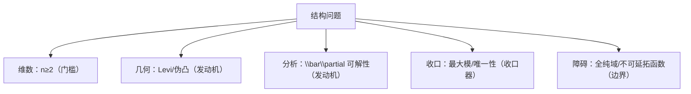

**相关笔记：** [[7.9 习题]] | [[第07章 多复变引论 — 章节汇总]]

> [!abstract] 概览
> ==核心术语==：维数边界｜几何—分析链条｜$\bar\partial$ 可解性｜全纯域的“延拓边界”
> - 本节目标：把本章主线提升为“结构问题”，能说清楚条件的作用与失败方向
> - 第一轮要求：不写长证明，但要写清逻辑链、关键定义、以及削弱条件会在哪一步坏
^overview

---

# 1. 本节主题定位
- **本节的核心问题**
  - 本章关键结论到底依赖什么？（维数/几何/可解性/收口器/全局结构）
- **本节在本章知识链中的位置**
  - 为第二轮学习准备：把“会用定理”升级为“会解释定理为什么需要这些条件”。
- **本节依赖哪些前置概念/定理**
  - 7.3（$\bar\partial$ 构造）、7.5（Levi/伪凸）、7.6（最大模收口）、7.7（逼近/延拓、全纯域）
- **本节为后续哪些内容铺路**
  - 继续学习多复变/复几何时，用这些问题作为路线图与反例指南。

# 2. 内容分层图
- **概念层**：维数门槛、伪凸/Levi、$\bar\partial$ 可解性、全纯域
- **命题层**：Hartogs 延拓、逼近/延拓定理族
- **方法层**：构造（$\chi f-u$）、判别（Levi 符号）、收口（最大模）
- **过渡层**：把“条件作用”转成“失败点定位”

# 3. 定义系统
## 3.1 结构角色分类（本页组织用语）
- **定义名称**：发动机 / 接口 / 收口器 / 障碍
- **严格表述**
  - 发动机：保证“存在性/可构造性”（如伪凸、$\bar\partial$ 可解性）
  - 接口：把问题翻译成可用语言（如 CR 条件、Levi 符号条件）
  - 收口器：给唯一性/刚性（如最大模原理）
  - 障碍：说明机制不能无限推广（如全纯域、不可延拓函数）
- **初学者误区**
  - 把所有条件都当“技术假设”；正确做法是给每个条件分配角色，并能指出它在证明链条中的位置。

# 4. 定理/命题系统（以“问题”形式呈现）
> [!quote] 原文直接信息（本节定位）
> 教材“问题”部分引导读者思考：本章现象与定理依赖哪些关键条件（维数、几何、可解性），以及条件削弱时会如何失败。

- **问题 1：为什么 Hartogs 机制要求 $n\ge2$？**
  - 条件作用：维数是硬门槛；$n=1$ 有孤立奇点理论提供反向证据。
- **问题 2：为什么 Levi/伪凸与 $\bar\partial$ 可解性绑定？**
  - 条件作用：几何条件提供估计/紧性，使 PDE 可解性可用。
- **问题 3：最大模在逼近/延拓中负责什么？**
  - 条件作用：负责唯一性与估计收口（构造之后保证“只可能是这个”）。
- **问题 4：什么是全纯域，为什么它是延拓的边界？**
  - 条件作用：存在不可延拓函数，说明延拓机制的终点。

# 5. 例子与反例系统
- **关键例子（正向机制）**
  - Hartogs 延拓：展示“维数+可解性 ⇒ 可去洞”。
- **值得补的反例（失败方向）**
  - $n=1$：去点可产生极点/本性奇点（说明维数不可省）。
  - 全纯域：存在无法继续延拓的函数（说明延拓机制有边界）。
- **服务理解点**
  - 正例展示发动机如何工作；反例展示障碍在哪里。

# 6. 本节逻辑链复原
1) 维数决定“机制是否可能存在”。  
2) 几何（Levi/伪凸）决定“发动机是否启动”。  
3) $\bar\partial$ 可解性提供“构造延拓/逼近”的生产线。  
4) 最大模/唯一性提供“证明最后一击”。  
5) 全纯域告诉你“延拓不能无限继续”。

# 7. 本节高风险误区
1) 只背结论，不会说明条件作用。  
2) 把 $\bar\partial$ 可解性当普遍事实。  
3) 不知道 Levi/伪凸在分析中提供估计。  
4) 认为最大模可有可无（忽略收口器）。  
5) 缺反例意识：说不出削弱条件哪里坏。

# 8. 知识库拆分建议
- **A类：概念卡**：全纯域；结构角色分类
- **B类：定理卡**：第二轮可把“几何→可解性→延拓”的链条拆成多张定理卡
- **C类：本节保留**：问题清单（复习与追问入口）
- **D类：专题综述候选**：维数效应综述；伪凸与可解性综述

# 9. 后续学习接口
- 下一轮展开证明的点：$\bar\partial$ 可解性定理的精确条件与估计；Levi 符号如何进入估计。  
- 适合设计习题的点：要求学生为每个定理标注“发动机/收口器/障碍”。  
- 与前后节对比：把 7.3 的构造链条与 7.7 的全局机制对照；最大模（7.6）作为统一收口器。

# 10. 自测问题
1) 用一句话说清：本章中维数条件承担什么角色？  
2) 用 3–4 句话写出链条：Levi/伪凸 → $\bar\partial$ 可解性 → 延拓/逼近。  
3) 最大模原理在证明中最常做哪件事？请给出一个典型“收口句式”。  
4) 什么是全纯域？它为什么能作为“延拓的边界”？  
5) 给出一个“削弱条件会失败”的方向，并说清你会从维数/几何/可解性/全局结构哪条线去找反例。

---

## 引用
![[00-Raw素材/泛函分析/07_第7章_多复变引论/7.10_问题.pdf]]
