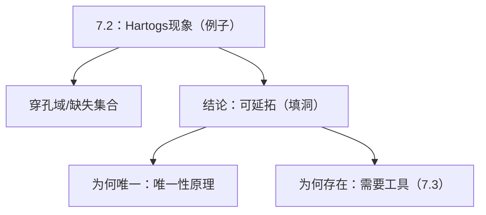

**相关笔记：** [[7.1 初等性质]] | [[7.3 Hartogs定理 非齐次Cauchy-Riemann方程]] | [[第07章 多复变引论 — 章节汇总]]

> [!abstract] 概览
> ==核心术语==：Hartogs 现象｜可去洞（填洞延拓）｜维数条件 $n\ge 2$｜唯一性原理接口
> - 本节回答：为何在多复变里“挖洞”往往不产生新奇性，反而被全纯延拓自动填平
> - 本节位置：承接 7.1 的“定义与等价刻画”，给出第一条“维数断裂证据”
> - 核心输出：一个代表性例子（现象级），为 7.3 的定理化证明做目标描述
> - 关键动作：把例子抽象成“可去的缺失集合长什么样”（做题时先验判断）
^overview

---

# 1. 本节主题定位
- **本节的核心问题**
  - 在 $n\ge2$ 的 $\mathbb C^n$ 中，某些穿孔域上的全纯函数为何能延拓到洞内？这种“自动填洞”现象说明了什么？
- **本节在本章知识链中的位置**
  - 本章三条主线之一“解析延拓”在此第一次出现；但此时还停留在“现象/例子”层面。
- **本节依赖哪些前置概念/定理**
  - 7.1：全纯/分离全纯的语言，唯一性原理作为“若延拓存在则通常唯一”的接口。
- **本节为后续哪些内容铺路**
  - 7.3：用 $\bar\partial$ 方程把“现象”升级为“可证明的定理”（构造法）。
  - 7.5：洞能否填，深层与边界几何（Levi/伪凸）相关。

# 2. 内容分层图
- **概念层**
  - 穿孔域（有缺失集合的区域）、延拓、可去性、维数条件
- **命题层**
  - Hartogs 现象：在某类穿孔域上，全纯函数可延拓
- **方法层**
  - 现象层面的理解：唯一性 + “缺失集合太小”直觉
- **过渡层**
  - 7.3 的“工具化证明”：截断 + 解 $\bar\partial u=\alpha$ + 修正拼接

# 3. 定义系统
## 3.1 “穿孔域/缺失集合”的抽象模板
- **定义名称**：穿孔域（非正式模板）
- **严格表述**
  - 给定域 $\Omega$ 与紧集（或某类“小集合”）$K\subset\Omega$，考虑 $\Omega\setminus K$ 上的全纯函数是否能延拓到 $\Omega$。
- **定义对象是什么**：把“洞”从几何图形抽象为“从域里挖掉一个集合”
- **为什么要这样定义**
  - 多复变的延拓问题本质是“缺失集合的可去性”；你需要把例子抽象成可复用问题形式。
- **最小例子**
  - $\Omega$ 为多圆盘，$K$ 为一个紧集（教材给出的几何构型）。
- **初学者误区**
  - 把“可去”当作纯拓扑概念；在多复变中，可去性深受解析结构与维数影响。

## 3.2 Hartogs 现象（现象级定义/命名）
- **定义名称**：Hartogs 现象
- **严格表述（教材例子口径）**
  - 存在一类穿孔域，使得任意在穿孔域上全纯的函数都能（且通常唯一地）延拓到填洞后的更大域。
- **它解决了什么问题**
  - 告诉你：一复变的“挖洞=可能产生奇点”的直觉不再可靠；在 $n\ge2$ 中很多洞是“解析上不可见的”。
- **与前面概念的关系**
  - 需要 7.1 的全纯语言与唯一性接口；存在性证明在 7.3 用 $\bar\partial$ 完成。
- **初学者误区**
  - 以为“所有洞都可去”；实际上洞的几何形态决定可去性，后续需 Levi/伪凸语言。

# 4. 定理/命题系统
## 4.1 Hartogs 现象（本节例子结论）
> [!quote] 原文直接信息（现象级结论，摘其逻辑形态）
> 教材通过一个具体几何构型的穿孔域举例说明：在 $n\ge2$ 的多复变中，某些挖洞并不会导致新的全纯奇性；定义在穿孔域上的全纯函数可以延拓到洞内（并由唯一性原理给出唯一性）。

- **定理名称**：Hartogs 现象（例子）
- **准确内容（结构化复述）**
  - 对教材给定的穿孔域构型：若 $f$ 在洞外全纯，则存在全纯函数 $F$ 在填洞后的域上全纯且 $F=f$（在洞外）。
- **条件逐条解释**
  - **维数 $n\ge2$**：这是现象成立的硬条件；$n=1$ 被孤立奇点理论系统性反驳。
  - **穿孔域构型**：并非任意 $K$ 都可去；教材选择的构型能被 7.3 的构造法处理。
- **结论到底在说什么**
  - “洞”在解析意义上被忽略：洞外的数据已经决定洞内的值。
- **这个定理为什么重要**
  - 它是多复变学习的第一道分水岭：从此以后，你必须用几何+PDE 的视角理解延拓。
- **证明骨架（Step 1/2/3）**
  - Step 1：先接受现象（本节例子层面）；把它视为“目标结论”。
  - Step 2：在 7.3 用截断函数拼接得到候选，再用 $\bar\partial$ 修正为全纯（存在性）。
  - Step 3：用唯一性原理证明延拓唯一（只要洞外连通并有聚点）。
- **证明中最关键的一跳**
  - 存在性：把“几何上的洞”转写为“可解的 $\bar\partial$ 右端”，这是 7.3 的关键。
- **后续用途**
  - 7.7 逼近/延拓、全纯域概念：都是在回答“什么几何条件下延拓失败/成功”。
- **若条件削弱，哪里可能出问题**
  - 去掉 $n\ge2$：立即失败（极点/本性奇点反例）。
  - 随意改变缺失集合：可能不再可去，需要更细的判别。

# 5. 例子与反例系统
- **本节最关键的例子**
  - 教材给出的“穿孔域构型”例子（应作为本章的标准 Hartogs figure 直觉载体；做题时把你遇到的域尽量对齐到这种模板）。
- **本节最值得补的反例**
  - 一复变反例（对比用）：在 $n=1$，去点能产生极点/本性奇点，说明“填洞”不可能普遍成立。
- **每个例子/反例分别服务于什么理解点**
  - 正例：提醒你“缺失集合可能解析不可见”。
  - 反例：提醒你“维数是决定性条件”，别把 7.2 当作普适定理。

# 6. 本节逻辑链复原
1) 作者先要你从 7.1 的“全纯等价刻画”出发建立共同语言。  
2) 随即抛出一个违背一维直觉的例子：洞外全纯 $\Rightarrow$ 洞内自动延拓。  
3) 这一步的目的不是让你背一个结论，而是让你意识到：**必须引入新工具**。  
4) 因此下一节 7.3 立刻转向 $\bar\partial$ 方程：把“现象”变成可证明的定理。

# 7. 本节高风险误区
1) **把 Hartogs 现象当作“所有洞都可去”**
   - 为什么容易误读：例子给人的冲击太大。
   - 正确理解：可去性强依赖几何构型；后续需要 Levi/伪凸语言来分辨。
2) **忽略维数条件 $n\ge2$**
   - 为什么：从一维过来会下意识默认“维数不重要”。
   - 正确理解：这里维数是结论能否成立的硬门槛。
3) **把“延拓存在”与“延拓唯一”混为一谈**
   - 为什么：唯一性在复分析中太常见，容易被当成“自动存在”。
   - 正确理解：唯一性通常易得（唯一性原理），存在性才是难点（7.3）。
4) **用一复变的“绕圈积分”直觉硬套**
   - 为什么：一维 Cauchy 工具太熟。
   - 正确理解：多复变常需 PDE（$\bar\partial$）或几何判别，不是简单的围道积分。
5) **把“洞太小”当作测度/拓扑意义的“小”**
   - 为什么：缺少多复变几何经验。
   - 正确理解：这里的“小”往往是“解析结构意义的小”，与伪凸/Levi 等有关。

# 8. 知识库拆分建议
- **A类：应独立成概念卡**
  - Hartogs 现象（现象描述 + 典型构型）
  - Hartogs figure（若教材明确出现，可作为几何模板页）
- **B类：应独立成定理卡**
  - Hartogs 定理（严格定理版，放在 7.3/专题页）
- **C类：只保留在本节页中**
  - 与一复变对比的“反直觉冲击”段落（作为学习动机）
- **D类：建议作为专题综述页的候选节点**
  - “哪些缺失集合可去？”（连接 7.5 Levi/伪凸 与 7.7 延拓/全纯域）

# 9. 后续学习接口
- **适合下一轮展开证明的点**
  - 7.3 的截断 + $\bar\partial$ 修正：每一步的条件（支撑、兼容条件、估计）分别用来干什么。
- **适合设计习题的点**
  - 让学生判断：给定 $\Omega\setminus K$，哪些信息足以猜测可延拓（只要求“线索”，不要求严格证明）。
  - 唯一性题：若两个延拓在洞外一致，证明它们处处一致。
- **适合与前一节做比较的点**
  - 7.1 的“等价刻画”在这里提供两个接口：唯一性（微分/幂级数）与存在性（PDE 工具）。
- **适合与下一节做衔接的点**
  - 7.3：把“例子结论”作为目标，用构造法证明存在性。

# 10. 自测问题
1) 用自己的话复述 Hartogs 现象的“反直觉点”是什么。  
2) 为什么本节必须强调 $n\ge2$？请给出一维的反向证据类型（不必写具体函数）。  
3) 若延拓存在，为什么它通常唯一？你会调用哪条原理？  
4) 本节例子告诉你：洞的“大小/形状”应该用什么视角理解（拓扑/测度/解析几何）？  
5) 用一句话说明：7.3 将用什么工具把现象变成定理（写出工具的名字与方程形式）。

---

## 引用
![[00-Raw素材/泛函分析/07_第7章_多复变引论/7.2_Hartogs现象_一个例子.pdf]]
