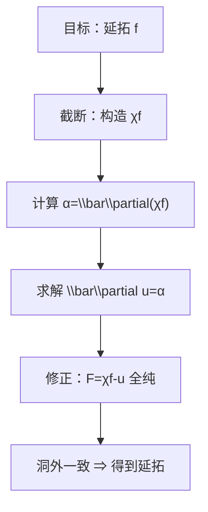

**相关笔记：** [[7.2 Hartogs现象 一个例子]] | [[7.4 边界情形 切向Cauchy-Riemann方程]] | [[第07章 多复变引论 — 章节汇总]]

> [!abstract] 概览
> ==核心术语==：$\bar\partial$ 方程｜非齐次 Cauchy–Riemann｜截断（cut-off）｜修正（correction）｜延拓（extension）
> - 本节回答：如何用“解 PDE”的方式证明 Hartogs 型延拓（把现象变成可证明的定理）
> - 核心套路：先拼接，再用 $\bar\partial u=\alpha$ 构造修正项让结果重新变全纯
> - 关键关注：右端 $\alpha$ 的“兼容性条件”与域的几何条件分别在证明中做什么
>
^overview

---

# 1. 本节主题定位
- **本节的核心问题**
  - 如何证明“洞外全纯 ⇒ 洞内可延拓”的结论？证明不是靠一维围道积分，而是靠解一个非齐次 C-R（$\bar\partial$）方程。
- **本节在本章知识链中的位置**
  - 7.2 还只是例子层面的冲击；本节把它升级为可复用的“构造法定理”。
- **本节依赖哪些前置概念/定理**
  - 7.1：全纯的不同口径（便于在“微分口径/积分口径”间切换）
  - 7.2：目标结论形态（Hartogs 现象）
- **本节为后续哪些内容铺路**
  - 7.4：边界版本的 C-R（切向 C-R）
  - 7.5：Levi/伪凸决定 $\bar\partial$ 可解性（几何进入分析）

# 2. 内容分层图
- **概念层**
  - $\bar\partial$、$(0,1)$-形式（或教材右端项口径）、截断函数、支撑
- **命题层**
  - Hartogs 定理（延拓定理，严格条件见教材）
  - 非齐次 C-R 方程的可解性（作为工具命题）
- **方法层**
  - “先拼接，再修正”：$F=\chi f-u$
  - 把“非全纯性”集中到一个右端 $\alpha=\bar\partial(\chi f)$
- **过渡层**
  - 从内部延拓过渡到边界 CR 与几何条件（7.4–7.5）

# 3. 定义系统
## 3.1 非齐次 Cauchy–Riemann（$\bar\partial$）方程
- **定义名称**：$\bar\partial u=\alpha$
- **严格表述（教材口径）**
  - 在 $\mathbb C^n$ 中用 $\bar z_j$ 的偏导（或等价语言）定义算子 $\bar\partial$；非齐次方程的右端 $\alpha$ 是教材指定类型的数据（常写成某类 $(0,1)$-形式）。
- **定义对象是什么**
  - 一个“把函数变成右端数据”的微分算子；$\bar\partial u=0$ 可作为全纯性的一个判别口径。
- **为什么要这样定义**
  - 延拓构造常从一个“几乎全纯”的候选出发；其失败部分正好可以用 $\bar\partial$ 测量，并通过求解方程消掉。
- **它解决了什么问题**
  - 把“全纯性”从抽象性质变成“可消除的误差项”。
- **最小例子**
  - $n=1$ 时，$\bar\partial=\frac12(\partial_x+i\partial_y)$；$\bar\partial u=0$ 就是 C-R 方程。
- **非例/边界情况**
  - 若右端 $\alpha$ 不满足必要兼容条件（或域几何不允许估计），方程可能无解。
- **初学者误区**
  - 以为“微分方程总能解”；这里“可解性”是一个深定理，依赖域的几何与函数空间估计。

## 3.2 截断函数 $\chi$（cut-off）
- **定义名称**：截断函数（光滑、支撑可控）
- **严格表述**
  - 选 $\chi$ 使其在洞外某区域等于 $1$，在洞附近等于 $0$，并且具有足够光滑性以便计算 $\bar\partial(\chi f)$。
- **为什么要这样定义**
  - 让“拼接后的候选”在洞外与原函数一致，同时把非全纯性集中到一个紧支撑区域（便于解方程）。
- **误区**
  - 忘记支撑位置：如果 $\chi$ 的过渡区放错，$\alpha$ 可能不再满足你要的假设（例如支撑不紧、兼容条件失败）。

# 4. 定理/命题系统
## 4.1 Hartogs 定理（延拓定理）
> [!quote] 原文直接信息（定理形态）
> 教材把 Hartogs 现象提升为定理：在 $n\ge2$ 且满足教材给出的几何/正则条件时，穿孔域上的全纯函数可以延拓到填洞后的域；证明通过构造截断函数并求解非齐次 C-R（$\bar\partial$）方程实现。

- **定理名称**：Hartogs 定理（延拓定理）
- **准确内容（结构化复述）**
  - 若 $f$ 在某穿孔域 $\Omega\setminus K$ 上全纯，并满足教材条件（关于 $K$、$\Omega$ 的几何与正则性），则存在 $F$ 在 $\Omega$ 上全纯，且 $F=f$ 于 $\Omega\setminus K$。
- **条件逐条解释**
  - $n\ge2$：保证多复变的 $\bar\partial$ 工具与延拓机制可用；$n=1$ 失败。
  - 几何/正则条件：用于确保两件事  
    1) 能构造合适的截断 $\chi$（支撑与光滑性）  
    2) 右端 $\alpha$ 进入一个可解性定理的适用范围
- **结论到底在说什么**
  - 延拓不是“猜出来”，而是“构造出来”：你能写出一个明确的构造链条产生 $F$。
- **这个定理为什么重要**
  - 它把“延拓”从现象变成方法论：以后遇到类似问题，你会尝试把误差写成 $\bar\partial$ 并消去。
- **证明骨架（Step 1/2/3）**
  - Step 1（拼接）：选截断 $\chi$，构造候选 $g=\chi f$；它在洞外等于 $f$，但一般不全纯。
  - Step 2（测误差）：计算 $\alpha=\bar\partial g=\bar\partial(\chi f)$；通过 $\chi$ 的支撑把 $\alpha$ 限制在可控区域。
  - Step 3（修正）：用教材的可解性定理解 $\bar\partial u=\alpha$；令 $F=g-u$，则 $\bar\partial F=0$，从而 $F$ 全纯且与 $f$ 在洞外一致。
- **证明中最关键的一跳**
  - “$\bar\partial u=\alpha$ 可解”这一环节：它把延拓问题转化为 PDE 的可解性问题（并由几何条件保障）。
- **后续用途**
  - 7.4–7.5：边界 CR、Levi/伪凸：决定 $\bar\partial$ 的可解性，从而决定延拓/逼近的成败。
- **若条件削弱，哪里可能出问题**
  - 若没有足够正则/几何：$\alpha$ 可能无法落入可解性定理的条件；或解 $u$ 不够正则，导致 $F$ 不能被判定为全纯。

# 5. 例子与反例系统
- **本节最关键的例子**
  - “$\chi f-u$”构造是本章最需要可复用的一套证明模板：后续你会把它当成做题套路而不是一次性证明。
- **本节最值得补的反例**
  - 若右端 $\alpha$ 不满足兼容条件/域不满足几何条件，则方程不可解，构造链条断裂（延拓可能失败）。
- **每个例子/反例分别服务于什么理解点**
  - 正例：延拓是一套“拼接—测误差—修正”的机械流程。
  - 反例：提醒你做题要先检查“可解性条件”，否则套路无法启动。

# 6. 本节逻辑链复原
1) 7.2 给出目标：洞外全纯可能决定洞内。  
2) 本节策略：先强行把洞补上（截断拼接），接受“暂时不全纯”。  
3) 然后用 $\bar\partial$ 精确测量“不全纯的部分” $\alpha$。  
4) 最后通过可解性定理构造 $u$ 去抵消 $\alpha$，得到真正全纯的延拓。  
5) 一旦存在性完成，唯一性由全纯函数的唯一性原理自动给出。

# 7. 本节高风险误区
1) **只背结论，不会复述构造链条**
   - 为什么：定理叙述短，但证明需要“拼接—修正”两段式。
   - 正确理解：至少要能写出 $F=\chi f-u$ 与 $\bar\partial u=\bar\partial(\chi f)$ 这两行。
2) **忽略截断函数支撑位置**
   - 为什么：认为 $\chi$ 只是技术细节。
   - 正确理解：支撑决定 $\alpha$ 的性质，直接影响可解性定理能否应用。
3) **把 $\bar\partial u=\alpha$ 当作总能解**
   - 为什么：从常微分方程/初等 PDE 直觉迁移。
   - 正确理解：这是深结论；必须列出“兼容性 + 几何/估计”两类条件。
4) **只强调唯一性，忘记存在性才是难点**
   - 为什么：唯一性原理在复分析中太常用。
   - 正确理解：本节的价值在“存在性构造”，唯一性只是附带结果。
5) **公式写法触发 KaTeX 门禁**
   - 为什么：习惯写 `\\bar\\partial` 或使用对齐环境。
   - 正确理解：本库只用 `$...$` / `$$...$$`，命令单反斜杠，避免对齐环境与双反斜杠。

# 8. 知识库拆分建议
- **A类：应独立成概念卡**
  - $\bar\partial$ 算子（口径、对象、常见右端与兼容条件）
  - 截断函数（cut-off）套路（支撑控制的作用）
- **B类：应独立成定理卡**
  - Hartogs 定理（延拓定理）：叙述 + 条件作用 + 证明模板
  - 非齐次 C-R 方程可解性（若教材给出明确命题，可独立成工具卡）
- **C类：只保留在本节页中**
  - “$\chi f-u$”作为延拓模板的逐步解释（可在此节最完整）
- **D类：建议作为专题综述页的候选节点**
  - “延拓/逼近/全纯域”的统一视角（连接 7.6–7.7）

# 9. 后续学习接口
- **适合下一轮展开证明的点**
  - 右端 $\alpha$ 的兼容条件到底是什么？教材如何验证它满足？
  - 解 $u$ 的正则性与估计如何保证 $F$ 真正全纯（而不是弱意义）？
- **适合设计习题的点**
  - 让学生在给定 $\chi$ 时写出 $\alpha=\bar\partial(\chi f)$ 的支撑位置与“为何可控”的解释。
  - 让学生从“可解性假设”推出延拓结论（把复杂步骤压缩成引用链）。
- **适合与前一节做比较的点**
  - 7.2：现象层结论 vs 本节：定理层构造（存在性来源不同）。
- **适合与下一节做衔接的点**
  - 7.4：边界上对应的 C-R（切向方程）如何出现？为什么边界几何会决定可解性？

# 10. 自测问题
1) 写出本节延拓构造的两条关键等式：$F=\chi f-u$ 与 $\bar\partial u=\bar\partial(\chi f)$。  
2) 截断函数 $\chi$ 的两个核心要求是什么（取值区域 + 正则性/支撑）？  
3) 为什么解 $\bar\partial u=\alpha$ 需要“兼容性条件”？用“像空间/必要条件”的语言解释即可。  
4) 延拓存在后，为什么唯一？请指出你调用的原理与其适用条件。  
5) 用一句话说明：7.5 的 Levi/伪凸将如何影响本节构造链条中的哪一步？

---

## 引用
![[00-Raw素材/泛函分析/07_第7章_多复变引论/7.3_Hartogs定理_非齐次Cauchy-Riemann方程.pdf]]
