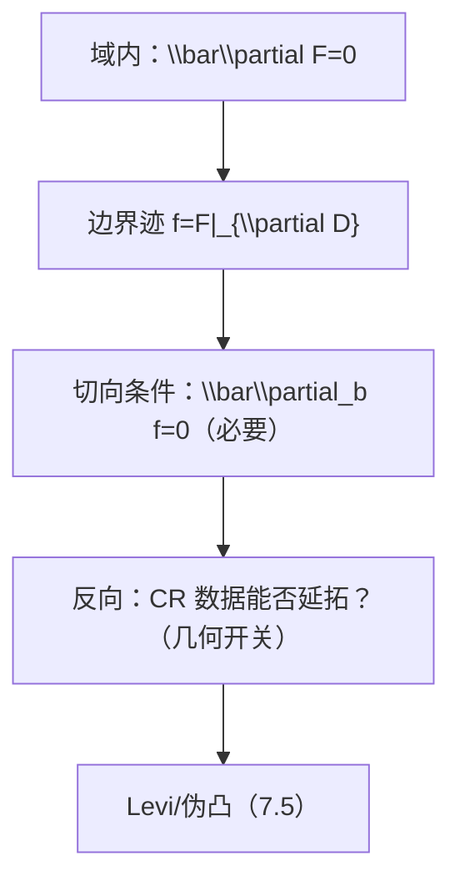

**相关笔记：** [[7.3 Hartogs定理 非齐次Cauchy-Riemann方程]] | [[7.5 Levi形式]] | [[第07章 多复变引论 — 章节汇总]]

> [!abstract] 概览
> ==核心术语==：边界迹（trace）｜切向 Cauchy–Riemann（$\bar\partial_b$）｜CR 函数｜几何条件（Levi/伪凸）
> - 本节回答：当函数只给在边界 $\partial D$ 上时，“像不像全纯”如何被一个切向 PDE 条件刻画
> - 结论形态：全纯函数的边界迹一定满足切向 CR（必要性）；反向延拓（充分性）需要几何条件
> - 章节位置：把 7.3 的内部 $\bar\partial$ 工具推到边界；为 7.5 的 Levi/伪凸做接口准备
>
^overview

---

# 1. 本节主题定位
- **本节的核心问题**
  - 当 $f$ 只定义在 $\partial D$ 上时，什么条件能表征“$f$ 是某个内部全纯函数的边界值”？
- **本节在本章知识链中的位置**
  - 从“域内 $\bar\partial$（7.3）”过渡到“边界 $\bar\partial_b$”；把延拓问题从“挖洞”升级为“边界数据问题”。
- **本节依赖哪些前置概念/定理**
  - 7.1：全纯的微分口径（$\bar\partial F=0$）
  - 7.3：$\bar\partial$ 可解性思路（但本节强调边界版本）
- **本节为后续哪些内容铺路**
  - 7.5：Levi 形式作为“充分性/可解性”的几何开关

# 2. 内容分层图
- **概念层**：边界迹、复切向方向、切向 C-R 算子 $\bar\partial_b$、CR 函数
- **命题层**：全纯 $\Rightarrow$ 边界迹为 CR（必要性）；CR $\Rightarrow$ 可延拓（需要条件）
- **方法层**：把“$\bar\partial F=0$”限制到边界切向方向得到“$\bar\partial_b f=0$”
- **过渡层**：充分性依赖 Levi/伪凸（7.5）

# 3. 定义系统
## 3.1 边界迹（trace）
- **定义名称**：边界迹 $f=F|_{\partial D}$
- **严格表述**
  - 若 $F$ 在 $D$ 内全纯并具有足够正则性可延到边界，则可在 $\partial D$ 上定义其限制作为边界数据。
- **定义对象是什么**：把“内部全纯函数”投影为“边界上的函数”
- **为什么要这样定义**
  - 边界值问题/延拓问题的输入通常只给边界数据。
- **误区**
  - 忘记正则性：不是所有内部全纯函数都自动有良好边界迹（需额外条件）。

## 3.2 复切向方向与切向 C-R（$\bar\partial_b$）
- **定义名称**：切向 Cauchy–Riemann 方程
- **严格表述（教材口径）**
  - 在足够光滑的边界 $\partial D$ 上，沿“复切向方向”的 $(0,1)$ 向量场作用下满足 $\bar\partial_b f=0$。
- **定义对象是什么**：边界上的一个一阶 PDE 条件
- **为什么要这样定义**
  - 因为边界上只能沿边界移动；“全纯”在边界上只能通过切向方向来检测。
- **它解决了什么问题**
  - 给出“边界数据是否可能来自内部全纯”的**必要条件**。
- **最小例子**
  - 若 $F$ 内部全纯，则其边界迹 $f$ 必满足切向 CR（见 4.1）。
- **非例/边界情况**
  - 任意连续函数一般不满足该 PDE，因此不可能是全纯边界迹。
- **初学者误区**
  - 把“切向”理解为“少检查一点所以更弱更容易延拓”；实际上充分性仍需几何条件。

# 4. 定理/命题系统
## 4.1 必要性：全纯边界迹一定是 CR
> [!quote] 原文直接信息（必要性结论的逻辑形态）
> 若 $F$ 在域 $D$ 内全纯，则其边界限制（在可定义意义下）满足切向 Cauchy–Riemann 方程；因此 CR 条件是“来自全纯”的必要条件。

- **定理名称**：全纯 $\Rightarrow$ 边界迹为 CR（必要条件）
- **准确内容**：$F$ 全纯 $\Rightarrow \bar\partial_b(F|_{\partial D})=0$
- **条件逐条解释**
  - 边界足够光滑：用于定义“复切向方向/$\bar\partial_b$”
  - $F$ 具有边界迹：用于使限制有意义
- **证明骨架（Step 1/2/3）**
  - Step 1：域内全纯意味着 $\bar\partial F=0$
  - Step 2：把算子限制到边界切向方向（投影/限制）
  - Step 3：得到边界 PDE：$\bar\partial_b f=0$
- **证明中最关键的一跳**
  - “域内算子限制到边界”的几何解释：切向方向是边界上可见的方向

## 4.2 充分性问题框架：CR 是否能保证可延拓？
- **命题名称**：CR $\Rightarrow$ 全纯延拓（需要额外条件）
- **准确内容（框架）**
  - 仅有 $\bar\partial_b f=0$ 往往不够；需要域/边界满足某种几何条件（7.5 用 Levi/伪凸刻画）。
- **后续用途**
  - 把“边界数据”与“域的几何”耦合起来：这是多复变区别于一复变的核心困难之一。

# 5. 例子与反例系统
- **关键例子**
  - $F$ 内部全纯 $\Rightarrow$ $f=F|_{\partial D}$ 自动 CR（最典型的“必要性例子”）。
- **值得补的反例**
  - 随便给一个边界连续函数通常不满足 $\bar\partial_b f=0$，因此不能是全纯边界迹。
- **服务的理解点**
  - 例子强调“必要性”；反例强调“边界 PDE 不是装饰，而是硬约束”。

# 6. 本节逻辑链复原
1) 作者把“延拓”改写为“边界数据能否来自内部全纯”。  
2) 先给出硬必要条件：全纯 $\Rightarrow$ 满足切向 C-R。  
3) 立刻指出：反向推导需要几何；于是下一节引入 Levi 形式作为判别器。

# 7. 本节高风险误区
1) **把 CR 条件当作充分条件**
   - 为什么容易误读：一维里边界条件常“够用”。
   - 正确理解：CR 只是必要条件；充分性要看 Levi/伪凸等几何。
2) **忽略边界正则性**
   - 为什么：默认边界光滑。
   - 正确理解：$\bar\partial_b$、Levi 都需要至少 $C^2$ 等正则性才能定义。
3) **把“切向”理解成任意方向**
   - 为什么：没建立“边界上只能沿边界移动”的几何图像。
   - 正确理解：切向是“边界内在方向”；法向信息需要进入域内。
4) **把 $\bar\partial_b$ 与 $\bar\partial$ 混淆**
   - 为什么：符号相近。
   - 正确理解：$\bar\partial_b$ 是边界切向版本；它检测的是边界内在 CR 结构。
5) **不先问维数/几何条件就开始套定理**
   - 为什么：从一维迁移习惯。
   - 正确理解：多复变里“可延拓/可解”的开关通常在几何（7.5）。

# 8. 知识库拆分建议
- **A类：概念卡**
  - CR 函数、切向 C-R（$\bar\partial_b$）、复切向方向
- **B类：定理卡**
  - 全纯边界迹满足 CR（必要性）
- **C类：本节保留**
  - “必要性 vs 充分性”的问题框架（作为章节过渡页）
- **D类：专题综述候选**
  - “边界值问题与几何条件”（连接 7.5–7.7）

# 9. 后续学习接口
- **下一轮展开证明的点**
  - 充分性需要哪些几何条件？教材如何用 Levi 形式表述？
- **适合设计习题的点**
  - 给一个简单域（球/多圆盘）与其边界函数，判断是否可能为全纯边界迹（先用 CR 必要性筛）。
- **与前一节比较**
  - 7.3：内部 $\bar\partial$ 修正；本节：边界切向版本（$\bar\partial_b$）。
- **与下一节衔接**
  - 7.5：Levi 形式为何是“充分性/可解性”的判别器？

# 10. 自测问题
1) 用一句话解释：为什么边界上只能提出“切向”的 C-R 条件？  
2) 写出“全纯 $\Rightarrow$ 边界迹 CR”的证明骨架三步。  
3) 仅有 CR 条件为何不保证可延拓？你预计缺少什么类型的条件？  
4) $\bar\partial$ 与 $\bar\partial_b$ 的角色分别是什么？  
5) Levi 形式将在哪一步影响“CR ⇒ 延拓”的结论？

---

## 引用
![[00-Raw素材/泛函分析/07_第7章_多复变引论/7.4_边界情形_切向Cauchy-Riemann方程.pdf]]
