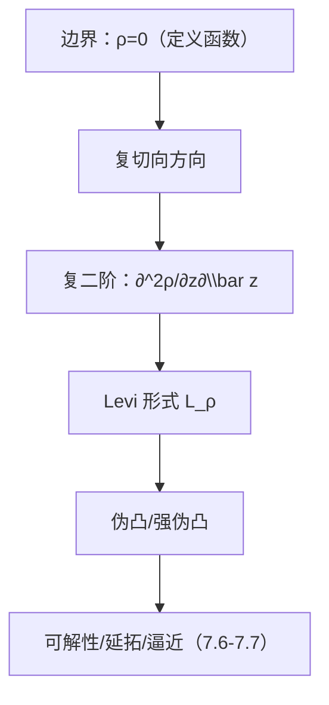

**相关笔记：** [[7.4 边界情形 切向Cauchy-Riemann方程]] | [[7.6 最大模原理]] | [[第07章 多复变引论 — 章节汇总]]

> [!abstract] 概览
> ==核心术语==：定义函数 $\rho$｜复切向空间｜Levi 形式 $L_\rho$｜伪凸/强伪凸｜几何→可解性
> - 本节回答：如何用边界的“复二阶信息”刻画域的几何（伪凸性），并作为延拓/可解性的开关
> - 关键对象：Levi 形式是复 Hessian 在复切向方向上的 Hermite 二次型
> - 章节位置：承接 7.4 的“CR ⇒ 延拓？”充分性缺口；为 7.6–7.7 的原理与定理提供几何前提
>
^overview

---

# 1. 本节主题定位
- **本节的核心问题**
  - “CR ⇒ 可延拓/可解 $\bar\partial$？”这类问题的成败由什么几何量控制？Levi 形式给出可计算的判别器。
- **本节在本章知识链中的位置**
  - 作为 7.4 的充分性缺口补丁：从边界 PDE 进入边界几何。
- **本节依赖哪些前置概念/定理**
  - 7.4：边界 CR 的必要性框架
  - 基本微分几何直觉：边界可用 $\rho(z)=0$ 表示，二阶信息决定“凸性”
- **本节为后续哪些内容铺路**
  - 7.6 最大模/唯一性收口在很多“伪凸域”上更自然使用
  - 7.7 逼近与延拓定理（全局性质）通常以伪凸为假设之一

# 2. 内容分层图
- **概念层**：定义函数 $\rho$、复切向空间、复 Hessian、Levi 形式、伪凸/强伪凸
- **命题层**：Levi 半正 $\Rightarrow$ 伪凸（教材口径）；伪凸与可解性/延拓的关联（框架）
- **方法层**：把“几何凸性”转写为“二次型符号”（半正/正定）
- **过渡层**：由几何判别进入 7.7 的全局定理

# 3. 定义系统
## 3.1 定义函数（defining function）
- **定义名称**：定义函数 $\rho$
- **严格表述**
  - 用光滑函数 $\rho$ 描述域：$D=\{z:\rho(z)<0\}$，边界 $\partial D=\{z:\rho(z)=0\}$，且 $\nabla\rho\ne0$ 于边界。
- **定义对象是什么**：把边界几何编码进一个可微函数
- **为什么要这样定义**
  - Levi 形式来自 $\rho$ 的二阶导数；没有 $\rho$ 就无法计算“二阶几何”。
- **误区**
  - 把 $\rho$ 当唯一；实际上 $\rho$ 不唯一，但最终的“伪凸性”应是域的性质（需注意等价性口径）。

## 3.2 Levi 形式
- **定义名称**：Levi 形式 $L_\rho$
- **严格表述（常用写法，教材以其为准）**
  - 在边界点 $p\in\partial D$，对复切向向量 $X=(X_1,\dots,X_n)$，
    $$
    L_\rho(p;X)=\sum_{j,k=1}^n \frac{\partial^2 \rho}{\partial z_j\partial\bar z_k}(p)\,X_j\overline{X_k},
    $$
    并仅在“复切向空间”中讨论其符号。
- **定义对象是什么**：边界的“复二阶曲率”二次型（Hermite 型）
- **为什么要这样定义**
  - 多复变的解析现象对复结构敏感；只检查复切向方向能捕捉与全纯最相关的二阶几何。
- **它解决了什么问题**
  - 给出可操作的几何判别：域是否“伪凸”。
- **最小例子**
  - 单位球的边界是强伪凸（Levi 正定，直觉上“严格凸”）。
- **非例/边界情况**
  - Levi 既可能半正也可能有负方向；负方向通常意味着某些延拓/估计失败或变复杂。
- **初学者误区**
  - 把 Levi 当成实 Hessian；它是复 Hessian 且只在复切向上看。

## 3.3 伪凸（pseudoconvex）
- **定义名称**：伪凸/强伪凸（教材口径）
- **严格表述（框架）**
  - Levi 半正（或正定）对应伪凸（或强伪凸）边界/域。
- **它解决了什么问题**
  - 把“几何好不好”转成“二次型符号好不好”，为后续定理提供可检验假设。
- **误区**
  - 把“伪凸”当几何凸；二者有关系但不等价，伪凸更贴近复结构。

# 4. 定理/命题系统
## 4.1 Levi 半正与伪凸（定义/判别命题）
> [!quote] 原文直接信息（逻辑形态）
> 教材通过定义函数的复二阶信息定义 Levi 形式，并以其半正性刻画（或等价定义）伪凸性；随后指出伪凸性在多复变的可解性/延拓问题中起决定作用。

- **定理/命题名称**：Levi 半正 $\Rightarrow$（边界/域）伪凸（教材口径）
- **条件逐条解释**
  - $\rho$ 足够光滑：需要二阶导数
  - 只在复切向方向检验：这是与全纯相容的几何信息
- **结论到底在说什么**
  - 域的“好几何”可以用一个点态二次型来检测。
- **证明骨架（Step 1/2/3）**
  - Step 1：用 $\rho$ 描述边界并定义复切向空间
  - Step 2：定义 Levi 形式并证明其在复切向上的坐标不变性（或等价性）
  - Step 3：把“半正/正定”作为伪凸/强伪凸的判据
- **后续用途**
  - 作为 7.7 逼近/延拓与 $\bar\partial$ 估计的几何假设入口
- **若条件削弱，哪里可能出问题**
  - 边界不够光滑：Levi 形式无法定义或不稳定
  - Levi 出现负方向：许多结论需要修改或直接失败

# 5. 例子与反例系统
- **关键例子**
  - 单位球（直觉：严格凸）是强伪凸；适合用来对照 Levi 正定的含义。
- **值得补的反例**
  - Levi 有负方向的边界（或不伪凸域）往往导致“CR ⇒ 延拓/可解”失败或变得微妙（第二轮可补具体例子）。
- **服务理解点**
  - 例子：把“符号条件”与几何直觉对应起来；反例：说明几何条件不是装饰。

# 6. 本节逻辑链复原
1) 7.4 指出：边界 CR 是必要条件，但不足以保证延拓。  
2) 为了给“充分性缺口”一个可检验的几何假设，作者引入定义函数 $\rho$。  
3) 通过 $\rho$ 的复二阶导数构造 Levi 形式。  
4) 用 Levi 的符号定义/刻画伪凸性，并说明它将决定后续的可解性与延拓结论。

# 7. 本节高风险误区
1) **把伪凸当作几何凸**
   - 为什么：名字很像“凸”。
   - 正确理解：伪凸是复结构相容的凸性，检验的是 Levi（复二阶）而不是实几何凸。
2) **忘记只在复切向方向检查 Levi**
   - 为什么：习惯看全空间 Hessian。
   - 正确理解：Levi 只在复切向方向有意义；这是它强相关于全纯的原因。
3) **以为 Levi 依赖 $\rho$ 就不是域的性质**
   - 为什么：定义确实用了 $\rho$。
   - 正确理解：在合适等价意义下，伪凸性是域的几何性质；写作时要强调“不依赖具体 $\rho$ 的选择”。
4) **忽略正则性（至少二阶）**
   - 为什么：把边界当成光滑曲面理所当然。
   - 正确理解：不够光滑就谈不上 Levi；很多定理假设本质上是“允许做二阶微分”。
5) **只会背符号，不知道它在证明中做什么**
   - 为什么：定义看起来像纯计算。
   - 正确理解：Levi 的符号是“可解性/延拓”的开关；你必须能指出它在证明链条里“保证哪一步成立”。

# 8. 知识库拆分建议
- **A类：概念卡**
  - 定义函数、复切向空间、Levi 形式、伪凸/强伪凸
- **B类：定理卡**
  - 伪凸的判别（Levi 半正）
- **C类：本节保留**
  - “几何→可解性”的接口说明（作为章节过渡）
- **D类：专题综述候选**
  - “伪凸的等价刻画集合”（若教材/后续给出多个等价定义，可汇总成专题页）

# 9. 后续学习接口
- **下一轮展开证明的点**
  - Levi 的坐标不变性/与复切向空间的精确定义（需要更细的微分几何语言）。
- **适合设计习题的点**
  - 给出简单 $\rho$，计算 $L_\rho$ 并判断符号；用来训练“从公式到几何”的转换能力。
- **与前一节比较**
  - 7.4 给出边界 PDE（必要性）；本节给出几何符号条件（可能的充分性入口）。
- **与下一节衔接**
  - 7.6/7.7 中哪些结论需要伪凸？你应能在引用时说清楚“用 Levi 半正保证了什么”。

# 10. 自测问题
1) 什么是定义函数 $\rho$？为什么需要它来谈边界几何？  
2) 写出 Levi 形式 $L_\rho(p;X)$ 的典型表达式，并说明 $X$ 取在哪些方向。  
3) 用一句话解释：为什么 Levi 形式可以看作“复意义下的二阶凸性”？  
4) 伪凸/强伪凸与 Levi 的符号分别如何对应？  
5) 你能举出一个“Levi 条件在证明中发挥作用”的位置吗（例如保证 $\bar\partial$ 可解性/延拓）？

---

## 引用
![[00-Raw素材/泛函分析/07_第7章_多复变引论/7.5_Levi形式.pdf]]
