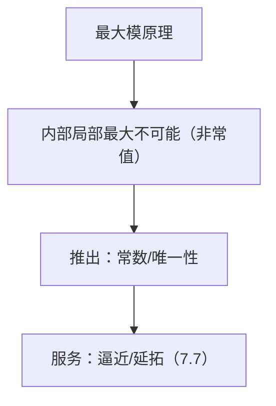

**相关笔记：** [[7.5 Levi形式]] | [[7.7 逼近和延拓定理]] | [[第07章 多复变引论 — 章节汇总]]

> [!abstract] 概览
> ==核心术语==：最大模原理｜内部局部极大｜收口（推出常数/唯一性）｜复直线降维
> - 本节回答：多复变中“内部极大 ⇒ 刚性（常数/唯一性）”的基本收口原理是什么、如何在证明中复用
> - 关键结论：非常值全纯函数不可能在域内部取得 $|f|$ 的局部最大
> - 章节位置：为 7.7 的逼近/延拓提供“唯一性与估计”的收口工具
>
^overview

---

# 1. 本节主题定位
- **本节的核心问题**
  - 在 $D\subset\mathbb C^n$ 上，全纯函数满足什么“极值刚性”？如何把题目条件翻译成“$|f|$ 在内部出现局部极大”从而收口？
- **本节在本章知识链中的位置**
  - 作为本章的“收口器”：给出唯一性/常数性的快速结论，为 7.7 的逼近/延拓提供稳定性与唯一性。
- **本节依赖哪些前置概念/定理**
  - 7.1：全纯的基本性质与局部幂级数/降维思路
- **本节为后续哪些内容铺路**
  - 7.7：逼近/延拓过程中常用“唯一性/排除内部极值”来完成证明最后一步

# 2. 内容分层图
- **概念层**：局部最大、连通域、非常值、复直线切片
- **命题层**：最大模原理；其常见推论（唯一性、Liouville 型等）
- **方法层**：复直线降维、局部幂级数最低阶项反证
- **过渡层**：把“估计/边界条件”转写为“内部极值”并收口

# 3. 定义系统
## 3.1 局部最大（针对 $|f|$）
- **定义名称**：$|f|$ 在 $z_0$ 处取得局部最大
- **严格表述**
  - 存在邻域 $U$ 使得对所有 $z\in U$ 有 $|f(z)|\le |f(z_0)|$。
- **它解决了什么问题**
  - 最大模原理的触发条件就是“内部局部最大”；做题时你最关键的动作是把题设推成这一句。
- **误区**
  - 把“全局最大”与“局部最大”混淆；全局最大点若在内部当然也是局部最大点。

## 3.2 非常值与连通性
- **定义名称**：非常值/连通域
- **严格表述**
  - “非常值”指不恒等于常数；“连通域”用于把“局部常数”升级为“全局常数”。
- **为什么要强调**
  - 最大模原理常先推出局部常数；连通性再把它扩展到整个域。

# 4. 定理/命题系统
## 4.1 最大模原理（多复变）
> [!quote] 原文直接信息（定理形态）
> 设 $D\subset\mathbb C^n$ 连通，$f$ 在 $D$ 内全纯且非常值，则 $|f|$ 不可能在 $D$ 内取得局部最大。

- **定理名称**：最大模原理
- **条件逐条解释**
  - $f$ 全纯：刚性来源
  - $D$ 连通：用于把“局部常数”推广到全域
  - “局部最大”而非“全局最大”：这是极值原理的核心触发点
- **结论到底在说什么**
  - 只要你在内部抓到一个局部极大点，就能把结论直接收口为“$f$ 常数/矛盾”。
- **证明骨架（Step 1/2/3）**
  - Step 1（复直线降维）：取任意方向 $v$，令 $g(t)=f(z_0+tv)$，把问题降到一复变。
  - Step 2：在一维上用最大模原理推出 $g$ 局部常数。
  - Step 3：由方向任意性推出 $f$ 在邻域内常数，再由连通性推出全域常数。
- **证明中最关键的一跳**
  - “取复直线切片”保证 $g$ 是一维全纯；这一步把多复变问题交给一维原理处理。
- **后续用途**
  - 唯一性/延拓唯一：令 $h=f-g$，把“相等”转成“零点具有聚点”，再用极值/唯一性收口。
  - 最小模套路：若 $f$ 无零点，对 $1/f$ 用最大模原理。
- **若条件削弱，哪里可能出问题**
  - 域不连通：只能推出每个连通分支上常数。
  - 只知道连续/调和而非全纯：结论需要替换为对应的最大值原理版本。

# 5. 例子与反例系统
- **关键例子**
  - $f$ 在内部达到模的局部最大 $\Rightarrow f$ 必常数（这是所有应用的母例）。
- **值得补的反例**
  - 实可微但非全纯的函数可以在内部取得局部最大（说明“全纯”条件不可省）。
- **服务的理解点**
  - 例子告诉你：最大模原理是“最后一击”；反例提醒你：别把它当成普通微积分结论。

# 6. 本节逻辑链复原
1) 作者要你掌握一个“收口原则”：内部极值会导致刚性。  
2) 为了让它可复用，给出证明套路：复直线降维/幂级数最低阶项反证。  
3) 然后把它作为后续定理（逼近/延拓）证明中的“唯一性与估计模块”。

# 7. 本节高风险误区
1) **把“局部最大”看成太强，认为很少用到**
   - 为什么：误以为题目不会给出极值信息。
   - 正确理解：很多题通过“有界/边界控制/紧性”间接制造局部最大点。
2) **忘记连通性**
   - 为什么：习惯默认域连通。
   - 正确理解：不连通时结论是“每个分支常数”。
3) **把最大模原理与唯一性原理混成一个定理**
   - 为什么：二者都能推出“只能常数/只能相等”。
   - 正确理解：最大模处理极值；唯一性处理“零点/相等集合有聚点”。
4) **想用对齐环境写证明导致 KaTeX 门禁问题**
   - 为什么：习惯 LaTeX 排版。
   - 正确理解：拆成列表/多段公式，避免环境与双反斜杠。
5) **把“内部最大”误写成“边界最大”**
   - 为什么：最大值原理常与边界混用。
   - 正确理解：非常值情形下，最大值发生在边界；若你发现最大值点在内部，那就是收口信号。

# 8. 知识库拆分建议
- **A类：概念卡**
  - 复直线降维（proof trick）
  - 最小模原理套路（对 $1/f$ 用最大模）
- **B类：定理卡**
  - 最大模原理（多复变）
  - Liouville 型推论（若教材提及，可独立）
- **C类：本节保留**
  - “做题触发信号→收口动作”清单（作为复习入口）
- **D类：专题综述候选**
  - “极值原理家族”（最大模/最大值/次调和等）与其互推关系

# 9. 后续学习接口
- **下一轮展开证明的点**
  - 证明中“方向任意 ⇒ 局部常数”的严密论证（可用幂级数最低阶项做更结构化证明）。
- **适合设计习题的点**
  - 让学生把“有界/边界控制/紧子域取最大点”翻译为“内部局部最大”，再收口。
- **与前后节衔接**
  - 7.5：几何（伪凸）常决定你能否构造足够的全纯函数来应用最大模
  - 7.7：逼近/延拓的唯一性与估计收口常调用本节

# 10. 自测问题
1) 写出最大模原理的精确叙述（条件与结论各是什么）。  
2) 证明骨架：为什么“复直线切片”能把多复变问题降为一复变？  
3) 解释：若 $f$ 无零点，如何由最大模原理得到“最小模”结论（提示：考虑 $1/f$）。  
4) 什么时候你只能推出“每个连通分支上常数”，而不能推出全域常数？  
5) 给出一个题面信号，使你立即想到“尝试制造内部局部最大点并收口”。

---

## 引用
![[00-Raw素材/泛函分析/07_第7章_多复变引论/7.6_最大模原理.pdf]]
> 典型做法是考虑紧子域/闭包上的最大值点，并用“内部不能取最大”推出最大值发生在边界。

> [!problem] 练习 7.6.4（最大值发生在边界）
> 设 $\Omega\subset\mathbb{C}^n$ 为有界域，$f$ 在 $\Omega$ 上全纯且连续到 $\overline{\Omega}$。证明：要么 $f$ 常数，要么
> $$\max_{z\in\overline{\Omega}}|f(z)|=\max_{z\in\partial\Omega}|f(z)|.$$

> [!solution]- 完整过程解答
> 1) 因为 $\Omega$ 有界，$\overline{\Omega}$ 是紧集。又 $|f|$ 在 $\overline{\Omega}$ 上连续，所以存在 $z_0\in\overline{\Omega}$ 使
>    $$|f(z_0)|=\max_{z\in\overline{\Omega}}|f(z)|.$$
> 2) 若 $z_0\in\Omega$，则 $|f|$ 在域内部取得局部最大。由最大模原理，$f$ 在 $\Omega$ 上必须是常数。
> 3) 若 $f$ 非常数，则不可能出现上一步情形，因此最大点只能在边界：$z_0\in\partial\Omega$。
> 4) 于是
>    $$\max_{z\in\overline{\Omega}}|f(z)|=|f(z_0)|\le \max_{z\in\partial\Omega}|f(z)|,$$
>    反向不等式显然成立（边界是闭包的子集），从而得到等号结论。

> [!faq]- 提示
> 在紧集 $\overline{\Omega}$ 上取 $|f|$ 的最大点 $z_0$。若 $z_0\in\Omega$，则它是内部局部最大点，最大模原理推出 $f$ 常数；否则 $z_0\in\partial\Omega$，结论成立。

> [!problem] 练习 7.6.5（模长恒定）
> 设 $f$ 在连通域 $D\subset\mathbb{C}^n$ 上全纯，且 $|f|$ 在 $D$ 上恒等于常数。证明 $f$ 必为常数。

> [!solution]- 完整过程解答
> 1) 设 $|f|\equiv c$（常数）。取任意点 $z_0\in D$，则对 $z_0$ 的任意邻域内的点 $z$ 都有 $|f(z)|\le c=|f(z_0)|$。
> 2) 因而 $|f|$ 在 $z_0$ 处取得局部最大。
> 3) 由最大模原理，$f$ 在 $D$ 上只能是常数。

> [!faq]- 提示
> 对任意点 $z_0\in D$，$|f|$ 在 $z_0$ 的邻域内同时是“局部最大”也是“局部最小”。最大模原理直接收口：$f$ 只能常数（连通性用于推出全域常数）。

> [!problem] 练习 7.6.6（最小模套路：用 $1/f$）
> 设 $f$ 在连通域 $D\subset\mathbb{C}^n$ 上全纯且处处非零。证明：若 $|f|$ 在 $D$ 的某点取得局部最小，则 $f$ 常数。

> [!solution]- 完整过程解答
> 1) 因为 $f$ 在 $D$ 内处处非零，定义
>    $$g=\frac{1}{f}.$$
>    则 $g$ 在 $D$ 上全纯。
> 2) 若 $|f|$ 在某点 $z_0$ 取得局部最小，则在 $z_0$ 的某邻域内有 $|f(z_0)|\le |f(z)|$。
> 3) 对倒数取模得到 $|g(z_0)|\ge |g(z)|$（在同一邻域内），即 $|g|$ 在 $z_0$ 取得局部最大。
> 4) 由最大模原理，$g$ 只能是常数，从而 $f=1/g$ 也是常数。

> [!faq]- 提示
> 令 $g=1/f$。则 $g$ 仍全纯。$|f|$ 的局部最小等价于 $|g|$ 的局部最大；对 $g$ 用最大模原理推出 $g$ 常数，从而 $f$ 常数。

> [!problem] 练习 7.6.7（Liouville 风格：全空间有界）
> 设 $f:\mathbb{C}^n\to\mathbb{C}$ 全纯且有界。证明 $f$ 为常数。

> [!solution]- 完整过程解答
> 1) 任取方向 $v\in\mathbb{C}^n$，定义一复变函数
>    $$g(t)=f(tv),\quad t\in\mathbb{C}.$$
> 2) 因为 $f$ 在 $\mathbb{C}^n$ 上全纯，复线性映射 $t\mapsto tv$ 保持全纯性，所以 $g$ 在 $\mathbb{C}$ 上全纯。
> 3) 由于 $f$ 有界，存在 $M>0$ 使得对所有 $z\in\mathbb{C}^n$ 有 $|f(z)|\le M$，从而对所有 $t\in\mathbb{C}$ 亦有 $|g(t)|\le M$。因此 $g$ 是一维的“全纯且有界”函数。
> 4) 由一复变 Liouville 定理，$g$ 为常数，即对给定的 $v$，$f(tv)$ 与 $t$ 无关。
> 5) 对任意 $z\in\mathbb{C}^n$，取 $v=z$，则 $f(z)=f(1\cdot z)=g(1)=g(0)=f(0)$，故 $f$ 在全空间上恒为常数。

> [!faq]- 提示
> 对任意复方向 $v$，考虑一复变限制 $g(t)=f(tv)$。它在 $\mathbb{C}$ 上全纯且有界，故由一复变 Liouville 定理得 $g$ 常数。由于 $v$ 任意，可推出 $f$ 在每条复直线上常数，从而在连通域 $\mathbb{C}^n$ 上常数。

---

## 八、引用

![[00-Raw素材/泛函分析/07_第7章_多复变引论/7.6_最大模原理.pdf]]

## 参见 Wiki

- concepts：[[伪凸域]] [[Levi形式]]
- theorems：[[最大模原理（多复变）]]
