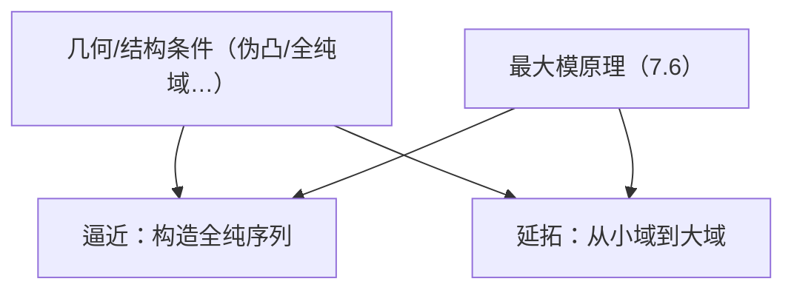

**相关笔记：** [[7.6 最大模原理]] | [[7.8 附录 上半空间]] | [[第07章 多复变引论 — 章节汇总]]

> [!abstract] 概览
> ==核心术语==：全纯逼近｜延拓定理族｜全纯域（domain of holomorphy）｜几何假设（伪凸/Runge 型）
> - 本节回答：何时“局部/较小区域的全纯信息”足以推出“更大范围的全纯逼近/延拓”
> - 关键输出：逼近定理与延拓定理的可引用接口（叙述、条件作用、证明骨架）
> - 章节位置：把 7.2–7.3 的延拓现象放进“全局机制”中；为后续做题提供结构性判断
>
^overview

---

# 1. 本节主题定位
- **本节的核心问题**
  - 何时可以用全纯函数去逼近给定数据？何时可以把局部/子域上的全纯性延拓到更大域？这些问题的共同本质是什么？
- **本节在本章知识链中的位置**
  - 7.2–7.3 给出“延拓”的代表例；本节把它放进“全局机制（逼近/延拓）”框架。
- **本节依赖哪些前置概念/定理**
  - 7.6 最大模原理：提供唯一性与估计收口
  - 7.5 伪凸/Levi：作为几何假设来源之一（教材若使用）
- **本节为后续哪些内容铺路**
  - 为后续章节或第二轮学习建立“题面识别器”：看到“紧集/边界数据/想构造全纯函数”就想到逼近；看到“较小域上的全纯性”就想到延拓/全纯域。

# 2. 内容分层图
- **概念层**：逼近（在什么拓扑下）、延拓、全纯域、几何条件
- **命题层**：逼近定理、延拓定理（以及它们与 Hartogs 的关系）
- **方法层**：最大模原理收口、构造序列/拼接、几何假设保证可行
- **过渡层**：为 7.8 的“标准域模型”提供应用舞台

# 3. 定义系统
## 3.1 全纯逼近（approximation）
- **定义名称**：全纯逼近
- **严格表述（教材口径）**
  - 在满足教材条件的集合/域上，用全纯函数序列在指定意义下逼近目标函数（常见是“一致逼近”或某种范数/拓扑逼近）。
- **定义对象是什么**：一个“从局部/边界数据构造全纯函数”的全局机制
- **为什么要这样定义**
  - 许多构造题的目标不是“求一个解析公式”，而是“证明存在全纯函数满足约束”，逼近定理就是存在性的接口。
- **非例/边界情况**
  - 如果逼近意义要求过强（例如点态不控制，或拓扑不对），定理可能不成立；必须看清题设的拓扑。
- **误区**
  - 把逼近误解成点态逼近；忽略“一致/范数/拓扑”是逼近的核心信息。

## 3.2 延拓（extension）
- **定义名称**：全纯延拓
- **严格表述（框架）**
  - 给定 $f$ 在较小集合（子域/穿孔域）上全纯，问是否存在更大域上的全纯 $F$ 使得 $F=f$（在原定义域上）。
- **它解决了什么问题**
  - 把“局部信息能否决定全局”变成一个可判断的问题；Hartogs 延拓只是其中一类。

## 3.3 全纯域（domain of holomorphy）
- **定义名称**：全纯域
- **严格表述（直觉口径，严格表述以教材为准）**
  - 一个域被称为全纯域，若它是“延拓的最大舞台”：存在在该域上全纯但无法再延拓到任何真扩张域的函数。
- **它解决了什么问题**
  - 告诉你延拓机制的边界在哪里：不是任何域都能无限延拓。
- **误区**
  - 把“全纯域”理解成“任意域都全纯”；实际上它是一个限制性的结构概念。

# 4. 定理/命题系统
## 4.1 逼近定理（本节主定理之一）
> [!quote] 原文直接信息（定理形态）
> 教材给出一类“逼近定理”：在满足相应结构条件的集合/域上，可以用全纯函数（按指定意义）逼近给定函数。

- **定理名称**：逼近定理（教材命名为准）
- **条件逐条解释（做题必须能复述其作用）**
  - 集合/域的结构条件：保证“全纯函数足够多”，可覆盖你要逼近的数据
  - 逼近拓扑/范数：决定结论强度与应用范围（例如一致逼近适合边界控制）
- **证明骨架（Step 1/2/3）**
  - Step 1：把目标函数嵌入一个可逼近的函数类/空间（或先做光滑化/截断）
  - Step 2：构造全纯逼近序列（或用定理直接断言存在）
  - Step 3：用最大模原理/一致估计收口，确保极限/误差满足要求
- **关键一跳**
  - “几何条件 ⇒ 存在足够多的全纯函数进行逼近”（这通常是定理的难点）
- **后续用途**
  - 构造满足边界/紧集条件的全纯函数；为延拓定理提供辅助（逼近+唯一性）。

## 4.2 延拓定理（本节主定理之一）
> [!quote] 原文直接信息（定理形态）
> 教材给出一类“延拓定理”：在满足相应结构条件时，定义在子域/穿孔域上的全纯函数可以延拓到更大域。

- **定理名称**：延拓定理（教材命名为准）
- **条件逐条解释**
  - 结构条件：保证不存在“本质障碍”（例如全纯域概念给出障碍的抽象化）
  - 维数/几何：决定延拓机制是否启动（与 7.3 的 $\bar\partial$、7.5 的 Levi 互联）
- **证明骨架（Step 1/2/3）**
  - Step 1：先通过局部构造/拼接得到候选
  - Step 2：用 PDE（$\bar\partial$）或逼近工具修正为全纯
  - Step 3：用最大模/唯一性收口保证延拓唯一与稳定
- **与 7.3 的关系**
  - Hartogs 延拓是延拓定理族的代表：它体现“缺失集合太小 ⇒ 可去”的机制。
- **若条件削弱，哪里可能出问题**
  - 若域是全纯域，则存在函数无法再延拓；缺少结构条件时“延拓总成立”是错的。

# 5. 例子与反例系统
- **关键例子**
  - Hartogs 延拓（7.3）是延拓定理族的标杆例子。
  - “边界数据→构造全纯函数”的题面是逼近定理的典型应用场景。
- **值得补的反例**
  - 全纯域上的“不可延拓函数”是反例机制：说明延拓的边界确实存在。
- **服务理解点**
  - 例子教你识别题面；反例教你先查条件再套定理。

# 6. 本节逻辑链复原
1) 作者把多复变的若干强现象统一成两类机制：逼近（构造序列）与延拓（扩张定义域）。  
2) 这两类机制都需要结构条件（几何/全纯结构），否则结论可能失败。  
3) 一旦机制启动，最大模原理提供“唯一性/估计”的最后收口，使全局结论成立。

# 7. 本节高风险误区
1) **不看“逼近意义/拓扑”就套逼近定理**
   - 正确理解：先写清是“一致逼近”还是“范数逼近”。
2) **把延拓当成普遍事实**
   - 正确理解：全纯域概念说明延拓有边界；必须检查结构条件。
3) **忘记最大模/唯一性在证明中负责“收口”**
   - 正确理解：构造与收口缺一不可；否则你可能只得到“近似满足”。
4) **把几何条件当作装饰**
   - 正确理解：几何条件常是定理的发动机；缺它往往是假命题。
5) **以为本节的定理与 7.3 无关**
   - 正确理解：7.3 给出一个延拓模板；本节讨论的是“何时这种模板能推广/何时会失败”。

# 8. 知识库拆分建议
- **A类：概念卡**
  - 全纯逼近、全纯延拓、全纯域
- **B类：定理卡**
  - 逼近定理（教材命名）
  - 延拓定理（教材命名）
- **C类：本节保留**
  - “题面识别器”：哪些题像逼近、哪些题像延拓
- **D类：专题综述候选**
  - “全局机制：逼近/延拓/全纯域/伪凸”的关系图谱

# 9. 后续学习接口
- **下一轮展开证明的点**
  - 教材的结构条件究竟是什么（Runge/伪凸/全纯域等）的精确定义与相互蕴含。
- **适合设计习题的点**
  - 识别题：给题面，判断应该调用逼近还是延拓，并说明理由。
- **与前后节衔接**
  - 向前：7.6 给收口工具；向后：7.8 的标准域为许多局部计算提供模型。

# 10. 自测问题
1) 用一句话区分：逼近定理解决什么问题？延拓定理解决什么问题？  
2) 为什么“逼近意义（拓扑/范数）”是结论的一部分而不是细节？  
3) 什么是全纯域？它在延拓问题中扮演什么“边界角色”？  
4) 说出最大模原理在逼近/延拓证明中典型承担的任务是什么。  
5) 给出一个题面信号：看到它你会优先考虑“逼近定理”而不是“延拓定理”。

---

## 引用
![[00-Raw素材/泛函分析/07_第7章_多复变引论/7.7_逼近和延拓定理.pdf]]
