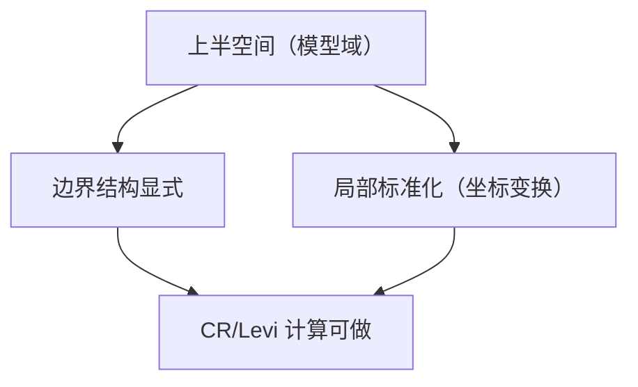

**相关笔记：** [[7.7 逼近和延拓定理]] | [[7.9 习题]] | [[第07章 多复变引论 — 章节汇总]]

> [!abstract] 概览
> ==核心术语==：上半空间模型域｜坐标标准化｜边界超曲面｜在模型上计算 CR/Levi
> - 本节回答：为什么“上半空间”是一个好用的标准域，以及它在本章中承担的角色（把一般局部问题搬到可计算模型）
> - 关键输出：上半空间的定义口径、边界结构、以及它与前述 CR/Levi/延拓问题的连接方式
>
^overview

---

# 1. 本节主题定位
- **本节的核心问题**
  - 为什么需要一个“标准域”来做局部计算？上半空间如何作为边界问题（CR/Levi/估计）的模型？
- **本节在本章知识链中的位置**
  - 位于全章末尾作为附录：给出可计算模型，帮助你在第二轮把 7.4–7.5 的对象“算出来”而不是只背符号。
- **本节依赖哪些前置概念/定理**
  - 7.4：边界 CR 的切向条件
  - 7.5：Levi 形式（二阶几何）
- **本节为后续哪些内容铺路**
  - 7.9/7.10 的题目与开放问题常需要“局部标准化”的直觉（把一般边界点搬到模型域附近讨论）。

# 2. 内容分层图
- **概念层**：上半空间域、边界超曲面、局部坐标变换/标准化
- **命题层**：在模型域上 CR/Levi 的表达更简单（教材若给出具体变换/命题，以原文为准）
- **方法层**：把局部几何/边界 PDE 转化为标准形式进行计算或估计
- **过渡层**：为习题页提供“可计算舞台”

# 3. 定义系统
## 3.1 上半空间（多复变版本）
- **定义名称**：上半空间（upper half-space）
- **严格表述（教材口径）**
  - 以某个“虚部为正”（或等价）条件定义的标准域（具体变量/形式以教材为准）。
- **定义对象是什么**：$\mathbb C^n$ 中一个边界形状非常规则的域
- **为什么要这样定义**
  - 它的边界方程简单、对称性强，使得切向方向与二阶形式更容易写出。
- **它解决了什么问题**
  - 给你一个统一的计算模板：遇到复杂边界点，先想能否在局部坐标下把它近似/化到上半空间。
- **最小例子**
  - 一复变中：上半平面 $\{z:\operatorname{Im}z>0\}$。
- **误区**
  - 把它当作纯拓扑同胚模型；这里关心的是复结构与边界结构的保持（通常是双全纯/光滑意义）。

# 4. 定理/命题系统
## 4.1 模型化命题（附录的用途口径）
> [!quote] 原文直接信息（用途形态）
> 教材在附录中引入上半空间作为标准域，用于在该模型上讨论边界结构与相关算子/几何量，从而把一般问题局部化、标准化。

- **命题名称**：上半空间作为边界局部模型（用途命题）
- **结论到底在说什么**
  - 许多边界问题不是“全球都在上半空间”，而是“在边界点附近可以搬到上半空间做计算”。
- **证明骨架（Step 1/2/3）**
  - Step 1：选边界点与局部坐标
  - Step 2：做规范化/变换使边界方程简化
  - Step 3：在模型上计算 CR/Levi 或做估计
- **关键一跳**
  - 坐标变换的正则性与其对复结构/边界结构的保持（细节留到第二轮）。

# 5. 例子与反例系统
- **关键例子**
  - 在上半空间上显式写出边界、切向方向，从而把“切向 CR/Levi”变成可计算对象（第二轮补充具体算式）。
- **值得补的反例**
  - 若边界不够光滑或变换不保持复结构，模型化可能失败或失去意义。
- **服务理解点**
  - “模型域”不是装饰，而是把抽象几何对象落地的算子化工具。

# 6. 本节逻辑链复原
1) 7.4–7.5 引入边界 CR 与 Levi，但它们在一般域上不易计算。  
2) 作者提供上半空间作为标准域，把局部问题搬到“可算”的舞台。  
3) 这样在做题/第二轮学习时，你可以在模型上直观看到几何与分析如何耦合。

# 7. 本节高风险误区
1) **把“模型化”误当成“全局等同”**
   - 正确理解：通常是局部等价/局部坐标化。
2) **忽略边界正则性**
   - 正确理解：没有足够光滑度，CR/Levi 甚至无法定义或不稳定。
3) **把拓扑同胚当作足够**
   - 正确理解：需要保持复结构/边界结构（通常双全纯或至少光滑同胚）。
4) **只记上半空间定义，不知道为何要引入**
   - 正确理解：它是“把对象算出来”的工具，不是新的抽象概念堆砌。
5) **忘记与 7.4/7.5 的连接**
   - 正确理解：本节的意义在于让 CR/Levi 的表达更显式。

# 8. 知识库拆分建议
- **A类：概念卡**
  - 上半空间（多复变版本）、模型域思想、局部标准化
- **B类：定理卡**
  - 若教材给出“与球/圆盘的变换”或“局部等价”命题，可独立为定理卡
- **C类：本节保留**
  - “如何使用模型域”的操作说明
- **D类：专题综述候选**
  - “常用模型域对照表”（球/上半空间/多圆盘）及其适用场景

# 9. 后续学习接口
- **下一轮展开证明/计算的点**
  - 在模型域上显式写出复切向空间与 Levi 形式（把抽象定义变为可算公式）。
- **适合设计习题的点**
  - 让学生在模型域上验证某个边界函数是否 CR；或计算 Levi 的符号。
- **与前后节衔接**
  - 向前连接 7.4–7.5；向后连接 7.9 的题型训练。

# 10. 自测问题
1) 用一句话说明：为什么需要模型域？  
2) 上半空间的边界是什么类型的集合（超曲面/等号集合）？  
3) 在模型域上，为什么切向方向更容易描述？  
4) 你预计 Levi 形式在模型域上会更容易算的原因是什么？  
5) 什么时候模型化可能失效（提示：正则性/结构保持）？

---

## 引用
![[00-Raw素材/泛函分析/07_第7章_多复变引论/7.8_附录_上半空间.pdf]]
