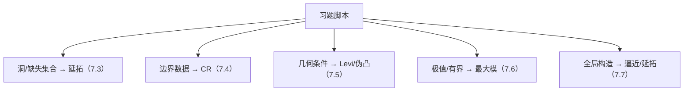

**相关笔记：** [[7.8 附录 上半空间]] | [[7.10 问题]] | [[第07章 多复变引论 — 章节汇总]]

> [!abstract] 概览
> ==核心术语==：题型地图｜延拓套路（$F=\chi f-u$）｜CR→Levi（几何充分性）｜最大模收口
> - 本节目标：把第07章习题压成“识别信号→调用定理→关键一跳”的做题脚本
> - 第一轮要求：不追求长解答；但必须写清对象、要用的定理名、关键构造/关键一跳
^overview

---

# 1. 本节主题定位
- **本节的核心问题**
  - 本章习题主要训练哪几种“可复用动作”？每类题应先看什么信号，再调用什么定理？
- **本节在本章知识链中的位置**
  - 把 7.2–7.7 的结论变成可操作脚本，并为 7.10 的“开放问题/反例意识”提供骨架。
- **本节依赖哪些前置概念/定理**
  - 7.3（延拓构造）、7.4（边界 CR）、7.5（Levi/伪凸）、7.6（最大模）、7.7（逼近/延拓定理族）
- **本节为后续哪些内容铺路**
  - 第二轮：把每个脚本补成严格证明；或针对“缺条件时失败”补反例。

# 2. 内容分层图
- **概念层**：题型、识别信号、关键构造、关键一跳
- **命题层**：本章主定理作为“可引用接口”
- **方法层**：延拓/边界/几何判别/最大模收口四大套路
- **过渡层**：由“会做题”转向“会提问/会找边界”（7.10）

# 3. 定义系统
## 3.1 题型地图（本库用语）
- **定义名称**：题型地图
- **严格表述**
  - 把题面路由到：主题（延拓/边界/几何/极值/全局）→ 需要的定理卡 → 一句关键构造/关键一跳。
- **为什么要这样定义**
  - 第一轮要确保你能“启动正确机制”；细节证明留到第二轮补齐。
- **初学者误区**
  - 把题型地图当答案；正确做法是让它指导你写出证明骨架。

# 4. 定理/命题系统（本节只列“调用接口”）
> [!quote] 原文直接信息（本节定位）
> 本节对应教材“习题”部分；以题型训练为主，不新增主定理，而是训练如何调用本章的核心结论与构造。

- **延拓接口**：7.3 的 $F=\chi f-u$ 与 $\bar\partial u=\alpha$
- **边界接口**：7.4 的“全纯迹 ⇒ CR（必要）”，充分性看 7.5
- **几何接口**：7.5 的 Levi 形式符号判别（伪凸/强伪凸等）
- **收口接口**：7.6 最大模原理（内部局部极大 ⇒ 常数/唯一性）
- **全局接口**：7.7 逼近/延拓定理族（看清拓扑与结构条件）

# 5. 例子与反例系统
- **本节最关键的例子（题型骨架示例）**
  1) 题面含“洞/缺失集合” → 写出截断 $\chi$，目标是构造 $F=\chi f-u$。
  2) 题面含“边界上函数” → 先写 CR 必要性，再讨论 Levi/伪凸是否保证充分性。
  3) 题面含“内部最大/有界/边界控制” → 设法触发最大模原理完成收口。
- **本节最值得补的反例**
  - 缺条件反例意识：去掉 $n\ge2$、去掉伪凸、去掉兼容条件，套路会断（第二轮补具体反例）。
- **每个例子/反例分别服务于什么理解点**
  - 例子服务于“题面识别”；反例服务于“条件不可省”。

# 6. 本节逻辑链复原
1) 教材给了很多习题，但核心训练点其实是“机制识别”。  
2) 本节把机制压缩为四个动作：延拓构造、边界 CR、Levi 判别、最大模收口。  
3) 只要你能写出关键一跳，就能把题目转为可继续补细节的证明骨架。

# 7. 本节高风险误区
1) 不判题型就开算。  
2) 只写“引用某定理”，不写关键构造/关键等式（例如 $F=\chi f-u$）。  
3) 把 Levi/伪凸当背景，不会用作“充分性开关”。  
4) 最大模原理不会触发：不会制造“内部局部最大”。  
5) 直接抄 PDF 排版导致 KaTeX 崩（对齐环境/双反斜杠）。

# 8. 知识库拆分建议
- **A类：概念卡**：题型地图（做题脚本）
- **B类：定理卡**：不新增（引用 7.3–7.7 的定理卡）
- **C类：本节保留**：“题面信号→调用接口→关键一跳”清单
- **D类：专题综述候选**：“本章做题套路总览”（可作为全书习题页模板）

# 9. 后续学习接口
- 下一轮：把每个脚本补成严格证明（尤其是 $\bar\partial$ 可解性与 Levi 的作用）。  
- 适合设计习题：给一句题面，要求写出“应调用的定理 + 第一行证明”。  
- 与 7.10 衔接：把“缺哪条条件会失败”说清楚并找反例。

# 10. 自测问题
1) 看到“洞/缺失集合”，你第一句写什么？关键构造是什么？  
2) 看到“边界上函数”，你第一步先做什么？（必要性还是充分性？）  
3) Levi/伪凸在本章中用一句话概括承担什么角色？  
4) 最大模原理通常负责证明的哪一步（构造/收口/估计）？  
5) 给出一个“缺条件会失败”的点，并说明你会从维数/几何/可解性哪条线去找反例。

---

## 引用
![[00-Raw素材/泛函分析/07_第7章_多复变引论/7.9_习题.pdf]]
