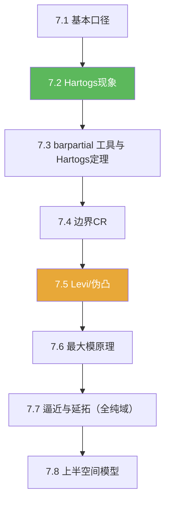

# 第07章 多复变引论 — 章节汇总

**相关笔记：** [[第06章 Brownian运动引论 — 章节汇总]] | [[泛函分析/index]] | [[Wiki/index]]

> [!abstract] 概览
> 本章的核心是理解“$n\ge 2$ 的全纯结构”与一复变的差异：  
> Hartogs 现象（可去洞）→ $\bar\partial$ 工具 → 边界 CR 与 Levi/伪凸几何 → 最大模 → 逼近与延拓（全纯域）。

^overview

---

## 一、知识结构总览

---

## 二、各节入口（学习路线）

| 节 | 主题 | 你应带走的可复用套路 |
|---|---|---|
| [[7.1 初等性质]] | 定义与对比 | 分离全纯 vs 全纯；多复变“断裂点”预告 |
| [[7.2 Hartogs现象 一个例子]] | 可去洞现象 | 维数 $n\ge 2$ 的核心反直觉 |
| [[7.3 Hartogs定理 非齐次Cauchy-Riemann方程]] | 工具化证明 | “截断 + 解 $\bar\partial$ + 修正”骨架 |
| [[7.4 边界情形 切向Cauchy-Riemann方程]] | 边界 CR | 全纯边界迹的必要条件；充分性需几何 |
| [[7.5 Levi形式]] | 几何判别器 | Levi 半正 ⇔ 伪凸直觉；影响可解性/延拓 |
| [[7.6 最大模原理]] | 收口工具 | 内部极值 ⇒ 常数；边界控制 |
| [[7.7 逼近和延拓定理]] | 全局机制 | 逼近/延拓与全纯域概念 |
| [[7.8 附录 上半空间]] | 模型域 | 局部标准化，便于计算边界结构 |
| [[7.9 习题]] | 训练题 | 题型地图与常见套路 |
| [[7.10 问题]] | 边界感 | 维数/几何/可解性的因果链 |

---

## 三、自测清单（逐条打勾）

- [ ] 我能说清楚为什么 Hartogs 现象要求 $n\ge 2$。  
- [ ] 我能复述 Hartogs 延拓证明的“截断 + $\bar\partial$ 修正”骨架。  
- [ ] 我能解释 CR 条件是全纯边界迹的必要条件，并知道充分性需 Levi/伪凸。  
- [ ] 我能用一句话说明 Levi 形式在做什么（复切向二阶信息）。  
- [ ] 我能熟练使用最大模原理完成“常数/唯一性”收口。  
- [ ] 我能解释“全纯域”的意义：它是延拓的最大域。  

---

## 四、各节概览（快速回看）

- ![[7.1 初等性质#^overview]]
- ![[7.2 Hartogs现象 一个例子#^overview]]
- ![[7.3 Hartogs定理 非齐次Cauchy-Riemann方程#^overview]]
- ![[7.4 边界情形 切向Cauchy-Riemann方程#^overview]]
- ![[7.5 Levi形式#^overview]]
- ![[7.6 最大模原理#^overview]]
- ![[7.7 逼近和延拓定理#^overview]]
- ![[7.8 附录 上半空间#^overview]]
- ![[7.9 习题#^overview]]
- ![[7.10 问题#^overview]]

---

## 五、本章索引（Wiki 导航）

**节笔记：** [[7.1 初等性质]] | [[7.2 Hartogs现象 一个例子]] | [[7.3 Hartogs定理 非齐次Cauchy-Riemann方程]] | [[7.4 边界情形 切向Cauchy-Riemann方程]] | [[7.5 Levi形式]] | [[7.6 最大模原理]] | [[7.7 逼近和延拓定理]] | [[7.8 附录 上半空间]] | [[7.9 习题]] | [[7.10 问题]]

**concepts（本章）：** [[Hartogs现象]] [[barpartial算子]] [[CR函数]] [[Levi形式]] [[伪凸域]] [[全纯域]] [[全纯逼近]] [[上半空间（多复变）]]

**theorems（本章）：** [[Hartogs定理（延拓定理）]] [[最大模原理（多复变）]] [[逼近定理（多复变）]] [[延拓定理（多复变）]]

---

## 六、引用（PDF）

![[00-Raw素材/泛函分析/07_第7章_多复变引论/7.1_初等性质.pdf]]
![[00-Raw素材/泛函分析/07_第7章_多复变引论/7.2_Hartogs现象_一个例子.pdf]]
![[00-Raw素材/泛函分析/07_第7章_多复变引论/7.3_Hartogs定理_非齐次Cauchy-Riemann方程.pdf]]
![[00-Raw素材/泛函分析/07_第7章_多复变引论/7.4_边界情形_切向Cauchy-Riemann方程.pdf]]
![[00-Raw素材/泛函分析/07_第7章_多复变引论/7.5_Levi形式.pdf]]
![[00-Raw素材/泛函分析/07_第7章_多复变引论/7.6_最大模原理.pdf]]
![[00-Raw素材/泛函分析/07_第7章_多复变引论/7.7_逼近和延拓定理.pdf]]
![[00-Raw素材/泛函分析/07_第7章_多复变引论/7.8_附录_上半空间.pdf]]
![[00-Raw素材/泛函分析/07_第7章_多复变引论/7.9_习题.pdf]]
![[00-Raw素材/泛函分析/07_第7章_多复变引论/7.10_问题.pdf]]
