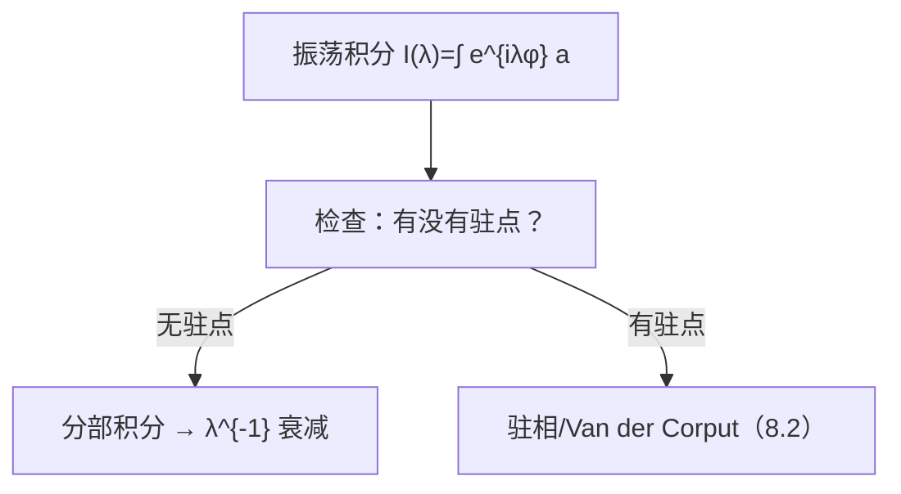

**相关笔记：** [[第07章 多复变引论 — 章节汇总]] | [[8.2 振荡积分]] | [[第08章 Fourier分析中的振荡积分 — 章节汇总]]

> [!abstract] 概览
> ==核心术语==：振荡抵消｜相位函数 $\phi$｜振幅函数 $a$｜分部积分（IBP）｜“可用条件检查表”
> - 本节用一个“最小例证”说明：同样是积分，加入振荡因子后会出现“抵消”，导致量级下降（衰减）
> - 第一招是分部积分：把“导数落到振荡因子上”换来一个大的参数（典型是 $\lambda$）的倒数
> - 但分部积分不是总能用：你必须检查相位导数不为 0、边界项可控、振幅足够光滑/有支撑
> - 本节输出的是后续 8.2 的通用模板：**先定位振荡来源，再决定用哪种估计机制**
^overview

---

# 1. 本节主题定位
- **本节的核心问题**
  - “振荡为什么会让积分变小？”最小可复用的解释是什么？第一招（分部积分）在什么条件下成立？
- **本节在本章知识链中的位置**
  - 入口直觉节：先建立“抵消”这一核心机制，随后 8.2 抽象为通用估计定理模板。
- **本节依赖哪些前置概念/定理**
  - 一元/多元微积分的分部积分；对“支撑/边界项”的基本认识。
  - 复数指数函数的基本性质（$e^{i\theta}$ 模长恒为 1）。
- **本节为后续哪些内容铺路**
  - 8.2：振荡积分的一般估计（Van der Corput、驻相法等）
  - 8.3：曲面 Fourier 衰减（把“抵消”升级为几何条件驱动的衰减率）

# 2. 内容分层图
- **概念层**
  - 相位 $\phi$、振幅 $a$、大参数 $\lambda$、抵消
- **命题层**
  - 在“无驻点/导数不为 0”条件下可以积分分部得到衰减
- **方法层**
  - 构造“把导数转移”的算子（IBP 算子），反复迭代换来更高次衰减
- **过渡层**
  - 当出现驻点（$\nabla\phi=0$）时，IBP 会失效，需要驻相法（8.2）

# 3. 定义系统
## 3.1 振荡积分（本章的基本对象）
- **定义名称**：振荡积分（oscillatory integral）
- **严格表述（通用口径，教材以其为准）**
  - 典型形态：
    $$
    I(\lambda)=\int e^{i\lambda \phi(x)} a(x)\,dx,\qquad \lambda\to\infty.
    $$
- **定义对象是什么**
  - 一个依赖大参数 $\lambda$ 的积分；$\lambda$ 越大振荡越快。
- **为什么要这样定义**
  - 许多 Fourier 分析/PDE 的核函数可写成这种形态；估计 $I(\lambda)$ 的衰减率就是估计算子/解的关键步骤。
- **它解决了什么问题**
  - 把“抵消”变成可定量的问题：给出 $|I(\lambda)|\le C\lambda^{-\alpha}$ 这类结论。
- **与前面概念的关系**
  - 若没有振荡因子（例如 $\phi\equiv0$），就退化为普通积分，通常不出现随 $\lambda$ 的衰减。
- **最小例子**
  - $I(\lambda)=\int_0^1 e^{i\lambda x}\,dx$：可算出大小约为 $O(\lambda^{-1})$。
- **非例/边界情况**
  - 如果 $\phi$ 不光滑或 $a$ 不是可积/无控制，衰减估计可能没有意义或需要重新定义（分布意义）。
- **初学者误区**
  - 只记住“振荡会抵消”，但不知道要检查什么条件才能把直觉变成估计（见 #7）。

# 4. 定理/命题系统
## 4.1 “无驻点 ⇒ 可分部积分衰减”（例证级命题）
> [!quote] 原文直接信息（命题形态，需以 PDF 为准）
> 本节通过一个具体例子展示：当相位函数在积分区间/区域内没有驻点（导数不为 0）时，可以通过分部积分把振荡“换成”参数的倒数，从而得到随参数增长的衰减估计。

- **定理/命题名称**：无驻点情形的分部积分衰减（例证口径）
- **准确内容（结构化）**
  - 若在积分区域上能构造算子把导数落在 $e^{i\lambda\phi}$ 上，并且边界项可控，则可得
    $$
    |I(\lambda)|\le C\,\lambda^{-1}\cdot(\text{由 }a,\phi\text{ 的导数控制}).
    $$
- **条件逐条解释（最重要）**
  1) **相位导数不为 0（无驻点）**：保证你能“除以 $\phi'$ 或 $|\nabla\phi|^2$”来构造 IBP 算子；否则分母会爆。
  2) **振幅足够光滑/可微**：分部积分会把导数打到 $a$ 上；导数存在且可控才能迭代。
  3) **边界项为 0 或可控**：要么 $a$ 有紧支撑，要么边界条件使边界项消失，否则无法收口。
- **结论到底在说什么**
  - “振荡抵消”不是口号：它在满足条件时提供明确的衰减阶。
- **这个命题为什么重要**
  - 后续所有更复杂的估计，都会回到这三类条件：无驻点、驻点非退化、以及边界/支撑控制。
- **证明骨架（Step 1/2/3）**
  - Step 1：把 $e^{i\lambda\phi}$ 写成某个导数作用在 $e^{i\lambda\phi}$ 上的形式（产生一个 $\lambda$）。
  - Step 2：分部积分，把导数从振荡因子转移到振幅与系数上，得到 $\lambda^{-1}$。
  - Step 3：用 $a$ 与 $\phi$ 的导数界控制新积分，边界项为 0/可控则完成估计。
- **证明中最关键的一跳**
  - 构造“IBP 算子”时除以导数/梯度的步骤：这一步解释了为什么必须无驻点。
- **后续用途**
  - 8.2 的一般定理中，“无驻点情形”基本都退化为反复 IBP。
- **若条件削弱，哪里可能出问题**
  - 若出现驻点：分母为 0，IBP 机制断裂，需要驻相法。
  - 若边界项不可控：会出现与 $\lambda$ 无关甚至变大的项，衰减失效。

# 5. 例子与反例系统
- **本节最关键的例子**
  - “一眼可算”的振荡积分（如 $\int_0^1 e^{i\lambda x}dx$）作为直觉基准：它告诉你 $O(\lambda^{-1})$ 的量级不是玄学。
- **本节最值得补的反例**
  - 驻点反例方向：如 $\int_{-1}^1 e^{i\lambda x^2}dx$（出现驻点），衰减阶会改变，说明“无驻点”不可省。
- **每个例子/反例分别服务于什么理解点**
  - 例子：把“衰减”具体化成 $\lambda^{-1}$。
  - 反例：提醒你必须先判定是否有驻点，再选工具（IBP vs 驻相）。

# 6. 本节逻辑链复原
1) 作者先给一个可计算/可直观的例子，让读者相信“振荡真的会抵消”。  
2) 随后展示第一招：分部积分如何把“快速振荡”转为“参数倒数”。  
3) 最后强调三类门槛条件（无驻点/光滑/边界），为下一节的通用定理化做准备。

# 7. 本节高风险误区
1) **以为“有振荡就一定衰减”**
   - 为什么容易误读：直觉太强。
   - 正确理解：必须有可用机制（无驻点可 IBP；有驻点需驻相/其它工具）。
2) **忽略边界项**
   - 为什么：练习题常默认边界项消失。
   - 正确理解：要么振幅紧支撑，要么边界条件明确；否则 IBP 不闭合。
3) **把“无驻点”只理解成 $\phi'\ne0$，但不会在多维里检查**
   - 为什么：一维经验迁移。
   - 正确理解：多维要看 $\nabla\phi\ne0$，并关注“在整个支撑上”而非只在一点。
4) **分部积分迭代时忘了导数会不断落到振幅上**
   - 为什么：只盯着 $\lambda^{-1}$。
   - 正确理解：每迭代一次都消耗光滑性；要写清需要几阶导数有界。
5) **KaTeX 排版误用导致公式崩**
   - 为什么：复制 LaTeX 排版习惯。
   - 正确理解：避免对齐环境与双反斜杠换行；推导用列表+多段公式块。

# 8. 知识库拆分建议
- **A类：应独立成概念卡**
  - 振荡积分（基本对象）
  - 相位/振幅/驻点（基本术语）
  - 分部积分算子（IBP trick）
- **B类：应独立成定理卡**
  - 无驻点情形的 IBP 衰减模板（作为可复用 lemma）
- **C类：只保留在本节页中**
  - “例证直觉 + 三条门槛条件”的叙事链
- **D类：建议作为专题综述页的候选节点**
  - “振荡积分估计方法谱系”（IBP / Van der Corput / 驻相 / 减维等）

# 9. 后续学习接口
- **适合下一轮展开证明的点**
  - 把 IBP 算子的构造写成一般多维形式，并把每一步的可积性/边界项处理写严谨。
- **适合设计习题的点**
  - 给定 $\phi,a$，判断能否 IBP、能 IBP 几次、衰减阶是多少（并解释失败原因）。
- **适合与前一节做比较的点**
  - 与第07章“最大模/延拓”不同：本章收口器多是“估计衰减”，不是“唯一性刚性”。
- **适合与下一节做衔接的点**
  - 8.2 会系统给出“有/无驻点”的分支定理；本节输出的检查表应直接复用到 8.2。

# 10. 自测问题
1) 写出一个典型振荡积分 $I(\lambda)$ 的形式，并解释 $\lambda\to\infty$ 的意义。  
2) 为什么“无驻点（导数不为 0）”能触发分部积分衰减？一句话说明关键原因。  
3) 分部积分时边界项从哪里来？什么时候能保证它为 0？  
4) 说明“迭代分部积分”会消耗哪些正则性假设（落在谁身上）。  
5) 给出一个出现驻点的例子，并说明为什么它提示你应该转向驻相/Van der Corput（8.2）。

---

## 引用
![[00-Raw素材/泛函分析/08_第8章_Fourier分析中的振荡积分/8.1_一个例证.pdf]]

