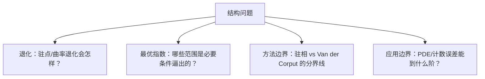

**相关笔记：** [[8.9 习题]] | [[第08章 Fourier分析中的振荡积分 — 章节汇总]]

> [!abstract] 概览
> ==核心术语==：条件的作用｜失败点定位｜最优指数/猜想方向｜退化几何｜应用边界
> - 本节用于建立“结构感与边界感”：哪些条件是发动机、哪些是收口器、哪些是障碍
> - 目标不是写长证明，而是能说清：**为什么需要这些条件、削弱后会在哪一步坏、以及有哪些自然的开放方向**
^overview

---

# 1. 本节主题定位
- **本节的核心问题**
  - 第08章的估计机制在什么条件下成立？这些条件分别在证明链条中负责哪一步？若削弱条件，哪里最先坏掉？
- **本节在本章知识链中的位置**
  - 第二轮接口页：把 8.2–8.8 的工具与应用抽象成“可追问的问题清单”。
- **本节依赖哪些前置概念/定理**
  - 8.2：驻点/退化与衰减模板
  - 8.3：曲率→衰减接口
  - 8.5：必要条件（缩放/Knapp）与指数边界
  - 8.8：Poisson+衰减的应用闭环
- **本节为后续哪些内容铺路**
  - 继续学习 Fourier 限制问题、色散估计、几何计数时，用这些问题作为路线图。

# 2. 内容分层图
- **概念层**：发动机/收口器/障碍（本页组织用语）
- **命题层**：振荡衰减、曲面衰减、限制估计、色散估计、计数误差
- **方法层**：驻相/Van der Corput/TT*/Poisson
- **过渡层**：退化几何与最优指数的边界问题

# 3. 定义系统
## 3.1 结构角色分类（本页组织用语）
- **定义名称**：发动机 / 收口器 / 障碍
- **严格表述**
  - 发动机：产生衰减/估计的关键条件（如 Hessian 非退化、曲率非退化）
  - 收口器：把局部估计拼成全局结论的步骤（如 dyadic 求和、插值、TT*）
  - 障碍：说明“不能更好”的结构原因（如缩放/Knapp 反例、退化几何）
- **它解决了什么问题**
  - 让你在读证明时能准确指出：每个假设到底在“负责哪一步”。

# 4. 定理/命题系统（以“问题”形式组织）
> [!quote] 原文直接信息（本节定位）
> 教材“问题”分片引导读者思考：本章结论的条件作用、可能的改进方向、以及退化/极端情形下会发生什么。

## 4.1 退化驻点：驻相法何时失效？
- **问题**：当驻点 Hessian 退化时，衰减阶如何变化？应该切换到哪类工具（Van der Corput/分层驻相/分解）？
- **对应接口**：8.2（驻相 vs Van der Corput）
- **失败点定位**：二次型化步骤无法闭合，误差项不再可控。

## 4.2 曲率退化：曲面 Fourier 衰减如何变弱？
- **问题**：若曲面存在平直方向或曲率为 0 的方向，$\widehat{\sigma}$ 的衰减会如何降级？这会怎样影响平均算子与限制估计？
- **对应接口**：8.3–8.5
- **失败点定位**：衰减不足导致频段求和/核估计发散或只得到更弱结论。

## 4.3 限制估计的最优范围：必要条件与猜想
- **问题**：缩放与 Knapp 型构造给出哪些必要条件？教材给出的充分条件距离必要条件差在哪里？
- **对应接口**：8.5
- **失败点定位**：指数范围一旦超出必要条件，反例直接破坏不等式。

## 4.4 色散估计与 restriction 的关系（方向）
- **问题**：色散核的驻相估计与 extension 算子结构有什么共性？哪些 PDE 估计可以看成 restriction 思想的变体？
- **对应接口**：8.6 与 8.5
- **失败点定位**：相位退化/几何条件不满足导致时间衰减不足。

## 4.5 格点计数误差项的边界：平滑化与衰减
- **问题**：平滑化参数如何影响误差项？边界几何退化会使误差项上界变差到什么程度？
- **对应接口**：8.8
- **失败点定位**：Fourier 衰减不足导致非零频求和无法有效控制。

# 5. 例子与反例系统
- **关键例子（正向机制）**
  - 非退化驻点模型给典型衰减阶；曲率非退化曲面给典型 $\widehat{\sigma}$ 衰减。
- **最值得补的反例（失败机制）**
  - 退化驻点（衰减变弱）
  - 曲率退化曲面（衰减变弱→限制/平均算子失败）
  - Knapp 型反例（指数范围硬边界）
- **服务理解点**
  - 用反例说明“最优范围/必要条件”不是技术问题，而是结构性边界。

# 6. 本节逻辑链复原
1) 本章从“振荡抵消”出发建立衰减机制（8.1–8.2）。  
2) 把机制推进到几何对象（曲面、平均算子、限制问题）（8.3–8.5）。  
3) 再把它用于 PDE 与计数（8.6、8.8）。  
4) 本节追问：每一步的关键条件是什么？缺条件会在哪一步坏？能否更优？

# 7. 本节高风险误区
1) **只问“结论是什么”，不问“条件负责哪一步”**  
2) **把退化情形当作小细节**（实际上决定衰减阶与指数范围）  
3) **忽略必要条件（缩放/反例）**  
4) **把 dyadic 分解/插值当黑箱**（其实是收口器）  
5) **KaTeX/符号不统一导致无法对照前后节**（Fourier 约定尤其要一致）

# 8. 知识库拆分建议
- **A类：应独立成概念卡**
  - 退化驻点/有限型（作为“衰减阶的几何来源”概念）
  - Knapp 型构造（必要条件工具）
- **B类：应独立成定理卡**
  - 若第二轮要补：把教材给出的“最强/关键版本”限制定理、曲面衰减定理单独成卡
- **C类：只保留在本节页中**
  - “失败点定位清单”（便于复盘）
- **D类：建议作为专题综述页的候选节点**
  - restriction 猜想/最优指数范围综述（若教材提示）

# 9. 后续学习接口
- **适合下一轮展开证明的点**
  - 退化驻点的分层分析；曲率退化时的局部模型与衰减估计。
- **适合设计习题的点**
  - 给相位/曲面，要求判断退化与预期衰减阶，并说明选择哪条工具链。
- **适合与前一节做比较的点**
  - 8.9 是“会做题”；本节是“会问为什么、会找边界”。
- **适合与下一章做衔接的点**
  - 若后续章节继续讨论 Fourier/PDE/几何分析，本节问题可直接迁移为新的研究接口。

# 10. 自测问题
1) 驻相法失效的最典型原因是什么？它会使衰减阶如何变化？  
2) 曲率退化会在哪些环节破坏平均算子或限制估计？  
3) 为什么在限制问题中必须先做缩放/Knapp 必要条件检查？  
4) 色散估计中“时间衰减”来自哪一步的振荡分析？  
5) 在格点计数里，平滑化与 Fourier 衰减分别负责什么角色？

---

## 引用
![[00-Raw素材/泛函分析/08_第8章_Fourier分析中的振荡积分/8.10_问题.pdf]]

