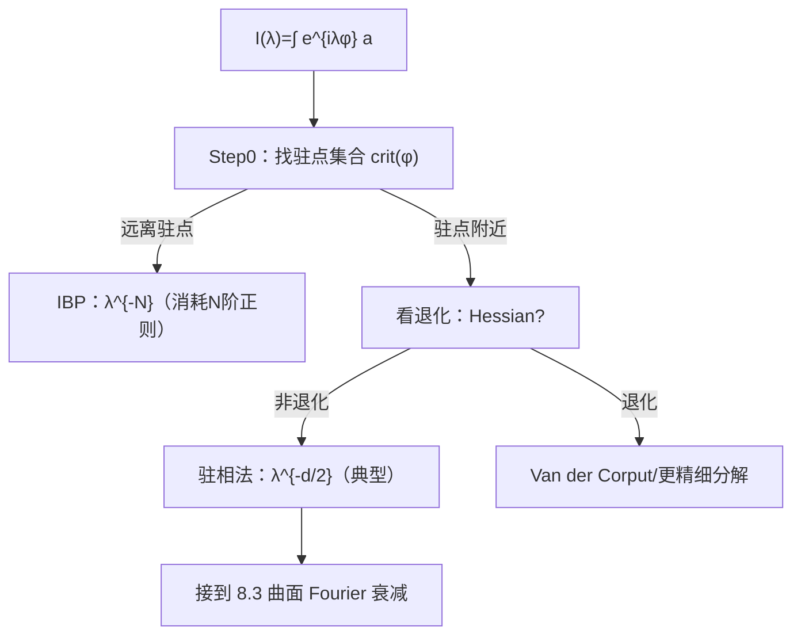

**相关笔记：** [[8.1 一个例证]] | [[8.3 支撑曲面测度的Fourier变换]] | [[第08章 Fourier分析中的振荡积分 — 章节汇总]]

> [!abstract] 概览
> ==核心术语==：驻点（critical point）｜非退化 Hessian｜驻相法（stationary phase）｜Van der Corput 引理｜分部积分（无驻点分支）
> - 本节把 8.1 的“例证”抽象为可复用的估计模板：给定 $I(\lambda)=\int e^{i\lambda\phi}a$
> - 关键是先分支：**无驻点**（$\nabla\phi\ne0$）→ 反复分部积分；**有驻点** → 分析驻点的退化程度（Hessian 是否非退化）并使用驻相/Van der Corput
> - 第一轮目标：记住每条定理的“输入条件清单、输出衰减阶、证明骨架三步、失败点”
^overview

---

# 1. 本节主题定位
- **本节的核心问题**
  - 给定振荡积分 $I(\lambda)$，如何在不同的相位几何条件下给出衰减估计 $|I(\lambda)|\le C\lambda^{-\alpha}$？
- **本节在本章知识链中的位置**
  - 本章的“估计发动机”：8.3–8.8 的核心估计都要回到本节模板（或其变形）。
- **本节依赖哪些前置概念/定理**
  - 8.1：无驻点分部积分的基本机制
  - 多元微积分：梯度、Hessian、非退化临界点
- **本节为后续哪些内容铺路**
  - 8.3：曲面测度 Fourier 衰减通常通过驻相/Van der Corput 得到
  - 8.6：色散估计同样是对某类振荡积分做驻相分析

# 2. 内容分层图
- **概念层**：驻点、Hessian、退化阶、振幅正则性
- **命题层**：无驻点 IBP 衰减；Van der Corput；驻相法
- **方法层**：分区（把驻点附近/远离驻点分开）；局部坐标化；Taylor 展开到二次项
- **过渡层**：把一维/多维估计模板接到“曲面 Fourier”“限制定理”“PDE 核”上

# 3. 定义系统
## 3.1 驻点与驻点集合
- **定义名称**：驻点（critical point）
- **严格表述**
  - $\nabla\phi(x_0)=0$ 的点 $x_0$ 称为驻点；驻点集合记作 $\mathrm{crit}(\phi)$。
- **定义对象是什么**
  - 相位函数的“振荡停止/最弱”的位置；这些点主导渐近行为。
- **为什么要这样定义**
  - 分部积分的分母通常含 $|\nabla\phi|$；在驻点处无法使用无驻点机制。
- **最小例子**
  - $\phi(x)=x^2$ 在 $x=0$ 有驻点；$\phi(x)=x$ 无驻点。
- **初学者误区**
  - 只检查一点而忽略“在振幅支撑上”的驻点分布。

## 3.2 非退化驻点（Hessian 非退化）
- **定义名称**：非退化驻点
- **严格表述（常用口径）**
  - 若 $\nabla\phi(x_0)=0$ 且 Hessian 矩阵 $D^2\phi(x_0)$ 可逆，则称 $x_0$ 为非退化驻点。
- **它解决了什么问题**
  - 允许把相位在驻点附近用二次型主导，从而得到典型的 $\lambda^{-d/2}$ 衰减（驻相法）。
- **误区**
  - 把“二阶不为 0”误认为“可逆”；多维要检查行列式/秩。

## 3.3 振荡积分的“衰减阶”
- **定义名称**：衰减阶（decay rate）
- **严格表述**
  - 若存在 $C,\alpha>0$ 使 $|I(\lambda)|\le C\lambda^{-\alpha}$（$\lambda$ 大时），称 $I$ 具有 $\alpha$ 阶衰减。
- **为什么要这样定义**
  - 8.3–8.6 的算子/PDE 估计最终都需要一个衰减指数来决定映射性质与可积性。

# 4. 定理/命题系统
## 4.1 无驻点情形的反复分部积分（IBP）
> [!quote] 原文直接信息（以教材为准）
> 当相位在振幅支撑上无驻点时，可构造分部积分算子反复迭代得到任意阶的多项式衰减（代价是消耗振幅的高阶导数与边界控制）。

- **定理名称**：无驻点 IBP 衰减模板
- **条件逐条解释**
  - $\nabla\phi\ne0$（在支撑上）：构造 IBP 算子的分母不爆
  - $a$ 足够光滑/支撑可控：保证迭代与边界项处理
- **证明骨架**
  - Step 1：构造算子 $L$ 使 $L(e^{i\lambda\phi})=(i\lambda)e^{i\lambda\phi}$
  - Step 2：分部积分把 $L$ 转移到 $a$
  - Step 3：迭代 $N$ 次得到 $\lambda^{-N}$

## 4.2 Van der Corput 型估计（退化或一维核心工具）
> [!quote] 原文直接信息（以教材为准）
> 在一维（或可降维的局部）情形下，若相位的某阶导数有下界，可得到 $|I(\lambda)|\le C\lambda^{-\alpha}$ 的估计（$\alpha$ 由阶数决定），这类结果常被归入 Van der Corput 引理。

- **定理名称**：Van der Corput 引理（模板）
- **条件逐条解释**
  - 控制某阶导数（例如 $|\phi^{(k)}|\ge c$）：用“有限阶非退化”替代 Hessian 可逆
  - 振幅的有界变差/光滑性：保证估计闭合
- **结论到底在说什么**
  - 即使有驻点，只要退化不太严重，也能得到多项式衰减。
- **关键一跳**
  - 把积分分解为单调/曲率受控区间，并在每块上做 IBP 或比较估计。

## 4.3 驻相法（stationary phase，非退化驻点主定理）
> [!quote] 原文直接信息（以教材为准）
> 当驻点非退化（Hessian 可逆）且振幅足够光滑时，振荡积分的主项由驻点附近贡献决定，并给出典型的 $\lambda^{-d/2}$ 级衰减与渐近展开（证明以局部二次近似为核心）。

- **定理名称**：驻相法（非退化驻点）
- **条件逐条解释**
  - Hessian 可逆：允许用二次型替代相位主导项
  - 局部化（cut-off）：只分析驻点附近并控制其余部分
  - 振幅光滑：用于 Taylor 展开与误差控制
- **证明骨架（Step 1/2/3）**
  - Step 1：分区：驻点邻域 + 远离驻点（远离部分用 IBP）
  - Step 2：在驻点邻域做坐标变换，把相位化为二次型 + 高阶余项
  - Step 3：对二次型情形显式计算/估计，并控制余项
- **证明中最关键的一跳**
  - “把相位局部化为二次型”的坐标化与误差控制：这一步解释了为什么需要非退化。
- **后续用途**
  - 8.3：曲面 Fourier 衰减往往就是对某个驻相积分的应用。
- **条件削弱会怎样**
  - Hessian 退化：衰减阶下降或需要更精细的分解（通常回到 Van der Corput/分层驻相）。

# 5. 例子与反例系统
- **本节最关键的例子**
  - 典型驻相模型：$\int_{\mathbb R^d} e^{i\lambda |x|^2} a(x)\,dx$，展示 $\lambda^{-d/2}$ 的衰减量级。
- **本节最值得补的反例**
  - 退化驻点（如 $\phi(x)=x^k$）导致衰减阶与 $k$ 相关，说明“非退化 Hessian”不可随意省略。
- **每个例子/反例分别服务于什么理解点**
  - 例子：让你记住“非退化驻点 → $\lambda^{-d/2}$”这一量级记忆钩子。
  - 反例：告诉你必须把退化程度写进条件，否则结论会错。

# 6. 本节逻辑链复原
1) 先把问题定型：估计 $I(\lambda)$ 的衰减。  
2) 关键分支：是否存在驻点。无驻点用 IBP；有驻点则研究退化。  
3) 对“非退化驻点”给驻相法；对“有限阶退化/一维控制”给 Van der Corput。  
4) 这些模板随后被反复调用于曲面 Fourier、限制估计、色散核等场景。

# 7. 本节高风险误区
1) **不先分支（无驻点/有驻点）就套定理**
   - 正确理解：先定位 $\mathrm{crit}(\phi)$ 与振幅支撑的相对位置。
2) **把“非退化”误解为“二阶导数不为 0”**
   - 正确理解：多维要检查 Hessian 可逆（秩/行列式），不是某个分量非零。
3) **忽略局部化（cut-off）**
   - 正确理解：驻相法几乎总是“驻点附近分析 + 远离驻点用 IBP”的拼接结构。
4) **只记住衰减阶，不知道条件各自负责哪一步**
   - 正确理解：Hessian 可逆负责坐标化；光滑性负责误差控制；支撑/边界负责 IBP 闭合。
5) **KaTeX 写法触发门禁**
   - 正确理解：避免对齐环境与“反斜杠换行”写法；多行推导改用列表+多个公式块。

# 8. 知识库拆分建议
- **A类：应独立成概念卡**
  - 驻点/非退化驻点/退化阶
  - 驻相法（作为方法卡）
  - Van der Corput 引理（作为方法卡）
- **B类：应独立成定理卡**
  - 无驻点 IBP 衰减模板
  - 驻相法主定理（非退化）
- **C类：只保留在本节页中**
  - “分支树 + 选工具”的路由图
- **D类：建议作为专题综述页的候选节点**
  - “振荡积分估计工具箱总览”（把本章所有调用点串起来）

# 9. 后续学习接口
- **适合下一轮展开证明的点**
  - 驻相法中坐标变换与误差项的严格估计（需要把余项控制写细）。
- **适合设计习题的点**
  - 给定 $\phi,a$：判断用 IBP/驻相/Van der Corput，并给出衰减阶与失败原因。
- **适合与前一节做比较的点**
  - 8.1 只有“第一招”；本节把第一招放入完整的“工具谱系”。
- **适合与下一节做衔接的点**
  - 8.3 的曲面 Fourier 衰减基本就是把曲面参数化后得到的驻相积分；你需要把“曲率/非退化”翻译为 Hessian 可逆。

# 10. 自测问题
1) 什么是驻点？为什么驻点会让无驻点的 IBP 机制失效？  
2) 写出“驻点非退化”的条件，并解释它在驻相法证明里负责哪一步。  
3) 说明驻相法证明的三段结构：局部化、二次型化、误差控制。  
4) Van der Corput 引理解决了驻相法哪类“退化”问题？它的输入条件是什么类型？  
5) 给一个你自选的相位函数 $\phi$，并说明在振幅支撑上如何快速判断应该用哪条估计工具。

---

## 引用
![[00-Raw素材/泛函分析/08_第8章_Fourier分析中的振荡积分/8.2_振荡积分.pdf]]
