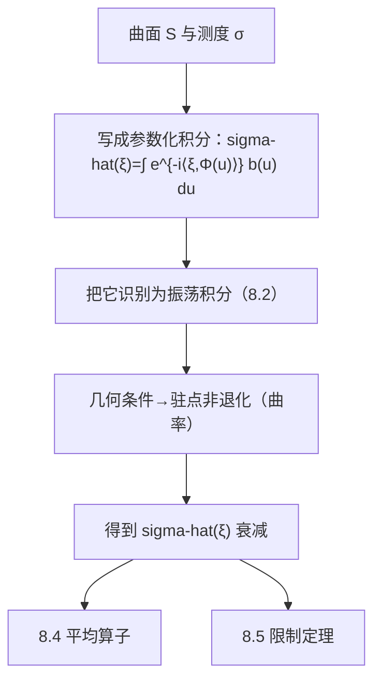

**相关笔记：** [[8.2 振荡积分]] | [[8.4 回到平均算子]] | [[第08章 Fourier分析中的振荡积分 — 章节汇总]]

> [!abstract] 概览
> ==核心术语==：曲面测度 $\sigma$｜参数化｜高斯曲率/二次型非退化｜Fourier 衰减｜驻相法接口
> - 本节把 8.2 的振荡积分模板应用到“曲面测度的 Fourier 变换”
> - 核心机制：曲面上的几何非退化（曲率/二阶信息）使相位 Hessian 非退化，从而得到衰减
> - 本节输出的是一个可复用接口：**几何条件 → Fourier 衰减率 → 后续算子估计/限制估计**
^overview

---

# 1. 本节主题定位
- **本节的核心问题**
  - 对曲面 $S$ 的测度 $\sigma$，如何估计其 Fourier 变换 $\widehat{\sigma}(\xi)$ 的衰减？衰减率由哪些几何量决定？
- **本节在本章知识链中的位置**
  - 连接点：从“振荡积分”过渡到“几何 Fourier 分析”，并为 8.4 平均算子与 8.5 限制定理提供输入估计。
- **本节依赖哪些前置概念/定理**
  - 8.2：驻相法/无驻点 IBP 的分支模板
  - 曲面参数化与法向/切向、曲率的基本概念（至少直觉层面）
- **本节为后续哪些内容铺路**
  - 8.4：把 $\widehat{\sigma}$ 的衰减转回空间算子估计（平均算子）
  - 8.5：限制定理中“曲率”条件的来源与必要性

# 2. 内容分层图
- **概念层**：曲面测度、Fourier 变换、曲率/非退化
- **命题层**：曲率非退化 ⇒ $\widehat{\sigma}$ 衰减（估计式）
- **方法层**：参数化后变成振荡积分；对相位做驻相分析
- **过渡层**：从衰减估计推算子界/限制估计

# 3. 定义系统
## 3.1 曲面测度与 Fourier 变换
- **定义名称**：曲面测度 $\sigma$（surface measure）
- **严格表述（教材口径）**
  - 在足够光滑的曲面 $S$ 上的自然面积测度（或教材指定的测度）。
- **定义对象是什么**
  - 把曲面的几何信息编码成一个测度；其 Fourier 变换刻画“曲面频域指纹”。
- **为什么要这样定义**
  - 很多算子（球面平均/曲面平均）与限制问题都以 $\sigma$ 为内核。
- **最小例子**
  - 单位球面 $S^{d-1}$ 的面积测度。
- **误区**
  - 忘记测度可能包含权重；权重会影响振幅 $b(u)$，进而影响估计常数与可用正则性。

## 3.2 曲率/非退化（第一轮口径）
- **定义名称**：曲率非退化（直觉口径）
- **严格表述**
  - 以教材为准；常见口径是“高斯曲率不为 0”或“第二基本形式非退化”，保证驻相分析中的 Hessian 可逆。
- **它解决了什么问题**
  - 给振荡积分提供非退化驻点，从而得到明确的衰减指数。
- **误区**
  - 把“曲面不平”当成曲率非退化；真正用到的是二阶形式的可逆/符号性质。

# 4. 定理/命题系统
## 4.1 曲率非退化 ⇒ $\widehat{\sigma}(\xi)$ 衰减（接口命题）
> [!quote] 原文直接信息（以教材为准）
> 教材通过把 $\widehat{\sigma}(\xi)$ 写成参数化振荡积分，并在曲率/非退化条件下使用驻相法，得到 $\widehat{\sigma}(\xi)$ 随 $|\xi|$ 增大而衰减的估计；曲率退化会导致衰减变弱或失败。

- **定理名称**：曲面测度 Fourier 衰减估计（曲率驱动）
- **准确内容（结构化）**
  - 在教材假设下存在 $\alpha>0$ 使
    $$
    |\widehat{\sigma}(\xi)|\le C(1+|\xi|)^{-\alpha}.
    $$
  - 并且 $\alpha$ 与维数、非退化类型（典型是非退化驻点）相关。
- **条件逐条解释**
  1) 曲面足够光滑：为了能参数化并做二阶展开
  2) 非退化几何条件（曲率/二次型）：保证驻相法可用
  3) 振幅/局部化：把问题切到有限张坐标图上
- **结论到底在说什么**
  - 几何条件（曲率）转化为频域衰减；这就是后续算子与限制估计的“输入数据”。
- **证明骨架（Step 1/2/3）**
  - Step 1：用坐标图参数化 $S$，把 $\widehat{\sigma}$ 写成 $\int e^{-i\langle\xi,\Phi(u)\rangle} b(u)du$
  - Step 2：把 $|\xi|$ 抽成大参数，识别相位并找驻点
  - Step 3：在非退化条件下用驻相法得到衰减；远离驻点部分用 IBP
- **证明中最关键的一跳**
  - “曲率非退化 ⇒ 驻点 Hessian 非退化”的转换（把几何二阶信息翻译成解析条件）。
- **后续用途**
  - 8.4：用该衰减控制平均算子/相关算子的范数
  - 8.5：限制估计的曲率假设与必要性线索
- **若条件削弱，哪里可能出问题**
  - 曲率退化方向：驻相非退化失败，衰减阶下降；在极端情形可能不再有多项式衰减。

# 5. 例子与反例系统
- **本节最关键的例子**
  - 球面/抛物面：曲率非退化，衰减最典型；也是限制定理与色散方程的常见模型。
- **本节最值得补的反例**
  - 含平直方向的曲面（曲率退化）：会导致衰减变弱，提醒你“曲率条件不是装饰”。
- **服务的理解点**
  - 例子服务于“曲率→衰减”的记忆钩子；反例服务于“失败点定位”。

# 6. 本节逻辑链复原
1) 作者把曲面 Fourier 变换写成振荡积分，为使用 8.2 的模板做接口。  
2) 随后指出：估计能否强，取决于曲面二阶几何（曲率/非退化）。  
3) 最后把衰减估计作为“后续章节的输入”，导向算子估计与限制问题。

# 7. 本节高风险误区
1) **不会把 $\widehat{\sigma}$ 写成振荡积分**
   - 正确理解：先参数化，再把指数写成 $e^{-i\langle\xi,\Phi(u)\rangle}$。
2) **把“曲率非退化”当作模糊直觉**
   - 正确理解：必须能说清它在证明里对应“驻点 Hessian 可逆/二次型非退化”。
3) **忽略局部化**
   - 正确理解：曲面通常要用有限张坐标图覆盖，逐块估计再拼接。
4) **误以为衰减只跟维数有关**
   - 正确理解：退化程度同样决定衰减阶。
5) **在公式推导中使用对齐环境导致 KaTeX 崩**
   - 正确理解：拆成列表+多段公式块，不用对齐环境。

# 8. 知识库拆分建议
- **A类：应独立成概念卡**
  - 曲面测度与 Fourier 变换
  - 曲率/非退化条件（作为“几何→分析接口”概念）
- **B类：应独立成定理卡**
  - 曲面测度 Fourier 衰减估计（接口定理）
- **C类：只保留在本节页中**
  - 参数化→驻相这一条“把几何转成振荡积分”的主线解释
- **D类：建议作为专题综述页的候选节点**
  - “曲面 Fourier 衰减谱系：非退化/退化/有限型”综述（第二轮再做）

# 9. 后续学习接口
- **适合下一轮展开证明的点**
  - 曲率条件如何精确转成 Hessian 非退化（把坐标化写严谨）。
- **适合设计习题的点**
  - 给定曲面参数化，判断曲率退化方向并预测衰减变弱的原因。
- **适合与前一节做比较的点**
  - 8.2 是纯“相位函数条件”；本节把相位条件来源解释为曲面的几何二阶信息。
- **适合与下一节做衔接的点**
  - 8.4 会把衰减估计用在算子上；你需要能说明“衰减在哪里进入算子范数估计”。

# 10. 自测问题
1) 解释为什么 $\widehat{\sigma}(\xi)$ 具有“振荡积分”形态：相位与振幅分别是什么？  
2) 曲率非退化在证明里对应哪个解析条件（Hessian/二次型）？  
3) 证明骨架中，为什么要把曲面分解成坐标图并局部化？  
4) 如果曲率退化，你预期衰减阶会发生什么变化？为什么？  
5) 说出一个本节衰减估计在后续的用途（8.4 平均算子或 8.5 限制问题）。

---

## 引用
![[00-Raw素材/泛函分析/08_第8章_Fourier分析中的振荡积分/8.3_支撑曲面测度的Fourier变换.pdf]]
